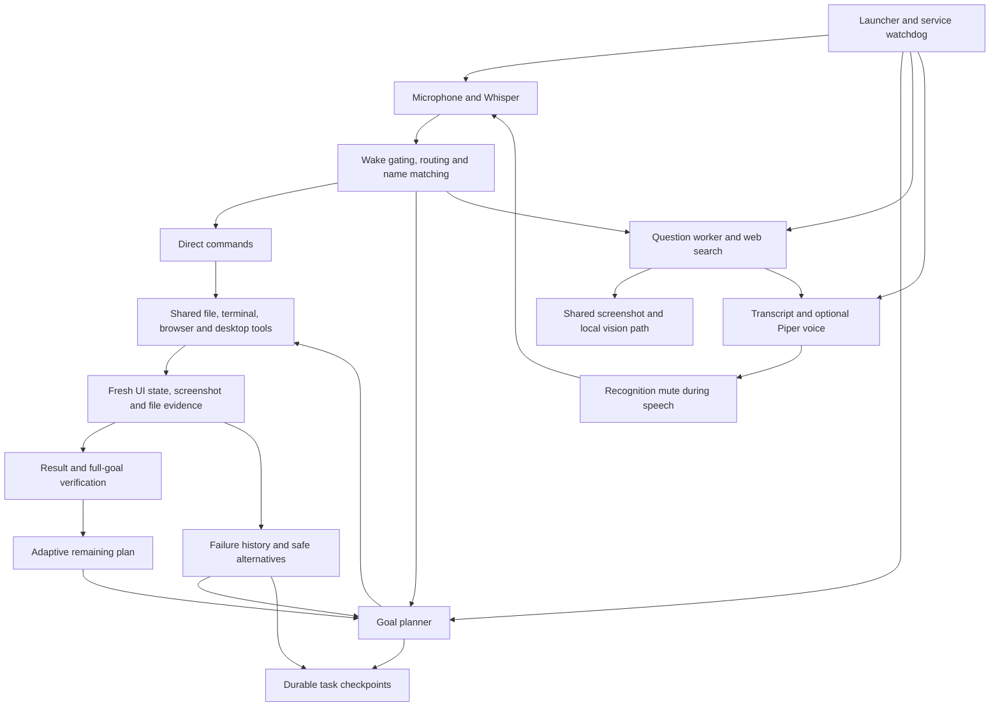

# Jarvis feature and performance audit

Date: 2026-09-26. Scope: configured local Jarvis, all 24 test modules, feature connections, startup/recovery compatibility, and targeted live checks.

## Changes with demonstrated benefit

| Area | Evidence before the change | Improvement and verification |
|---|---|---|
| Overlay rendering | Median 9.32 ms per animated frame | Cached bounded, phase-independent geometry: 5.32 ms/frame, approximately 43% less rendering time. Exact pixels matched in 24 phase/state/size cases. Five batches of 40 default-size active frames per measurement. This measures the renderer, not total task speed. |
| Screen capture to vision | Optional OCR timeout or OS error propagated out of capture and discarded a usable screenshot | Preserve the image for vision when optional OCR fails. Injected timeout and OS-error tests confirm the JPEG still decodes correctly. OCR subprocesses are hidden. |
| Completed tasks to adaptive planning/recovery | Unused fields such as browser could change the completed-action fingerprint although actual app dispatch stayed identical | Completed and failed actions now share the dispatch-aware action key. Regression test blocks the redundant app launch. Distinct exact text remains distinct. |
| Folder planning to file tools/verification | Live model proposed a Downloads folder opening in Chrome, despite the folder tool using Explorer | Clarified browser field semantics. Same live file-planning request now expects Downloads open and preserves filename/content correctly. |
| General answers to English speech | Live English-configured arithmetic request returned Hindi/escaped Hindi. The prompt contained conflicting language instructions | Choose one language instruction from configuration. Same live request returned “Two plus two equals four.” Regression test excludes conflicting Hindi output instructions in English mode. |

Timing data and pixel hashes: `.jarvis-runtime/performance-audit.json`. No model, GPU allocation, recognition sensitivity, playback preference, approval rule, or retry budget was changed without evidence of a benefit.

## Feature connections

Fresh observations and trusted file evidence connect actions to verification. Task state is planning context, never a replay queue. Recovery cannot bypass approval, repeat uncertain external effects, or turn a rejected action into an alternate unsafe route.

## Checks by feature

| Feature | Check and result |
|---|---|
| Speech recognition | Live CUDA/int8_float16 medium.en decoded the 6.22-second fixture in 0.70 seconds, producing the expected Notepad/file commands without executing them. Streaming/queue/VAD behavior covered by automated tests. This does not measure the user's accent or live microphone accuracy. |
| Wake gating, routing and dictation | Automated final/partial boundaries, cancellation, duplicate prevention, compound tasks and dictation checks passed. |
| App names, spelling and file catalog | Automated exact, fuzzy, ambiguous and scoped lookup checks passed. Catalog freshness and bounded lookup guards reviewed. |
| Browser and YouTube | URL construction, compound search/play planning and source-sensitive selection covered by tests; live synthetic music/browser plans passed. Logged-in browser playback was not exercised. |
| Desktop selection, text fields, scrolling, shortcuts, menus and dialogs | Automated visible-control, ambiguity, exact text, fresh-window and supported-shortcut checks passed. Custom or elevated third-party apps were not individually operated. |
| File creation, editing and deletion approval | Scoped paths, exact contents, no unwanted overwrite, approval and cancellation tests passed. Live coding workflow created a folder/script and modified that script in a temporary project. No real user file was deleted. |
| Terminal | Explicit command approval, output/exit handling and cancellation covered by regression tests. No arbitrary user command was run for this audit. |
| Coding and current project context | Live folder/script creation and modification passed, with syntax validation and readback. Project discovery, existing-file context and atomic-write protections covered by tests. |
| Laya selection | Live synthetic profile picker selected the intended candidate; decision checker independently agreed. |
| Planner, decision checker and vision | Live Qwen3.5:4b plans and decisions passed; unrelated destructive action rejected; incomplete browser goal rejected; Qwen3-VL:4b described a synthetic screen. |
| Adaptive planning and task recovery | Regression tests passed for changed remaining plans, failure memory, duplicate blocking, fresh observations, uncertainty pauses, cancellation and bounded alternatives. These use controlled failures; every possible desktop failure is not covered. |
| General answers and web search | Live English arithmetic answer passed after the prompt fix; live public web lookup returned five sources. History, current-query routing, unavailable-network handling and citations covered by tests. |
| Voice output | Installed Piper voices synthesized nonempty audio in memory; no audio was played. Configured output remains English, and voice remains disabled according to the existing setting. |
| Overlay and screenshot hiding | Hidden UI startup/shutdown passed; exact orb pixels preserved by optimization. Overlay capture-hiding code reviewed and existing capture lifecycle tests passed. No screenshot of the user's current desktop was taken. |
| Spotify | Source-scoped transport, seeking, shuffle/repeat, volume and cancellation tests passed. Read-only live status found no active Spotify media session; live playback/playlist changes therefore were not exercised. |
| God's Eye | Installed local server started, served its expected page, and its owned process closed. Browser/globe interactions and external data layers were not exercised. |
| Persistent state, launcher and self healing | Regression tests passed for atomic state, interrupted tasks, startup syntax/config repair, duplicate launcher prevention, owned process restart/stop, worker recovery and retry backoff. Dependency/model readiness check passed. |

Final automated result: **246 tests passed**. Targeted live checks above passed, subject to their stated scope. No change was made to otherwise working features merely to claim an upgrade. The launcher still loads the latest modules and configuration, and the existing watchdog supervises the same workers; these improvements add no runtime dependencies or background services.
