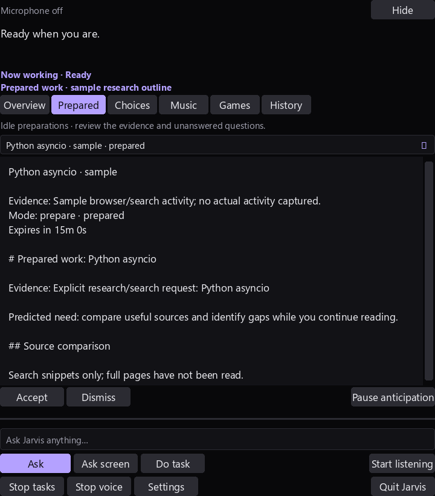

# Idle-time anticipation

Implemented 2026-10-03. Jarvis can anticipate a small set of likely next needs,
explain their activity evidence, and prepare read-only research outlines or editor
review checklists while its foreground work is idle. The separate component uses
bounded rules for prediction and optional existing local Qwen synthesis. It does
not import either upstream agent or inherit their evaluation scores.



This image renders the actual native Tk widgets with explicitly labeled fixtures.
The verification captures no desktop content, user recordings or private notes.

## What it anticipates

| Evidence | Likely need | Default behavior |
| --- | --- | --- |
| Explicit `search for Python asyncio`, `research Python asyncio`, `learn about ...`, or `compare ...` request | A source comparison and unanswered research questions | Prepare silently after Jarvis becomes idle |
| A sustained browser search, documentation, tutorial or research title | A research outline for that topic | Suggest in **Prepared**; accept before any public query |
| A sustained supported source filename in a Visual Studio Code title | A code-review checklist | Suggest; accepted preparation reads no source and edits no project |

Browser recognition currently covers Chrome, Edge and Firefox title suffixes.
Editor recognition covers `.py`, `.js`, `.jsx`, `.ts`, `.tsx`, `.html` and `.css`.
Other activity produces no proposal. This is a limited predictor, not awareness
of every task, tab or application. Explicit requests and current window titles
are evidence; page bodies, keyboard/mouse activity and browser extensions are
not collected. A title does not establish the page contents or user intent.

## Commands and review

- **What have you prepared?** / **Show prepared work**: open the Prepared view.
- **Anticipation status**: report current state and public-research authorization.
- **Accept preparation** / the card's **Accept** button: accept the most recent
  eligible preparation, or the exact selected card. Accepting a suggestion
  authorizes that read-only preparation once. Accepting a ready artifact checks
  its disk hash before showing it. It never starts a desktop task.
- **Dismiss preparation** / **Dismiss**: record negative feedback.
- **Pause anticipation** / **Resume anticipation**: stop/resume background work.
- **Always prepare public research**: grant standing authorization to prepare
  eligible inferred browser research topics during idle time.
- **Stop automatic public research**: revoke that standing authorization.

These routes work in the normal text input and after the spoken wake word.
The Prepared selector shows evidence, `prepare` / `suggest` /
`perform_authorized` mode, status, expiry, sources and missing information.
Silent results do not open the island or produce speech. Visiting Prepared and
accepting/dismissing its cards preserves a running coding/task generation.

`perform_authorized` is restricted to preparing a research/checklist artifact in
Jarvis's own cache. It cannot execute a shell command, edit a user project, send a
message, access an account, delete a file or click an app. Existing foreground
task approvals remain unchanged. A model cannot grant standing authorization.

## Evidence and learning

Research performs at most one free public search with three results. Its artifact
compares the available source titles, URLs and snippets, lists checks still
needed, and identifies unanswered questions. **Full source pages are not read.**
Search results and optional local-model notes are untrusted reference text and
are never routed into execution. Results are preparations, not verified answers.
Unavailable search produces an explicitly incomplete outline rather than
inventing sources. `public_search: false` produces only a local research outline.

Optional `local_model: true` adds tentative synthesis from the retrieved snippets
using the existing configured planner model, CPU inference, 2,048 context tokens
and the configured output-token cap. It is off by default to avoid competing with
the current CPU planner/coder. There is at most one model request per job. Model
failure retains the source outline if the worker finishes within its deadline.

Accepted, dismissed and expired **suggestions** update bounded local counts by
proposal kind and signal origin. Two more dismissals/ignores than acceptances
suppress subsequent automatic proposals of that kind/origin. Expired silent
preparations do not count as rejection; accepting a proposal and then its result
counts once. This is preference feedback, not model-weight training or measured
prediction accuracy. Counts, deliberate pause and standing authorization survive
a restart. Jobs and preparations are never automatically resumed after restart;
fresh activity is required. There is no paid reward model or remote telemetry.

## Limits, cancellation and storage

The enabled `anticipation` block in [config.json](../config.json) defaults to:

| Setting | Default |
| --- | ---: |
| `idle_seconds` | 45 seconds since the last Jarvis request/speech input |
| `dwell_seconds` | 20 seconds on one eligible foreground title |
| `cooldown_seconds` | 300 seconds between proposals/jobs |
| `expiry_seconds` | 900 seconds |
| `max_jobs_per_hour` | 3 jobs per running session's rolling hour |
| `max_seconds_per_job` | 45 seconds |
| `max_seconds_per_hour` | 120 reserved/used worker seconds per rolling hour |
| `model_tokens` | 256, when optional synthesis is enabled |

Idle here means **Jarvis has no foreground request, dictation, pending choice,
question, speech output or screen capture**. You can keep reading or typing in
another app; keyboard inactivity is not measured. No prediction inference runs
continuously. Configuration validates finite integer ranges and boolean flags;
there is one anticipation thread and at most one owned hidden preparation child.

New requests, speech input, changed context, Stop tasks, microphone Stop,
pause, Quit and expiry interrupt work. A different observed topic invalidates old
cards, and an expired request alone cannot trigger fresh preparation. Microphone
Stop blocks preparation until listening is explicitly restarted or anticipation
is resumed. The Stop tasks button also stops microphone/background preparation;
restart listening or resume anticipation explicitly. The spoken **stop all tasks**
command records a deliberate anticipation pause until **resume anticipation**.
The watcher cannot undo a deliberate pause/stop. Wall-clock expiry is checked at
acceptance as well as during work. Changed/missing artifacts are rejected.

Cancellation kills only the owned client child. Optional requests already sent
to the shared Ollama server may continue briefly after the client disconnects;
server-side compute preemption is not guaranteed. Total deadlines bound Jarvis's
client worker, not an OS CPU quota for the shared model service.

The Git-ignored `.jarvis-runtime/anticipation/` area contains an atomic metadata
state and up to eight rotating Markdown draft slots. Reused slots invalidate
earlier cards; every published artifact has disk readback and a SHA-256 receipt.
Expiry invalidates access without deleting user files. Sensitive-looking topics,
email addresses, explicit paths/URLs, private-browser titles and selected account
titles are excluded. This heuristic is not a complete privacy classifier; review
what you authorize for public search. Window topics, feedback and preparations
stay local except for an authorized topic sent to the public search provider.
They are not appended to the personal Obsidian vault by this component.

The anticipation service is declared in [the manifest](../runtime_manifest.json)
and registered with the existing watchdog. Read/preparation failures use bounded
backoff; recovery never dispatches desktop actions. Corrupt metadata is preserved
and disables the component for review. Uncertain disk failures halt further
writes instead of replaying them. Startup source snapshots automatically cover
the new modules; bootstrap and Start/Stop commands need no new dependencies.

## Verification

The [focused suite](../tests/test_anticipation.py) checks evidence selection,
privacy exclusions, idle/busy gating, authorization, expiry, feedback persistence,
disk tampering, compute limits, injected child stalls/cancellation, disk faults,
backoff, explicit Stop and shutdown. Existing WinRT child tests now explicitly
include their test directory in `PYTHONPATH`, fixing their import failure when
running the documented full discovery command.

[Dated fixture/UI and live-search attempt](../artifacts/anticipation-check.json):
all twelve fixture/protocol/widget checks passed on **2026-10-03**. The real
offline one-shot worker protocol and hidden Prepared widgets were exercised.
Activity and source snippets were synthetic; no live user activity, microphone,
real-vault write, local-model synthesis or desktop action was tested. The separate
generic live public search retrieved **three eligible sources** through the real
worker. Earlier sandboxed searches returned no sources (`DDGSException`); an
outside-sandbox retry exposed Windows stdout encoding, which is now explicitly
UTF-8 and covered by a Unicode protocol test. The corrected outside-sandbox
worker retrieved the snippets successfully. These attempts and the initial
fixture-runner corrections are summarized in the
[verification history](../artifacts/anticipation-check-history.json).
This is not a prediction-quality/acceptance benchmark or full-page verification.

**Final 2026-10-03 regression/readiness:** all **758 tests passed in 80.704 seconds**,
including 39 anticipation tests, and the launcher reported **ready** with no
missing prerequisites. [Dated result](../artifacts/anticipation-regression-check.json).
The focused checks include a real Unicode subprocess protocol and final-transcript
gating for spoken authorization. All **166 local link targets** in both README
files and this guide resolved. These results establish regressions and startup readiness,
not live prediction usefulness, voice recognition accuracy or optional synthesis.

Run from the application directory:

```powershell
.\.venv\Scripts\python.exe -m unittest discover -s tests -p test_anticipation.py -v
.\.venv\Scripts\python.exe verify_anticipation.py
# Optional one generic public search; never account or desktop actions:
.\.venv\Scripts\python.exe verify_anticipation.py --live
.\.venv\Scripts\python.exe -m unittest discover -s tests -q
.\.venv\Scripts\python.exe -m jarvis.launcher --check
```

Restart Jarvis once to load the feature. Local evaluation of prediction usefulness,
false suggestions, acceptance rates, task latency and energy remains outstanding.
No percentage from either research project is presented as Jarvis accuracy.

## Research and attribution

- [THUNLP ProactiveAgent](https://github.com/thunlp/ProactiveAgent), Apache-2.0:
  activity-based assistance proposals and acceptance/rejection/ignore feedback
  informed the separate prediction and preference loop. Its
  [demo](https://github.com/thunlp/ProactiveAgent/blob/main/agent/README.md)
  uses ActivityWatcher/Chrome/VS Code extensions and richer input monitoring;
  Jarvis does not install these or copy their watcher implementation.
- [AgentACE-AI ProAct](https://github.com/AgentACE-AI/ProAct), MIT, and its
  [paper](https://arxiv.org/abs/2605.25971): anticipating needs and using idle
  compute to prepare evidence informed the preparation lifecycle and budgets.
  Its released repository is a reproducibility subset and full evaluation uses
  paid LLM APIs. Those services and upstream benchmark runners are not installed.

These primary sources were inspected on 2026-10-03. All added prediction,
preparation, feedback and UI code is independently implemented in
[anticipation.py](../jarvis/anticipation.py),
[the one-shot worker](../jarvis/anticipation_worker.py), and
[the existing island](../jarvis/island_desk.py).
