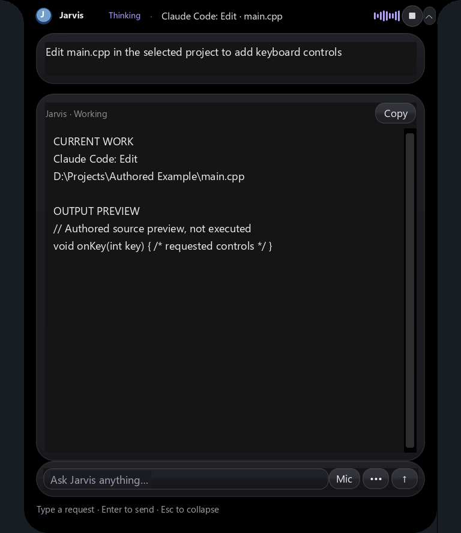

# Claude Code with local Qwen for Jarvis

**Historical backend:** The configured coding route changed to
[Codex with local Qwen3.5 9B](codex-code-local.md) on 2026-10-05 IST.
This guide preserves the previous implementation and its dated verification.

Jarvis can run the installed **Claude Code CLI** as its coding executor, with
**Qwen3.5 9B in local Ollama** supplying the model responses. This uses no paid
Anthropic model API or Claude subscription. Local hardware/electricity still
have a cost. Claude Code's JSON output can contain estimated dollar costs for
unknown models; those estimates are not an Anthropic bill for these loopback calls.

First-party references, checked 2026-10-04 with the
[Firecrawl skill](https://docs.firecrawl.dev/):

- [Ollama's Claude Code integration and local setup](https://docs.ollama.com/integrations/claude-code)
- [Claude Code CLI reference](https://code.claude.com/docs/en/cli-reference)
- [Streaming and unattended sessions](https://code.claude.com/docs/en/headless)

## Behavior

For a coding task, Jarvis resolves the folder you explicitly name, or uses the
freshly observed File Explorer folder, then a remembered project if no open folder is
available. An explicit folder or absolute source-file path overrides historical session scope.
Quote full paths containing spaces, for example:

```
create a C# calculator app with UI in "D:\Projects\Calculator"
edit main.cpp in "D:\Projects\My Game" to add keyboard controls
create a React website in "D:\Projects\Portfolio"
```

The installed CLI starts in that exact folder with the task and bounded
repository/language guidance. It reads existing files before edits. The island
receives file-tool activity, source previews where the CLI streams them, visible
reply text, completion and errors. No separate task popup is necessary. This is
Claude Code's programmatic `--print` interface; it does not open the interactive
terminal UI or control the Claude Desktop application.

The coding preview reveals once without taking typing focus. Later updates keep
the same mounted view and retain its expanded height across phase changes;
manually collapsing it is respected, including the final result. The transition
from session end to the final answer also retains the expanded height. An authored 90-event replay recorded zero
view unmounts or layout rebuilds and monotonic growth. This is UI regression
evidence, separate from actual local inference.



Each run uses a fresh session. Follow-up tasks read the current project; Jarvis
retains its own task/session memory. Files are referenced by path in the selected
project rather than uploaded to an external model.

## Local configuration

`python setup_claude_code.py` derives `jarvis-claude-qwen3.5:9b` from the already
installed `qwen3.5:9b`. It reuses the same weights, with a 32K context and twenty
GPU layers for this machine's 4GB RTX 3050. It does not download new weights or
change the main planner/answer model. The larger 64K+ context suggested by Ollama
for bigger repositories needs more memory; this setup is intended for bounded
projects and selected files.

Relevant `config.json` brain keys:

```json
{
  "coding_backend": "claude-code",
  "claude_code_model": "jarvis-claude-qwen3.5:9b",
  "max_coding_seconds": 1800
}
```

The native CLI is discovered on PATH or in `~/.local/bin/claude.exe`. An optional
`claude_code_executable` supplies an existing native executable. Selecting
`coding_backend: "direct-qwen"` restores Jarvis's existing generator. The direct
backend also accepts an optional integer `coding_num_gpu` (-1 automatic, 0 CPU,
1–128 requested GPU layers); its default stays CPU.

All model requests end at local `http://127.0.0.1:11434`. A task-owned loopback
adapter on an ephemeral port accepts only Messages/token-count routes for the
checked local model and explicitly disables extended thinking. Claude Code
omits third-party thinking controls when its setting is off; Qwen's default is
thinking enabled, and effort names alone do not turn it off. This adapter adds
no cloud service or new dependency and streams responses unchanged.
Each model response is capped at 6,000 tokens within the separate total task
deadline, so a large CLI default cannot bypass the coding generation budget.
The owned CLI also receives a 30-minute API/stream-watchdog ceiling. Claude
Code's default five-minute event watchdog was observed canceling active local
generation before a large tool response was complete. Jarvis's total task timer
and Stop remain authoritative; this setting does not replay any file action.
[Claude Code's stream watchdogs](https://code.claude.com/docs/en/network-config#streaming-idle-watchdogs)
and [environment variables](https://code.claude.com/docs/en/env-vars) were checked
with Firecrawl on 2026-10-05. Large local coding tasks can still take minutes.
[Claude Code setting behavior](https://code.claude.com/docs/en/settings-reference#alwaysthinkingenabled)
and [Ollama's Messages conversion](https://github.com/ollama/ollama/blob/main/anthropic/anthropic.go)
were checked with Firecrawl on 2026-10-04. The live fixture separately verifies
completed adapter requests with thinking disabled.

Anthropic credentials
and cloud-provider selectors are removed from the child environment; all default
model aliases point to the local model. Telemetry and nonessential traffic are
disabled. Ambient project/user settings and MCP connectors are excluded.

## File integrity and execution

The CLI gets only Read, Glob, Grep, Write and Edit tools, plus one local stdio
permission handler. The handler validates proposed Write/Edit source paths, project scope,
symlinks, sizes, source syntax where supported and exact edit matches. Original
bytes are preserved in `.jarvis-runtime/claude-code/<run>/originals/`. Full rewrites
are rejected if a file changed from its starting snapshot; unique targeted edits
preserve other text. The permission bridge must connect before the task proceeds.
The same already-approved mutation is not executed twice within a run, including
edits whose old text still occurs inside the replacement.
Python edits retain existing top-level interfaces; full rewrites of an explicitly
named GUI script also check reachable controls/callbacks. Invalid Unicode is
rejected before a write. These are structural checks, not runtime verification.

Shell execution, deletion, external account tools and publication are unavailable
to this runner. Builds/tests use Jarvis's existing reviewed development tooling
and its execution approval flow. CLI completion alone is not a functional test.
Explicit coding goals up to 6,000 characters are preserved without truncating
requirements. Plain folder creation remains a direct operation. Completion credits
only approved source mutations whose current content matches the approved proposal;
unrelated external edits are not attributed to the CLI.

Source files are bounded to 20,000 characters; split larger implementations into
modules. Native languages still require their respective compilers and GUI SDKs.

Stop closes the owned CLI/process tree, permission server and inference adapter. Partial files and
logs remain for inspection. Neither timeout nor an uncertain edit automatically
replays the task or silently switches to another executor.

## Verification

[Live creation/edit receipt](../artifacts/claude-code-live-check.json) and
[attempt history](../artifacts/claude-code-live-history.json) distinguish the final
result from earlier attempts. The fixture uses authored files, actual local
Qwen inference and the installed CLI; it does not execute a user's project.
`verify_claude_code.py` checks creation, current-source editing, actual permission
bridge decisions and a real Python run. Backup preservation and Stop/failed-bridge
cleanup are covered separately by regression tests. Windows subprocess
communication may require running this fixture outside the Codex sandbox.
Fault-injected regressions cover failed adapter startup, failed permission bridge,
Stop and total timeout; none starts a second coding executor.

The nine animated UI examples and their browser checks are documented in the
[multilingual coding guide](multilingual-coding.md). Those are separate functional
checks, not proof that every generated app or supported language works.
