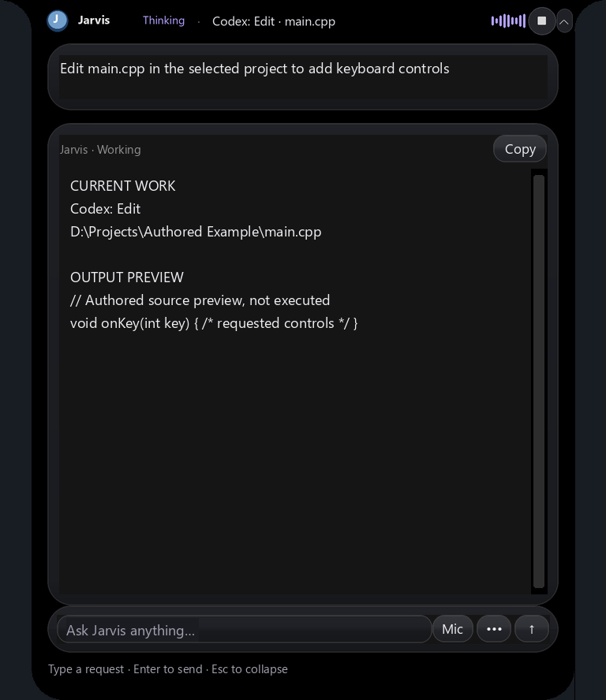

# Codex with local Qwen3.5 9B

**2026-10-07 resumed validation:** Backend browser checks now exercise the actual
homepage `/`; a working named HTML path cannot hide a broken root response.
Repair inference retains the authorized task, repository/skill guidance,
registered checks and paired file-tool history, while dropping repeated model
speculation and generic CLI descriptions. It does not relax the disk guard,
change checks, replay saves or enable additional tools. The old full-stack
receipt below is historical; see [current production validation and limits](production-validation.md).

**2026-10-08 interface guard:** Negative removal/rewrite instructions do not
authorize dropping existing Python interfaces. Removal or rename must identify
the affected function/class in an affirmative request. Rejected proposals leave
the existing source intact; the confirmed-save and uncertain-write guards remain
in force. Current regression and live scope are recorded in the validation link above.

Coding also performs Jarvis's existing bounded local Ollama startup preflight
before model inspection, with cancellation checked immediately afterward.
It reuses running Ollama and never kills or restarts a responding shared server.
All task types reject identical source proposals before creating backups or
mutation journals; a repeated unchanged code block cannot count as a saved repair.

**2026-10-06 update:** Coding now enables planned multi-session workloads with
LocalGithub's local Git layer. See [workload scheduling, ownership, combined
checks and limits](codex-workloads.md). The executor below still runs each
worker and the one-workload path.

Jarvis's default coding executor changed from Claude Code to **Codex CLI** on
2026-10-05 IST. Ollama runs the installed **Qwen3.5 9B** weights locally. No paid
model API, Claude subscription or OpenAI API key is required. The user's global
Codex settings and this desktop chat's model are untouched.

## Folder selection and progress

An explicit project folder or source-file path wins, followed by a freshly
observed File Explorer folder, then remembered scope when no folder is open.
An explicit file selects its parent project. Codex reads current source before
modifying it; the original task and bounded project/language guidance accompany
the prompt. Plain folder creation retains Jarvis's direct execution.

The 2026-10-05 destination-parser repair accepts both `in folder TestCodes folder`
and `in TestCodes folder`. In `create an app to monitor my health in folder
TestCodes folder`, the destination is `TestCodes`; the app's purpose is not part
of the folder name. If a folder is missing or ambiguous, a full existing path,
folder name, `use the folder TestCodes`, or `open folder TestCodes` answers the
pending folder question. Jarvis resolves the answer to a concrete existing path
and resumes the original goal once through the configured Codex executor. The
confirmed path overrides the old unresolved scope, including an old absolute
path. Resumed completion is reported in the island and spoken aloud.

An invalid answer leaves the question pending. Expiry, cancellation and uncertain
previous writes retain their existing guards. A folder reply does not approve
replaying file mutations. Tests of this handoff replace the native Codex boundary
with a recording test double: they verify request/folder routing and completion
delivery without generating or manually editing an application. Earlier actual
Codex creation/edit and app browser checks remain separate evidence below.
The actual existing catalog was also checked read-only: the reported utterance
resolved to its existing `TestCodes` destination without rescanning the PC.

Jarvis starts the installed native executable in that folder using
`codex exec --json --ephemeral`. This is the programmatic CLI, without a separate
terminal window. The existing island displays visible response text, file/tool
activity, source previews, checked saves and the final result. The Responses
relay supplies incremental text; tool arguments may arrive together when
Ollama buffers them. Activity updates appear every four seconds during waits.
Hidden reasoning is disabled. The island keeps mounted widgets and expanded
height through completion, while respecting manual collapse.

## Local configuration and checked file tools

Each task receives an isolated `CODEX_HOME` under
`.jarvis-runtime/codex-code/<run>/home/`. Its provider uses `wire_api = "responses"`
and an ephemeral loopback relay to `http://127.0.0.1:11434/v1/responses`.
The relay flattens Codex's MCP tool namespaces for Ollama, restores them on
returned calls, and flattens subsequent input history consistently. Only Jarvis
Read, Glob, Grep, Write, Edit and Plan tools reach the model. Native shell, web, hooks,
plugins and subagents are disabled; native execution stays read-only. Those
six bounded MCP tools have explicit approval in the isolated profile and
enforce their own source boundary before accessing files.
Qwen can return these six exact tools with either the full MCP prefix or their
short name. The relay normalizes both to the same namespace; other names,
foreign namespaces and native shell/apply-patch tools remain rejected.

Existing files must have a fresh Read hash before changes. A successful owned
atomic save and readback also supplies a fresh observation for the next exact
edit; an external byte change requires another Read. Read results expose plain
source rather than JSON-escaped source, and syntax failures put the actual error
ahead of long source lines. Available syntax checks run before saves; original
bytes are backed up once. Exact edits require
a unique match unless replacing all matches was explicit. Atomic replacement
and disk readback confirm saves. Hidden files, linked paths, dependencies,
oversized files and paths outside the selected project are rejected. Attempted
identical mutations are not replayed. Completion credits only applied receipts
whose proposed hashes still match disk, rather than the model's claims.
Runtime/UI completion now requires the recorded validation checks described below;
other native compilers/platforms remain prerequisites rather than success claims.

Stop/Quit closes only the owned Codex, MCP and relay process tree through the
existing action worker. Shared Ollama remains running. Local model/tool support,
required MCP connection, bounded relay startup, stream errors, total deadline
and final completion/exit are checked. Failures retain partial source and private
receipts; interrupted inference retries are disabled and no executor fallback replays
edits. Successful agent turns with observed check failures can enter bounded repair
turns using fresh source rather than replaying the original writes.
Explicitly converting/replacing a named declared test file permits restructuring
its old helper functions into real test cases. This exception is scoped to that
test file; application-interface preservation and frozen verification checks
remain active.

## Automatic verification and Codex repairs (2026-10-05–06)

Before any source write, Codex must use **Plan** to declare every expected file's
relative path, implementation purpose and role, together with executable checks.
Jarvis rejects writes without that contract. Repairs may add deliverables, but
cannot remove earlier files or change their recorded purposes/checks to hide a
failure. Extra checks may be appended. Every declared test file needs an executable
test check. Files explicitly named in the task are checked too.
During repair, an empty Plan call retrieves the existing validated contract
read-only, avoiding regeneration of long arrays. A new task still requires complete
files/checks arrays; quoted JSON strings are rejected with a field-specific hint.

Jarvis checks all expected and changed files for existence, bounded readable
source, available syntax validation, empty/comment-only scripts, obvious TODO
stubs, empty Python functions and missing local HTML scripts/styles. Empty Python
package initializers, abstract methods and HTTP-handler logging suppression remain
allowed. These are heuristics; they do not prove that
every algorithm or user requirement is correct.
HTTP handler factories using a default base-class argument also allow an empty
`log_message` override; unrelated empty logging methods still fail.

The recorded checks run after generation: Python unittest or script execution,
Node tests/scripts, supported installed local Vite/Next/TypeScript/Vitest/
Playwright commands, and actual Chrome browser interactions. Zero/skipped Python,
Node or package tests do not count as verified behavior; their output must confirm
positive executed tests. Package shell chains,
install/download hooks and arbitrary model shell commands stay disabled. Missing
dependencies/toolchains and unsupported commands remain concrete failures.

Python/Node/browser checks use a bounded copy of the selected source tree under
the private run directory (160 source files, 80KB per copied file). Data and hidden
secrets are not copied. Package build/test tools use their installed local project
dependencies in the original folder; source hashes are checked afterwards. This
process ownership and working-directory separation is not an OS security sandbox
for executing source. Test programs must use test data and avoid real accounts or
external actions. Check logs, data, snapshots and receipts remain private/ignored.

For requested frontend/backend projects, the contract requires both roles plus
a browser check against a real backend. A new project can use HTML/CSS/JavaScript
and Python stdlib HTTP/SQLite when no framework was specified; existing/requested
stacks take priority. The server must accept `--port N --data-dir PATH`, bind
`127.0.0.1`, and serve its frontend plus actual API. Jarvis starts only its own
server on a fresh port, checks listening-process ownership, and never reuses an
unrelated server. Persistent backends cannot also be selected as one-shot scripts.
It checks declared clicks/fills and visible exact text/value assertions, mobile
overflow, runtime/HTTP errors, and successful frontend-to-backend fetch/XHR. A
full-stack UI that only uses localStorage cannot pass this backend check. Include
reload assertions in Plan when the request requires persistence.
The Python file explicitly declared as that browser check's backend is checked
as a server, rather than incorrectly requiring desktop widgets/mainloop. A
declared test file with a direct executable test check also avoids desktop UI
requirements; declaring an unchecked file as a test does not bypass them. Explicit
desktop Python UI requests retain their structural GUI checks.

On a known check failure, Jarvis sends a new Codex turn the exact failed paths,
diagnostics, missing-file purposes/locations, unchanged expected-file/check
contract and fresh source attachments with hashes (24K character attachment
budget; Read remains available for additional files). Codex performs all source
creation and edits through checked tools. Jarvis reruns every recorded check.
Rejected Python syntax proposals are retained separately as explicitly unsaved
attachments, with the error's nearby source lines and a diagnostic hint for incomplete
`try` blocks. They consume the same attachment budget; a later confirmed save
supersedes the rejected proposal. Browser assertion failures include the failed
step and observed runtime/HTTP errors, rather than hiding a broken API behind a
generic interaction failure.
The island shows concise failure causes and filenames; full diagnostics stay in
the private receipt and repair prompt.
Three consecutive rejected Write/Edit calls end that owned agent turn for fresh
diagnosis rather than letting the model repeat invalid proposals indefinitely.
Jarvis checks attempted/applied receipts after shutdown; an unconfirmed save
still halts automatic repair. Confirmed rejection means no save occurred and can
proceed to the bounded validation/repair workflow within the same deadline.
An explicit internal diagnostic resume can reuse an existing validated contract
and fresh failure packet; this does not enable retries after interrupted streams
or unknown saves. The owned live-fixture verifier uses this mode when testing
repair of a previously generated partial project.
The default is **two repair turns**, configurable as `brain.codex_max_repairs`
(0–3), within the existing shared `max_coding_seconds` deadline. Individual checks
have a 90-second limit, browser checks 120 seconds and backend startup 15 seconds.
Stop, an uncertain save or externally changed source halts further repair. A
timeout is reported without replaying the test invocation; a subsequent repair
must address its diagnosed cause. Completion reports checks actually passed;
exhausted repair limits retain partial files and report the remaining errors.

## Setup

Install native Codex CLI and Ollama first, with `qwen3.5:9b` locally available:

```powershell
.venv\Scripts\python.exe setup_codex_code.py
```

This creates `jarvis-codex-qwen3.5:9b` using the same installed model weights:
32K context, nine GPU layers, temperature 0.2 and up to 6,000 output tokens on this
4GB GPU. Since October 8, the [priority GPU policy](gpu-priority.md) reserves
speech memory and corrects the earlier 20-layer alias at normal preflight.
Ollama recommends at least 64K for Codex; the smaller setting bounds
memory use and limits large-repository tasks. Local 9B generation can still take
minutes. Streaming avoids a short whole-response timeout; it does not increase
inference speed. No new Python dependencies were added.

The `brain` object in `config.json` selects:

```json
"coding_backend": "codex",
"codex_model": "jarvis-codex-qwen3.5:9b",
"codex_max_repairs": 2,
"max_coding_seconds": 1800
```

Direct `qwen3.5:9b` is also accepted; other models and cloud fallback are rejected.
Optional `brain.codex_executable` names an installed native executable. Discovery
otherwise checks PATH and the desktop app's versioned native binaries. The
stream watchdog is 30 minutes and the total deadline is bounded to 60–3,600
seconds. Source files have a 20,000-character limit; tasks 6,000 characters.
Split larger work into modules. Restart through **Stop Jarvis.cmd**, then
**Start Jarvis.cmd** to load this configuration.

The older Claude implementation and dated records remain historical/optional
code; they are not the configured executor.

## Installed files but `/api/show` returns 404

On 2026-10-05 IST, the active port 11434 was forwarded into WSL. Its Ollama
store initially listed only Gemma, while the Qwen files existed in the separate
Windows cache at `D:\Ollama\models`. A missing model's `/api/show` returned 404;
the presence of Windows manifest folders did not make those weights visible to
the running server.

`brain.ollama_cache_roots` now lists that cache and `D:\OllamaModels`.
**Setup Jarvis Brain.cmd**, or the following model-only setup, first checks the
active server, then restores available cached single-GGUF models over the local
Ollama blob/create APIs before attempting a registry download:

```powershell
.venv\Scripts\python.exe setup_brain.py --ollama-only
```

Setup validates manifest sizes, contained blob paths, GGUF format and metadata
checksums. Ollama validates the uploaded weights' expected SHA-256. Renderer,
parser, parameters, system/template and license metadata accompany the import.
Existing server blobs are reused. Original cache files remain intact; copying
into a separate server store consumes additional disk space. Multi-part models
require the normal Ollama import/pull workflow rather than guessed filenames.

The base model is ensured before creating Jarvis's local Codex alias; alias names
are never pulled from the public registry. A coding request can recreate a
missing alias from an already visible base model, but does not start a large
weight upload/download. Missing weights produce an actionable setup message
before changing project files. Background recovery also uses this setup path.

The actual restore made Qwen3.5 9B, its Codex alias, the configured 0.8B audio
model and 0.5B context model visible without registry downloads or stopping the
shared server. Gemma remained installed. The fresh [model visibility receipt](../artifacts/codex-model-restore-check.json)
records all four configured model lookups returning 200 and the cached base
weight present on the server by its SHA-256. Restored server visibility takes effect
immediately; restart Jarvis once through Stop/Start to load the updated recovery
and preflight code.

## Verification on 2026-10-05–06

The [actual local CLI fixture](../artifacts/codex-code-live-check.json) passed
Codex 0.160.0/Qwen source creation and fresh-source editing, original-backup
verification and a Python run printing `5`. The automatic-check run observed
486 progress events and ten completed local inference requests with thinking
disabled. Codex created behavioral unittest checks and extended them after editing;
Jarvis executed the declared checks, both tasks passing without repair turns.
An early trial omitted Plan; enforcing the write gate fixed that in a fresh fixture.
Earlier passing 215-event/five-request,
228-event/five-request, 266-event/five-request and 378-event/seven-request runs remain historical
evidence. Early
namespace/approval failures remain in history; repairs used fresh owned fixtures.

The [generated counter app](../artifacts/codex-app-live-check.json) passed actual
Chrome heading, increment-twice, reset, 390px overflow and JavaScript-error checks.
The first generated file animated its control ancestors and failed browser
stability checks. A fresh-source Qwen/Codex edit moved motion off the controls;
the retest passed with 385 progress events. The initial failure is preserved in
history. This covers the small owned app's tested interactions, not arbitrary
generated applications or all visual/accessibility details.

The [island replay](../artifacts/codex-code-island-check.json) passed 90 authored
events in actual off-screen Tk widgets, with zero view unmaps/layout rebuilds,
monotonic growth and preserved completion handoff. This rendered preview is
not a desktop screenshot or live microphone test.



The [full regression/readiness receipt](../artifacts/coding-regression-check.json)
records **1,042 passing tests** and launcher status `ready` after adding validation.
Previous 1,021-test destination, 1,013-test model-cache and 1,006-test passes
remain in history. The eight destination/handoff tests include the exact spoken
request, confirmed-folder path selection, invalid-answer recovery, expiry,
uncertain-write blocking, worker completion delivery and the Codex boundary.
These use owned temporary folders and a recording native Codex test double.
The 20 validation tests include missing expected files/resources, placeholders,
real failing assertions followed by retesting, required test-file coverage,
zero/skipped test rejection, missing dependencies, fresh attachment hashes,
bounded repairs, explicit diagnostic resume and the web-backend/desktop-GUI distinction.
A focused 28-test validation/Codex pass also covered root-relative and escaped
local web asset paths, optional HTTP logging suppression, Plan retrieval, rejected
syntax attachments and rejected-save handoff with unconfirmed-mutation blocking.
Explicit test conversion is checked against application-interface removal. Actual
browser faults reject a static-only backend, a broken API, and `10` when an exact
visible count of `1` was required. Receipts retain exact UTC timestamps.
The October 5–6 full-stack diagnostic attempts were failed/unverified. Their
saved mutations had confirmed readback, but independent checks caught a
recursive backend factory and zero executed tests. These and later failed or
interrupted repairs remain in [history](../artifacts/codex-validation-live-history.json).
The [October 8 resumed native repair](../artifacts/codex-validation-live-check.json)
now passed the real homepage, seven browser steps, six API requests and seven
generated unit tests. A separate [persistence check](../artifacts/production-fullstack-persistence-check.json)
confirmed a saved value of two survived database reinitialization; the model had
omitted that additional test. No generated application source was manually
repaired. This verifies one repaired existing owned project. Fresh arbitrary
full-stack generation can still fail within the bounded model deadline.
See [production validation](production-validation.md) for current fixes and scope.
Fault tests include
Stop, failed relay startup, failed agent turns and total deadline cleanup without
replay. Checks also cover namespace round-tripping, local-only routing, stale
reads, backups, invalid syntax, duplicate mutations and divergent disk readback.
[Multilingual UI results](multilingual-coding.md) are separate from CLI completion.

```powershell
.venv\Scripts\python.exe verify_codex_code.py
.venv\Scripts\python.exe verify_codex_app.py
.venv\Scripts\python.exe verify_codex_validation.py
.venv\Scripts\python.exe verify_codex_island.py
.venv\Scripts\python.exe verify_coding_regression.py
```

Private task prompts, source logs and backups remain ignored under
`.jarvis-runtime/codex-code/`. No credentials or private recordings are published.

## Primary references

- [Codex configuration reference](https://learn.chatgpt.com/docs/config-file/config-reference)
- [Ollama's Codex integration](https://docs.ollama.com/integrations/codex)
- [Ollama Responses API compatibility](https://docs.ollama.com/api/openai-compatibility)
- [Ollama blob and model creation API](https://github.com/ollama/ollama/blob/main/docs/api.md)
- [Playwright local web servers](https://playwright.dev/docs/test-webserver)
- [Python unittest discovery](https://docs.python.org/3/library/unittest.html)

These were checked against the installed CLI and actual local requests. The
user-supplied screenshot was a reference, not validation.
