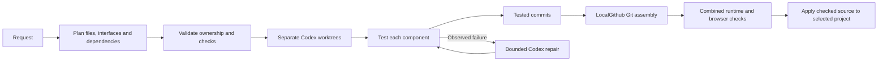
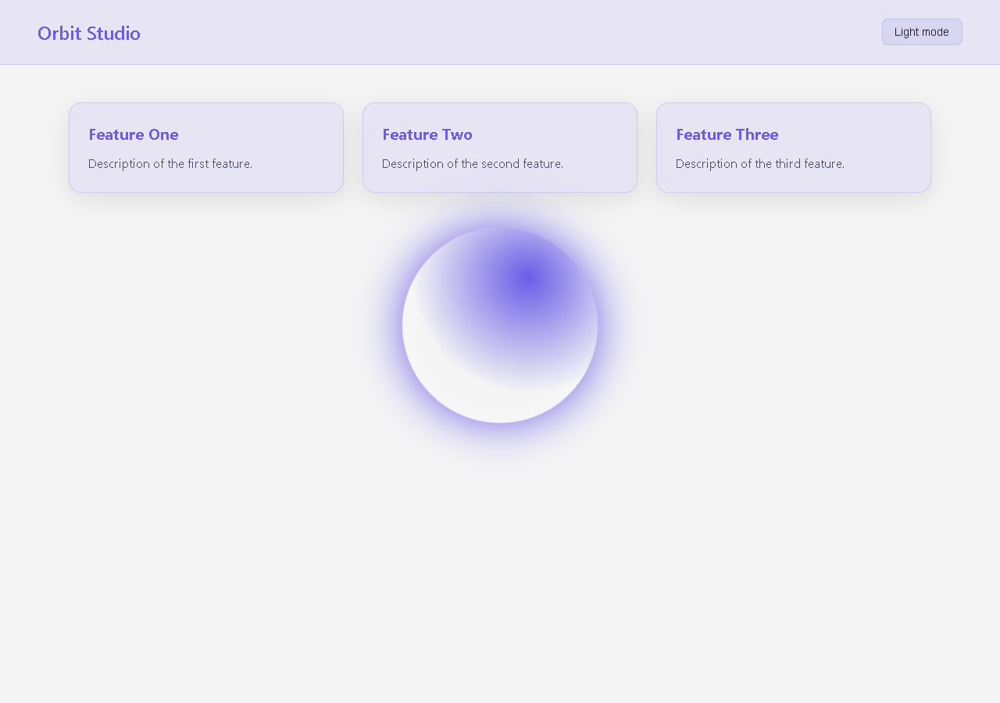
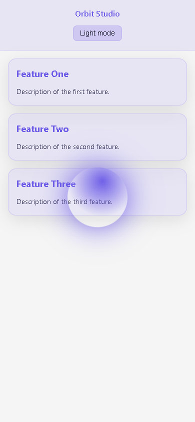

# Planned Codex workloads with LocalGithub

**2026-10-08 unnamed Python-script repair:** A reported circle-drawing Python
request was incorrectly planned as HTML/CSS/JavaScript workers with empty
`check_indices`. All three read-only attempts failed; no worker or source write
started. Python script/program requests now qualify for the single-source route
even when no `.py` filename is supplied. The model receives a compact Python
plan prompt and a Python-only file/check schema; strict validation rejects web
language drift, multiple implementations and split workers before writes. The
sole worker owns the implementation and its real behavioral tests. The selected
destination is already the project root; the prompt prevents treating its folder
name as another nested destination. Existing named multi-file, backend, package
and website requests retain their separate planning routes.

All worker schemas now require nonempty executable-check indices. Rejection
diagnostics identify every worker's missing or invalid indices together. Checks,
ownership and no-replay guards were preserved; the repair does not accept an
untested worker or replay the failed request into the user's project. One
implementation must have role `entrypoint` or `logic`; only actual unittest
files have role `test`. Explicit graphical/on-screen requests use `python_tests`
rather than a one-shot `python_script` check that would wait for the GUI loop
to exit. The first fresh live attempt exposed these two additional plan faults
and remained read-only.

Accepted single-Python workers also receive compact context containing the
original task, accepted file/check contract, repository guidance, fresh failure
evidence and paired source-tool history. Generic website instructions and prior
speculation are excluded. Tkinter test guidance requires patching the actual
Canvas dependency and asserting its drawing calls; an unrelated mock or
attributes assigned only by a test do not establish drawing behavior. Source
guards, test ownership, missing-test-first saves and no-replay rules still apply.

The accepted live Python plan exposed a separate repair failure: Codex could
exit its owned proxy immediately after receiving a completion event, before
the proxy finished GPU cache bookkeeping. The next repair then refused with
insufficient reserved VRAM even though the same alias could be reused. The
Responses relay now closes/finalizes the inference lease before publishing the
terminal SSE event or JSON body. A freshly observed cache identity is retained
if its duration update is unconfirmed; its local ownership window remains
bounded, and no inference or write is replayed. Real loopback tests verify that
terminal completion waits for cleanup and that proxy timeouts do not replay.
The fixture's syntax rejection, missing source, failed repair and fresh
continuation remain distinguishable in the live receipt/history.

Reproduce the owned live check with `python verify_python_script_workload.py`.
It uses a fresh isolated `TestCodes` folder under `.jarvis-runtime`, then launches
the generated program in a bounded real Tkinter loop and inspects a visible
Canvas circle. `--repair-project PATH` accepts only an existing owned fixture
under `.jarvis-runtime/python-script-fixture`; it executes fresh current-source
checks before supplying diagnostics for a bounded repair. It does not resume a
user project or replay earlier tool calls.

**Regression/readiness checkpoint, 2026-10-08 IST:** All **1,198 regression
tests passed** (350.052 seconds). Focused checks passed: 27 workload tests,
16 coding/context tests, three proxy fault tests and 26 GPU scheduling tests.
The static audit checked 349 Python files with no errors and 80 retained
warnings; all nine bundled skills and local documentation-link targets passed.
Configured dependency/service readiness is `ready`, including required Ollama
models and LocalGithub's local Git layer; hosted Gitea/account services were not
checked. These checks do not establish that every model-generated project works.
See the [regression log](../artifacts/python-script-final-regression-tests.log),
[coding/context log](../artifacts/python-script-codex-context-tests.log),
[static audit](../artifacts/python-script-repository-audit.json) and
[configured readiness](../artifacts/python-script-readiness-check.json).

**Actual local-model trial, 2026-10-08 IST:** The exact reported unnamed
circle-script goal produced an accepted single-worker Python plan in 41.515
seconds. Subsequent source syntax and generated-test failures, an interrupted
GPU-cleanup failure and two 15-minute continuation limits were retained; they
were not successful deliveries. After the repairs above, a fresh continuation
of the same owned fixture through installed Codex/local Qwen completed with
all six generated unittest cases passing. An independent bounded launch of
its actual Tkinter program observed a visible 200-pixel Canvas circle. The
final continuation changed the faulty test assertions using confirmed file
tools; application source was generated by Codex, not substituted by this
verifier. This demonstrates the reported planning case and its observed
repair path, not a guarantee of latency or success for arbitrary coding tasks.
The original user's `TestCodes` folder and failed task checkpoint were untouched.
See the [final live receipt](../artifacts/python-script-workload-live-check.json),
[retained failed-trial history](../artifacts/python-script-workload-live-history.json)
and [independent generated-test log](../artifacts/python-script-generated-tests.log).

**Authorized restart, 2026-10-08 IST:** After the checks passed, the normal hidden
bootstrap restarted Jarvis. A fresh running heartbeat confirmed requested audio
in the listening phase, live capture/decoder threads, fresh audio blocks and
healthy action/question/speech workers. All four repaired modules and the
configuration matched their recovery snapshots. The GPU heartbeat was idle with
no queued inference. This was a runtime-health observation, not a fresh spoken
speed or microphone-command trial. See the
[startup receipt](../artifacts/python-script-startup-check.json).

Jarvis plans coding/app/website requests before implementation using local
Qwen3.5 9B. The proposal includes expected files, executable checks, estimated
workload sizes, dependencies and a shared interface contract. Jarvis validates
ownership, checks and the dependency graph before launching separate Codex CLI
sessions. The default is two concurrent workers, each with an isolated home,
source MCP process, owned process tree and exact writable file list.

**2026-10-07 audit repair:** Explicitly named single-module Python requests use
one worker containing the implementation and its behavioral tests. For a sole
independent worker, an already declared Python/Node test referenced by its check
can be added to its omitted path list before strict validation; the receipt
records this completion. Multi-worker ownership is never redistributed. Invalid
plans remain read-only and are retained for inspection. See the
[fresh audit and live-trial limitations](system-audit.md).



For a new plain website without a requested framework/backend/module stack,
Jarvis uses named HTML/CSS/JS files or defaults to `index.html`, `styles.css` and
`app.js`. Qwen plans the exact shared DOM/file/behavior contract, separate
component feature briefs and final browser checks. Explicit simple browser-check
sequences are preserved from the request. Selector mismatches, such as `#count`
becoming `#counter`, fail the read-only plan before workers start.

New-site workers write **three application files**. Jarvis supplies real Chrome
component checks, without asking the model to author Node mocks or test boilerplate:

- Markup verifies shared DOM selectors, initial assertions and declared external
  CSS/JS links. Inline styles/scripts/event handlers violate this split.
  Empty semantic article/feature cards fail; an accessibility label alone does
  not supply visible card content.
- After tested markup is committed, CSS and JavaScript can run concurrently.
  CSS checks actual matching stylesheet rules, responsive rendering and requested
  advancing animation. JavaScript runs the real click/fill/assertion sequence
  against that markup, using a normal browser script with initialization on load.
  Workers receive the actual predecessor markup as read-only data, and distinguish
  text assertions (`textContent`) from input value assertions (`value`).
  Text checks require text-bearing markup; component sessions receive the exact
  DOM assertions and a bounded output budget to reduce repeated repair analysis.
  Chrome reports input-versus-text mismatches explicitly so repairs keep the
  assertion contract instead of treating the failure as a loading delay.
  Source tools reject provable text/input mismatches for simple ID selectors
  before saving markup, and reject unchanged component repair proposals.
  Completed peer stylesheets may be supplied as read-only interface evidence,
  only after their validation hash matches; untested or changed CSS is excluded.
- Component checks return empty responses only for named resources owned by
  other components. They do not alter application source. The combined check
  reruns all components and a complete browser check with **no resource suppression**.

Each worker receives its own brief rather than the whole website request. The
plain-site adapter sends a compact canonical task containing its registered plan,
original project guidance and observed repair diagnostics. Source-tool calls and
results remain paired in stateless history; unrelated generic Codex environment
and skill descriptions are omitted. General coding sessions retain their context.
Repair evidence and the exact initial assertions are restated after source-tool
history, so the last Read is not mistaken for a corrected implementation.
The orchestrator writes no application implementation. This replaces the earlier
six-file new-site source/test approach that repeatedly stalled on generated mocks.
Other requests use the general model-proposed workload graph. Invalid read-only
plans receive combined ownership/check diagnostics for at most two corrections.
The imported raw Qwen template uses the existing role-delimiter adapter; the
planner enforces a JSON schema and remains cancellable during model preparation.
Explicit single-file or inline-source requests stay with the general planner.
Assigned workers receive their registered contract and file tools directly;
they cannot replan other workers' ownership. Original project guidance is carried
into the isolated sessions. Part-level backend checks may test that layer alone;
the final full-stack contract still requires frontend/backend/browser API checks.
For general tasks with assigned test files, those tests must be saved before
new implementation files. New plain-site checks are supplied by Jarvis.
On an initial worker turn, once all assigned files are present after a confirmed
save, Jarvis ends the owned turn and runs independent checks immediately. Repair
turns retain the opportunity to correct multiple files. A one-file Chrome component
repair uses Read then a complete corrected Write addressing all observed failures;
partial Edit is disabled so handoff cannot interrupt a chain of small fixes.
It hands off only the confirmed complete Write. It checks mutation journals
again after closing; uncertain saves still stop without repair or replay. This
avoids waiting for a lengthy final model report or unrelated work.

Larger ready workloads start first. A dependent worker starts from the integration
commit containing its completed predecessors. Every worker runs its declared
behavioral checks; the combined project reruns worker and end-to-end checks.
Missing references to other workers' planned files are deferred only during
individual worker checks. They must exist in the final assembly. Stubs, zero
executed tests and uncertain writes fail verification. Existing bounded repairs
receive observed failures and fresh source; they cannot weaken tests. Only
Codex/local Qwen authors or repairs application source.

Animated browser checks can declare `animation_selectors` to verify visible
elements have advancing rendered animations and changing computed visual styles,
alongside real interaction checks. No-op animation timelines fail.
Browser checks also reject overflow at 320px, 390px, 768px, 1280px and 1920px and save actual mobile
and desktop screenshots from the owned source snapshot.

## LocalGithub integration

Jarvis imports `Git`, `normalize_roots`, `owned` and `overlap` from LocalGithub's
public source installation. Its Git wrapper creates local snapshot repositories,
worker worktrees, commits and an integration branch in Jarvis's runtime directory.
No new dependency, LocalGithub source edit or service is required.

This uses **LocalGithub's local Git/ownership layer**. It does not use its hosted
Gitea dashboard/PR queue, read operator credentials, start servers, push remotes
or change branch protection. The hosted queue requires human merge between
dependent tasks; automatic local assembly does not bypass that policy.

After combined checks pass, Jarvis applies source to the selected project with
original backups, freshness checks, atomic replacement of each file and readback.
Several files are not one filesystem-wide atomic transaction: interruption can
leave partial application recorded in `promotion.jsonl`. No mutation is replayed.

## Usage and configuration

Use normal Jarvis coding requests, for example `Build an animated responsive
website in folder TestCodes`. Existing folder clarification/resumption selects
the destination. The island streams workload names, file activity and checks.
Restart with the normal Stop/Start Jarvis launchers after this source update.

`config.json` → `brain`:

| Setting | Default here | Purpose |
|---|---|---|
| `coding_backend` | `codex` | Existing local executor |
| `codex_workload_enabled` | `true` | Plan and assemble workloads |
| `localgithub_path` | LocalGithub sibling workspace | Public source utilities; update after relocation |
| `codex_max_workers` | `2` | Concurrent sessions, clamped to 1–4 |
| `codex_max_repairs` | `3` | Bounded repairs per worker/integration session; matches the completed live trial |
| `max_coding_seconds` | `1800` | Shared planning/generation/check/repair deadline |

Git, the LocalGithub source installation and existing Codex/Ollama must be
available. Chrome/Playwright remain necessary for browser checks. A missing
integration or invalid plan fails before writes. A validated one-workload plan
uses the existing single-session executor. Setting workload mode to `false`
restores the previous executor without workload planning.

## Checkpoints and limits

`.jarvis-runtime/codex-workloads/<id>/` stores the plan, rejected read-only
proposals, receipt, snapshot repository, workers, integration, validation logs,
promotion journal and source backups. Per-turn logs remain under
`.jarvis-runtime/codex-code/`. Keep these private: they can contain project source.
Interrupted worktrees are retained, not deleted or automatically resumed.
Stop closes owned Codex/adapter/check processes. An already submitted read-only
planning request can finish on the shared Ollama server, but its abandoned result
cannot launch workers or writes.

Limits: eight workloads, 32 expected files, 12 initial checks, 160 snapshot source
files, 80KB per source file and the shared deadline. Hidden files, credentials,
linked paths and generated dependency/build directories remain outside the source
boundary. `node_modules` is not copied into worktrees: use supported source-only
runtimes or disable workload mode for projects requiring installed dependencies.
Git conflicts stop and preserve the candidate for inspection.

Separate contexts can reduce each session's workload. All workers still share
one local 9B inference backend; generation can be serialized by capacity.
Neither faster wall-clock completion nor lower total tokens is guaranteed.

New-site workers receive a separate model-planned component brief and shared
selectors, with one source file and platform-supplied rendered checks.
Their tool set is Read/Write/Edit; save schemas offer exact assigned paths.
General workers with test files must save those first. The disk guard enforces ownership
even when inference ignores a schema. Local Responses inference uses temperature
zero. Initial workers hand off when registered files are saved; repair turns can
correct multiple files before handing off to checks. No test or website source
is filled in by the orchestrator. These changes address observed worker drift,
missing tests and unnecessary whole-project implementation attempts.
The placeholder check also recognizes intentionally ignored HTMLParser data and
comment callbacks; empty test methods and ordinary logic functions still fail.
Rejected JavaScript Write proposals retain separate, unapplied source/error
attachments with numbered context, like Python syntax proposals. Repair receives
those proposals as diagnostics, never as existing disk source.
Confirmed pre-save syntax rejections in older owned Codex event logs can also be
retained as diagnostics; repeated collection does not duplicate records or save
application source. Uncertain mutations remain blocked.

## Verification, 2026-10-07 IST

The final full regression suite passed **1,067 tests in 139.850 seconds**; the
focused workload/executor/validation suite passed **53 tests in 81.744 seconds**.
The launcher check reported `ready` with no missing components. These are
regression/readiness results, including actual temporary Git worktrees and
headless Chrome failure checks; they are separate from live model-generated
feature results. [Machine-readable regression/readiness receipt](../artifacts/codex-workload-regression-check.json).
The earlier 1,060-test/46-focused-check pass preceded the separate component
briefs and HTMLParser correction; its measurements remain in
[regression history](../artifacts/codex-workload-regression-history.json).
The later 1,062/48 pass preceded Chrome component checks. Those checks now
exercise all three components and the full site, reject clicks that do not
change the counter, and verify that component testing leaves source unchanged.
The 1,064/50 result preceded pre-save DOM property validation and the one-file
component repair handoff. Those checks now verify that rejected proposals create
no mutation journal and that uncertain repair saves still block handoff.
The 2026-10-06 1,065/51 pass preceded compact component context. The current
focused suite also preserves paired tool history and original guidance, and
rejects a real layout that fits at 390px but overflows at 320px.
The first 2026-10-07 1,066/52 pass preceded complete-file component repairs,
visible card validation and hash-gated peer stylesheet evidence. The earlier
single-file repair handoff could interrupt a sequence of edits; the new source
boundary explicitly requires a complete repair Write before that handoff.

The initial focused suite passed 35 tests covering real temporary Git worktrees,
concurrent workers, dependency visibility, assignment denial, destination drift,
original backups and an injected uncertain-worker failure that cancels peers
without promotion/replay. These use authored Python fixtures and a recording
coding boundary; they do not claim live model generation.

The first actual animated-site trial failed on the planner's 15-second cold-start
timeout before any application write. Jarvis now uses a cancellable bounded
planner queue and a 120-second socket read limit. Live feature results remain
separate in [the live trial record](../artifacts/codex-workload-live-check.json)
and [previous attempts](../artifacts/codex-workload-live-history.json).
Earlier six-file trials failed or were stopped on generated test/mocking defects.
The first three-source-file trial failed after two markup repairs: the model
used an input for a registered text assertion. Its partial source was retained;
no files were promoted to the requested destination. Jarvis now supplies explicit
DOM assertion semantics and grounded input/text diagnostics. The next landing-page
trial was interrupted after tested markup was committed; fresh inspection found
no live task-owned workers or CSS/JS save journals and an empty destination.
Subsequent trials used compact component context; their outcomes remain in the
live receipts, separately from regression tests.
The first compact-context run failed on generated JavaScript scope/label errors
after CSS passed. It exposed the partial-edit handoff problem. Complete-file
repairs and repeated initial-state assertions address that observed failure;
each earlier attempt remains in the history.

The final **actual local Qwen/Codex animated website trial passed** on
2026-10-07 in **950.250 seconds (15 minutes 50 seconds)**. Three separate Codex
sessions produced Orbit Studio's markup, stylesheet and JavaScript. Markup and
CSS passed without repairs; JavaScript passed after three bounded Codex repairs.
LocalGithub combined the tested commits, and all four combined checks passed
before source was promoted to the empty fixture destination. The seven initial
Chrome checks comprise three component checks and four combined checks. The
complete browser check verified an advancing, visibly changing `.orb` animation,
theme interactions, five widths and no runtime errors.
[Actual model-generated live receipt](../artifacts/codex-workload-live-check.json).

Read-only post-promotion verification passed all four browser checks again and
confirmed that source hashes still match the tested assembly. Additional UI
checks verified three visible, filled feature cards and actual page color changes
at 320px, 390px, 768px, 1280px and 1920px. Fifty clicks and two Enter toggles at
each width passed: **260 additional interactions**, with no runtime errors.
That is **eleven successful browser stage checks** across the initial and
post-promotion runs. Application source was never manually edited; all source
creation and repair went through Jarvis/Codex.
[Post-promotion and UI verification receipt](../artifacts/codex-workload-post-check.json).

These are actual Chrome renders of the Jarvis/Codex-generated test website:






```powershell
.\.venv\Scripts\python.exe -m unittest tests.test_codex_workload tests.test_codex_code tests.test_codex_validation -q
.\.venv\Scripts\python.exe verify_codex_workload.py
```

The live verifier uses an owned fixture, the configured three bounded repairs
and a one-hour trial deadline; normal coding retains the configured 30-minute
limit. The completed trial took less than 30 minutes. It sends a website request through
`Coder.run`; only Jarvis/Codex writes or repairs the application. Successful
fixtures establish those fixtures' behavior, not arbitrary app generation.
See [the existing executor and checks](codex-code-local.md).

Firecrawl retrieved the primary [Git worktree documentation](https://git-scm.com/docs/git-worktree)
for the separate working directory/branch mechanism. Scheduling and validation
are implemented in Jarvis.
Its [Ollama API reference](https://docs.ollama.com/api/openai-compatibility#responses-api)
also confirms stateless Responses; compact context retains paired function calls
and outputs rather than relying on a server-side conversation.
