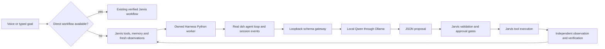

# DeepSeek Harness: how it works and how Jarvis uses it

Research and integration date: **2026-10-02**. Research used the selected Firecrawl plugin and official DeepSeek repository pages. The repository reviewed at the start was commit `639ed015397290b3745d163aafe02ffee4aa3f84` (`0.2.0-rc.2`). The **installed Python SDK and Windows runtime are both `0.1.5rc1`**, corresponding to `dsh-v0.1.5-rc.1`. They are different versions: current repository documentation does not establish that every feature exists in the published Python wheel.

## What a harness does

A model predicts a response or a tool call. An agent harness supplies the surrounding application: prompts, available capabilities, repeated model requests, tool dispatch, policy, cancellation, context management and session state. Using a harness does not train a model or automatically make its decisions correct.

DeepSeek Harness is a TypeScript/Node application with Python and TypeScript SDKs. Its README describes a developer preview with breaking changes expected. The project is MIT licensed. [Official README](https://github.com/deepseek-ai/deepseek-harness/blob/639ed015397290b3745d163aafe02ffee4aa3f84/README.md); [retained SDK license](../integrations/DEEPSEEK-HARNESS-LICENSE).

## Cordis: why everything is a plugin

Cordis supplies a shared context containing named services. For example, a tool plugin looks up the tools service, while a model adapter registers with the LLM service. A consumer depends on an interface instead of importing a specific provider. Required services are declared through `inject`, so activation follows dependencies.

Plugins also contribute event listeners and registrations with cleanup functions. Unloading a plugin unwinds those effects, including its tools and listeners. This makes replacing a provider or changing composition practical without editing one central agent implementation. Event dispatch supports observation, ordered handlers, parallel handlers and middleware that delegates through `next()`.

The implication for Jarvis is composition: keep the upstream inference services and remove capabilities Jarvis already owns. [Cordis primer](https://github.com/deepseek-ai/deepseek-harness/blob/dsh-v0.1.5-rc.1/docs/cordis-primer.md).

## Profiles, bundles and patches

A profile chooses an ordered set of bundles. A bundle contributes plugin rows. Profile, home and invocation patches then modify that composition. Replacing a row's `config` replaces its configuration as a whole, so copying only part of an old configuration can change defaults.

The full SDK profile layers the SDK server over the shared base application. The separate minimal SDK profile owns a small complete tree. It normally includes a persistent platform shell and excludes workspace instructions, skills, compaction and many full-profile tools. Its default shell has broad process access, so selecting the minimal profile alone does not establish a restricted agent.

Jarvis selects `sdk-minimal` with [an explicit overlay](../integrations/harness-inference.patch.yml), then audits the resulting active plugin identities before SDK startup. [Architecture and composition](https://github.com/deepseek-ai/deepseek-harness/blob/639ed015397290b3745d163aafe02ffee4aa3f84/docs/architecture.md); [minimal profile](https://github.com/deepseek-ai/deepseek-harness/blob/dsh-v0.1.5-rc.1/packages/bundle/sdk-minimal/cordis.patch.yml).

## One turn through the upstream runtime

The SDK queues input in a session inbox. The loop admits that input, builds a prompt and capability schemas, resolves a model request, streams a response, and settles the step. A **step** is a model request with its associated tool work; a **turn** can contain several steps before the agent becomes idle.

Events describe the lifecycle: input receipt, turn start, step start, system/user messages, request context, assistant message, step end and turn end. Stream chunks support live rendering; settled messages supply the retained history. Tool results can cause another model request in a fully equipped profile. Live extension events let plugins inspect or intercept requests without replacing the loop.

Jarvis's inference profile intentionally ends after one model request. Its action descriptions are reference data inside the prompt; they are not registered upstream executable tools. [Agent-loop implementation](https://github.com/deepseek-ai/deepseek-harness/blob/dsh-v0.1.5-rc.1/packages/core/agent-loop/src/index.ts).

## Tools, policy and verification

In the full harness, a model tool call enters a guarded pipeline. Pre-execution policy and approval decisions precede dispatch. Post-execution handlers can transform results, and the final settled result reaches both the session and the next model request. A tool returning successfully establishes a tool outcome; it does not by itself establish that the user's complete goal succeeded.

Jarvis already owns Windows UI automation, browser state checks, file-change validation and explicit approval for sensitive actions. Giving the upstream runtime a second shell or desktop executor would create a second execution boundary. This integration therefore uses upstream inference and keeps execution in Jarvis's existing registry and checkpoints. [Upstream tool pipeline](https://github.com/deepseek-ai/deepseek-harness/blob/dsh-v0.1.5-rc.1/docs/tool-execution-pipeline.md).

## Models and the Python bridge

The Python SDK launches the matching packaged `dsh` executable and exchanges JSON-RPC over stdio. Initialization selects the model route; `run()` queues a prompt and collects session events until the agent becomes idle. An explicit harness home isolates its files. The packaged runtime avoids requiring a separate system Node installation.

The DeepSeek adapter supports an OpenAI-compatible endpoint override and accepts model IDs outside its advisory catalog. Jarvis points that adapter at an owned loopback HTTP gateway. The gateway sends the actual harness-assembled messages to the existing Ollama/Qwen runtime, requests schema-constrained JSON and returns the response as SSE. The route label `deepseek-official` names the adapter; **the model executing these Jarvis requests is local Qwen3.5-4B**. No DeepSeek cloud API key is required or used.

The adapter's loopback credential is a fixed non-secret marker. Runtime tool schemas must be empty. Unknown endpoints and multiple inference calls in one turn are rejected. [Python SDK](https://github.com/deepseek-ai/deepseek-harness/blob/639ed015397290b3745d163aafe02ffee4aa3f84/python/sdk/README.md); [installed-release model adapter](https://github.com/deepseek-ai/deepseek-harness/blob/dsh-v0.1.5-rc.1/packages/llm/llm-deepseek/README.md).

## Sessions, memory and recovery

The upstream session event stream records messages and lifecycle facts. Its JSONL backend supports per-session storage and historical format handling. The SDK reports root-session events separately from descendant notifications.

In this pinned runtime's checks, the configured upstream JSONL directory did not materialize session files. Jarvis therefore exports the **actual SDK-returned events**, including failed turns, to `.jarvis-runtime/harness-home/turns/<session-id>.jsonl`. These are Jarvis exports, not verified upstream persistence/resume artifacts. They may contain private task context and are excluded from Git. Each inference gets a fresh session; Jarvis task checkpoints and read-only sessions supply continuation context. No saved action is automatically replayed.

An owned Windows job reaps the harness executable when its worker closes or dies. Worker loss permits one inference-only retry after a cancellable 0.5-second delay. A watchdog clears a dead worker for the next request. Quit/Stop and cancellation close owned processes. [Persistence backend](https://github.com/deepseek-ai/deepseek-harness/blob/dsh-v0.1.5-rc.1/packages/session/session-persistence-jsonl/README.md); [SDK server lifecycle](https://github.com/deepseek-ai/deepseek-harness/blob/dsh-v0.1.5-rc.1/packages/sdk/server/README.md).

## What is used in Jarvis



| Area | Current integration |
| --- | --- |
| General task planning/replanning | Harness selected through `brain.harness.enabled`; proposals validated in both worker and caller. Completed/failed actions are forbidden in new proposals. |
| Read-only project research | `jarvis.agent_cli --backend harness` uses the real runtime for inference while Jarvis scopes and dispatches reads. Session resume restores context, never actions. |
| Direct app/media/folder workflows | Continue using existing deterministic routes before model planning. |
| Streaming coding | Existing Qwen3-Coder draft streaming and file commit checks remain in use. Harness is not selected for `code_edit`. As of the staged development upgrade on 2026-10-02, development `code_plan` proposals can use Harness; ordinary small coding plans retain the existing coder route. Jarvis validates paths and commits at most three files per batch. See [web/app development](web-app-development.md). |
| Decision, screen vision and independent verification | Existing model routes remain in use. A Harness completion assessment still needs Jarvis verification. |
| Skills and Obsidian memory | Jarvis's bounded capability/skill/memory context enters planning; upstream skill discovery is not enabled in this profile. |
| Upstream shell, filesystem, MCP, web, subagents and jobs | Not exposed. Headless `team.run` rejects this single-worker backend; ordinary Ollama research retains its existing team support. |
| UI, microphone, speech | Existing Jarvis island, input and voice services. No UI change or new screenshot. |

The upstream repository also organizes skills, compaction, subagents, LSP, workflows, sandboxing, hooks and web capabilities into separate package families. Their presence in the repository is not evidence that Jarvis has enabled them. [Package family map](https://github.com/deepseek-ai/deepseek-harness/tree/dsh-v0.1.5-rc.1/packages).

For example, a goal needing researched file context can still plan `read_file`, receive its verified result, and ask Harness for remaining work. The file read itself is performed by Jarvis. A Calculator proposal only becomes a completed desktop task after Jarvis opens the app and checks current state.

## Setup, configuration and use

Run [Setup Jarvis Harness.cmd](../Setup%20Jarvis%20Harness.cmd), or:

```powershell
.\.venv\Scripts\python.exe setup_harness.py --enable
```

The setup creates `.venv-harness`, installs [declared dependencies](../requirements-harness.txt), boots the real runtime for its readiness check, and only then selects planning. It does not download another model. Ollama must have the configured planner installed; inference uses Jarvis's existing readiness path to start Ollama when needed.

```json
"harness": {
  "enabled": true,
  "model": "qwen3.5:4b",
  "timeout_seconds": 180
}
```

These settings live under `brain` in [config.json](../config.json). Harness takes precedence over enabled Hermes for planning. Set `enabled` to `false` to return to Hermes when enabled, or native Qwen otherwise. Errors do not silently switch planner backends. Restart Jarvis after changing selection. Existing Start/Stop launchers remain the entrypoints.

Read-only research from the app directory:

```powershell
.\.venv\Scripts\python.exe -m jarvis.agent_cli --backend harness --project . --goal "Read jarvis/harness.py and explain its routing" --max-steps 3
```

The CLI backend is explicitly selected and independent of the voice planner setting. Supply `--session <returned-id>` for Jarvis's conversational context continuation. Files and calls remain subject to its read-only scope checks.

Implementation: [client/routing](../jarvis/harness.py), [SDK worker and gateway](../jarvis/harness_worker.py), [process ownership](../jarvis/harness_process.py), [launcher health check](../jarvis/launcher.py), [runtime manifest](../runtime_manifest.json). Worker diagnostics stay in local `harness-worker.log`; repair records stay in `.jarvis-runtime/repairs.jsonl` and the transcript.

## Verification and limitations

**2026-10-02:** The official `0.1.5rc1` Windows executable booted and completed its SDK handshake with 18 expected active plugins and no model-facing tools. The final three real local Qwen turns passed against synthetic observations: plan **32.344 s**, replan completion assessment **15.734 s**, and a read-only code explanation **10.344 s**. The earlier successful pass measured **22.312 / 17.438 / 10.375 s** before event export and the extra repeat-proposal check. [Final inference evidence](../artifacts/harness-local-check.json).

The first check failed because Ollama was stopped; [that original result](../artifacts/harness-local-check-initial-failure.json) is retained. Subsequent checks exposed an SSE compatibility failure caused by empty usage metadata; the gateway now omits unavailable usage counts. A stronger completion prompt corrected an inconsistent model replan, and repeated completed/failed proposals are rejected independently.

These are real SDK/model checks with **synthetic observations**, not live desktop execution, spoken end-to-end timing, a matched speed comparison, or a coding-quality benchmark. No universal speed/quality improvement is established. CPU inference can remain slow. The minimal profile has no upstream compaction; Jarvis retains its bounded observation compaction. Source being edited and mandatory instructions are not discarded to fit context.

**Actual read-only CLI on 2026-10-02:** Jarvis read a real `sample.py` in a temporary synthetic project and Harness/Qwen explained `print(2 + 3)` correctly in **30.672 s**. This checked the CLI's strict provider contract as well as actual read dispatch; it did not execute the sample program. [Research check](../artifacts/harness-research-check.json). The [first CLI failure](../artifacts/harness-research-check-initial-failure.json) is retained: the adapter initially exposed extra runtime metadata to a session that accepts only `final` and `calls`; the adapter now returns that exact contract.

**Final regression/readiness on 2026-10-02:** All **592 tests passed** in the project `.venv`; `python -m jarvis.launcher --check` reported `ready`, no missing components, and `planning_backend: deepseek-harness`. The 14 new tests cover routing, the research provider contract, profile drift, cancellation, bounded retry/backoff, proposal rejection, and owned-process cleanup that leaves an unrelated process alive. No upstream Web UI is started or published, and no desktop screenshots or microphone recordings are captured.

Verification commands:

```powershell
.\.venv-harness\Scripts\python.exe -m jarvis.harness_worker --check
.\.venv\Scripts\python.exe verify_harness.py
.\.venv\Scripts\python.exe verify_harness_research.py
.\.venv\Scripts\python.exe -m unittest discover -s tests
.\.venv\Scripts\python.exe -m jarvis.launcher --check
```

The runtime is pinned because the project is in developer preview. Upgrade SDK/runtime together, recheck effective plugin identities and transport behavior, and repeat regression/readiness tests before enabling a new release.
