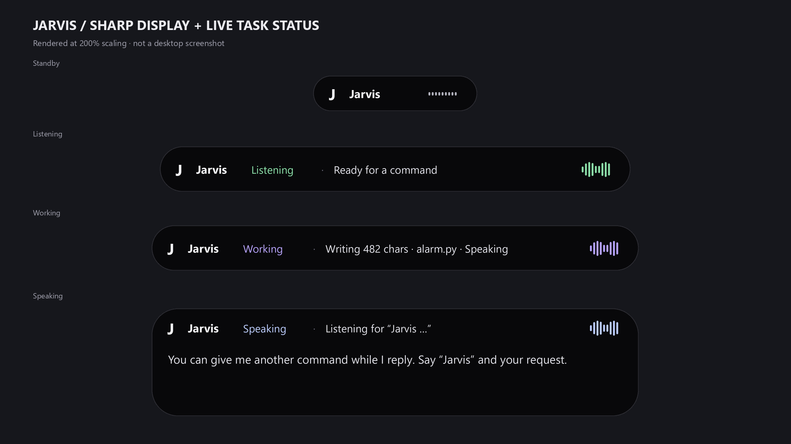
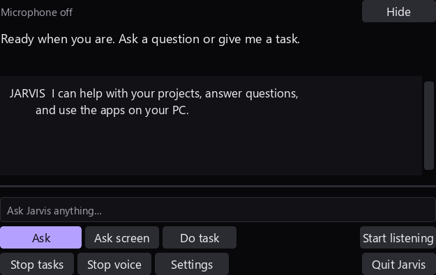

# Sharp display, live progress and commands during speech

Implemented **2026-10-01**. Restart Jarvis once to load this upgrade.

## Native display rendering

Jarvis requests Windows Per Monitor V2 DPI awareness before creating Tk windows, using the documented [Windows DPI API](https://learn.microsoft.com/en-us/windows/win32/api/winuser/nf-winuser-setprocessdpiawarenesscontext). The island queries its window DPI and renders directly to the matching physical pixel dimensions. Text and shapes are drawn at twice that resolution and reduced with antialiasing; transparent corners retain the Windows color key without pink edges. Larger header type improves readability. Panel dimensions and text wrapping account for display scaling.

Idle remains a quiet compact capsule. Listening and active tasks expand up to **580 × 64 logical pixels**; response cards use up to **600 × 140**. Expanded controls remain **540 × 392**. Physical dimensions grow with Windows scaling and are bounded to the screen. Smooth size transitions, reduced motion, keyboard controls, dragging, capture exclusion, microphone Stop and Quit remain connected.

This **1920 × 1080 rendered preview** uses the runtime renderer at 200% scaling. Its task captions are representative examples, not evidence that a live alarm task was running in the screenshot. It contains no desktop capture or private source. The native overlay has no fixed “1080p” resolution; it renders at the actual window DPI.

## Status beside Listening / Working

The header's right-hand caption shows runtime task updates, including opening an app or folder, planning, the selected tool or current step. Coding reports **Generating code · alarm.py** before the first model token, **Writing 482 chars · alarm.py** as streamed content grows, then validation. **Speaking** appears beside working/thinking details when output overlaps another activity.

Captions update through the existing UI event queue. File progress displays the target basename and character count; source code is not sent to the caption. Long captions are truncated without covering the status or waveform. Completion captions expire after seven seconds. Stream progress is limited to four metadata updates per second. Display delivery failures do not stop or replay file writes. The existing transcript remains available in expanded controls.

## Commands during voice playback

Microphone capture and Whisper decoding now continue while Jarvis synthesizes/plays speech. Say **“Jarvis, open Spotify”**, **“Jarvis, what time is it?”**, or another addressed command to interrupt a reply and give the next instruction. A detected, non-echo wake phrase stops the current voice and clears older queued replies; it does not stop microphone capture. Final recognition still governs task execution, so a partial wake phrase does not prematurely execute a revised command.

To reduce feedback, audio blocks record whether they overlap voice playback or its short tail and retain the corresponding spoken-text references. The decoder rejects matching self-echo and requires an explicit wake word for overlapping audio. Those capture-time tags/references also apply when decoding finishes after speech has stopped or a newer reply has begun. Audio captured before playback retains existing awake-command behavior and original transcript punctuation. No extra voice service or dependency was installed.

This is **text-based echo rejection, not acoustic echo cancellation or speaker authentication**. Loudspeaker audio mixed with your voice can still reduce Whisper accuracy; headphones or a microphone with hardware echo reduction help. An addressed command exactly matching a phrase Jarvis is currently reading can also be filtered as echo. Overlapping speech accuracy needs a real spoken trial on your microphone; automated recognizer inputs cannot establish it.

The independent voice, question and action workers continue to run concurrently. A general question now leaves an in-progress coding/automation task's generation intact. New mutating task requests still supersede the old autonomous task and execute through the single action worker; independent desktop writes/clicks are not raced against each other. Stop/Cancel continues to invalidate late decoder output, tasks and speech. Question/model inference can still compete for local hardware resources, and command latency includes Whisper segmentation/decoding.

## Verification

- **2026-10-01:** all **578 regression tests passed in 31.600 seconds**. Twelve new checks cover DPI dimensions, caption layout/lifecycle, live draft metadata, display failure isolation, self-echo, interruption, delayed decode, partial/final deduplication, Stop, independent questions and a read-only verification journal. The scaled compact control layout regression also passed after correcting its logical/physical size handling.
- Hidden Tk startup/shutdown, compact controls and Full HD preview export passed without microphone capture, startup greeting or actual Obsidian writes. Both images above were visually inspected. Hidden UI verification uses a read-only task journal so it cannot overwrite a real running task's state.
- Launcher readiness reported `ready`, no missing components and native Qwen planning. Documentation links and `git diff --check` passed. These are regression/readiness checks; no live microphone interruption or end-to-end latency measurement is claimed.

The existing [Dynamic Island design](dynamic-island.md), [speech setup](natural-voice-and-model-repair.md), and [streamed coding verification](streaming-coding.md) retain their historical evidence.
