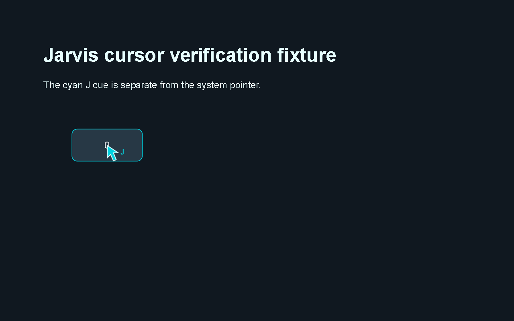

# Jarvis's independent cursor

Implemented and checked **2026-10-08 IST**. When Jarvis activates a supported
control, a cyan arrow marked **J** approaches it, activates it once, and disappears.
The user's system pointer is never moved, hidden, restored or borrowed by this
path. Existing named-control requests, owned-browser clicks and supported
coordinate recipes use it automatically; there is no new setting or dependency.
Start Jarvis normally after the update.



This is a real rendered verification fixture with the cyan J cue and a counter
still at zero, before the click. It is not a production-notch screenshot, a
YouTube/Spotify account capture or an upstream reference image. The cursor
artwork and lifecycle are independently authored for Jarvis.

## How activation works

Windows applications use [UI Automation Invoke](https://learn.microsoft.com/en-us/windows/win32/winauto/uiauto-implementinginvoke)
and the existing role-aware SelectionItem, Toggle or ExpandCollapse patterns.
[independent_cursor.py](../jarvis/independent_cursor.py) displays a nonactivating,
click-through, disposable Win32 window, with a roughly 180 ms approach animation.
The existing serial UI worker rechecks identity, owner, bounds, visibility,
enabled state and foreground after animation, before the one dispatch. Grounded
visual points must resolve a fresh accessible control; non-password Edit targets
can receive native focus. UWP frame hosts and their child processes are matched
through their actual root window. Changed targets/focus cancel before input.

The cue's own rendering thread expires after 950 ms even if a native action
blocks. Normal cleanup also disposes it; terminating its owning worker removes
the OS window. No additional daemon or recovery service is needed. Existing
bounded workers and damaged-copy-preserving source snapshots cover the modules.
Provider order remains UFO, Windows-MCP, CUA, Open Computer Use, Agent-S; the last
adapter now refuses absent accessibility patterns instead of using a physical
centre click. Upstream licenses and pinned source attribution remain retained.

Jarvis's owned browser uses [browser_cursor.py](../jarvis/browser_cursor.py).
It pins the selected DOM element, draws a temporary SVG cue, checks that the page
has not navigated, and calls Playwright once through Chrome's protocol. The
element remains the same across animation; Playwright checks actionability.
The cue ignores pointer events, is removed after the action, and has a 1.2 s
fallback removal timer. Navigation closes its document. DOM construction uses
elements/attributes rather than `innerHTML`, respecting YouTube's Trusted Types
policy. Cleanup errors never trigger another activation.

Direct media APIs, text assignment, shortcuts and no-op state requests do not
need a button cue. App focus and keyboard input remain shared. This is an
independent visual cursor with semantic activation, not a second Windows mouse
device or an independent desktop session.

## Supported targets and limits

Native buttons need an actual supported accessibility pattern. Custom canvas,
games, inaccessible/elevated controls and physical-only gestures may refuse.
Mouse move, drag, wheel, button-down/up, right/middle/double/triple-click recipes
now stop before physical input. Single coordinate clicks require an explicit
current-window point and an accessible control there. Native accessibility
scroll and supported browser actions remain available. The original 493-command
catalog is retained as reference; its entries do not imply every mouse recipe
can run. [Updated command contract](windows-commands.md).

The animation starts near the selected control. It does not expose private
screenshots, add screen/model uploads, or change account/credential storage.
Live actions still need fresh admitted state; there is no automatic action
replay after uncertainty. These checks establish the listed controls, not every
button, login, account action or arbitrary app task.

## Verification on 2026-10-08 IST

The [aggregate receipt](../artifacts/independent-cursor-validation.json) combines
**separately dated** actual-worker checks, with explicit postconditions:

| Target | Action and observation | System pointer |
| --- | --- | --- |
| Owned native fixture | Exactly one button activation by the provider route and by grounded accessibility; click-through/noactivation styles, foreground preservation, disposal and expiry while callback blocks | Unchanged in the clean native run |
| Owned DOM fixture | Counter 0 to 1, one activation, cue removed | Unchanged in the clean DOM run |
| YouTube | Guide drawer closed to open | Unchanged; cue removed |
| GitHub public repository | Platform menu `aria-expanded` false to true | Unchanged; cue removed |
| Spotify web | Browse changed path `/` to `/search` | Unchanged; cue removed |
| Spotify desktop | Search once; focused search ComboBox observed on a read-only follow-up | Unchanged |
| Windows Camera | Switch to video mode, observe changed mode control, restore original photo mode | Unchanged for switch and restoration |

No Camera photo/video was taken; no account write or GitHub publication was made.
Public sites ran in a fresh isolated headful Chrome profile, separate from user
tabs and Jarvis's normal browser profile. Generic browser receipts still report
downstream goal verification as false; the verifier independently checked each
specific property in the table, without promoting arbitrary task completion.

[Original live history](../artifacts/independent-cursor-live-history.json) retains
the early paint signature bug, YouTube Trusted Types failure, ambiguous GitHub
target refusal and trials where global pointer readings changed. Those readings
cannot establish who moved the pointer. Clean native and website checks occurred
in separate runs; this is not a claim of one perfect combined trial. Spotify's
initial observer wrongly expected an Edit rather than a ComboBox. A fresh
read-only observation corrected the evidence without repeating its activation;
[history](../artifacts/independent-cursor-spotify-history.json) is preserved.

**1,165 regression tests passed in 216.872 seconds** after final source review:
[final log](../artifacts/cursor-final-regression-tests.log). Eight focused cursor
checks cover stale focus/navigation, unsupported patterns, one dispatch and
cleanup on failure; [focused log](../artifacts/cursor-focused-tests.log).
The 47 focused visual checks include rejection of physical mouse injection
before `SendInput`; [visual log](../artifacts/cursor-visual-tests.log).
All five native provider checks passed separately:
[actual provider log](../artifacts/cursor-native-adapters.log).
These regression/provider checks are distinct from the live app/site observations.

The [repository audit](../artifacts/cursor-repository-audit.json) parsed all 344
authored Python files with zero static correctness errors, validated all nine
bundled skill definitions and checked 769 local documentation links with no
missing targets. It retains 79 unused-import/variable warnings; static warnings
alone do not prove a file is disconnected or safe to delete.

Configured-service/dependency readiness is
[ready](../artifacts/cursor-readiness.json). Hosted LocalGithub services and
optional external account integrations are outside that readiness scope.
Normal supervised startup is recorded separately in
[startup health](../artifacts/cursor-startup-check.json); operational heartbeats
do not establish a fresh audible spoken answer.

Reproduce selected checks from the application folder:

```powershell
.venv/Scripts/python.exe -m unittest tests.test_independent_cursor
.venv/Scripts/python.exe verify_independent_cursor.py
.venv/Scripts/python.exe verify_independent_cursor.py --web
.venv/Scripts/python.exe verify_independent_cursor.py --app spotify
.venv/Scripts/python.exe verify_independent_cursor.py --app camera
```

Native app checks require that app already open and left in the foreground.
They may refuse if focus changes; inspect the fresh state before issuing another
action. The Camera check changes and restores mode only.
