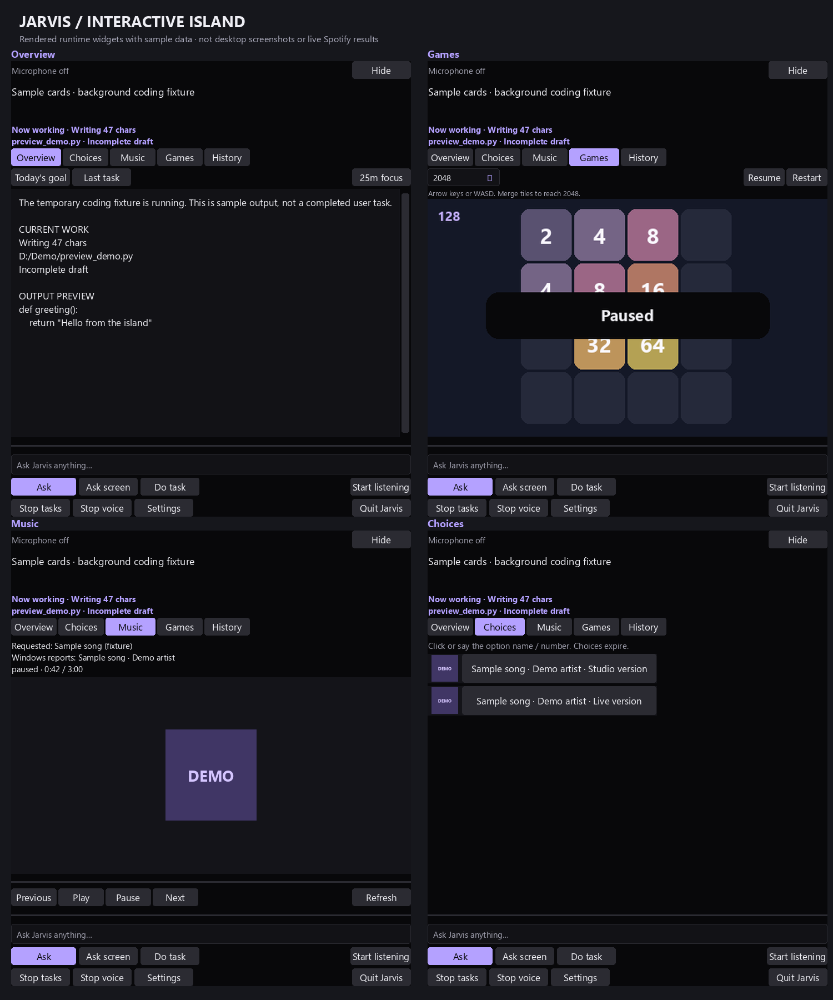

# Interactive Jarvis island

**Current presentation (2026-10-04):** All these features now live inside the
[single-window glass notch](voiceos-notch.md), including the command console.
Earlier previews and measurements below retain their original context.

Implemented 2026-10-02. The island now opens cards for outputs, choices, music and five local games. **Now working** stays above every view with the activity, current filename and streamed character count. Overview shows the full target path, recent result and a bounded source preview. Streaming drafts are explicitly incomplete; a **File saved** event requires the existing coder's disk readback and validation. Python/JSON syntax checks do not establish functional behavior.



This preview comes from the actual Tk widget layout and game renderer. The song names, artwork and choice rows are fixtures. The purple DEMO artwork is original verification artwork. The user's Instagram images inspired the compact player, choice cards and embedded games; their screenshots, account information and third-party album artwork were not copied into this repository.

## Use

Click the island to expand it. It grows to at most 560 × 660 logical pixels, bounded by screen size and Windows scaling. The smaller collapsed card still shows short answers and current activity. Drag the header to move it; Hide/Escape collapses it. Background coding and tasks keep running when changing views.

| View | Contents |
| --- | --- |
| Overview | Task/answer output, full target path, source preview, validation scope; Today's goal and Last task shortcuts; a local 25-minute focus timer |
| Choices | Clickable names and available thumbnails from the actual pending request; countdown until choices expire |
| Music | Requested query separately from the current Windows-reported song, artist, artwork, playback state, time/progress; previous/play/pause/next and refresh |
| Games | Flappy, Snake, 2048, Tic Tac Toe and Memory, with pause/resume/restart |
| History | Existing transcript and diagnostics |
| Settings | Existing microphone, language and speech options |

Examples, typed into the island or spoken after “Jarvis”:

```text
What's my goal today?
What task was I working on?
What file are you working on?
Show music
Play Billie Jean on Spotify
Choose option two
Play snake game
Play flappy bird game
Play 2048 game
Play tic tac toe game
Play memory pairs game
Pause game
Resume game
Restart game
Stop game
```

Game inputs stay inside the focused game canvas. Flappy uses click/Space; Snake and 2048 use arrows/WASD; Tic Tac Toe and Memory use clicks. Tic Tac Toe uses a small local minimax opponent. Games have no model, network or desktop-input dependency. They stop advancing when hidden or during screen capture, and pause when focus leaves the game. Desktop automation may need to focus another application, which pauses the game; background file generation can continue without doing that. Scores/game state last for the current Jarvis session.

Today's goal reads today's recorded task, including its real status. Last task reads the durable task record and latest recorded target. These shortcuts do not invent a separate day plan or imply calendar access. General answers, weather and other existing questions still use their existing knowledge routes and show their results on the island.

## Choices and approvals

Clickable choices come from actual pending app/file, project, UI control or task-clarification state. Cards carry a token bound to the original list, generation and relevant window/signature metadata. The action worker validates it again before dispatch. Expired/replaced cards are rejected, and native control selection still re-observes the application before input. Ordinary voice choices retain their focus-change checks. Clarifications with no predefined alternatives keep their question and accept a typed/spoken answer.

Approvals now use an inline review card with the **exact** destination/content or command and working folder, plus explicit Approve/Deny buttons. The Tk event loop remains responsive while the task waits. Approval requires a deliberate click; cancellation, Stop, Quit or three minutes without a decision denies the request. Closing/collapsing the island does not approve anything. Deletion still requires approval and retains its existing fresh-file checks.

## Spotify

Windows' source-scoped media session supplies current song metadata and native thumbnail bytes. `winrt-Windows.Storage.Streams==3.2.1` is added to the main requirements and readiness imports. Spotify must expose an active media session; multiple Spotify sessions require choosing one in Spotify. The card shows missing artwork/session availability honestly. It does not open Spotify or switch to another application's audio session during polling.

Music observation runs at most once per five seconds while its view is visible. Each read or transport operation runs in an owned hidden one-shot child, with bounded deadlines and output sizes. The existing watchdog checks it; recovery may terminate a stuck child and never replays a transport action. Play/pause/previous/next from the card, and supported Spotify transport commands during a task, use this independent channel, preserving a running coding task. A busy request is reported instead of queuing uncertain input. Play/pause use the existing state verification; next/previous acknowledgement is not proof of the exact requested song.

Equally matching Spotify tracks in the direct playback workflow now pause for selection. Candidate cards include exact exposed names and, when available, bounded thumbnails from accessible Image elements inside the visible native Spotify result rows. Those reads require the selected Spotify window to remain foreground and the image bounds to belong to it; thumbnails stay in memory and are excluded from control identity. Hidden/occluded/unexposed artwork falls back to a numbered card. Search/selection still depend on the installed Spotify UI exposing usable controls. Current playback artwork does not substitute for a missing candidate image.

## Configuration and components

The default configuration uses `ui.opacity: 0.96`; both the native capsule and its internal companion window are slightly translucent. Values are bounded to 0.8–1.0; use 1.0 for an opaque island. This uses window alpha and does not provide acrylic background blur. Existing `ui.reduced_motion` remains supported.

- [Island cards](../jarvis/island_desk.py), [bound choice routing](../jarvis/island_choices.py), [five game engines](../jarvis/island_games.py).
- [Owned media jobs](../jarvis/island_media.py), [candidate artwork reads](../jarvis/island_artwork.py).
- [Hidden verification and preview export](../verify_island_desk.py), [regression tests](../tests/test_island_desk.py).

The previous launcher, Stop, bootstrap, manifest, capture exclusion, single desktop-action owner and task checkpoints remain connected. Native screen capture hides the island so it is not mistaken for the target application. Metadata/choice display failures never replay an external action. Full transcripts/settings remain inside the island; the optional command-prompt window still opens only when requested.

## Research and attribution

Firecrawl checked these primary references for the implementation:

- [Microsoft: Windows media properties](https://learn.microsoft.com/en-us/uwp/api/windows.media.control.globalsystemmediatransportcontrolssession.trygetmediapropertiesasync) and [media thumbnail property](https://learn.microsoft.com/en-us/uwp/api/windows.media.control.globalsystemmediatransportcontrolssessionmediaproperties.thumbnail).
- [Microsoft: DataReader.ReadBytes](https://learn.microsoft.com/en-us/uwp/api/windows.storage.streams.datareader.readbytes) and [PyWinRT projection documentation](https://pywinrt.readthedocs.io/); the installed projection's typed interfaces were also checked.
- [Python: Tkinter window attributes](https://docs.python.org/3/library/tkinter.html) and [TkDocs: window transparency](https://tkdocs.com/tutorial/windows.html).

The card/game implementation is local Jarvis code; this change does not copy an upstream assistant or its album art.

## Verification (2026-10-02)

**693 regression tests passed in 35.330 seconds**, and launcher readiness reported `ready` with DeepSeek Harness planning and the UI-TARS parser still connected. [Regression/readiness record](../artifacts/island-regression-check.json). An intermediate shared-process native WinRT fixture was followed by two ONNX DLL initialization failures in speech tests; native media fixtures now run in isolated children, matching the production media boundary. The final full suite passed after that change.

The [hidden UI fixture report](../artifacts/island-desk-check.json) records actual temporary Python draft writes, readback and compilation while the game view opens. Task generation stayed unchanged and the current file/draft status reached the cards. All five game renderers, nonblocking denial, microphone-off startup and disabled real-vault memory passed. The exported images show runtime widgets with sample content, not completed user work.

The [real Spotify observation report](../artifacts/island-spotify-observation-check.json) confirms that the current Windows Spotify session returned title/artist fields, paused state and decoded 192 × 192 artwork. Song titles and album artwork were not exported to the report. **This was read-only: playback controls, candidate row artwork/selection on the live desktop and live spoken commands were not tested.** Their regression tests use fixtures. No local-model coding speed or concurrent desktop-interaction benchmark is claimed.

Run from the application directory:

```powershell
.venv\Scripts\python.exe -m unittest discover -s tests -q
.venv\Scripts\python.exe verify_island_desk.py
.venv\Scripts\python.exe verify_ui.py
.venv\Scripts\python.exe -m jarvis.launcher --check
```

Restart Jarvis once through its normal Stop/Start launchers to load the updated source and dependency manifest.
