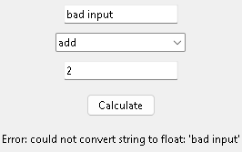

# Existing Python scripts and GUI edits

Updated 2026-10-04. `add UI to calculator.py` now resolves the named existing
file without a separate model planning call. Jarvis sends its exact UTF-8 source,
the original normalized user goal, project guidance and GUI requirements to the
configured `brain.coder` (currently local `qwen3.5:9b`). GUI edits bypass the
historical calculator GUI template and any CLI-trained coder checkpoint.

`add UI again` can resolve the last observed coding target in the same project,
or the sole Python source in the selected folder. Multiple plausible scripts
require a filename clarification. Target paths and source bytes are checked
again before any replacement; a concurrent user edit is never overwritten.
Existing source above the 14,000-byte edit limit is rejected explicitly rather
than silently truncated. Complete generated files remain limited to 20,000
characters. Follow-up memories are reference context; they do not replace the
fresh source read from disk.

The saved task history showed that the earlier completed request was
`modify calculator.py and complete its code`, which produced CLI code. The
subsequent `add ui to calculator.py` failed with Windows access denied while
writing `calculator.py.jarvis-draft`, after an unnecessary planning call.
The following retry was cancelled while planning. These particular records
do not establish an Ollama generation timeout. Separately, the former coding
worker enforced a fixed total deadline even when output was still streaming.

For requested desktop Python UIs, the prompt defaults to standard-library
Tkinter/ttk unless the existing code or user specifies another framework. A
syntax check alone no longer accepts console-only output, an unused UI
function, a bare `launch_ui(): pass`, or a window with no connected controls.
Conservative AST checks require a reachable launch/event loop, interactive
widgets, layout and callbacks. Console/text UI requests remain separate.
Failed validation returns the error plus the unchanged original source for up
to two additional inference attempts. Only a complete validated response can
replace the existing script. Structural checks cannot prove arbitrary callback
semantics or all GUI frameworks; Jarvis reports this distinction and does not
automatically execute arbitrary user source.

Streaming uses the existing island task-file preview. Existing scripts stay
unchanged while the optional `.jarvis-draft` sidecar is written. A locked or
unowned sidecar switches to island-only previews, without retrying the failed
write. A final script replacement error still stops the task; no external
action is automatically replayed. New-file draft writes retain their stricter
failure behavior because the target itself is the resumable draft.

`brain.coding_timeout_seconds` now bounds inference silence (default/configured
900 seconds, clamped to 5–900); the worker allows another 30 seconds for
transport/startup. `brain.max_coding_seconds` bounds the entire request
(default 1,800, maximum 3,600 seconds). Only genuine received model tokens or
code chunks renew the idle budget; thinking text is not displayed. Stop remains
available. Qwen receives an 8K–16K context allocation and up to 6,000 output
tokens for an edit. Model loading, CPU speed and other Ollama clients can still
affect latency; streaming does not make inference instantaneous.

Original bytes and the proposed diff remain in Jarvis's existing local coding
review when task-state tracking is available. No new paid service, model
download or Python dependency was introduced. Restart using the normal Stop
and Start Jarvis launchers to load the updated code.

Actual local verification on 2026-10-04:

- [Regression/readiness check](../artifacts/gui-edit-regression-check.json):
  **940 tests passed**, launcher reported **ready**. Injected faults cover
  locked optional previews, final target locks without replay, invalid GUI
  output and bounded correction, changed source, silent inference, active
  stream idle renewal, total deadlines and cancellation. These are readiness
  and regression checks, not end-to-end microphone accuracy measurements.
- [Model/edit check](../artifacts/gui-edit-live-check.json): configured
  `qwen3.5:9b`, exact current-source payload, one `code_edit` call and no
  `code_plan`, **421** streamed code events, validated atomic save and disk
  readback in **189.5 seconds**. The authored fixture's original source and diff
  were retained in its coding review. This is one PC/fixture measurement.
- [Generated GUI behavior](../artifacts/gui-behavior-live-check.json): normal
  script entry opened a Tkinter window with two inputs, an operation selector,
  a Calculate button and visible results. Actual widget invocation verified
  addition, subtraction, multiplication and division, plus visible zero-division
  and invalid-input errors. The verifier replaces the blocking event loop with
  explicit Tk event updates so it can close its own window after checking it.
  This tests callbacks and rendering, not mouse targeting or real voice input.
- [Pilot history](../artifacts/gui-edit-live-history.json) preserves a failed
  initial check: the validator then rejected an otherwise valid Tkinter wildcard
  import. That validator bug was corrected and regression-covered before the
  successful rerun. The pilot also reproduced Windows access denied on the
  optional sidecar and confirmed that island-only streaming continued.

Actual owned-window capture from the local Qwen-generated Tkinter fixture,
showing the tested invalid-input error. This is a sample generated calculator,
not the Jarvis island or an upstream UI reference. Code originated from the
authored arithmetic fixture plus local Qwen generation; no external artwork.

Live model/GUI checks are separate from regression and launcher readiness;
user projects are not used as executable test fixtures.
