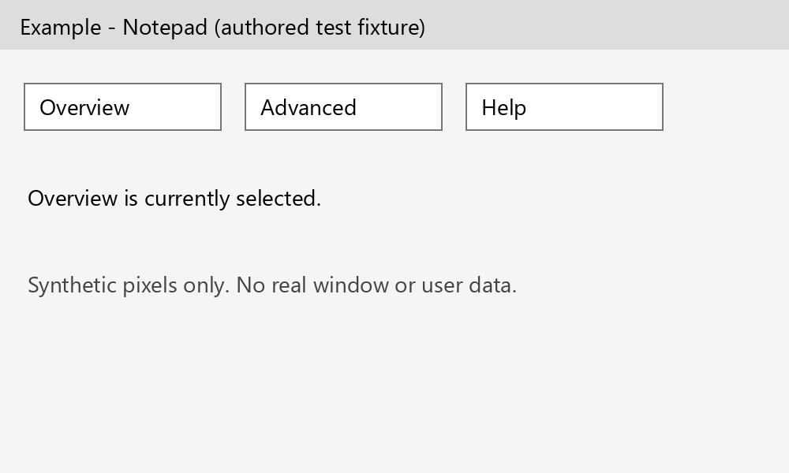

# One observed next step and verified repeat navigation

Implemented on 2026-10-03. Restart through the normal Stop/Start Jarvis launchers
to load it. This is adaptive software planning, not human consciousness, mind
reading or a model weight update.

**2026-10-04 model update:** Current configuration selects Qwen3.5:9b for text
and vision and uses native function proposals for the same one-action contract.
The 2026-10-03 measurements below remain historical 4B vision evidence.
[Current model, tool routing and measured limits](qwen35-9b.md).

## New desktop tasks

1. Observe the selected application and capture its current screen. General
   planning sends the image directly to the existing local vision model with the
   original aim, verified completed steps, current tool catalog and next step number.
2. Ask for **one next action**. The JSON schema permits at most one action;
   runtime validation rejects multiple actions, unsupported tools and repeated
   completed actions. A completion claim still needs independent whole-goal evidence.
3. Ground the proposed action against fresh controls. Existing ambiguity checks,
   visual grounding, explicit text checks and write/command approvals still apply.
4. While dispatching that action, one task-owned background worker prepares the
   next prompt scaffold. It copies known intent/history and the fixed prompt;
   it does not predict the next screen, run inference or perform another action.
5. Observe and independently verify the result before accepting another step.
   Attach a fresh image to the prepared prompt for the next inference request.
   Optional external Tesseract OCR is skipped for these captures because the
   vision model receives the pixels directly. Tool/API tasks use their returned
   evidence; the desktop image does not prove an API or file result.
6. Stop on cancellation, unclear outcomes or the existing six-action task limit.
   An uncertain click or write is never automatically replayed. Read-only
   inference retains its existing bounded retry and cancellation backoff.

Deterministic direct commands, explicit file/command requests, existing media
fast workflows and the separate coding pipeline keep their specialized routes.
General next-step planning uses native local Qwen inference; Harness/Hermes remain
available to other configured routes and when incremental planning is disabled.

## Two-screen memory

Only the current and previous capture remain in the task-owned frame ring. A
third capture discards the oldest image reference. Ordinary next-step requests
send only the current frame; recovery planning can use the previous frame as
reference, with current evidence taking precedence. Multiple read-only captures
can occur while checking a transition; the ring counts captures, not actions.

Completion, cancellation and exceptions clear both frames and join the local
prompt worker. The persistent inference worker drops its input/request references
after responding. This feature writes **no screenshot files**. This is reference
cleanup, not a guarantee of secure erasure from Python, OS or model-runtime memory.
The model is kept warm under the existing local runtime policy.

Task checkpoints retain action names, targets, result evidence and measured
timing. Verified experience learning continues to retain successes and failures;
neither store contains these screenshot images.

## Repeated tasks

An additional local cache remembers a recipe only when the entire goal and every
action have been verified. It stores semantic control names/roles/parent labels,
expected results and hashes of observed semantic before/after states. It excludes
old runtime IDs, window handles, coordinates, typed content and screenshots.

Reuse currently covers **navigation tabs and standard File/Edit/View/Help/Tools
menu expansions** in Notepad, Explorer, Paint and Calculator. Arbitrary buttons,
browser/account actions, dialog confirmations, typing, file writes, saving,
deletion and commands are excluded. A task containing an unsupported step is not
cached. Existing independently checked media fast paths are separate.

On the same explicit request, Jarvis checks the same initial application/title
and semantic controls, locates each unique control again and verifies the
corresponding fresh result. There are no model calls on this route. Changed,
ambiguous or expired state falls back to normal planning **before any action**.
After dispatch, an unverified result stops execution without replay or automatic
fallback. A remembered result is navigation-state evidence, not proof of document
contents or business outcomes.

Storage: `.jarvis-runtime/navigation-workflows.json`, maximum 24 recipes and six
steps per recipe, with 14-day expiry. Malformed, linked or unwritable cache files
disable reuse while preserving ordinary planning. No new dependencies or
long-running services were added.

## Configuration and timing

Both options are enabled in [config.json](../config.json):

```json
"incremental_planning": true,
"reuse_navigation_workflows": true
```

They belong under `brain`. Disable `reuse_navigation_workflows` to keep one-step
planning without repeat reuse. Disable `incremental_planning` to use the configured
legacy planner backend. Launcher readiness validates both as booleans and reports
the active route.

The repeat route stops dispatching additional actions at a five-second budget.
An OS accessibility call, application loading or outcome observation can exceed
that budget; there is no universal five-second completion guarantee. Timing
checkpoints record elapsed time, whether the five-second target was met, measured
next-step inference/action stages and the zero retained-frame count.

Preparing the scaffold overlaps a small amount of local work. It cannot remove
the vision model's inference time, network latency or application transition time,
and accuracy improvement has not been established by a comparative benchmark.

## Verification and limits

On **2026-10-03**, [the fixture check](../artifacts/step-planning-check.json) passed
two-frame rotation, task-end cleanup and prompt preparation checks. A real
`qwen3-vl:4b` call selected the correct **Advanced** tab from an authored image in
**34.125 seconds**. This measured one inference request including worker startup;
it was not an end-to-end desktop task or a warm/cold comparative benchmark.
The five-second target was **not met**. This one successful case is not a general
accuracy percentage.



The [dated regression/readiness record](../artifacts/step-planning-regression-check.json)
records **785 passing regression tests**, including 27 new step-planning checks,
and launcher readiness `ready` with `qwen-next-step`. The new tests cover
single-action enforcement, fresh image/step numbering, two-frame cleanup,
background scaffold isolation, verified-only persistence, changed IDs, stale and
poisoned recipes, cancellation, inference retry/backoff, disk failure and uncertain
actions without replay. Their navigation adapters are synthetic fixtures;
live voice and repeated desktop navigation speed remain unmeasured.

Reproduce from the application directory:

```powershell
.\.venv\Scripts\python.exe -m unittest discover -s tests -q
.\.venv\Scripts\python.exe verify_step_planning.py --live-model
.\.venv\Scripts\python.exe -m jarvis.launcher --check
```

This is an independent extension of Jarvis's existing planning, grounding and
experience code. No third-party consciousness or proactive research code is
imported. Idle research anticipation remains documented separately in
[anticipation.md](anticipation.md).
