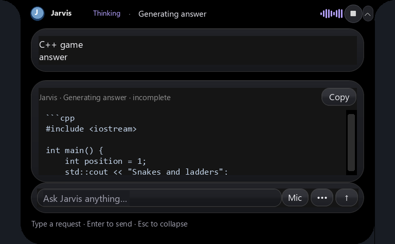

# Streaming Ollama answers in the island

**Later display fix on 2026-10-04:** [Smooth island growth](smooth-island-growth.md)
keeps the view mounted while tokens arrive, skips unchanged placement, retains
height through pauses/replacement, and preserves the reading line when scrolling
back. The live inference timings below remain from the preceding streaming update.

Updated **2026-10-04, Asia/Kolkata**.

Jarvis's question worker previously requested the entire answer with `stream:
false`, allowed a 120-second HTTP read, and stopped the process after 180 seconds.
Ollama's desktop chat could keep showing generation while Jarvis had already
stopped waiting. The preceding [timeout repair](ollama-output-timeouts.md) changed
task planning deadlines; it did not change this separate question path.

Questions now stream through the persistent question worker to the existing
glass island. The first tokens appear before the final answer. The heading shows
the current phase and **incomplete** until the final response passes validation.
The Stop control cancels the owned request; late results are discarded. Scroll
back to inspect earlier text, or stay at the bottom to follow new output. Copy
preserves source indentation; a copied preview remains incomplete.



## Time limits and configuration

| `config.json` knowledge setting | Current value | Meaning |
| --- | --- | --- |
| `stream` | `true` | Enables incremental answer display. |
| `timeout_seconds` | `300` | Maximum HTTP silence while loading, preparing a prompt, or between streamed data. The question client allows 30 additional seconds for transport/startup. |
| `max_answer_seconds` | `1800` | Total generation ceiling. Actual model progress resets the inactivity clock, never this ceiling. Allowed configuration is bounded to 3,600 seconds. |
| `num_predict` | `4096` | Output-token allowance, increased from the old implicit 600-token limit for long code answers. Reaching the token limit still marks output incomplete. |

These settings are under `knowledge`, independently of `brain` planning and
coding limits. Increasing the total ceiling does not make CPU inference faster.
An unavailable server, silent model load, disconnected stream, exhausted output
budget, or total ceiling can still stop a response. Streaming avoids discarding
a healthy response solely because its total duration exceeds the old 180 seconds.
Restart Jarvis through the normal Stop/Start launchers to load the changes.

## Request and display behavior

- **Ask**, spoken questions, and explicit `ask …` use the question worker. The
  screenshot's `give c++ code for snake and ladder game with working ui` also
  routes as one question, preserving “snake and ladder” rather than splitting it
  into commands.
- Stable code-example requests stream plain answer text with fenced source and
  build instructions. They have no execution tools and never write or run the
  generated program. Explicit project code tasks retain the guarded file workflow.
- General questions retain the validated `answer`/`needs_web` JSON protocol. Only
  the decoded answer string appears in the card. If a draft needs online
  verification, it is cleared before a replacement answer streams from search
  evidence; actual source links appear in the final answer.
- Screen answers stream from the local vision endpoint while preserving image
  input. No live screenshot inference is claimed by the verification below.
- Model activity can show “Thinking” without displaying private reasoning text.
  Progress comes from actual generated data, not a timer heartbeat that could
  hide a stalled model. No tokens are spoken, logged to the transcript, or saved
  to memory one at a time; completed answers use the existing final-answer flow.
- UI updates are throttled to approximately four per second. Append updates keep
  source selection and reading position intact. All controls stay inside the same
  island; task execution state remains separate from answer previews.
- On interruption, the visible preview stays labelled incomplete. It is never
  inserted into conversation history as a completed answer. A worker that dies
  after progress is not automatically restarted to regenerate a conflicting
  preview. Pre-output read-only worker recovery keeps its existing one-retry policy.

Implementation: [question client](../jarvis/question_client.py),
[worker and HTTP stream](../jarvis/knowledge_worker.py),
[question orchestration](../jarvis/knowledge.py),
[island answer card](../jarvis/island_desk.py), and
[shared bounds](../jarvis/inference_limits.py). No dependencies were added.
Launcher, runtime manifest, recovery snapshots and existing Stop behavior remain
compatible.

Ollama documents [newline-delimited streaming responses](https://docs.ollama.com/api/streaming)
and the chat endpoint's [content, thinking and completion fields](https://docs.ollama.com/api/chat).

## Verification

The [verification helper](../verify_answer_stream.py) records three separate
scopes and preserves older results before replacement:

```powershell
.venv/Scripts/python.exe verify_answer_stream.py ui
.venv/Scripts/python.exe verify_answer_stream.py live
.venv/Scripts/python.exe verify_answer_stream.py regression
```

- [Island fixture](../artifacts/answer-stream-ui-check.json): authored code in an
  off-screen instance of the real application; single native window, incomplete,
  cancelled and completed labels checked. The image above renders widget layout
  without capturing the user's desktop or starting the microphone.
- [Live question worker](../artifacts/answer-stream-live-check.json): the exact
  C++ game question shown in the user's message, local `qwen3.5:9b`, CPU inference.
  First text arrived in **13.266 seconds**; completion took **407.156 seconds**
  (6 minutes 47 seconds), with **1,287 progress events** and **7,984 answer
  characters**. The request continued beyond both the old 180-second deadline
  and the 300-second silence allowance because it kept generating. This measures
  real streaming and completion; it does not compile or execute the proposed
  source or establish that its GUI works. Timing is one CPU run, not a speed guarantee.
- [Regression and launcher readiness](../artifacts/answer-stream-regression-check.json):
  **859 tests passed; launcher readiness is `ready`, with no missing requirements**.
  This is separate from live inference. Fault injection covers streams beyond the old
  deadline, silence, total ceiling, cancellation, invalid frames, worker loss,
  Unicode/escaped source, online-draft replacement, and output/activity throttling.

Earlier live attempts that returned descriptions instead of C++ source remain in
the [check history](../artifacts/answer-stream-live-history.json). They are not
reported as successful code generation.
