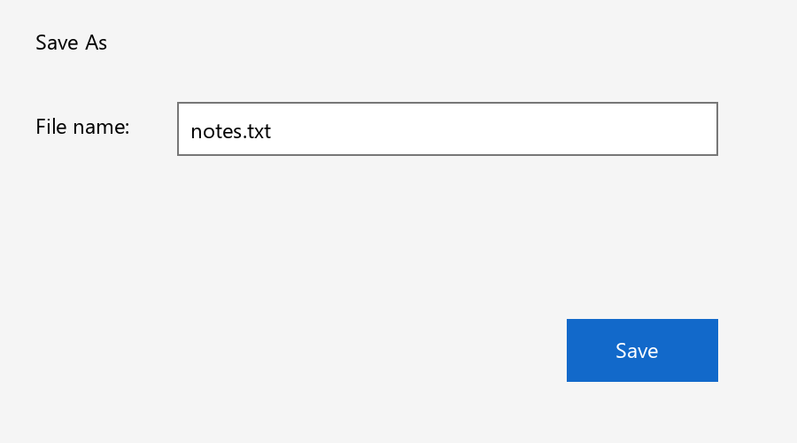

# Visual interaction and checked Save outcomes

Implemented 2026-10-02. Jarvis now has a native-first visual fallback for named controls that Windows UI Automation cannot expose. The existing owned-browser DOM tools remain the preferred website route. The fallback uses the installed local `qwen3-vl:4b` model, an actual reviewed Apache-2.0 UI-TARS parser component, and Jarvis-owned Windows input and verification. It is connected to task planning, direct missing-button requests, tool policy, cancellation, checkpoints and experience memory.

This is a selective component integration. UI-TARS Desktop, UI-TARS model weights and the Agent S runtime are not installed. Screenshots stay in memory and go to the existing local Ollama endpoint; this feature adds no screenshot upload service, cloud key or new model download. `pywin32==312` is now declared explicitly; it was already installed through the Windows automation stack. Pillow and the existing model runtime are reused.

## Evaluation and selection

| Candidate | Reviewed primary source | Decision for Jarvis |
| --- | --- | --- |
| Agent S | [Pinned repository](https://github.com/simular-ai/Agent-S/tree/3aa272d23d2994c7bbde1acbbe0ef8e8d06b8693), Apache-2.0; current documentation describes S3 | Useful observation/action architecture, but a full runtime would duplicate Jarvis planning and bring a broader generated-action/code path. It was evaluated and left uninstalled. |
| UI-TARS Desktop | [Pinned repository](https://github.com/bytedance/UI-TARS-desktop/tree/2ff41a9e515828c5bd5b276e493d73aa0bdf4a3a), Apache-2.0 | Reviewed its action grammar and local-model issues. The complete desktop application is not required for Jarvis's restricted fallback. |
| UI-TARS Python action parser | [Pinned source](https://github.com/bytedance/UI-TARS/blob/582f3a7ea5d285ee8ed9e2e84048d1ab01453c49/codes/ui_tars/action_parser.py), Apache-2.0 | Selected: the unchanged pure `parse_action` function is vendored, attributed and invoked by the runtime. The upstream generated PyAutoGUI code path is excluded. |

Agent S's [Windows hotkey report #195](https://github.com/simular-ai/Agent-S/issues/195) describes passing a string where key tokens were needed; [linked fix #203](https://github.com/simular-ai/Agent-S/pull/203) is part of the review. This does not establish that the issue remains unpatched. The separate [generated-code report #201](https://github.com/simular-ai/Agent-S/issues/201) and [linked fix #202](https://github.com/simular-ai/Agent-S/pull/202) reinforce the choice to exclude generated-code execution. UI-TARS Desktop's [local-model report #11](https://github.com/bytedance/UI-TARS-desktop/issues/11) and [coordinate report #16](https://github.com/bytedance/UI-TARS-desktop/issues/16) likewise motivate validating components locally. Public benchmarks and Apache licensing do not establish freedom from bugs or reliable performance on this PC.

Attribution and extraction details are in [UI-TARS-NOTICE.md](../integrations/UI-TARS-NOTICE.md); the complete [upstream license](../integrations/UI-TARS-LICENSE) is retained. The normalized-source SHA-256 and exact revision are recorded in [runtime_manifest.json](../runtime_manifest.json).

## How a visual step works

1. Resolve the current selected application and read its native controls. A matching native control keeps its existing handler. Multiple matching native dialog controls require clarification. Missing controls can enter the fallback; an uncertain native action cannot.
2. Capture only that selected window, including handle, process ID, title, physical rectangle and capture time. Strict capture refuses a substitute window. When a read-only UIA provider fails, a strict visual-only observation can describe the same selected window.
3. Ask local vision for a typed `[x,y]` point normalized to 0–1000, exact target label, supported role, dialog/password flags and confidence. Jarvis renders this data into `click(start_box="(x,y)")`, validates its AST, calls upstream `parse_action`, then validates its literal coordinates. Generated code, attributes, arbitrary keyboard instructions and unsupported actions are rejected.
4. Capture again after inference. Identity, geometry, whole-image pixels and pixels around the target must agree. The worker repeats these checks immediately before input, refuses frames older than five seconds, checks foreground ownership and held physical modifiers, and confirms the point belongs to the selected root window. Scaling uses the physical window rectangle, including negative monitor coordinates.
5. Dispatch once through a hidden, owned Windows worker. It supports one click, bounded literal Unicode field replacement, and a small Save/text-field shortcut allowlist. Key tokens are lists; shortcut names are never expanded into characters. Partial input permits one release-only cleanup of downs Windows reported accepting, then stops as uncertain; it never repeats the action. No drag, arbitrary shell/code execution or unrestricted generated keyboard sequence is accepted.
6. Reobserve and independently assess the resulting screen. Text entry additionally requires visibly checked focus, an unchanged field scene after that check, and an exact independent transcription of the entered value. Unreadable or truncated values pause. A failed verification cannot trigger a repeated click.

The confidence threshold is an additional refusal rule, not a calibrated probability of correctness. Pixel comparisons and focus checks reduce stale targeting but cannot make observations and input perfectly atomic. Animated/hovering interfaces, unusual DPI behavior, elevated applications and inaccessible windows can be refused. A fresh visual assessment can still be mistaken; it is not a guarantee of functional correctness.

## Saving an application document

Use an explicit filename with extension and a destination folder:

```text
Jarvis, save document as notes.txt in Documents
Jarvis, save document as notes.txt in D:\My Documents
Jarvis, click Cancel in the dialog
```

The `save_file` tool requires a running authorized task and an explicitly requested save, filename and folder. Destination lookup is read-only and must be unambiguous. Direct UTF-8 `create_file`/`modify_file` tools continue to serve file creation/editing; `save_file` operates the current application document through its own dialog.

Jarvis recognizes Save As or opens it once with the existing guarded `Ctrl+Shift+S` binding. Native filename/button controls take priority; missing controls use the visual fallback. The exact requested absolute path must be read back before Save. Existing targets need runtime overwrite approval for that exact file. If an overwrite confirmation appears, the independently transcribed replacement filename must match the approved filename and the target must still match its pre-approval disk state before choosing Yes/Replace.

Success requires a new or changed regular file at the named path, two stable disk observations, byte count and SHA-256 readback. Explicit expected text, when provided, must also match. The dialog must be resolved; its disappearance alone cannot prove a save. Linked paths and files over 20 MB are refused. Save prompts offering Save/Discard/Cancel require an explicit choice before starting this Save As workflow. A dialog in another process, application-added extension, unexpected format choice, changed target or uncertain input pauses for inspection.

Disk proof establishes the named file's observed bytes, not the correctness of the document, formula, export format or application behavior. Generic “click Save” confirms only its observed UI action; use the explicit document-save command for independent file checking.

## Configuration, startup and recovery

The supplied [config.json](../config.json) enables:

```json
"visual_fallback": {"enabled": true, "minimum_confidence": 0.95}
```

This block belongs under `brain`. Set `enabled` to `false` to disable the fallback and remove `save_file` from active planning catalogues. `brain.enabled` and the existing local `brain.screen_model` also apply. Restart Jarvis once after updating. No additional service or upstream desktop application needs starting.

The launcher checks the reviewed parser checksum, required integration files and existing imports. Startup snapshots now include the nested vendored source, with the same damaged-copy-preserving repair as other Jarvis files. Snapshot copies replace backups atomically, preserving the previous complete copy if a new copy fails. This also fixes the repeated in-place snapshot write error observed during readiness checking. The input worker has a 20-second deadline and is killed only if it is Jarvis's owned child. Stop/cancellation reaches capture, inference, input and disk observation. A dead worker, partial Windows input or post-input cancellation is uncertain and cannot be replayed. Only fresh reads/inference and planning before any input may recover automatically.

Task checkpoints distinguish `ui_tars_visual`, `fresh_visual_verifier`, field readback and `disk_readback`. Experience memory retains bounded outcome observations and negative cases; only existing whole-goal verification can promote task success. It does not store screenshot images, reusable coordinates or typed field contents. The configured external Obsidian vault was not written during this verification; normal Jarvis use updates its catalogues through the existing memory path.

## Verification on 2026-10-02

**667 full regression tests passed** in 35.811 seconds, including the new visual/save guards, experience observations and atomic-backup fault check. **46 focused visual checks passed**; [focused regression artifact](../artifacts/visual-fallback-regression-check.json). Launcher readiness reported `ready` with `deepseek-harness` planning and `ui-tars-parser` fallback. These checks establish regression/readiness, not live app task completion.

The isolated regression checks cover parser/code rejection, stale or locally changed images, negative-monitor/scaled coordinates, geometry/identity changes, focus loss, covered controls, held modifiers, keyboard token/Unicode event encoding, partial input, shutdown, owned-worker loss, native-first routing, dialog proof, policy/task scope, startup repair, field readback, exact overwrite approval and disk result checking. Tests use temporary files/vaults and controlled Windows doubles.

The [live model/desktop attempt artifact](../artifacts/visual-fallback-check.json), [initial failure](../artifacts/visual-fallback-check-initial-failure.json) and [failure history](../artifacts/visual-fallback-check-failures.jsonl) preserve actual results. Initial free-form model output did not satisfy the click grammar; a regex-constrained schema also failed on the installed Ollama runtime. The implemented typed point adapter fixed that format problem. A stronger dialog trial exposed confusion between the filename value and its field label; explicit field-label guidance, a refusal check for filename/path labels and a screenshot-only classifier request resolved the tested case. Four fresh local model checks passed: grounding (8.781 s), filename readback (6.313 s), Save As classification (43.984 s), and mismatched requested filename readback (8.953 s). Results vary with loading/caching and do not establish task latency or calibrated accuracy. These model proposals were never dispatched to a desktop.

The Windows execution session reported foreground handle `0` and refused `SetForegroundWindow` for the disposable Tk fixture. The live input/Save workflow is therefore **unverified in an interactive desktop**. No input was sent to user applications. Passing regression/readiness and rendered-fixture inference must not be presented as a live Save success or an app benchmark.



This fixture is generated by the repository's verification script and contains only sample UI text.

```powershell
.venv\Scripts\python.exe -m unittest discover -s tests
.venv\Scripts\python.exe -m jarvis.launcher --check
.venv\Scripts\python.exe verify_visual_fallback.py
# Real local vision on a rendered fixture, with no desktop input:
.venv\Scripts\python.exe verify_visual_fallback.py --model
# Optional live input only to a disposable owned Tk window:
.venv\Scripts\python.exe verify_visual_fallback.py --desktop
```

`--desktop` opens a bounded disposable verification window and writes only a temporary `notes.txt`. It refuses unavailable foreground access. It uses a deterministic fixture oracle to test the Windows input/Save plumbing, not an LLM. `--model` separately checks real model grounding, dialog classification and transcription, including a mismatched requested filename to check actual readback. Neither mode changes the configured vault or claims third-party app reliability.
