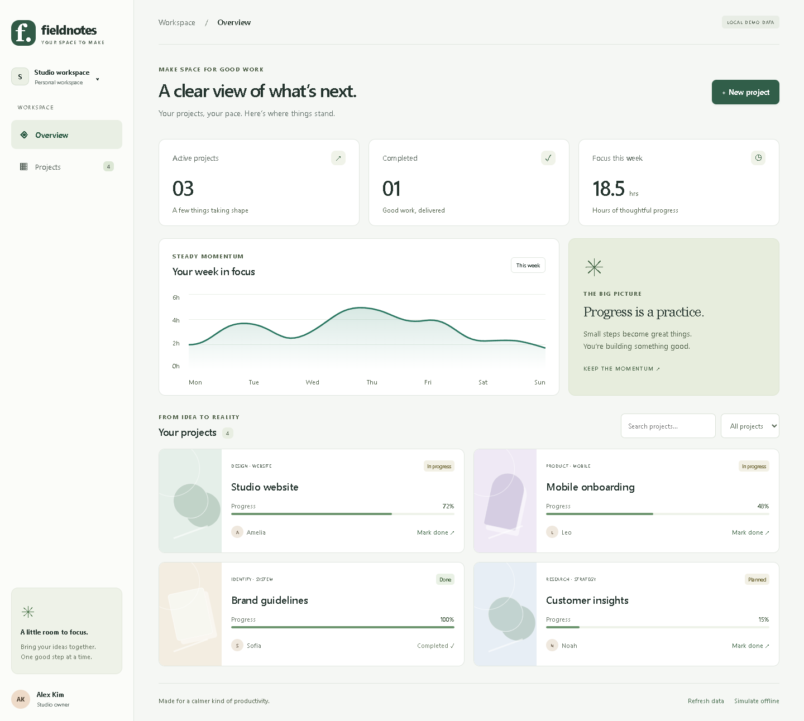
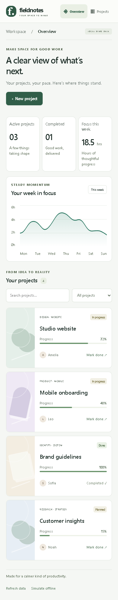

# Jarvis web and app development

Implemented and checked on **2026-10-02**. This adds knowledge retrieval, staged projects, deliberate design, real tooling and verified experience to the Jarvis runtime. It does not update model weights.

## Using it

Select an individual project folder in Explorer, then say **“Build an animated React dashboard in this folder.”** Or use **“Code in project MyWebsite: build an animated dashboard that works on desktop and mobile.”** The project name must resolve through Jarvis's existing project catalogue. A new project needs its own selected folder; Jarvis will not scaffold a framework in a drive root or inside an existing Python/Rust/Go application.

The workflow is:

1. Inspect the selected project and applicable repository instructions; detect its installed framework.
2. Save a design brief under `.jarvis/development/design-<id>.json` before implementation.
3. Scaffold an empty project with compatible, pinned packages. Existing projects retain their framework and source.
4. Plan up to **24 source files and 12 directories**, then generate/commit **at most three files per batch**. Each batch retains existing draft streaming, cancellation, file backups, optimistic concurrency guards and disk readback. A named single-file scope rejects extra files. File readback is a batch checkpoint, not whole-project success.
5. Present the actual project and execution scope through Jarvis's existing nonblocking island command approval. The source and design exist before this approval. Project configuration can execute code; the approval preserves the existing command-execution boundary. No model-proposed shell string runs automatically.
6. Install reviewed npm registry dependencies with package hooks disabled, type-check and build with project-local binaries, start an owned loopback preview, and run isolated Chromium checks with project-local axe.
7. Inspect actual build errors, console errors, horizontal overflow, keyboard focus, accessible controls, goal-specific interaction assertions and reduced-motion behavior. Save genuine desktop/mobile/reduced-motion screenshots and JSON evidence.
8. If checks fail, retain that evidence and permit **one newly planned correction pass**, with fresh reviewed changes and execution approval. No uncertain command or file action is replayed automatically. A second failure pauses the task with its evidence path.
9. Retain a framework-scoped case only when independent evidence and the current source fingerprint agree. Native installers/device behavior remain explicitly outside browser verification.

The island continues showing the current file, design/generation/build/inspection phase, source preview and character counts. Its local games and separate question worker retain their existing behavior while coding runs in the background.

## Stacks and setup

Install **Node.js LTS** and have `node`/`npm` on PATH. This machine was checked with Node **24.14.0**, npm **11.11.1** and Chrome. Python Playwright **1.63.0** is already a main-environment dependency. No global framework CLI is installed or used by this upgrade.

| Project | Adapter | Checked here |
|---|---|---|
| React + TypeScript + Vite | `tsc`, Vite production build and preview | Animated dashboard, eight scenarios, 18 assertions in each of three browser configurations |
| Next.js App Router | `tsc`, `next build`, owned `next start` | Real production build and client-state assertions in desktop/mobile/reduced-motion Chrome |
| React + Electron | Vite renderer build and browser preview; explicit Windows packaging adapter | Renderer build and browser interaction; native packaging/installer/lifecycle not exercised |
| React Native + Expo | SDK-compatible dependencies, `tsc`, Metro web export, owned static preview | Actual native components exported to web and browser interaction; Android/iOS devices not exercised |

The scaffold pins React/React DOM **19.3.0**, TypeScript **7.0.2**, Vite **8.3.2**, Motion **14.0.0**, Next **16.3.8**, Electron **44.5.1**, axe-core **4.13.0**, and relevant type packages. Electron packaging uses **@electron/packager 20.3.0** when installed. Expo **57.0.26** uses its published compatibility map: React/React DOM **19.2.3**, React Native **0.86.3**, React Native Web **0.21.3**, Metro runtime **57.0.16**. See [scaffold definitions](../jarvis/development_projects.py) and each fixture's package lock. Existing package versions are respected; the new-project pins are not silently applied to existing apps.

`npm ci` is used for a matching lock; explicitly reviewed dependency changes use `npm install` to update it. Hooks remain disabled. Git, URL and local-file dependency sources are rejected by this adapter. A missing executable, unsupported build stack or unavailable native toolchain pauses with a concrete prerequisite message. Node availability is checked when using development tools; it is not required to launch Jarvis's unrelated voice/desktop features.

An existing React project with no recognized Vite/Next/Electron/Expo adapter is not replaced with another framework. It needs an appropriate adapter or explicit manual verification. Windows cannot perform a local iOS build. Android needs its SDK/JDK and a device/emulator. Electron's package installation deliberately skips automatic runtime-download hooks; reviewed Windows packaging can download the official runtime. Native packaging/build does not automatically publish, sign or claim functional device verification.

## Jarvis-owned knowledge and design

[The local library](../jarvis/assets/development-skills.json) contains independently written, concise guides, examples, source URLs, reviewed date and version applicability. [Its retriever](../jarvis/development_knowledge.py) loads relevant guides automatically by project, goal and target extension, within a 5,500-character serialized budget. Python-target generation retains Python lesson scope. JavaScript/TypeScript repository symbols are now included by a bounded textual source map; this is a navigation aid, not a full compiler index.

The guides are connected to Jarvis's coding context and its own `skill_list`/`skill_read` tools, including `folder=@jarvis`, names such as `development:animation`. Installing a Codex skill alone is not used as Jarvis learning. Entire documentation sites, upstream helper scripts, proprietary skill source and unrelated plugins are not imported into the runtime.

[The design brief](../jarvis/development_design.py) records audience, primary task, responsive layout, typography, palette, spacing, components, loading/empty/error/success states and motion. It is a documented starting specification; the requested goal and existing project conventions take precedence. The reference gallery records why workspace navigation, accessible forms and purposeful motion help. References initially have `approved=false`. Explicit human feedback can approve a named reference and influence future briefs for that project; a model cannot fabricate that approval.

The [authored dashboard example](../jarvis/templates/development/dashboard/App.tsx), [styles](../jarvis/templates/development/dashboard/styles.css) and [functional scenarios](../jarvis/templates/development/dashboard/checks.json) provide a checked working reference. Its sample data and decorative artwork are locally authored; no private recordings, desktop content or third-party artwork were used.

## Tools, previews and recovery

The planner can discover `development_status`, `development_verify`, `development_preview`, `development_feedback`, `development_practice` and `development_native`. They use the existing selected-folder, tool-policy and execution-approval boundaries.

`development_status` reports prerequisites, the last receipt, reference interfaces and the five practice goals. `development_preview` starts a reviewed existing build or deliberately stops only its owned preview. `development_verify` accepts a bounded semantic test plan or, after a passing build and owned preview, first reads the fresh interface accessibility snapshot and asks the model for one; tests run only against the owned loopback preview. A model's test proposal does not establish a result. At least three observed assertions and one interaction are required in addition to smoke/accessibility/layout checks. Tests support named roles and a small action/key allowlist, not arbitrary JavaScript evaluation, shell commands, uploads or remote navigation. Browser test generation uses a constrained JSON schema for supported actions, roles and keys, followed by independent runtime validation. An invalid test proposal gets at most one inference-only correction using the validation error before execution; a second invalid proposal pauses verification. Development test-writing inference streams with a 300-second total deadline and a 180-second stalled-stream limit; CPU latency remains observable.

Use a task such as **“Design feedback for MyWebsite: use larger text; approve workspace.”** to retain exact human feedback and reference approval. Approval affects design inspiration, not code-execution permissions. Explicit practice requests select `responsive-landing`, `dashboard-forms`, `accessible-motion`, `data-routing` or `platform-version`, then use the normal development workflow. Practice is not silently started in unrelated folders.

[Node tooling](../jarvis/development_tools.py) runs hidden owned processes in the exact project, with bounded deadlines and cancellation. [Browser inspection](../jarvis/development_browser.py) runs in an isolated one-shot Python/Chrome worker; cookies/storage are separate, downloads are disabled and external requests are blocked. Evidence stays under `.jarvis/development/run-<id>`. Preview logs use owned temporary files.

The main watchdog registers the development preview. On a failed health check it closes only the owned process/job, writes transcript and `.jarvis-runtime/repairs.jsonl` status, and requires explicit continuation. It does not rerun project code, installs, builds or clicks. Deliberate Stop/Quit closes owned services. Service health/command timeout/cancellation are covered by injected-failure tests.

When configured, **DeepSeek Harness** now supplies scoped development `code_plan` inference with local Qwen, in addition to its existing general/read-only roles. Jarvis validates those proposals, executes the batches, retains existing Qwen `code_edit` streaming, and checks real outcomes. [Harness integration](deepseek-harness.md). No upstream shell tools were enabled.

## Experience and practice

[Development learning](../jarvis/development_learning.py) stores checked successes, failed or incomplete attempts, failure causes, newly verified recovery, package versions, source fingerprint and verification scope in app-owned `.jarvis-runtime/development-cases.jsonl`. Project-specific human design preferences use `development-feedback.jsonl`. These stores do not write the real user Obsidian vault during verification.

Relevant cases enter coding context for the same framework. Historical verification is not verification of a new task; versions and current state must still be checked. A changed source fingerprint prevents promotion, incomplete builds/screenshots prevent success learning, and failures remain reference-only. Fingerprinting covers at most 2,000 source files, 8 MB per file and 32 MB total; large projects must be narrowed. This is experience retrieval, not model training.

The progression covers responsive landing pages, React filters/forms, accessible animation, routing/data/error handling, and desktop/mobile adaptations. Each runs through the actual workflow when explicitly requested, then requires independently checked results before learning success.

## Verification on 2026-10-02

- [Sequential acceptance](../artifacts/development-acceptance-check.json): all four authored fixtures passed real type/build checks and browser assertions at 1440×1000 desktop, 390×844 mobile and reduced-motion desktop. Each view had no horizontal overflow, console errors or axe violations. Vite exercised eight scenarios, including search/empty recovery, status filtering, form validation/creation, Escape/Enter dialog handling, completion, simulated loading/error/retry, navigation and application of the motion preference.
- [Actual screenshots](../artifacts/development-previews/): browser captures of authored fixtures. They are not fabricated renders or evidence that a model autonomously built the whole application. axe detects a subset of accessibility problems; the motion audit and fixture assertion do not prove every animation or qualitative UX decision.
- [Real model probe](../artifacts/development-model-check.json): pinned Harness SDK/local Qwen development planning took **49.547 s**; Qwen3.5:4b generated a scoped React component in **100.547 s**; its actual TypeScript/build passed. The component was not mounted; its UI behavior is not claimed checked. Earlier proposals extending the explicit single-file scope were refused before execution. The main configured coder was not changed, and this is not an autonomous whole-project benchmark.
- [Real model test-writer check](../artifacts/development-test-planner-check.json): after fresh accessibility observation, local Qwen proposed five constrained scenarios in **148.328 s**. **Four of five passed in each of desktop/mobile/reduced-motion Chrome; the run remained unverified.** One test cleared the search and incorrectly expected an empty result. The authored nonmatching-query/clear-filter test independently passed. Earlier unexecuted malformed-role/key proposals and a CPU text-response timeout motivated schema/deadline changes; an earlier browser run exposed omitted roles and a placeholder assertion. These failures are retained as context, not reported as success. Generated test quality still requires review; the worker accepts explicit reviewed test plans, and a model proposal does not establish UI behavior. [Reproduction runner](../verify_development_test_writer.py).
- [Regression/readiness evidence](../artifacts/development-regression-check.json): **719 tests passed in 63.201 s; launcher reported `ready` with no missing prerequisites**. These are regression/readiness checks, covering cancellation, path guards, bounded batching, no early whole-task success, dependency source/lock guards, feedback authorization, learning scope and existing functionality. Full suite and launcher results are dated in that record. Historical upgrade results elsewhere retain their original scope.

Reproduce authored acceptance with `.venv/Scripts/python.exe verify_development.py --execute --stack all` after reviewing the runner; add `--install` to authorize dependency setup on a fresh copy. The script runs fixtures one at a time and stops on a failure. [Runner](../verify_development.py). `verify_development_models.py` separately invokes real local inference; CPU latency can remain substantial. Successful fixture checks do not guarantee arbitrary generated projects or native applications will succeed.

An already built dashboard can be opened with `.venv/Scripts/python.exe preview_development.py --minutes 30`. This separate acceptance-preview helper owns its process, stops after the selected 1–60-minute limit or a new Stop Jarvis marker, and pauses on a failed health check. Normal Jarvis task previews instead use the main registered development service. [Preview helper](../preview_development.py).

## Research and attribution

Primary sources reviewed with Firecrawl for this integration: [MDN core curriculum](https://developer.mozilla.org/en-US/curriculum/core/), [React learning](https://react.dev/learn), [React from scratch](https://react.dev/learn/build-a-react-app-from-scratch), [Vite setup](https://vite.dev/guide/), [Vercel agent skills](https://github.com/vercel-labs/agent-skills), [web interface guidelines](https://github.com/vercel-labs/web-interface-guidelines), [Anthropic frontend-design reference](https://github.com/anthropics/skills/tree/main/skills/frontend-design), [shadcn/ui](https://ui.shadcn.com/docs), [Motion](https://motion.dev/docs/react), [Motion accessibility](https://motion.dev/docs/react-accessibility), [GSAP](https://gsap.com/docs/v3/), [Next installation](https://nextjs.org/docs/app/getting-started/installation), [Electron security](https://www.electronjs.org/docs/latest/tutorial/security), [Expo creation](https://docs.expo.dev/get-started/create-a-project/) and [Playwright accessibility](https://playwright.dev/docs/accessibility-testing). Package versions were checked against the official npm registry; Expo compatibility came from its published `bundledNativeModules.json`. Guides/examples here are independent Jarvis implementations; GSAP and shadcn remain reference guidance, not newly installed dependencies.
