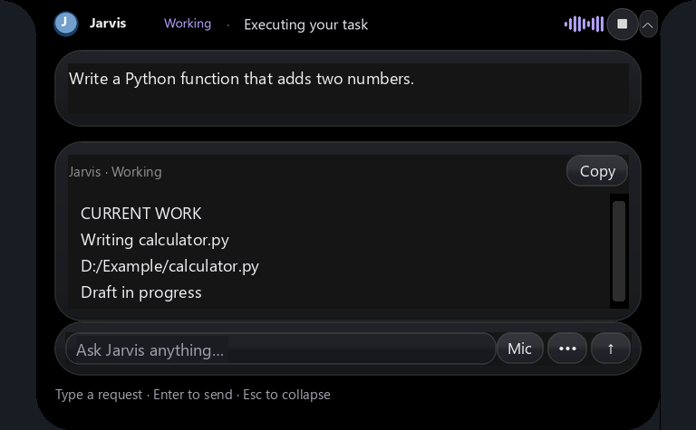

# Imported Windows command execution

**2026-10-08 mouse update:** The original 493-entry catalog remains available as
reference. Runtime single-click commands now require an accessible target and
display the [independent Jarvis cursor](independent-cursor.md). Mouse move, drag,
button-down/up, wheel, right/middle/double/triple-click recipes refuse before
physical input; they are not currently runnable commands. Native accessibility
scroll and browser DOM actions remain separate supported paths. The system
pointer stays under the user's control; keyboard and app focus remain shared.

Updated 2026-10-04. Jarvis retains **all 493 entries in 21 categories**, including
238 PowerShell, 241 Python/UIA and 14 Playwright examples, from the user-provided
ZIP. [Original Markdown](../integrations/windows-command-reference/Jarvis_Windows_11_Commands.md),
[original JSON](../integrations/windows-command-reference/Jarvis_Windows_11_Commands.json),
[searchable original HTML](../integrations/windows-command-reference/Jarvis_Windows_11_Commands_Searchable.html),
[parameterized catalog](../integrations/windows-command-reference/catalog.json), and
[archive/member SHA256 provenance](../integrations/windows-command-reference/source-manifest.json)
are retained. The archive supplies no license and explicitly says its examples
are not proprietary VoiceOS source.

## VoiceOS behavior checked

The [official VoiceOS message guide](https://www.voiceos.com/blog/send-emails-and-slack-messages-by-voice)
was read with Firecrawl on 2026-10-04 (the returned page was cached). It describes
speech-triggered drafts with recipient/subject/body previews and approval before
sending. The supplied screenshots show a compact Opening indicator for Camera
and YouTube and an email draft in the expanded island. These establish visible
behavior; neither source reveals VoiceOS's private execution implementation.
This ZIP contains no Gmail sending API. Jarvis's configured message tools and
existing island approval/draft paths remain necessary for sending.

## Use in Jarvis

Restart using Stop Jarvis and Start Jarvis. Examples:

- `open camera`, `open youtube for me`, `open display settings`.
- `list windows commands` lists categories and usage. `search windows commands camera`
  or `search windows commands 142` returns exact IDs, required parameters and prerequisites.
- `windows command 1` launches Camera through its Windows URI.
- `read entire file as string "D:\Work\notes.txt"` binds the actual path to recipe 137.
- `copy file "D:\Work\a.txt" to "D:\Work\b.txt"` binds recipe 143.
- `dns lookup example.org` binds recipe 193.
- `windows command 142 {"path1":"D:\\Work\\notes.txt","text1":"old","text2":"new"}`
  binds the same path for reading and writing, with literal replacement operands.
- `windows command 286 {"arg1":500,"arg2":300}` requests a click at explicit
  coordinates inside the currently bound destination window.
- `windows commands 480,481,483,484,488 {"484":{"text1":"A1","text2":"Jarvis"},"488":{"path1":"D:\\Work\\Output.xlsx"}}`
  creates an owned Excel instance/workbook, selects a sheet, writes a cell and saves
  through COM. Requires installed desktop Excel. This example was not live-tested.

Every ID is callable through an explicit recipe request. Exact recipe names are
also recognized; ambiguous names need the ID/app context. Literal paths/hosts and
JSON bindings support parameterized requests. This is finite deterministic
matching, not arbitrary natural-language understanding of every paraphrase.
Unrecognized tasks continue through the existing planner. A planner can discover
recipes but cannot invent an ID or change parameters explicitly bound by the user.

Configured app launchers retain their executable/AppUserModelID paths and typing
focus checks. These already implement the launch semantics and avoid extra shell
startup. Other matching launches use the reference executable/URI. IDs 78–85
**discover** Start menu apps rather than launch them; use the returned AppUserModelID
with recipe 86 or the existing configured app opener. Opening a Settings page does
not toggle its settings or permissions.

Existing rendered Jarvis preview from the prior notch UI checks, showing the
current task/approval surface. Its task text is illustrative; this is not a
screenshot of a new Windows command run or an upstream VoiceOS screenshot.
The supplied VoiceOS desktop images contain personal content and are not
published here. VoiceOS is the UI reference; this rendering is Jarvis artwork.

## Execution contracts

Voice requests for recipes wait for the final transcript and preserve punctuation
inside literal JSON arguments. The catalog and original JSON are pinned by SHA256; a changed recipe fails closed.
PowerShell runs reviewed templates with escaped literal arguments in a temporary
UTF-8 script, hidden and without user profiles. Standard Utility/Management modules
are explicitly imported because their script functions did not autoload reliably
in the test environment. Output is bounded; the helper has a 25-second deadline,
checks Stop and terminates only its own helper. No action is automatically replayed
following failure or a timeout. Inspect the actual state before requesting it again.

The Python adapter interprets a fixed AST method allowlist; it never evaluates
Python supplied by a user/model. Each call checks the fresh destination window,
PID and foreground app. App-specific shortcuts require that app; player/viewport
shortcuts reject focused Edit controls. Keyboard layouts and custom app keymaps
can still change shortcut meanings. Coordinates need explicit bindings and stay
inside the destination window; image clicks require a unique match and a bound
reference image. Held modifiers/buttons are released on normal error cleanup.
Hard process termination during input still needs fresh inspection.

Playwright recipes use only the existing Jarvis-owned browser, with its observed
URL, unique visible selectors, exact labels and password-field exclusion. They do
not restart a deliberately closed browser or attach to a user's Chrome tabs.
Open/inspect that browser before requesting DOM commands. The heading example's
`.first` does not bypass unique-target checks. Screenshot output needs an absolute,
new filename. Screenshot contents may include private data; no real desktop images
are included in this documentation.

Up to twenty recipes can form a batch. All parameters/backend prerequisites are
checked before the first effect; each backend executes in order and stops on error.
A batch uses one backend. Office object handles live inside one PowerShell batch:
start with 480/491, create/open a workbook before accessing it and select a sheet
before cell operations. A later standalone command cannot reuse an earlier COM
variable. Quit is limited to the instance created in that batch. Optional apps,
Windows modules, UIA providers, administrator rights, custom canvases and protected
system desktops remain prerequisites. UAC is not bypassed.

Deletes, overwrite/copy/move operations, terminating processes, shutdown/restart,
certain input/screenshot actions, DOM submissions and Office writes use the existing
island approval callback. File and recursive move/delete targets must be concrete
absolute paths, with drive roots and direct links excluded. Process termination
requires one exact target and rejects Jarvis, its descendants/host chain and protected
system processes. Environment values are redacted. Working directory/history are
those of the isolated helper, not the user's existing shell. Battery reports need
an explicit output filename. A dispatch receipt is not proof that the full task
succeeded; the existing planner's verification still applies to planned tasks.

## Dependencies and verification

Added free local `PyAutoGUI==0.9.54` and `opencv-python>=4.10,<5` to requirements
and the runtime manifest. OpenCV provides confidence-based image matching. The
verified environment installed OpenCV 4.14.0.94 with its existing NumPy 2.2.6.
No new model download or paid API is required for these execution recipes.

See [live fixture record](../artifacts/windows-command-live-check.json),
[preserved live pilots](../artifacts/windows-command-live-history.json),
[regression/readiness record](../artifacts/windows-command-regression-check.json),
[verification script](../verify_windows_commands.py) and
[regression script](../verify_windows_regression.py). On 2026-10-04 the owned live fixtures passed: 238 original PowerShell recipes
parsed without execution; all 493 recipes passed binding/interpreter compilation
coverage; ten file operations passed independent disk/hash observations; six
headless DOM operations passed field/dropdown/checkbox/text/click readback; two
native button activations matched their independent event log, and a closed app
was rejected before further input. These use authored fixtures and no model or
microphone. The earlier pilots (command-line size, transient timeout, repeated
path binding, module autoload, sandbox named pipes and DOM operand ordering) are
preserved in the history file. Compilation coverage is distinct from live execution;
all 493 recipes have not been exercised against installed applications.

Final regression/readiness check on 2026-10-04: **980 tests passed**;
launcher status **ready**, with no missing imports. This is readiness/regression
evidence, separate from the authored live fixtures above. The last focused suite
contains 20 tests, including Stop during dispatch, deadlines, final speech and
YouTube search-page rejection. Earlier successful regression runs remain in the
[regression history](../artifacts/windows-command-regression-history.json).

## Complete recipe mapping

Parameter examples/types are in the linked catalog and returned by command search.
Arguments named `argN` are literal operands from the reference AST, in catalog order.
Empty parameter cells mean the recipe has no example operand requiring binding.

| ID | Task | Adapter | Required bindings | Approval |
|---:|---|---|---|---|
| 1 | Camera | powershell |  | no |
| 2 | Notepad | powershell |  | no |
| 3 | Calculator | powershell |  | no |
| 4 | File Explorer | powershell |  | no |
| 5 | Paint | powershell |  | no |
| 6 | Snipping Tool | powershell |  | no |
| 7 | Task Manager | powershell |  | no |
| 8 | Command Prompt | powershell |  | no |
| 9 | Windows PowerShell | powershell |  | no |
| 10 | Windows Terminal | powershell |  | no |
| 11 | Control Panel | powershell |  | no |
| 12 | Device Manager | powershell |  | no |
| 13 | Disk Management | powershell |  | no |
| 14 | Services console | powershell |  | no |
| 15 | Event Viewer | powershell |  | no |
| 16 | Resource Monitor | powershell |  | no |
| 17 | Performance Monitor | powershell |  | no |
| 18 | Registry Editor | powershell |  | yes |
| 19 | System Information | powershell |  | no |
| 20 | DirectX Diagnostics | powershell |  | no |
| 21 | Windows version dialog | powershell |  | no |
| 22 | On-Screen Keyboard | powershell |  | no |
| 23 | Magnifier | powershell |  | no |
| 24 | Character Map | powershell |  | no |
| 25 | Windows Media Player (legacy) | powershell |  | no |
| 26 | Remote Desktop | powershell |  | no |
| 27 | Computer Management | powershell |  | no |
| 28 | Task Scheduler | powershell |  | no |
| 29 | System Configuration | powershell |  | no |
| 30 | Disk Cleanup | powershell |  | no |
| 31 | Sound panel | powershell |  | no |
| 32 | Mouse properties | powershell |  | no |
| 33 | Programs and Features | powershell |  | no |
| 34 | Firewall Control Panel | powershell |  | no |
| 35 | Internet Options | powershell |  | no |
| 36 | Credential Manager | powershell |  | no |
| 37 | All Settings | powershell |  | no |
| 38 | Display | powershell |  | no |
| 39 | Sound | powershell |  | no |
| 40 | Bluetooth and devices | powershell |  | no |
| 41 | Wi-Fi | powershell |  | no |
| 42 | Ethernet | powershell |  | no |
| 43 | VPN | powershell |  | no |
| 44 | Data usage | powershell |  | no |
| 45 | Windows Update | powershell |  | no |
| 46 | Power and battery | powershell |  | no |
| 47 | Storage | powershell |  | no |
| 48 | Default apps | powershell |  | no |
| 49 | Installed apps | powershell |  | no |
| 50 | Startup apps | powershell |  | no |
| 51 | Notifications | powershell |  | no |
| 52 | Focus settings | powershell |  | no |
| 53 | Taskbar settings | powershell |  | no |
| 54 | Personalization | powershell |  | no |
| 55 | Themes | powershell |  | no |
| 56 | Lock screen | powershell |  | no |
| 57 | Background | powershell |  | no |
| 58 | Date and time | powershell |  | no |
| 59 | Language | powershell |  | no |
| 60 | Accessibility | powershell |  | no |
| 61 | Camera permissions | powershell |  | no |
| 62 | Microphone permissions | powershell |  | no |
| 63 | Location permissions | powershell |  | no |
| 64 | Privacy diagnostics | powershell |  | no |
| 65 | Microsoft Edge | powershell |  | no |
| 66 | Google Chrome | powershell |  | no |
| 67 | Firefox | powershell |  | no |
| 68 | Brave | powershell |  | no |
| 69 | Opera | powershell |  | no |
| 70 | Visual Studio Code | powershell |  | no |
| 71 | Visual Studio | powershell |  | no |
| 72 | Git Bash | powershell |  | no |
| 73 | Git GUI | powershell |  | no |
| 74 | Python interpreter | powershell |  | no |
| 75 | Windows Store | powershell |  | no |
| 76 | Spotify | powershell |  | no |
| 77 | Steam | powershell |  | no |
| 78 | Discord | powershell |  | no |
| 79 | Unreal Engine | powershell |  | no |
| 80 | Unity Hub | powershell |  | no |
| 81 | Epic Games Launcher | powershell |  | no |
| 82 | PDFGear | powershell |  | no |
| 83 | Obsidian | powershell |  | no |
| 84 | Office apps | powershell |  | no |
| 85 | Installed Start apps | powershell |  | no |
| 86 | Run app by AppUserModelID | powershell | app_id | no |
| 87 | Open Google | powershell |  | no |
| 88 | Open YouTube | powershell |  | no |
| 89 | Open Gmail | powershell |  | no |
| 90 | Open GitHub | powershell |  | no |
| 91 | Open Google Drive | powershell |  | no |
| 92 | Open ChatGPT | powershell |  | no |
| 93 | Open a file with default app | powershell | path1 | no |
| 94 | Open a folder | powershell | path1 | no |
| 95 | All processes | powershell |  | no |
| 96 | Find Chrome process | powershell |  | no |
| 97 | Find process by name fragment | powershell | pattern | no |
| 98 | Top CPU processes | powershell |  | no |
| 99 | Top RAM processes | powershell |  | no |
| 100 | Process with PID | powershell | pid | no |
| 101 | Process name + PID | powershell |  | no |
| 102 | Process with main window title | powershell |  | no |
| 103 | Close Notepad | powershell | process_name | yes |
| 104 | Close process by PID | powershell | pid | yes |
| 105 | Force close unresponsive app | powershell | process_name | yes |
| 106 | Wait until app exits | powershell | process_name | no |
| 107 | Start app and capture PID | powershell |  | no |
| 108 | Start app in target directory | powershell | path1 | no |
| 109 | Run app minimized | powershell |  | no |
| 110 | Run app maximized | powershell |  | no |
| 111 | Get services | powershell |  | no |
| 112 | Only running services | powershell |  | no |
| 113 | Find Bluetooth service | powershell |  | no |
| 114 | Get scheduled jobs | powershell |  | no |
| 115 | Get running scheduled tasks | powershell |  | no |
| 116 | Current session and user | powershell |  | no |
| 117 | Computer name | powershell |  | no |
| 118 | Windows version details | powershell |  | no |
| 119 | Current time | powershell |  | no |
| 120 | Current directory | powershell |  | no |
| 121 | PowerShell command history | powershell |  | no |
| 122 | Discover installed command | powershell |  | no |
| 123 | List files | powershell | path1 | no |
| 124 | List hidden files | powershell | path1 | no |
| 125 | List folders only | powershell | path1 | no |
| 126 | List files only | powershell | path1 | no |
| 127 | List files recursively | powershell | path1 | no |
| 128 | Find PDFs recursively | powershell | path1 | no |
| 129 | Find screenshots | powershell |  | no |
| 130 | Files modified recently | powershell | path1 | no |
| 131 | Find large files | powershell | path1 | no |
| 132 | Current folder | powershell |  | no |
| 133 | Change folder | powershell | path1 | no |
| 134 | Create folder | powershell | path1 | no |
| 135 | Create empty file | powershell | path1 | no |
| 136 | Read a text file | powershell | path1 | no |
| 137 | Read entire file as string | powershell | path1 | no |
| 138 | Read first 10 lines | powershell | path1 | no |
| 139 | Read last 10 lines | powershell | path1 | no |
| 140 | Write a text file | powershell | path1, text1 | yes |
| 141 | Append to a text file | powershell | path1, text1 | no |
| 142 | Replace word in file | powershell | path1, text1, text2 | yes |
| 143 | Copy file | powershell | path1, path2 | yes |
| 144 | Copy folder recursively | powershell | path1, path2 | yes |
| 145 | Move file | powershell | path1, path2 | yes |
| 146 | Rename file | powershell | path1, name | yes |
| 147 | Delete file preview | powershell | path1 | no |
| 148 | Delete file | powershell | path1 | yes |
| 149 | Delete folder preview | powershell | path1 | no |
| 150 | Get file size | powershell | path1 | no |
| 151 | Get file timestamps | powershell | path1 | no |
| 152 | Create ZIP | powershell | path1, path2 | no |
| 153 | Extract ZIP | powershell | path1, path2 | yes |
| 154 | Calculate SHA256 | powershell | path1 | no |
| 155 | Check if file exists | powershell | path1 | no |
| 156 | Find text inside files | powershell | path1, text1, text2 | no |
| 157 | Search a file | powershell | path1, text1 | no |
| 158 | Compare text files | powershell | path1, path2 | no |
| 159 | Count lines in file | powershell | path1 | no |
| 160 | Sort text lines | powershell | path1 | no |
| 161 | Remove duplicate lines | powershell | path1 | no |
| 162 | Read JSON | powershell | path1 | no |
| 163 | Save object as JSON | powershell | path1 | yes |
| 164 | Import CSV | powershell | path1 | no |
| 165 | Export CSV | powershell | path1 | yes |
| 166 | Open file in Notepad | powershell | path1 | no |
| 167 | Read clipboard | powershell |  | no |
| 168 | Read clipboard as raw text | powershell |  | no |
| 169 | Set clipboard text | powershell | text1 | no |
| 170 | Clear clipboard | powershell |  | yes |
| 171 | Current environment variables | powershell |  | no |
| 172 | Get user profile folder | powershell |  | no |
| 173 | Get TEMP folder | powershell |  | no |
| 174 | Create temporary file | powershell |  | no |
| 175 | Refresh DNS cache | powershell |  | yes |
| 176 | Shutdown after 60 seconds | powershell |  | yes |
| 177 | Restart after 60 seconds | powershell |  | yes |
| 178 | Cancel scheduled shutdown | powershell |  | no |
| 179 | Lock Windows | powershell |  | yes |
| 180 | Battery report | powershell | path1 | yes |
| 181 | Active power scheme | powershell |  | no |
| 182 | List power schemes | powershell |  | no |
| 183 | Open printers | powershell |  | no |
| 184 | List installed printers | powershell |  | no |
| 185 | Default printer | powershell |  | no |
| 186 | List print jobs | powershell | printer | no |
| 187 | Network adapters | powershell |  | no |
| 188 | Active network adapters | powershell |  | no |
| 189 | IP addresses | powershell |  | no |
| 190 | IPv4 only | powershell |  | no |
| 191 | Network interface configuration | powershell |  | no |
| 192 | DNS client configuration | powershell |  | no |
| 193 | DNS lookup | powershell | host | no |
| 194 | Check host reachability | powershell | host | no |
| 195 | Test TCP port | powershell | host, port | no |
| 196 | Current TCP connections | powershell |  | no |
| 197 | Listening TCP ports | powershell |  | no |
| 198 | Network routing table | powershell |  | no |
| 199 | Local hostname | powershell |  | no |
| 200 | Wi-Fi status | powershell |  | no |
| 201 | Known Wi-Fi profiles | powershell |  | no |
| 202 | IP settings (classic) | powershell |  | no |
| 203 | Ping gateway | powershell |  | no |
| 204 | Traceroute | powershell | host | no |
| 205 | Open firewall settings | powershell |  | no |
| 206 | Windows firewall profiles | powershell |  | no |
| 207 | CPU details | powershell |  | no |
| 208 | RAM module details | powershell |  | no |
| 209 | Total RAM in GB | powershell |  | no |
| 210 | GPU details | powershell |  | no |
| 211 | Disk drives | powershell |  | no |
| 212 | Logical disks | powershell |  | no |
| 213 | Free disk space | powershell |  | no |
| 214 | Motherboard | powershell |  | no |
| 215 | BIOS version | powershell |  | no |
| 216 | Operating system | powershell |  | no |
| 217 | Boot time | powershell |  | no |
| 218 | Plug-and-play devices | powershell |  | no |
| 219 | Problematic devices | powershell |  | no |
| 220 | Display resolution | powershell |  | no |
| 221 | List installed Windows updates | powershell |  | no |
| 222 | Antivirus status | powershell |  | no |
| 223 | Run antivirus quick scan | powershell |  | yes |
| 224 | Power-related sleep states | powershell |  | no |
| 225 | Press Enter | desktop |  | no |
| 226 | Press Escape | desktop |  | no |
| 227 | Press Tab | desktop |  | no |
| 228 | Press Shift+Tab | desktop |  | no |
| 229 | Press Backspace | desktop |  | no |
| 230 | Press Delete | desktop |  | yes |
| 231 | Press Home | desktop |  | no |
| 232 | Press End | desktop |  | no |
| 233 | Press Page Down | desktop |  | no |
| 234 | Press Page Up | desktop |  | no |
| 235 | Press Arrow Up | desktop |  | no |
| 236 | Press Arrow Down | desktop |  | no |
| 237 | Press Arrow Left | desktop |  | no |
| 238 | Press Arrow Right | desktop |  | no |
| 239 | Press F1 help | desktop |  | no |
| 240 | Press F2 rename/edit | desktop |  | no |
| 241 | Press F5 refresh | desktop |  | no |
| 242 | Press Ctrl+A select all | desktop |  | no |
| 243 | Press Ctrl+C copy | desktop |  | no |
| 244 | Press Ctrl+X cut | desktop |  | yes |
| 245 | Press Ctrl+V paste | desktop |  | no |
| 246 | Press Ctrl+Z undo | desktop |  | no |
| 247 | Press Ctrl+Y redo | desktop |  | no |
| 248 | Press Ctrl+S save | desktop |  | yes |
| 249 | Press Ctrl+Shift+S save as | desktop |  | yes |
| 250 | Press Ctrl+O open file | desktop |  | no |
| 251 | Press Ctrl+P print | desktop |  | yes |
| 252 | Press Ctrl+F find | desktop |  | no |
| 253 | Press Ctrl+H replace/history | desktop |  | no |
| 254 | Press Ctrl+N new document | desktop |  | no |
| 255 | Press Ctrl+W close tab/document | desktop |  | yes |
| 256 | Press Alt+F4 close window | desktop |  | yes |
| 257 | Switch application | desktop |  | no |
| 258 | Task View | desktop |  | no |
| 259 | Show desktop | desktop |  | no |
| 260 | Show Windows search | desktop |  | no |
| 261 | Open Run dialog | desktop |  | no |
| 262 | Open Windows Settings | desktop |  | no |
| 263 | Open File Explorer | desktop |  | no |
| 264 | Quick Link menu | desktop |  | no |
| 265 | Open clipboard history | desktop |  | no |
| 266 | Open emoji picker | desktop |  | no |
| 267 | Take snip overlay | desktop |  | no |
| 268 | Lock workstation | desktop |  | yes |
| 269 | Snap window left | desktop |  | no |
| 270 | Snap window right | desktop |  | no |
| 271 | Maximize current window | desktop |  | no |
| 272 | Minimize/restore window | desktop |  | no |
| 273 | Minimize all windows | desktop |  | no |
| 274 | New virtual desktop | desktop |  | no |
| 275 | Close virtual desktop | desktop |  | yes |
| 276 | Virtual desktop right | desktop |  | no |
| 277 | Virtual desktop left | desktop |  | no |
| 278 | System context menu | desktop |  | no |
| 279 | Select previous word | desktop |  | no |
| 280 | Select next word | desktop |  | no |
| 281 | Jump previous word | desktop |  | no |
| 282 | Jump next word | desktop |  | no |
| 283 | Select until line end | desktop |  | no |
| 284 | Select until line start | desktop |  | no |
| 285 | Select all until document end | desktop |  | no |
| 286 | Click coordinates | desktop | arg1, arg2 | no |
| 287 | Right-click coordinates | desktop | arg1, arg2 | no |
| 288 | Double-click coordinates | desktop | arg1, arg2 | no |
| 289 | Middle-click coordinates | desktop | arg1, arg2 | no |
| 290 | Triple-click coordinates | desktop | arg1, arg2 | no |
| 291 | Move pointer | desktop | arg1, arg2 | no |
| 292 | Move relatively | desktop | arg1, arg2 | no |
| 293 | Click at pointer | desktop |  | no |
| 294 | Press left mouse button | desktop |  | no |
| 295 | Release left mouse button | desktop |  | no |
| 296 | Drag by offset | desktop | arg1, arg2 | no |
| 297 | Drag to target | desktop | arg1, arg2, arg3, arg4 | no |
| 298 | Scroll down | desktop |  | no |
| 299 | Scroll up | desktop |  | no |
| 300 | Read mouse coordinates | desktop |  | no |
| 301 | Read screen dimensions | desktop |  | no |
| 302 | Screenshot entire display | desktop | arg1 | yes |
| 303 | Screenshot region | desktop | arg1, arg2 | yes |
| 304 | Read pixel color | desktop | arg1, arg2 | no |
| 305 | Compare pixel color | desktop | arg1, arg2, arg3 | no |
| 306 | Locate button by screenshot | desktop | arg1 | no |
| 307 | Click image match | desktop | arg1 | yes |
| 308 | Locate screen image confidence | desktop | arg1 | no |
| 309 | Type simple text | desktop | arg1 | no |
| 310 | Press key repeatedly | desktop |  | no |
| 311 | Hold Shift while clicking | desktop | arg1, arg2 | yes |
| 312 | Ctrl-click to toggle selection | desktop | arg1, arg2 | yes |
| 313 | Select screen rectangle | desktop | arg1, arg2, arg3, arg4 | no |
| 314 | New folder | desktop |  | no |
| 315 | Rename selected file | desktop |  | no |
| 316 | Properties of selection | desktop |  | no |
| 317 | Open selected file | desktop |  | no |
| 318 | Up one directory | desktop |  | no |
| 319 | Navigate back | desktop |  | no |
| 320 | Navigate forward | desktop |  | no |
| 321 | Focus address bar | desktop |  | no |
| 322 | New Explorer window | desktop |  | no |
| 323 | Focus Explorer search | desktop |  | no |
| 324 | Refresh file list | desktop |  | no |
| 325 | Select file range | desktop | arg1, arg2 | yes |
| 326 | New tab | desktop |  | no |
| 327 | New window | desktop |  | no |
| 328 | Incognito/InPrivate window | desktop |  | no |
| 329 | Close tab | desktop |  | yes |
| 330 | Reopen tab | desktop |  | no |
| 331 | Next tab | desktop |  | no |
| 332 | Previous tab | desktop |  | no |
| 333 | First tab | desktop |  | no |
| 334 | Last tab | desktop |  | no |
| 335 | Address bar | desktop |  | no |
| 336 | Navigate to URL | desktop | arg1 | no |
| 337 | Refresh page | desktop |  | no |
| 338 | Hard refresh | desktop |  | no |
| 339 | Page back | desktop |  | no |
| 340 | Page forward | desktop |  | no |
| 341 | Find in page | desktop |  | no |
| 342 | Open downloads | desktop |  | no |
| 343 | Open history | desktop |  | no |
| 344 | Bookmark current page | desktop |  | yes |
| 345 | Show bookmark manager | desktop |  | no |
| 346 | Developer tools | desktop |  | no |
| 347 | Developer console | desktop |  | no |
| 348 | Zoom in | desktop |  | no |
| 349 | Zoom out | desktop |  | no |
| 350 | Reset zoom | desktop |  | no |
| 351 | Scroll to page bottom | desktop |  | no |
| 352 | Global media play/pause | desktop |  | no |
| 353 | Global next track | desktop |  | no |
| 354 | Global previous track | desktop |  | no |
| 355 | Global stop media | desktop |  | no |
| 356 | Increase volume | desktop |  | no |
| 357 | Decrease volume | desktop |  | no |
| 358 | Mute/unmute | desktop |  | no |
| 359 | YouTube play/pause | desktop |  | no |
| 360 | YouTube rewind 10 sec | desktop |  | no |
| 361 | YouTube forward 10 sec | desktop |  | no |
| 362 | YouTube mute | desktop |  | no |
| 363 | YouTube fullscreen | desktop |  | no |
| 364 | YouTube captions | desktop |  | no |
| 365 | YouTube theater mode | desktop |  | no |
| 366 | YouTube mini player | desktop |  | no |
| 367 | YouTube seek 50 percent | desktop |  | no |
| 368 | YouTube seek beginning | desktop |  | no |
| 369 | YouTube next video | desktop |  | no |
| 370 | YouTube faster speed | desktop |  | no |
| 371 | YouTube slower speed | desktop |  | no |
| 372 | YouTube next frame | desktop |  | no |
| 373 | YouTube previous frame | desktop |  | no |
| 374 | VLC play/pause | desktop |  | no |
| 375 | VLC fullscreen | desktop |  | no |
| 376 | VLC mute | desktop |  | no |
| 377 | VLC stop | desktop |  | no |
| 378 | Command Palette | desktop |  | no |
| 379 | Quick Open file | desktop |  | no |
| 380 | Integrated terminal | desktop |  | no |
| 381 | New terminal | desktop |  | no |
| 382 | Explorer panel | desktop |  | no |
| 383 | Search panel | desktop |  | no |
| 384 | Source Control panel | desktop |  | no |
| 385 | Run/Debug panel | desktop |  | no |
| 386 | Extensions panel | desktop |  | no |
| 387 | Problems panel | desktop |  | no |
| 388 | Toggle side bar | desktop |  | no |
| 389 | Split editor | desktop |  | no |
| 390 | Format document | desktop |  | no |
| 391 | Go to definition | desktop |  | no |
| 392 | Peek definition | desktop |  | no |
| 393 | Rename symbol | desktop |  | no |
| 394 | Open suggestions | desktop |  | no |
| 395 | Duplicate line down | desktop |  | no |
| 396 | Move line down | desktop |  | no |
| 397 | Move line up | desktop |  | no |
| 398 | Delete current line | desktop |  | no |
| 399 | Select next occurrence | desktop |  | no |
| 400 | Select all occurrences | desktop |  | no |
| 401 | Add cursor below | desktop |  | no |
| 402 | Add cursor above | desktop |  | no |
| 403 | Go to line | desktop |  | no |
| 404 | New line below | desktop |  | no |
| 405 | Open Settings | desktop |  | no |
| 406 | Bold selected text | desktop |  | no |
| 407 | Italic selected text | desktop |  | no |
| 408 | Underline selected text | desktop |  | no |
| 409 | Insert hyperlink | desktop |  | no |
| 410 | Align paragraph left | desktop |  | no |
| 411 | Center paragraph | desktop |  | no |
| 412 | Align paragraph right | desktop |  | no |
| 413 | Justify paragraph | desktop |  | no |
| 414 | Insert page break | desktop |  | no |
| 415 | Open Go To | desktop |  | no |
| 416 | Edit active cell | desktop |  | no |
| 417 | Format cells dialog | desktop |  | no |
| 418 | Select current column | desktop |  | no |
| 419 | Select current row | desktop |  | no |
| 420 | Toggle filters | desktop |  | no |
| 421 | AutoSum | desktop |  | no |
| 422 | Insert current date | desktop |  | no |
| 423 | Fill cells downward | desktop |  | no |
| 424 | Fill cells rightward | desktop |  | no |
| 425 | Create table from selection | desktop |  | no |
| 426 | Next sheet | desktop |  | no |
| 427 | Previous sheet | desktop |  | no |
| 428 | New slide | desktop |  | no |
| 429 | Duplicate selected slide/object | desktop |  | no |
| 430 | Start slideshow | desktop |  | no |
| 431 | Start slideshow from current | desktop |  | no |
| 432 | Next slideshow slide | desktop |  | no |
| 433 | Previous slideshow slide | desktop |  | no |
| 434 | Black slideshow screen | desktop |  | no |
| 435 | Exit slideshow | desktop |  | no |
| 436 | Move/grab selection | desktop |  | no |
| 437 | Rotate selection | desktop |  | no |
| 438 | Scale selection | desktop |  | no |
| 439 | Toggle Edit Mode | desktop |  | no |
| 440 | Add object menu | desktop |  | no |
| 441 | Search operators | desktop |  | no |
| 442 | Toggle side panel | desktop |  | no |
| 443 | Front view | desktop |  | no |
| 444 | Right view | desktop |  | no |
| 445 | Top view | desktop |  | no |
| 446 | Play in Editor | desktop |  | no |
| 447 | Simulate in Editor | desktop |  | no |
| 448 | Toggle game view | desktop |  | no |
| 449 | Toggle immersive viewport | desktop |  | no |
| 450 | Move tool | desktop |  | no |
| 451 | Rotate tool | desktop |  | no |
| 452 | Scale tool | desktop |  | no |
| 453 | Focus selection | desktop |  | no |
| 454 | Open Content Drawer | desktop |  | no |
| 455 | List top-level windows | desktop |  | no |
| 456 | Find Notepad window | desktop | arg1 | no |
| 457 | Wait for selected window | desktop |  | no |
| 458 | Bring window to foreground | desktop |  | no |
| 459 | Maximize selected window | desktop |  | no |
| 460 | Minimize selected window | desktop |  | no |
| 461 | Restore selected window | desktop |  | no |
| 462 | Print controls in window | desktop |  | no |
| 463 | Find button by visible label | desktop | arg1 | no |
| 464 | Click button by visible label | desktop | arg1 | yes |
| 465 | Read edit box text | desktop |  | no |
| 466 | Navigate to URL | browser | arg1 | no |
| 467 | Get page title | browser |  | no |
| 468 | Click button by name | browser | arg1 | yes |
| 469 | Click link by name | browser | arg1 | no |
| 470 | Fill labeled field | browser | arg1, arg2 | no |
| 471 | Fill placeholder field | browser | arg1, arg2 | no |
| 472 | Fill CSS input | browser | arg1, arg2 | no |
| 473 | Press Enter in input | browser |  | yes |
| 474 | Select dropdown item | browser | arg1, arg2 | no |
| 475 | Check checkbox | browser | arg1 | yes |
| 476 | Uncheck checkbox | browser | arg1 | yes |
| 477 | Click text | browser | arg1, arg2 | yes |
| 478 | Save screenshot | browser | arg1 | yes |
| 479 | Read text from element | browser |  | no |
| 480 | Launch Excel via COM | office_batch |  | no |
| 481 | Create Excel workbook | office_batch |  | no |
| 482 | Open Excel workbook | office_batch | path1 | no |
| 483 | Get first Excel sheet | office_batch |  | no |
| 484 | Write Excel cell | office_batch | text1, text2 | yes |
| 485 | Read Excel cell | office_batch | range | no |
| 486 | Write Excel formula | office_batch | text1, text2 | yes |
| 487 | Bold Excel cell | office_batch | text1 | yes |
| 488 | Save Excel as file | office_batch | path1 | yes |
| 489 | Close Excel workbook | office_batch |  | yes |
| 490 | Quit Excel | office_batch |  | yes |
| 491 | Launch Word via COM | office_batch |  | no |
| 492 | Add Word paragraph text | office_batch | text1 | yes |
| 493 | Export Word document to PDF | office_batch | path1 | yes |
