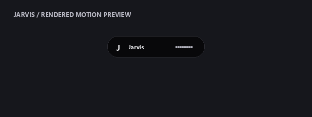

# Jarvis Dynamic Island

**Long-output growth fix (2026-10-04):** [Smooth island growth](smooth-island-growth.md)
documents the stable mounted answer view, continuous expansion, screen-height
limit, pause/collapse behavior and current rendered growth fixture.

**Current UI (2026-10-04):** The [single-window glass notch](voiceos-notch.md) replaces
the companion window with embedded content, curved top-edge shoulders, 340 ms
motion and glass controls. Details below retain the earlier capsule implementation
and its historical verification context.

**Current cards update (2026-10-02):** [Interactive island](interactive-island.md) documents output/source previews, permanent current-work metadata, bound clickable choices, inline approvals, Spotify artwork, five games and a focus timer, with current rendered images. The expanded size is now bounded to 560 × 660 logical pixels. Earlier screenshots and verification below retain their original implementation context.

Implemented 2026-09-30. Jarvis uses a small black capsule at the top center of the primary Windows screen. The previous circular launcher and large command center have been replaced. Click the island to expand compact controls; drag its header to reposition it, right-click for quick actions, and use Hide or Escape to collapse. Closing the view hides it; Quit Jarvis stops the assistant and supervisor.

**2026-10-01 display/voice update:** Native DPI rendering, larger antialiased header text, live task/file captions and addressed commands during speech are described with current previews in [sharp display and voice input](hd-display-and-voice-input.md). Dimensions below are logical pixels; physical sizes follow Windows display scaling. Earlier previews and verification remain historical.

## States and controls

- Idle: a stationary 208 × 52 capsule with a quiet monogram. Hover gives a small size expansion.
- Listening, thinking, working and speaking: the capsule expands up to 580 × 64 logical pixels with a status label, live task/file caption and animated bars. Microphone level modulates listening bars; speaking bars indicate active playback, not a measured speech waveform. Working takes priority when a task and voice output overlap.
- Answers and questions: a temporary card up to 600 × 140 logical pixels shows a bounded three-line excerpt for 12 seconds. Partial recognition appears briefly. Overview retains bounded answer/output previews and History retains the transcript. Structured pending choices have clickable cards. Display animation does not delay delivery of answer text or speech.
- Click: a rounded island up to 560 × 660 opens interactive views and compact input controls. Ask, Ask screen, Do task, Start/stop listening, Stop tasks, Stop voice and Quit retain their handlers. Settings contains microphone, reply language and speech options. Terminal, files and parsed-command preview remain in the right-click menu. Enter uses the normal spoken-command parser. Dimensions are bounded by display scaling and available screen space.

Transitions interpolate current dimensions over 420 ms with an easing curve and preserve the current size if interrupted. Display updates target roughly 30 frames per second while moving or showing active status; idle artwork and geometry are reused. This is a scheduling target, not a measured guaranteed frame rate. Tk and Pillow provide the native overlay. The 2026-10-02 music update adds the declared PyWinRT Streams dependency. Windows transparent color exposes the desktop outside the rounded silhouette; window alpha makes the body slightly translucent. Windows is the supported target. `ui.reduced_motion: true` disables shape interpolation and decorative bar motion; live status/level information remains visible.

The controls use a borderless companion window within the expanded capsule. Automatic short answers retain the collapsed preview; choices and approvals can expand the interactive view. Capture exclusion applies to both windows, and screen requests hide the overlay while capturing the previous external app. Display callbacks retain silent recovery. Quit prevents further scheduled display callbacks; display recovery never repeats task actions or starts the microphone.

## Design research and attribution

Firecrawl was used to inspect the requested repository, React Bits and alternative animation references:

- [CodeNebula-Dev / MacDynamic-Island](https://github.com/CodeNebula-Dev/MacDynamic-Island): reference for a top-center black capsule, hover/click expansion, rounded size transitions and borderless desktop placement. Its [CSS](https://github.com/CodeNebula-Dev/MacDynamic-Island/blob/main/src/App.css) animates size and radius. Jarvis uses an independently written native renderer and motion controller; upstream Electron/React code was not copied.
- [React Bits component index](https://reactbits.dev/get-started/index) and [Blur Text](https://reactbits.dev/text-animations/blur-text): reviewed for animated content entrance. Its delayed word animation was not installed: Jarvis shows answer content immediately to avoid adding answer latency. These React components are references, not dependencies running in Tk.
- [SmoothUI Dynamic Island](https://smoothui.dev/docs/components/dynamic-island): reviewed for expandable status/messages, actions and reduced motion.
- [Motion layout animation documentation](https://motion.dev/docs/react-motion-component): reviewed for continuous layout changes and transitions. Motion is not a runtime dependency.

Older HUD artwork, provenance and previews remain in [the historical HUD guide](hud-interface.md) and [asset attribution](../jarvis/assets/README.md). They are not the current island branding.

## Previews and verification




These images are generated from the actual runtime renderer and Tk widget layout using sample content. They are rendered previews, not desktop screenshots or evidence of a completed user task.

```powershell
.venv\Scripts\python.exe -m scripts.verification.verify_ui --preview artifacts\jarvis-island-preview.png --controls-preview artifacts\jarvis-island-controls.png --animation artifacts\jarvis-island-motion.gif
.venv\Scripts\python.exe -m unittest discover -s tests -q
.venv\Scripts\python.exe -m jarvis.launcher --check
```

UI smoke checks create and close their own hidden window, without starting the microphone. Regression checks cover interrupted motion, static idle rendering, reduced motion, no companion-window reopening during capture, callback wiring and compact controls with long responses/clarifications. Restart Jarvis to load these UI changes. Live voice/desktop-task correctness and animation frame rate require separate runtime checks.

**2026-09-30 results:** All 432 regression tests passed. Hidden UI construction/animation/shutdown and preview exports passed; launcher readiness reported `ready` with no missing dependencies. The UI verifier disables memory writes and startup greeting in its process only, and never enables the microphone. The rendered controls were visually inspected. No live voice task or measured animation frame-rate claim is made.

The final regression rerun also found a rapid-save timestamp collision in the Obsidian catalogue cache. Cache invalidation now checks both modification time and file size; the existing runtime-summary reload regression covers the fix.
