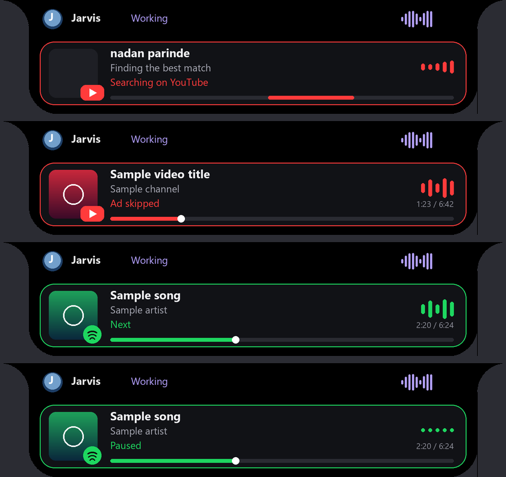

# Full YouTube and Spotify control with an island media card

Updated 2026-10-10 IST. This page covers playing songs and videos by name, controlling both players by voice, and the animated YouTube/Spotify card on the island. The older [media-controls](media-controls.md) and [automation-upgrade](automation-upgrade.md) pages describe the earlier routes this builds on.



*Rendered preview (2026-10-10) from `render_island` with sample text and generated artwork. Live cards show the real title, channel/artist and thumbnail or album art.*

## Why "open YouTube and play nadan parinde" failed

Whisper split the sentence into two segments: "open YouTube" and "and play nadan parinde". The first opened YouTube. The second began with "and", so no command rule matched it, and the classifier sent it to the chat worker. The chat worker replied that it cannot control the PC. Three changes fix this:

- A leading "and / then / also / now / so" before an action verb is removed before intent matching.
- "play X" (no service named) is now a direct `play_media` command, not chat or a planner task.
- Opening YouTube or Spotify remembers that service, so a following "play X" uses it.

"open YouTube and play X", "go to Spotify then play X" and "play X on Spotify" are also one direct command. None of them call the planning model.

## How playing by name works

**YouTube** (`jarvis/media_player.py`, `browser_worker.play_video`):

1. Search. When a YouTube Data API v3 key is set, Jarvis calls `search.list` (type video) and then `videos.list` for durations. Without a key, or if the key is rejected or out of quota, it reads the same results from YouTube's own results page. No key is needed for this fallback.
2. Choose. Jarvis keeps YouTube's ranking and drops Shorts and live clips. It takes the first of the top six whose title clearly matches what you said. Matching tolerates Hindi/Urdu transliteration, so "nadan parinde" matches "Nadaan Parinde". Remix, cover, slowed, lofi, 8D and karaoke versions are skipped unless you asked for one.
3. Play. Jarvis's own Chrome opens that exact video ID and waits until the video is really playing. Skippable ads are skipped with Jarvis's pointer. If playback doesn't start, Jarvis reports it and never replays.

**Spotify** (the "own API" route, no developer account needed):

1. Open the desktop app's search for the query (`spotify:search:` link).
2. Read the result rows from the app's accessibility tree: title, type (Song/Album/…), artists and each row's Play button. Jarvis waits until the search box shows your query and a clearly matching song appears, because the old results can linger briefly.
3. Click that song's Play button with Jarvis's own pointer.
4. Verify playback through the Windows media session: the title must match and the state must be playing.

Starting one service pauses the other, so two songs never play at once. With no service named, "play X" uses the last service Jarvis played on, otherwise `media.default_service` in `config/config.json` (default `youtube`). If that service can't find the song, Jarvis tries the other one. A named service is never switched.

## Which player a command controls

Commands that name a service ("pause the video", "next song on Spotify") go to that service. Commands that name none ("pause", "next song", "volume up", "go back 10 seconds", "mute", "play it again", "what's playing") go to whichever player is actually playing:

- Only one playing: that one.
- Both playing: the one Jarvis started last.
- Neither playing: the one Jarvis used last.
- Nothing known yet: Spotify if its app has a session, otherwise Jarvis's YouTube page.

Bare "pause" and "play" only click an on-screen button in the foreground app when neither Spotify nor Jarvis's YouTube page has a session.

YouTube commands use Jarvis's own Chrome page directly whenever YouTube is the service in use, even if another window is in front. Buttons that YouTube hides until the mouse moves (next, captions, fullscreen) are revealed first.

## Commands

| Intent | Examples |
| --- | --- |
| Play by name | `play nadan parinde`; `open YouTube and play blinding lights`; `play kun faya kun on Spotify`; `go to Spotify then play tum hi ho` |
| Pause / resume | `pause`; `resume`; `pause it`; `resume music`; `pause the video`; `pause Spotify` |
| Track / video | `next song`; `skip this song`; `previous song`; `next video`; `previous video`; `play it again` |
| Seek | `skip ahead 30 seconds`; `go back 10 seconds`; `rewind 15 seconds`; `seek to 50 percent on YouTube` |
| Volume | `volume up`; `volume down`; `set volume to 40`; `mute`; `unmute` |
| YouTube only | `fullscreen`; `exit fullscreen`; `turn on captions`; `turn off captions`; `speed up the video`; `slow down the video`; `theater mode on YouTube`; `miniplayer` |
| Spotify only | `shuffle on/off`; `repeat this song`; `repeat all`; `repeat off` |
| Status | `what's playing` (spoken answer with title and position) |

For Spotify, "previous song" checks that the track actually changed. When the song
was more than 2.5 seconds in, Spotify's first "previous" can restart it. Jarvis sends
one more press only after observing the same song return below 2.5 seconds. Near the
start, it sends only one press, even if track metadata is slow to update.

## Spotify control follow-up repair (2026-10-10 IST)

The earlier live checkpoint below preceded a report of intermittent pause/resume
and failed next/previous/volume in ordinary use. Playback-by-name was still working.
The follow-up change addresses the difference between a standalone test and a
desktop worker whose libraries have initialized Windows COM as STA:

- Transport runs on a fresh thread explicitly initialized as MTA, with a six-second
  bound and balanced apartment cleanup. Both ordinary voice actions and the island
  transport helper use this path. Metadata reads also explicitly initialize MTA.
- Cancellation and timeout fence late dispatch; no uncertain command is retried.
  The optional second previous-track press requires an observed restart and respects
  cancellation. Repeated play/pause returns the already-current state without sending
  another command that Spotify may reject as disabled.
- Volume enumerates audio sessions across all active render devices, so a separate
  Spotify headset/output in Windows is included. Only `Spotify.exe` sessions change;
  system and browser levels are untouched. This is Windows's Spotify app mixer level,
  which can differ from the slider inside Spotify.
- An active Spotify session is recognised when its window is hidden in the tray.
  When neither player is playing, a closed last-used player no longer overrides the
  remaining paused player. Existing explicit service commands keep their scope.
- Volume also accepts `increase Spotify volume`, `raise volume`, `lower volume on
  Spotify`, `reduce volume`, and `turn down the volume`.

Fresh live checks used the native session functions from a caller that had imported
`comtypes` (STA). Spotify exposed enabled next/previous controls and an audio session.
Pause and resume were confirmed from playback status, next and previous from changed
track metadata, and volume 40%, up, down and 50% from audio-session read-back. The
original playing state and 50% volume were restored. This is a native-session live
check. A separate live check passed text through the real `Engine.feed(...,
final=True)` → `Actions.execute` → Spotify path using a temporary workspace with
memory disabled and COM initialized as STA. It dispatched pause Spotify, bare play,
next song, previous song, set volume 40%, increase volume, lower volume and restore
50% exactly once each; audio volume and mute read-back matched their original values.
Microphone recognition and speech output were not tested. Tray routing,
non-default-output enumeration, cancellation and timeout are covered with controlled
regressions; a real alternate output was not selected during this check.

No dependencies or long-running services were added. Jarvis was already stopped;
use [Start Jarvis.cmd](<../Start Jarvis.cmd>) to load the repaired source. Startup,
shutdown and recovery continue through the existing supervisor.

Final regression/readiness on 2026-10-10 IST: **1,455 tests ran successfully with
one skip** (`python -m unittest discover -s tests -v`), all 15 focused Spotify tests
passed, and `python -m jarvis.launcher --check` returned `ready` with empty missing
and incomplete lists. Tests cover MTA thread initialization/cleanup, late-dispatch
fencing, cancellation before sending and before a second previous press,
idempotent pause/play, stale track metadata near the start, alternate-output
enumeration, source-scoped volume, tray routing and a closed former player.
The existing COM ownership test now mocks the all-output audio lookup; no live
audio is touched by that fixture. Regression logs are retained locally under the
ignored `.jarvis-runtime/` folder. These results are separate from the live checks
described above and the earlier historical checkpoint below.

## Island media card

Each media command shows an animated card on the island:

- **Searching / starting:** the query, a pulsing equalizer and a moving shimmer bar.
- **Playing:** artwork with a YouTube or Spotify badge, title, channel or artist, a live equalizer, and a progress bar that advances smoothly between updates.
- **Paused, control result or error:** what just happened, such as "Volume 40%", "Back 10s", "Next" or "No matching song".

The card is red for YouTube and green for Spotify. While a search runs it stays up for up to 40 seconds. After playback starts it shows for 10 seconds, and after a control command for 6. It gives way when you open the island, a task panel is active, or an answer is streaming. Card data travels as the `media_card` event. YouTube artwork is the video thumbnail; Spotify artwork comes from the Windows media session.

## Enabling the YouTube Data API v3 (optional)

The keyless search works now. To use the official API instead:

1. In Google Cloud Console, create or select a project and enable **YouTube Data API v3**.
2. Create an **API key** under APIs & Services → Credentials. Restricting it to YouTube Data API v3 is recommended.
3. Save it as `app/secrets/youtube.json`, which is gitignored:

   ```json
   {"api_key": "YOUR_KEY"}
   ```

   Or set the `JARVIS_YOUTUBE_API_KEY` environment variable.

Each search costs 100 quota units (`search.list`) plus 1 (`videos.list`). The default daily quota is 10,000 units, roughly 99 searches per day. When the quota runs out Jarvis falls back to keyless search automatically. Keys are never written to `config/config.json`.

## Verification (2026-10-10 IST, this PC)

Live runs through the real `Actions` path, Jarvis's own Chrome and the installed Spotify app (Premium). These timings exclude speech recognition and speech output.

| Check | Result |
| --- | --- |
| "open YouTube and play nadan parinde" | T-Series "ROCKSTAR: Nadaan Parinde (Lyrical Video)" playing, verified. 5.2 s; 12.4 s in a run where an ad was skipped. |
| "open YouTube" then "and play nadan parinde" (the original split) | Second segment routed to `play_media` and played the same video, 5.6 s. |
| YouTube controls | pause, resume, volume down/up, set volume 40, skip ahead 30 s, back 10 s, mute, unmute, captions on/off, speed up/down, fullscreen/exit, play it again, next video, previous video, what's playing, pause the video. All verified from the player's own state, 0.1–0.7 s each. |
| "play nadan parinde on Spotify" | "Nadaan Parinde" by A.R. Rahman playing, verified, 7.7 s. "play kun faya kun on Spotify" took 5.4 s. |
| Spotify controls | pause, resume music, what's playing, next song, previous song (reached the earlier track), shuffle on/off, repeat this song/off, skip ahead 30 s, back 10 s, set volume 50, volume up, mute, unmute, play it again, pause Spotify. All 0.0–0.8 s. |
| Switching | Starting YouTube paused Spotify; starting Spotify paused YouTube. The bare "play tum hi ho" used the last service. |
| Unscoped words | "pause", "volume down", "set volume to 40", "go back 10 seconds" went to YouTube while it played, and to Spotify while Spotify played. |

Problems found during these runs and fixed before the final runs:

- A bare "pause" hit Spotify while YouTube had just started.
- YouTube next/previous and captions buttons were hidden.
- The card read the previous video's state after "next".
- Reading Spotify artwork right after a volume change deadlocked. The media-session read now runs on its own thread.
- Stale Spotify results caused a false "no match".
- "previous song" only restarted the song.
- Caption phrases weren't understood.

Shuffle and repeat sometimes report "accepted, but its updated state could not be verified" when Windows publishes the new state late. The change itself was applied.

Regression and readiness (2026-10-10 IST, after the live fixes): **1,412 tests ran, all passed with one skip** (`artifacts/logs/media-player-regression-2026-10-10.log`), and `python -m jarvis.launcher --check` reported `ready`. These are regression and readiness checks; the live results are in the table above.

Unit tests: `tests/test_media_player.py` covers matching, both search paths, Spotify result parsing, fallback rules, unverified playback, control cards, service resolution, Spotify previous-track handling, routing and card rendering for every phase.

## Limits

- Keyless YouTube search reads YouTube's page data. If YouTube changes that format, keyless search stops until it's updated; an API key avoids this.
- An unskippable ad can delay a "playing" confirmation by up to 35 seconds.
- Captions work only on videos that have them. Outside a playlist, "previous video" means the previously watched video in Jarvis's Chrome.
- Spotify playback by name needs the desktop app and a signed-in account. Free accounts may play a different track order (shuffle) than requested.
- Controlling YouTube in your own browser (not Jarvis's Chrome) still uses the slower accessibility route from [media-controls](media-controls.md).
