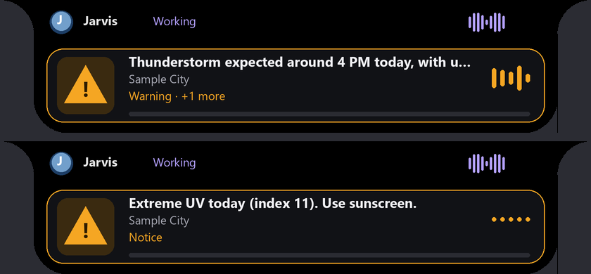

# Long-term memory, API repair, and bad-weather alerts

Updated 2026-10-10 IST. Three changes: Jarvis builds its own long-term memory in the Obsidian vault, every connected API was tested and the failing ones repaired, and Jarvis now warns you about bad or upcoming bad weather while it runs.

## How memory worked before

The vault (`D:\Phython Project\Jarvis_Memory\Jarvis_Mem`) held:

- daily notes: a raw log of requests, answers and foreground windows;
- a catalogue of tools, apps, projects and skills, rebuilt hourly;
- procedures and experiences learned from tasks;
- a profile note (`Kunal Vaghani.md`) written once by hand.

Conversation turns went into a local SQLite store with full-text search, but only typed or spoken questions, not tasks.

The gaps:

- Jarvis never learned anything new about you on its own.
- Ordinary questions skipped saved memory entirely.
- Nothing summarised past conversations, so "what did we talk about yesterday" had no real answer.
- "What can you do / which APIs" was left to the model to guess.

## Long-term memory (`jarvis/memory_curator.py`)

**Facts it learns by itself.** After every reply, a quick phrase check looks for personal statements ("my sister…", "I prefer…", "I have an exam next Monday…", "I usually…"). Only those turns go to the local Qwen 9B model, in the background, about 20 s, never on the reply path. The model extracts short facts about you as JSON, with relative dates turned into real ones ("next Monday" becomes 12 October 2026). Every fact must reuse your own words and be about you, so the model's guesses and facts about Jarvis are rejected. A similar fact updates the old one instead of duplicating it. Passwords, OTPs, PINs, card and account numbers and keys are never stored.

**Facts you give it.** "Remember that my sister Riya lives in Jamnagar" saves "Kunal's sister Riya lives in Jamnagar." immediately; "remember I have a French exam on Monday" stores the real date. "Forget that I have an exam" removes the matching fact. "What do you know about me" combines your profile note with everything learned; "what do you remember about Riya" searches.

**Conversation summaries.** After 15 quiet minutes (and when Jarvis closes), the conversation since the last summary is summarised into `Jarvis Conversations/<date>.md`: a title, two to four sentences and topic tags. They're indexed in `Jarvis Conversations/index.md` and linked from `Jarvis Brain.md`. "What did we talk about yesterday / on Monday / about the trip" and "summarise our last conversation" answer from these.

**Context everywhere.**
- Every question now carries the facts relevant to it, plus recent summaries when you refer back ("last time", "earlier", "you said").
- Task planning receives relevant facts with its tool catalogue.
- Tasks and direct commands (play, WhatsApp, open, write, and so on) are now saved as conversation turns too, so "what did you do earlier" works. Player controls and prompt answers are left out.

**Files in the vault.** `Jarvis Memory.json` holds the facts. `Jarvis Memory.md` is regenerated from it: people, preferences, plans and dates, goals, projects, routines, other facts, each with its date and source. `Jarvis Conversations/` holds the summaries.

## Knowing its own tools (`jarvis/capability_guide.py`)

"What can you do", "which APIs are you connected to" and "how do I use WhatsApp" (or Spotify, Gmail, weather…) get instant, accurate answers built from Jarvis's registries, with no model guessing. "Check your APIs" tests every provider live in about 30 seconds, along with Gmail (a real read-only profile call) and the YouTube key status. It saves the report to `.jarvis-runtime/api-health.json`, and later "which APIs" answers include that result.

## API repair (`jarvis/realtime_sources.py`, `realtime_catalog.py`)

A live check of all 82 public providers on 2026-10-10 found 66 working. Fixes:

| Problem | Fix |
| --- | --- |
| SpaceX API down (HTTP 525) | Replaced by Launch Library 2: upcoming launches, including SpaceX. |
| Bluesky public endpoint 403 | Moved to `api.bsky.app`; falls back to Google News. |
| REST Countries needed a paid-tier key | Keyless World Bank country data when no key is saved (a saved key still uses v5). |
| WorldTimeAPI blocked on this network | Falls back to TimeAPI.io automatically. |
| Semantic Scholar / GDELT rate limits | A short wait (≤ 6 s) is honoured once, then OpenAlex / Google News answer. |
| Overpass, ListenBrainz, Cover Art, DBpedia slow | Longer bounded reads (10–18 s). |
| Transient 5xx / dropped connections | One retry after 1 s; longer back-offs are never retried. |
| Kraken WebSocket gave up after one quiet second | Keeps listening until its 8 s sample deadline. |
| OSRM required your own server | Uses the public OSRM demo server unless you configure one. |
| A missing word or record looked like an outage | Reported as "no matching record" (`not_found`). |
| Parallel first queries raced the IP location lookup | The lookup is now locked. |

Every fallback answer is labelled with the provider that actually answered. **Result after the fixes (2026-10-10, through Jarvis's own "check your APIs"): 77 of 82 working, plus Gmail API OK.** The remaining five:

- **Overpass:** its public servers returned 500/504 or timed out on every instance during testing. That's an upstream outage, and Jarvis retries it on its own.
- **SearXNG, RSSHub, GBFS, OpenTripPlanner:** these need a server you run yourself (set `realtime.endpoints`). RSSHub's public instance blocks automated clients.

YouTube runs keyless until a Data API v3 key is saved.

## Bad-weather and emergency alerts (`jarvis/weather_watch.py`)

Every 30 minutes, even while Jarvis is busy with a task or a conversation, Jarvis checks the next 36 hours for your location. That's IP-based (Vadodara), with `weather.fallback_city` as backup.

| Hazard | Source | Warning | Severe |
| --- | --- | --- | --- |
| Thunderstorm / hail | Open-Meteo weather codes 95/96/99 | thunderstorm | hail |
| Heavy rain | Open-Meteo daily total and hourly bursts | 64.5 mm/day or 10 mm/h | 115.6 mm/day or 30 mm/h |
| Wind | gusts | 60 km/h | 90 km/h |
| Heat / cold | temperature | 42 °C / 4 °C | 45 °C / 0 °C |
| Fog | visibility | < 200 m | — |
| Air quality | Open-Meteo US AQI, next 24 h | 151 | 201 |
| Earthquake | USGS M4.5+ feed | M4.5+ within 300 km | M6+ within 500 km |
| Cyclone, flood, drought | GDACS | orange within 500 km | red |
| Storms, wildfires | NASA EONET | notice within 300 km | — |
| River floods | Open-Meteo flood forecast | 3× the median discharge | — |

An alert is spoken and shown as an amber card on the island, for example: "Weather alert for Vadodara: thunderstorm with hail expected around 4 PM today, with up to 12 mm of rain an hour and gusts near 55 km/h. This is from forecast data, not an official warning." It's also written to the daily note. Each hazard is announced once, and again only if it gets worse; announced hazards are kept for 3 days in `.jarvis-runtime/weather-alerts.json`. Extreme UV and NASA EONET items count as notices, which are only spoken if `weather_alerts.min_level` is set to `notice`. "Is bad weather coming?", "weather alerts" or "is a cyclone coming?" checks immediately and always answers, including "No bad weather expected for Vadodara in the next 36 hours, today 25 to 36 °C with no rain."

The existing realtime alerts (extreme wind/heat/AQI, NOAA space weather, US NWS) remain. These are forecasts and public feeds, not official IMD warnings; there is no free official IMD alert API.

*Rendered preview (2026-10-10) with sample text.*

## Settings (`config/config.json`)

| Key | Default | Purpose |
| --- | --- | --- |
| `memory.long_term.enabled` | `true` | Long-term memory (requires `memory.enabled`). |
| `memory.long_term.learn_facts` | `true` | Learn facts from conversations automatically. |
| `memory.long_term.summarize_conversations` | `true` | Write conversation summaries. |
| `memory.long_term.model` | `qwen3.5:9b` | Extraction/summary model (0.8B missed most facts in testing). |
| `memory.long_term.summary_idle_minutes` | `15` | Quiet time that ends a conversation. |
| `weather_alerts.enabled`, `interval_minutes`, `min_level` | `true`, `30`, `warning` | Alert watch; `notice` also speaks UV and EONET items. |

## Verification (2026-10-10 IST, this PC)

Memory checks used a temporary copy of the vault, so no test facts were written to the real vault.

| Check | Result |
| --- | --- |
| Explicit memory | "remember that my sister Riya lives in Jamnagar" → saved; "remember I have a French exam on Monday" → "…on Monday 12 October 2026"; "forget that I have a French exam" → removed. |
| Learned facts, 3 identical runs | "I prefer Arijit Singh songs when I study", "my best friend Arjun is visiting next Saturday" (→ 17 October 2026) and "I usually wake up at 6 am for the gym" were learned every run; "open youtube and play something" saved nothing. |
| Summary | A five-turn conversation became a titled 2–4 sentence note in about 30 s; "what did we talk about today" answered from it. |
| Questions use memory | "I'm about to study, what music should I put on?" → suggested Arijit Singh, citing the saved preference. "Who is my best friend?" → Arjun. |
| Capabilities | "what can you do", "which APIs are you connected to", "how do I use WhatsApp" answered instantly. |
| APIs | 66/82 before → 77/82 after, plus Gmail OK (details above). |
| Weather | "is bad weather coming" → "No bad weather expected for Vadodara in the next 36 hours, today 25 to 36 °C with no rain." (live forecast, AQI peaking at 144, just under the warning level). |

No real alert fired during testing because the weather was calm. The alert rules, announce-once behaviour and escalation are covered by unit tests with sample forecasts.

Regression and readiness (2026-10-10 IST): **1,444 tests ran, all passed with one skip** (`artifacts/logs/memory-apis-regression-2026-10-10.log`), and `python -m jarvis.launcher --check` reported `ready`. `tests/test_memory_weather.py` covers fact storage and updates, secret refusal, grounding, summaries and idle detection, commands and dates, every hazard rule, announce-once and escalation, capability answers, and API retry, fallback and not-found handling.

## Limits

- Learned facts come from a local model. They're grounded in your words but can still be imperfect; open `Jarvis Memory.md` to review them, and "forget that …" to remove one.
- Summaries are written after 15 quiet minutes, so the current conversation is listed as "right now" until then.
- Weather alerts depend on IP location; a VPN can move it. Set `realtime.location` for a fixed location.
- The 9B model runs extraction and summaries in the background through the GPU scheduler, so a big task in progress can delay them; they never delay replies.
