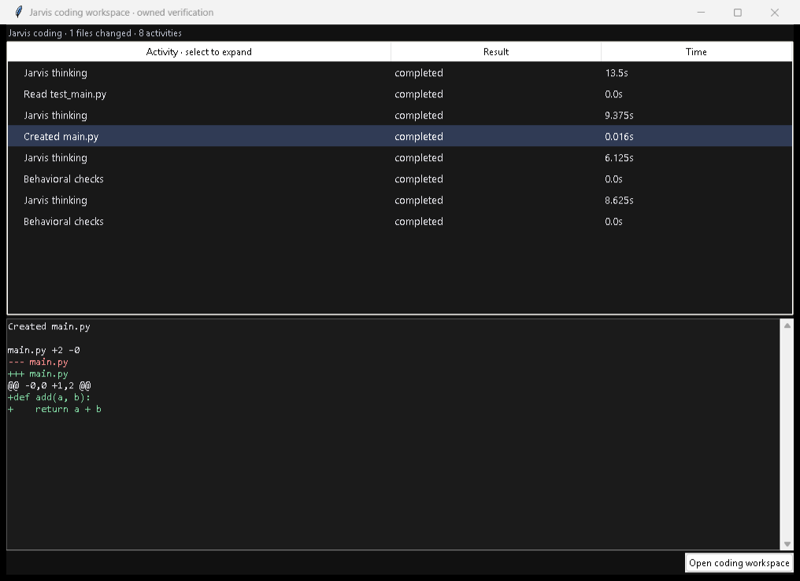

# Native Jarvis coding

Updated 2026-10-09 IST. The configured default is `brain.coding_backend: "jarvis"`.
The local Qwen3.5 9B planner and executor run Jarvis's own typed tool loop;
Codex CLI, its home/configuration, its account and its MCP relay are not used.
The optional legacy Codex/Claude adapters remain selectable for compatibility.
This is an independent implementation of the exposed coding workflow, not a
copy of proprietary model weights or private Codex internals.

## Usage and visible activity

Open the notch's **Command prompt**, then **Open coding workspace**. Enter a
coding goal and choose an individual project with **Code in chosen folder…**.
The workspace includes a manual-command entry and **Stop task**. Spoken coding
requests still use the same configured native backend and existing folder
selection/clarification flow. Native coding works on the selected project;
manual commands retain their exact approval dialog and `JarvisFiles` working
directory. Their deadline remains 60 seconds.

Activity rows show actual model, file, command, LocalGithub and check results.
Select a row to expand command arguments/output or the real source diff with
added/removed line counts. The large workspace mirrors the embedded console.
At most 300 rows and bounded output/diffs are retained in the UI. Complete owned
run receipts, source backups and command logs remain local. Source/code output
is not spoken or copied into the ordinary transcript.



This is a capture of the actual Jarvis console with an owned verification
fixture, not the supplied Codex screenshots or a fabricated product screenshot.
The user's screenshots guided the compact activity and expandable shell/diff
presentation. An initial offscreen capture did not render the controls correctly;
the final owned-window capture was checked visually.

## Execution and assembly

1. Inspect applicable repository instructions, selected skills and bounded
   source. Plan exact deliverables, public interfaces, dependencies and executable
   behavioral checks. Documentation requirements belong in those assignments.
2. Use separate LocalGithub worktrees for independent workloads. A single
   inseparable Python source-and-tests workload also uses this assembly boundary.
3. Read existing source before editing. Save new tests first; tests that exist,
   appear later or have already been saved become immutable. Repair implementation
   failures without changing assertions or discarding checks.
4. Check each worker independently. Commit only its assigned source paths and
   merge tested commits through LocalGithub's local Git layer.
5. Check the combined project. Recheck test/source hashes and the original
   destination before promoting tested changes once. Drift, merge conflicts,
   uncertain saves/commands and failed checks retain partial work for inspection.

For platform-provided browser component assignments, saving all assigned files
starts the original checks immediately. A passing component completes without
an extra model turn. A failing component receives the actual failure for bounded
implementation repairs; its registered checks remain fixed. Other workloads use
explicit completion and the same independent validation boundary.

`codex_workload.py`, `codex_validation.py` and `codex_files.py` are existing
Jarvis-authored shared contracts/guards. Their historical names remain for
compatibility; the native workload receives `native_coding.run` directly and
does not call the Codex executor. Neither user repositories nor remotes are
automatically committed/pushed. Git commits here belong to owned assembly
repositories.

Runs are under `.jarvis-runtime/native-workloads/<id>` and
`.jarvis-runtime/native-code/<id>`. These contain plans, worker assignments,
tool/activity journals, command logs, originals, checks and failure/success
receipts. They are runtime data, not source to publish. Stop cancels the task,
closes owned Windows command jobs, retains partial state and performs no automatic
action replay or backend fallback. Pending HTTP headers have a 120-second
transport backstop; no partial model response becomes an action.

## Tools and the supplied command reference

The native menu includes Read, Write, Edit, Glob, Grep, exact Add/Update
`apply_patch`, `read_batch`, `read_slice`, `search_regex`, `source_transform`,
`copy_source`, `parse_json`, `encode_base64`, repository/skill observations,
`programs`, `tool_search`, `command_reference`, `exec_command`, `write_stdin`,
`update_plan`, `run_checks` and `finish`. `Plan` retrieves the immutable worker
assignment. `view_image` inspects a bounded visible image in the owned project
through the local vision model; it does not capture unrelated desktop content.

Examples of typed arguments:

```json
{"tool":"read_slice","arguments":{"file_path":"main.py","start":200,"count":32}}
{"tool":"Edit","arguments":{"file_path":"main.py","old_string":"return a-b","new_string":"return a+b"}}
{"tool":"exec_command","arguments":{"argv":["python","-m","unittest","discover","-v"],"workdir":".","timeout_seconds":90}}
{"tool":"write_stdin","arguments":{"session_id":"returned-owned-id","chars":"","yield_time_ms":1000}}
{"tool":"command_reference","arguments":{"query":"typescript"}}
```

All six pages of the supplied **Autonomous Agent Command Reference** are retained
as reference text in [the packaged source](../jarvis/data/autonomous-command-reference.txt).
[The 24 topic guides](../jarvis/command_reference.py) explain when/how to use every
command family, including the language scaffolding and in-file manipulation
examples. Native equivalents preserve checked paths, fresh reads, fixed tests
and atomic saves. Raw PDF commands are data, never execution permissions.
Some PDF page 1/2 code is visibly clipped; extracted spacing can also be imperfect.
Use the typed equivalent and current installed-tool help instead of blindly
executing a pasted example.

Head/tail/slices use `read_slice`; source discovery uses Glob/Grep/ripgrep;
echo/touch/New-Item/Set-Content use checked Write; sed/append/prepend/line removal
use checked Edit/patch/transform; source copying uses `copy_source`; JSON/base64
operations have typed equivalents. Source parent directories are created with
their checked save. Recursive deletion, archive extraction, dependency installs,
environment setup and user-database changes retain their separate explicit
review/approval workflows. Supported project development tools already cover
scaffolds, dependencies, builds and owned loopback previews; the PDF does not
silently authorize package downloads or destructive commands.

[Program inventory](native-program-inventory.json) records actual availability
and concrete usage examples for every registered program. Missing programs are
reported, not invented or automatically installed. Windows npm/related JS tools
use checked direct Node entries instead of executing arbitrary command shims.
`exec_command` accepts a checked argv array, an in-project working directory,
bounded output/time and at most four owned live sessions. Python/Node tests,
syntax/lint/type/build tools use the CPU; version presence alone is not compiler
or framework validation. Standard credential environment variables are removed
from native command children.

[Exposed assistant tool inventory](exposed-tool-inventory.json) accounts for all
782 tool metadata entries exposed during inspection, with native/equivalent or
optional-connector mappings. Media/account/app-specific capabilities are not
all coding primitives and are not cloned as authenticated services. Native
workers can discover existing Jarvis integration readiness and invoke configured
public Firecrawl reads or trusted allowlisted MCP tools through their original
approval boundaries. Missing local configuration fails explicitly. Codex plugin
accounts/tokens are never transferred; credentials remain local. No new Python
dependency is required for this coding update.

The tool protocol uses a complete structured JSON object with typed arguments.
Imported models with raw `.Prompt` templates use Jarvis's existing ChatML adapter;
native vision uses the existing local image route. Official API references were
read with Firecrawl: [Ollama structured outputs](https://docs.ollama.com/capabilities/structured-outputs),
[Ollama tool calling](https://docs.ollama.com/capabilities/tool-calling) and
[Git worktrees](https://git-scm.com/docs/git-worktree).

## CPU/GPU allocation and configuration

The existing shared priority queue admits planning first, then coding/execution,
then questions and helpers. Inference requests use reserved VRAM and partial
GPU layers with the remainder on CPU; Git/file IO/UI/tests do not move to the GPU.
Native queued workers share the coding task's remaining deadline instead of
failing solely because another worker takes longer than the general queue bound.
Cancellation also interrupts waiting admission. GPU dispatch metadata appears
in model activity receipts.

Defaults: `native_max_workers=2` (1–4), `native_max_turns=40` (4–100),
`native_max_repairs=3` (0–6), `native_predict=4000` (256–8,192), existing
`max_coding_seconds=1800`, and `coder=qwen3.5:9b`. Native inference uses a 16,384
token context on this imported model. The initial worker prompt includes a compact
tool menu and relevant command guidance; full schemas/reference text are fetched
on demand. Applicable repository instructions and explicitly selected skill
guidance are kept separate from untrusted file/reference data.

## Dated validation and limits

2026-10-08 IST checkpoints:

- Actual single-worker Qwen trial: fixed addition tests unchanged, worker checks,
  LocalGithub assembly, combined checks and three independent assertions passed
  in 89.578 seconds. Executor requests reported 11 GPU layers/16,384 context.
- Actual two-worker Qwen trial: separate alpha/beta implementations, six unchanged
  independent tests, per-worker and combined assembly checks passed in 240.500
  seconds. Executor requests again reported 11 GPU layers. No Codex executor used.
- Regression checkpoint: **1,208 tests passed** in 281.228 seconds. This
  checkpoint predates the last command-shim/GPU queue refinements.
- Real Tk selection/expanded diff/mirrored window checks and full application UI
  initialization/shutdown passed without microphone capture. Launcher configured
  service readiness returned `ready` with local Ollama and LocalGithub available.

2026-10-09 IST live feature and focused regression checks:

- Actual local Qwen website generation passed: three separately assigned HTML,
  CSS and JavaScript workers, per-component and combined checks, LocalGithub
  assembly and an independent Chrome oracle checking the original 0 → 1 → 2
  counter behavior. The independent browser check exercised five viewport widths.
  Total elapsed time was **943.766 seconds**, including planning/inference/checks.
  This trial predates automatic component completion and does not measure that
  optimization. The 9B executor reported 11 GPU layers/16,384 context.
- Actual native local vision identified an owned synthetic blue-circle image
  in **11.344 seconds**. No user photograph, desktop or account was captured.
- All **12 native coding regressions** passed, including immutable tests,
  uncertain-action refusal, actual npm shim execution, LocalGithub assembly and
  immediate component completion through real Chrome. The latter exposed an
  optional resource-list handling bug; Jarvis's checker was repaired and the
  original fixture assertions were kept.
- All **28 GPU scheduler regressions** passed, including task-budget queue
  admission beyond the default wait and cancellation before inference.
- Final full regression suite: **1,212 tests passed in 206.667 seconds**.
  Configured dependency/service readiness returned `ready`, with required local
  models and LocalGithub's local Git mode available. All 242 checked local links
  in the root/application README and this guide resolved; Git whitespace checks
  passed. These are regression/readiness checks, separate from the live trials.
- CMD and Windows PowerShell version discovery executed their fixed native
  queries successfully through bounded owned processes. Actual discovery found
  **58 profiles, 22 available programs**; this does not establish every compiler
  or hosted integration as tested. See [program inventory](native-program-inventory.json).

The approved tracking cleanup removed 325 generated/runtime files from Git's
index; every local copy was verified present. Existing Git history was unchanged.

After final checks, the authorized restart produced a fresh running heartbeat:
microphone capture and decoding were listening, action/question/speech workers
were alive, the stop marker was cleared and all 153 Python recovery snapshots
plus the saved configuration matched current source. The verification summary
is [native-final-validation.json](../artifacts/reports/native-final-validation.json).

Jarvis's own Firecrawl key remains unconfigured by user choice. Its optional
research tools report that state explicitly; the separately authenticated Codex
documentation plugin is not a credential source for Jarvis.

The first live native trial failed double-encoded tool-argument parsing before
an implementation save; typed arguments repaired Jarvis, not tests. A regression
caught externally arriving test files being writable; first observation now freezes
them. Website trials caught missing literal selectors, fill actions replacing text
assertions, invented animation checks and an insufficient queue wait. Failed
workspaces/results are retained; browser assertions remain unchanged.

This is not an OS filesystem/network sandbox. Generated test/build code runs
under the local user account in bounded owned processes, so existing project code
and dependencies must be trusted. Python/Node, supported installed package checks
and real browser interactions have independent validators; missing SDKs, native
framework packaging and optional hosted/account services require their own actual
checks. These fixtures are not a universal production-readiness or latency guarantee.
The prior Codex/GPU/cursor measurements in other guides remain historical evidence,
not native backend results.
