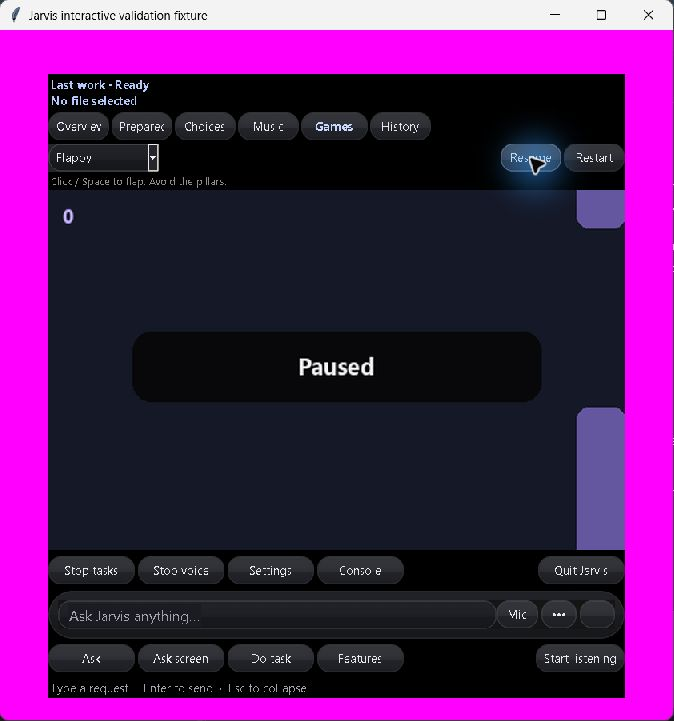
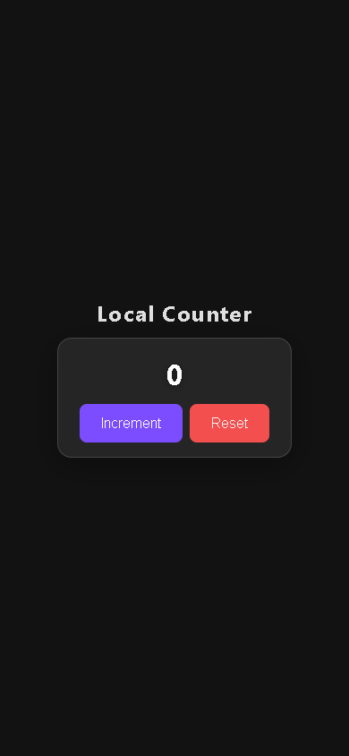

# Production validation and repair — 2026-10-07–08 IST

This continues the [system audit](system-audit.md). The operator explicitly
authorized starting Jarvis, capturing live microphone input, speech playback,
screen testing and partial GPU use after a measured comparison. Existing user
projects, account messages and remote Git repositories were not changed.

## Voice latency and operational health

The operator initially reported a long wait at “Loading model / preparing
prompt.” A competing owned coding trial was stopped before measuring the voice
path. CPU and GPU calls used the same configured Qwen3.5 9B model and actual
question-worker implementation, with the configured Whisper model resident.
No alternate model or fabricated response was used.

| Sequential arithmetic fixture | CPU, 0 GPU layers | Partial GPU, 12 layers |
| --- | --- | --- |
| First call, including loading/prefill | 17.625 seconds | 9.032 seconds |
| Repeated call | 4.297 seconds | 2.781 seconds |
| Total GPU memory used with Whisper resident | 1,028 MiB | 3,324 MiB of 4,096 MiB |

[Measured calls](../artifacts/reports/production-question-latency.json) retain load,
prefill, generation and first-answer timing. An [earlier 20-layer trial](../artifacts/reports/production-question-latency-history.json)
reached 3,894 MiB; the smaller allocation retains more headroom. These are four
sequential short synthetic questions, not a throughput or arbitrary-task
benchmark. Other GPU applications, model reloads and long prompts can change
latency and available memory.

The current local `knowledge.num_gpu` is **12**. Brain planning/Laya and small
background model roles retain their own settings. The Codex coding alias remains
a separate configuration. After restarting Jarvis, the operator repeated the
spoken arithmetic question and reported **“Faster and audible.”**
[Live receipt](../artifacts/reports/production-live-voice-check.json) records a 6.859-second
answer stage, one final microphone segment, fresh audio blocks and all three
foreground workers alive. The duration excludes microphone utterance time and
speech playback. No recording or prompt is published.

`jarvis/runtime_health.py` adds microphone readiness, capture/decoder liveness,
age of the last audio block, final-segment count, question phase/duration and
worker liveness to the local supervisor heartbeat. It does not include speech,
questions, answers, URLs or credentials. Unknown phase strings and raw errors
are excluded. The three dedicated privacy/state tests passed.

The complete post-repair regression suite passed **1,140 tests in 332.122
seconds** ([actual suite log](../artifacts/logs/production-regression-tests.log)).

A later readiness check under concurrent validation load reproduced an uncaught
60-second dependency-import timeout. The launcher now returns `check_incomplete`
with the component and exception type, instead of crashing or treating that
timeout as proof of missing packages. Its import subprocess runs in an owned
job, so Windows venv redirector children also close on timeout. Both injected
fault checks passed, including actual slow-child disposal
([test log](../artifacts/logs/production-launcher-fault-tests.log)). The historical subsequent full run passed **1,142 tests in 302.687 seconds**.
The final-suite log now contains the newer October 8 run documented below. The final
small cancellation/empty-error corrections also passed all five focused health
and readiness checks ([log](../artifacts/logs/production-final-fault-tests.log)).
The configured-service check reports **`ready`**, with all four required Ollama
models and local Git available ([receipt](../artifacts/reports/production-readiness.json)).
A restricted-sandbox run could not reach those services; this result is from
the subsequent read-only check with local-service access. Readiness does not
establish universal feature correctness.

## Provider fixes and credentials

Firecrawl retrieved the primary [REST Countries v5 contract](https://restcountries.com/docs/countries).
The previous adapter appended a country name to the property-search path and
expected a different JSON shape. It now uses `names.common?q=India&limit=5`
and validates/extracts `data.objects`. The corrected adapter passed an actual
India read with the provider's documented public demo token. This is separate
from operator-key readiness; the demo token is not installed as a credential.

An operator free-plan key can be placed in ignored **`secrets/realtime.json`**:

```json
{"countries_api_key": ""}
```

Fill the empty value locally. Alternatively set `JARVIS_REALTIME_COUNTRIES_KEY`
in the process environment; it takes priority. An empty local template was
created only when no file existed. The file is excluded by `secrets/` in
`.gitignore`; it is never a GitHub artifact. Invalid/oversized files or header
tokens produce a content-free setup error. No account is created automatically.

The review found **326 already tracked runtime/log files**. After the operator
explicitly approved the exact scope, these were removed from the Git index,
with all **325 existing local files verified unchanged by SHA-256**. The one
already absent file was the old orb recovery copy removed in the initial audit.
No local runtime file was deleted by this privacy operation. The entire
`.jarvis-runtime/` tree and worker logs are now ignored. A local review manifest
and pre-operation staged patch were preserved; there were no prior staged
changes in this scope. [Verification receipt](../artifacts/reports/production-git-privacy-check.json).
Existing Git history remains unchanged; this operation does not claim that
historical commits were scrubbed or that unpublished state was pushed anywhere.

Provider request exceptions formerly exposed their full URLs, which could
contain private feed paths or query tokens. Failure details now contain only
HTTP status, timeout or exception type. Successful configured-feed receipts
use only the URL origin. Countries authentication uses an HTTP header. Numeric,
HTTP-date and malformed `Retry-After` values now preserve bounded backoff without
retrying the failed request. All **55 realtime tests passed**.

[Fresh supplemental reads](../artifacts/reports/production-provider-recheck.json) reached
Dictionary's documented `hello` sample, GDACS, ListenBrainz and Open Notify.
Bluesky search returned 403, Semantic Scholar 429, SpaceX 525, and WorldTime a
connection failure. arXiv and GDELT exceeded the normal bounded read. This does
not overwrite the earlier full 82-provider probe totals or certify permanent
availability. The upstream [Bluesky report](https://github.com/bluesky-social/atproto/issues/3891)
also records public-search 403 failures; it is historical context, not proof of
the cause of the current rejection.

A [separate two-provider read](../artifacts/reports/production-longer-provider-reads.json)
with a 15-second socket budget subsequently reached arXiv; GDELT still failed.
No production timeout or provider was silently substituted based on that trial.

SearXNG, RSSHub, OSRM, OpenTripPlanner and regional GBFS still need operator
endpoints/feed data. Accounts, private feeds and regional datasets cannot be
invented as production checks. See [provider setup and coverage](realtime-data.md).

## Broader checks and remaining work

All nine existing owned game/app/website fixtures passed a fresh actual Chrome
retest, including real control outcomes, persistence where requested, animation,
390px mobile layout and reduced motion. See the [fresh verifier log](../artifacts/logs/production-multilingual-ui.log)
and [per-project receipts](../artifacts/reports/multilingual-ui-check.json). This retests
existing generated source; it does not claim nine new successful generations.

### Earlier interrupted checkpoint

The full-stack verifier now reports interruptions explicitly and uses the
current observed defects for its owned repair fixture instead of obsolete
diagnostic instructions. Actual Codex must repair the source, and independent
Python/API/browser checks must pass before recording success. Its historical
failed source and [earlier receipts](../artifacts/reports/codex-validation-live-history.json)
remain inspectable. The fresh repair trial corrected the recursive HTTP handler
factory, but later actual checks still found incorrect frontend API wiring and
tests calling a server they never started. The
[live diagnostic log](../artifacts/logs/production-fullstack-live.log) records these
failures. After the operator stopped Computer Use with Escape, screen interaction
ended and the owned coding trial was interrupted. Partial files are retained;
that interrupted trial had **no verified completion**. Jarvis remained temporarily
stopped at that checkpoint. The resumed passing repair and normal startup are
documented in the October 8 section below.

The native Spotify source-scoped transport check used the logged-in app without
publishing track/account metadata. Spotify acknowledged pause, but readback
still reported playing, so that earlier check failed; its result is retained in
[history](../artifacts/reports/production-spotify-transport-history.json).
The action was not replayed. No success or restored playback state is inferred
from acknowledgment alone. The opt-in verifier attempts a distinct restoration
only after observing the expected changed state. Screen verification ended with
the operator's Escape interruption.

### Resumed Computer Use checks — 2026-10-07 IST

The operator explicitly renewed Computer Use and live testing after that
interruption. The complete resumed suite passed **1,149 tests in 388.598 seconds**
([log](../artifacts/logs/production-resumed-regression-tests.log)). The later compact
Codex repair-context change passed **13 focused tests in 3.341 seconds**
([log](../artifacts/logs/production-codex-context-tests.log)). Configured dependencies
and local services again report **`ready`**
([readiness receipt](../artifacts/reports/production-resumed-readiness.json)).

Real Computer Use clicks exposed a game focus defect: clicking Pause moved
focus away from the canvas, implicitly paused the game, then the explicit click
resumed it. The pause button now belongs to the game's focus group; moving
focus elsewhere still pauses. Five widget checks passed, followed by actual
Games navigation, one-click Pause and Resume, a second Pause, selection of
2048, an Up-key merge giving score four, and Restart restoring zero
([observed results](../artifacts/reports/production-interactive-ui-check.json),
[widget test log](../artifacts/logs/production-game-focus-tests.log)).



This screenshot shows actual widgets in an opaque verification window. The
fixture disables microphone, inference, external media polling and real memory
writes; its decorations and layout are not a production-notch capture. The
production screen-capture exclusion remains enabled. The fixture was closed
through its Quit Jarvis control and its window disappearance was observed.

The fresh native Spotify test began paused, issued play once, observed playing,
then issued the distinct pause restoration and observed paused
([receipt](../artifacts/reports/production-spotify-transport.json)). The verifier permits
bounded **read-only status polling** after acknowledgment, preserves receipt
history, and does not replay a transport command. This is a successful retest;
it does not establish the cause of the earlier failed readback or imply a
production Spotify adapter rewrite. Track/account metadata is not published.

Media observation helpers now run in owned Windows jobs. Timeout, Close and
repair close the helper tree, including the Windows venv redirector's child.
An actual eight-second sleeping-child fault proved disposal and a single launch
without replay; six companion tests passed
([actual process fault](../artifacts/logs/production-media-ownership-test.log),
[companion tests](../artifacts/logs/production-media-fault-tests.log)).

Task-state commits retain one fsynced temporary file and use bounded replacement
backoff only for classified Windows access/sharing errors while the target
bytes remain unchanged. A competing writer, unknown error or vanished source
stops the commit; the failed pending file is preserved locally. External actions
are never rerun. Nine checks passed, including a real Windows reader holding
the target without delete sharing and a concurrent-writer preservation fault
([log](../artifacts/logs/production-task-state-tests.log)). The fresh native execution
verifier then passed five providers, Unicode readback, exact single actions,
warm worker reuse and cancellation before dispatch
([log](../artifacts/logs/production-execution.log),
[receipt](../artifacts/reports/execution-native-check.json)); its earlier commit failure
remains in [history](../artifacts/reports/execution-native-history.json).

The Windows command verifier passed **238 PowerShell recipe parses**, catalog
coverage for **493 recipes**, ten owned filesystem/hash operations, six local
browser DOM commands and two native button/event-order checks, with closed-app
guards ([log](../artifacts/logs/production-windows-commands.log),
[receipt](../artifacts/reports/windows-command-live-check.json)). This does not mean all
493 recipes were executed against the operator's applications.

The resumed full-stack trial saved frontend/backend tests through actual
Codex/local Qwen and passed the older named-HTML browser path. Source inspection
then found that GET `/` returned a misleading 200 with an error page: the
generated backend opened a directory as a file and sent headers before reading.
Jarvis now exercises the actual backend **homepage `/`**. A real browser fault
test rejects a wrong homepage even when `/index.html` works
([test log](../artifacts/logs/production-homepage-fault-test.log)). These stronger
checks reproduced the generated defect. Repairs retain the original task,
repository guidance, fixed checks and paired source-tool history, while
discarding repetitive speculative model reports from subsequent inference
context. Source changes must still use checked tools and pass the original
independent tests. At that October 7 checkpoint the stronger repair was still
under validation; it passed on October 8 as documented below.

The later final suite passed **1,150 tests in 356.221 seconds**
([log](../artifacts/logs/production-resumed-final-regression-tests.log)). After that
suite, two actual backend fault tests passed in **28.036 seconds**, rejecting
both the wrong homepage and HTTP/1.1 connection starvation, then confirming
a threaded server fixes the latter
([fault tests](../artifacts/logs/production-backend-fault-tests.log)). The validator
holds its first read connection while probing an independent GET `/`; a blocked
second connection produces a specific backend diagnosis without increasing
timeouts or replaying mutations. A separate read-only generated-source probe
also reproduced the stalled second request
([observations](../artifacts/reports/production-backend-connections.json)).

The refreshed inventory covers **611 authored files**, including **340 Python
files with zero static errors and 79 warnings**. All nine bundled guides are
recognized, and **750 repository-relative file targets** exist; anchor/external
URL validity is outside that link check
([inventory/static receipt](../artifacts/reports/production-repository-audit.json)).
Warnings alone do not establish unused files: compatible exports and retained
integration references require connection evidence before cleanup.

Firecrawl retrieved the current [official Ollama compatibility documentation](https://docs.ollama.com/api/openai-compatibility),
which confirms Responses function tools, `max_output_tokens`, `think` and
stateless full-history requests. No unsupported `tool_choice` override was
added to force model saves. The fresh sources and actual checks, rather than
upstream support alone, determine completion.

Repository inventory now excludes the local `secrets/` directory, alongside
ignored runtime/environment data. No additional local files were deleted in
this resumed validation.

### Protected interfaces — 2026-10-08 IST

A live repair exposed an interface guard bug: a task saying “do not remove
features” could allow removal of another function named elsewhere in the goal.
The guard now distinguishes negative instructions from affirmative rewrite or
removal requests, and scopes removal/rename permission to the explicitly named
function/class. Negative instructions such as “never rewrite” also preserve
interfaces. A checked-source fault verifies that rejected source leaves the
original file intact. All **48 affected coding/Codex/validation tests passed in
79.546 seconds** ([log](../artifacts/logs/production-interface-guard-tests.log)); the
earlier final **35 Codex/validation tests passed in 75.310 seconds**
([log](../artifacts/logs/production-final-codex-tests.log)). The full-stack verifier
also independently requires all five requested backend interfaces, including
`run`, before recording its own success.

### Cold service restart — 2026-10-08 IST

The resumed full suite passed **1,154 tests in 232.696 seconds**
([log](../artifacts/logs/production-final-interface-regression-tests.log)). After an
overnight break, the first coding attempt failed before inference because Ollama
was stopped. Coding now calls the existing bounded local-server startup preflight
before model inspection, then checks cancellation before further work. It reuses
a responding server, starts the installed service only after connection failure,
and never kills a shared service. All **14 Codex tests passed in 1.450 seconds**,
including startup-failure and cancellation faults proving unchanged source and
no coding process launch ([log](../artifacts/logs/production-codex-cold-start-tests.log)).
The actual subsequent retry started the service and reached local Codex inference.
Fresh dependency/configured-service readiness reports **`ready`**, with every
required model and local Git available
([receipt](../artifacts/reports/production-final-readiness.json)). The approval reviewer
usage limit that blocked an earlier whole-suite request has cleared; that failed
review did not execute the requested run or establish an unsafe action.

Identical source proposals are now rejected for every Codex task before backup,
disk replacement or mutation-journal creation. The prior component-only guard
had allowed a live full-stack turn to report an unchanged save. Independent
checks never credited that as a source change; the new guard gives the model
the correct failure sooner and avoids unused recovery files. All **15 focused
Codex tests passed**, including unchanged bytes, timestamp and absent backup/journal
assertions ([log](../artifacts/logs/production-noop-source-tests.log)).

Logged-in app actions, account writes, every optional MCP endpoint and native
compiler/framework remain separate checks. Installed SDK/compiler discovery
does not prove a generated native application builds or behaves correctly.
Current evidence establishes the recorded workflows, not universal autonomous
operation across every file, application and account.

## Final resumed checks — 2026-10-08 IST

The final product regression run passed **1,156 tests in 267.088 seconds**
([log](../artifacts/logs/production-final-regression-tests.log)). LocalGithub's fresh
suite passed **31 tests in 173.20 seconds**, with one dependency deprecation
warning from Starlette's use of httpx
([log](../artifacts/logs/production-localgithub-tests.log)); hosted Gitea was not
certified by that local Git check. A later addition to the verification utility
adds the independent persistence assertion described below; product source did
not change after the full suite.

The real native Codex/local Qwen repair of the retained owned Local Counter
fixture now passed. Jarvis rejected its incorrect homepage and single-threaded
HTTP/1.1 connection handling; the model then repaired source paths, restored
`run`, closed the SQLite write connection and removed the duplicate server
implementation. Independent checks exercised **GET `/`, seven browser steps,
six API requests, five widths (320–1920 px), and seven genuine generated unittest
cases**, with zero observed browser runtime errors. The model did not add the
requested nonzero reinitialization assertion. A separate independent check used
a fresh temporary SQLite database, incremented twice, reinitialized it and
observed the preserved value **2**, against the same server SHA-256. This check
is now included in the live verifier, without manually repairing generated app
source. [Native receipt](../artifacts/reports/codex-validation-live-check.json),
[persistence receipt](../artifacts/reports/production-fullstack-persistence-check.json)
and [historical attempts](../artifacts/reports/codex-validation-live-history.json)
distinguish the passing resumed repair from earlier interrupted/failed trials.
This establishes one repaired existing fixture, not a fresh from-scratch
full-stack generation or a guarantee for arbitrary requests.



Computer Use separately exercised the actual Jarvis controls in the isolated
opaque fixture: navigation, Flappy start, Snake selection/render, a Tic-Tac-Toe
move with opponent response, revealing a matching-game card, Music rendering,
empty Prepare/Choices/History states and Quit. A fresh window inventory confirmed
the fixture closed. These are interaction checks, not completed game runs or
live microphone/media tests
([receipt](../artifacts/reports/production-interactive-ui-resumed-check.json)). The earlier
2048 and Pause/Resume checks remain in their own dated receipt.

The completed owned coding model was unloaded before normal Jarvis bootstrap
startup, retaining the shared Ollama service. The normal supervised startup reported `running` and `listening`, capture and
decoder alive, all actions/questions/speech workers alive and audio blocks
**0.031 seconds** old at observation
([operational receipt](../artifacts/reports/production-resumed-startup-check.json)).
Production screenshot capture remains intentionally excluded. The operator
has been asked to confirm a new spoken answer; no new audible-answer result is
claimed while that reply is pending. The earlier operator-confirmed voice result
remains valid as dated historical evidence.
No additional user or runtime files were deleted in this continuation; secrets
remain ignored and no credential files were added to Git.
