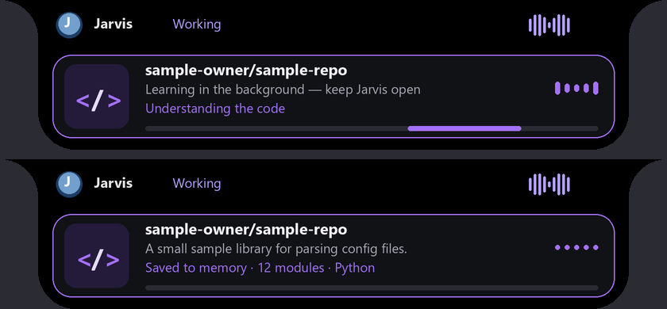

# Learning GitHub repositories for coding, and multi-context awareness

Updated 2026-10-10 IST. Jarvis now learns public GitHub repositories and codes with that knowledge, learns repositories you look at in the browser in the background, saves everything to memory for next time, and keeps several live contexts in mind at once.

*Rendered preview (2026-10-10) with sample text.*

## What existed before

`repository_skills.py` (with `repo_acquisition.py` and `repo_analysis.py`) takes a pinned snapshot of a Python repository, analyses its functions statically, and lets approved functions run as sandboxed "skills" in Docker. That pipeline is unchanged. It is Python-only and built for execution, though. Its knowledge never reached coding tasks, nothing searched GitHub for a task, and nothing watched what you browse.

## Coding tasks now use learned repositories (`jarvis/repo_learning.py`)

Before a coding task that builds or adds something ("create a snake game in JavaScript", "build a markdown to html converter"):

1. **Memory first.** Repositories already learned are matched against the task by keywords. A good match (at least half of the task's key words) is used directly, with no internet and no delay.
2. **Otherwise search GitHub.** The local model turns the task into a short search query and language. The public GitHub API returns candidates, filtered to not archived, not forks, not huge, and at least half the query words in the name, description or topics. The model then reads the top candidates' names and descriptions and keeps only those whose main purpose fits. For example, it rejected a "convert CSV/HTML/Markdown to SQLite" tool for a markdown-to-HTML task.
3. **Learn it.** The source zip comes from codeload.github.com (no API quota), up to 40 MB, and is read as text only: never executed, imported or installed. Vendor and build folders are skipped. Jarvis records:
   - languages, the folder structure, manifests (package.json, pyproject, Cargo.toml, go.mod, …), the README and entry points;
   - functions and classes per file: Python through its syntax tree; JavaScript/TypeScript, Go, Rust, Java/Kotlin/C#, C/C++, Ruby and PHP through declaration patterns;
   - imports.

   The local Qwen 9B model then writes the purpose, architecture, how to run it, key modules and their roles, patterns worth reusing, when to use it, and keywords.
4. **Code with it.** The task's planner gets the repository's purpose, architecture, key modules and patterns. The coding worker also gets the functions most relevant to the task and up to three short code excerpts from the main files, with an instruction to reuse proven structure but write original code that fits the project. The same references reach every coding path through `coding_context()`.
5. **Saved for next time.** The task is recorded under the repository's `used_for`; a similar task later reuses it from memory.

Edit-only tasks ("fix the typo", "rename…") skip this. By default one repository is learned per task (`repos_per_task`).

**Plan repair found during testing.** The planner sometimes split a small project one file per worker, including a separate "test" worker, while every worker pointed at the same test. That plan can never validate. It failed the same way with repo learning switched off, so it wasn't caused by repo learning. Small plans (at most 8 files) that fail only because workers don't own their checks are now merged into a single worker that owns every file and check. Deliverables and checks are unchanged, and plans that are already valid keep their parallel workers.

## Learning while you browse

`main.py` already reads the foreground window title every 300 ms. When a browser window title shows a GitHub repository ("owner/repo: description", "file.py at main · owner/repo", "Issues · owner/repo") for 8 seconds, Jarvis:

1. confirms with one GitHub API call that the repository exists, which rules out titles like Reddit's "r/python";
2. queues it, unless it was learned in the last 30 days;
3. learns it on a background thread.

Your browser is never touched and nothing extra is opened. The island shows **Learning owner/repo — keep Jarvis open**, then steps (checking, downloading, reading N files, understanding the code, saving to memory). At the end it shows **Learned and saved** with a one-line summary, the module count and the main language, so you know you can close Jarvis. Background learning uses the GPU scheduler's research priority, so it yields to answers, planning and coding. If you close Jarvis mid-way, that repository is simply not saved, and it will be learned next time you view it.

## Memory

- `Jarvis Repos/<owner>__<repo>.md` in the Obsidian vault: link, stars, license, when and why it was learned, purpose, architecture, how to run, use it when, key modules, patterns, structure, main functions and classes, and tags.
- `Jarvis Repos/index.md` and `index.json`: every learned repository with purpose, keywords and the tasks it was used for. It's linked from `Jarvis Brain.md`.
- `.jarvis-runtime/repo-knowledge/<owner>__<repo>/`: the full analysis plus up to 30 key source files (about 600 KB at most) for code excerpts.

## Voice commands

| Say | Does |
| --- | --- |
| "learn this repo" | Learns the repository open in the browser now. |
| "learn psf/requests" / "learn https://github.com/psf/requests" | Learns that repository in the background. |
| "what is this repo about" / "what did you learn about psf/requests" | Answers from memory (or starts learning it). |
| "what repos have you learned" | Lists them, plus anything learning now or waiting. |
| "forget the repo psf/requests" | Removes it from repo memory (the Obsidian note stays). |

## Multi-context awareness (`jarvis/context_hub.py`)

Every question and every task plan now gets a compact snapshot of what is going on:
- the window and app on screen;
- the GitHub repository being viewed and whether it's learned, with its purpose;
- background learning in progress;
- the running task and the queue;
- what Jarvis is waiting for you to answer, such as a WhatsApp preview;
- what was playing and the active project;
- recent conversation topics and the last conversation summary;
- active weather alerts.

Jarvis can then resolve "this", "that" and "the repo", answer "is that done yet?" or "go back to the email thing", and know a repository you're looking at without being told. The snapshot reads only local state: no network or model calls, and at most 2,500 characters.

## Settings (`config/config.json` → `repo_learning`)

| Key | Default | Purpose |
| --- | --- | --- |
| `enabled` | `true` | Repository learning (requires memory). |
| `auto_learn_browsing` | `true` | Learn repositories viewed in the browser. |
| `search_for_coding` | `true` | Search GitHub when memory has nothing that fits a coding task. |
| `repos_per_task` | `1` | Repositories learned for one coding task. |
| `min_stars` | `20` | Preferred minimum stars (relevant repos with at least 3 are the fallback). |
| `dwell_seconds` | `8` | How long a repository must stay open before background learning. |
| `refresh_days` | `30` | Re-learn after this many days. |
| `max_zip_mb` | `40` | Largest source download. |
| `model` | `qwen3.5:9b` | Query, pick and summary model. |

An optional GitHub token in `secrets/github.json` (`{"token": "..."}`) or `GITHUB_TOKEN` raises the API limit from 60 calls/hour; it's only sent to api.github.com.

## Verification (2026-10-10 IST, this PC)

Live runs used a temporary vault and cache, so nothing was added to the real vault.

| Check | Result |
| --- | --- |
| Coding task, first time | "build a pomodoro timer app in python with tkinter" → searched GitHub, learned AMaheshVardhan/Pomodoro-Timer, returned purpose, architecture, patterns (state machine, `window.after` loop), functions and a code excerpt. |
| Same kind of task again | "make a pomodoro timer in python tkinter with a start and pause button" → reused memory in 0.0 s, no network. |
| Search relevance | The model pick chose md2html for a markdown task (rejecting a SQLite converter), real snake games for a snake task (dropping a ping-pong game), and music bots for a Discord music-bot task. Each pick took about 4 s. |
| Learning time | About 45–70 s per repository after reducing the prompt (psf/requests: 130 files, 37 modules). The first version took 100–120 s, and one summary timed out. |
| Browsing | A simulated browser title for `sindresorhus/is` held for 5 s → verified, queued, learned in the background (about 60 s), island cards learning → learned. Reddit "r/python" and a Notepad title were ignored. |
| Coding with learning | "create a snake game in javascript with canvas, arrow key controls and a score" → learned CodeExplainedRepo/Snake-JavaScript in about 45 s, the planner's plan was accepted after the new single-worker repair, and the generated `snake.js` reused the reference's canvas setup, 32 px grid and collision helper. The task itself did not pass validation (see below). |

**Coding run outcome (honest result).** The repository learning and references worked in every run. The full snake-game coding task did **not** pass Jarvis's own validation in three live attempts (about 30 minutes each, on 2026-10-10/11):

1. The planner split the project one file per worker; this failed the same way with repo learning switched off. That is now repaired automatically.
2. The plan was accepted and all four files were written, reusing the learned repository. The model then wrote a test file with no tests and a browser check that filled a field a canvas game doesn't have, and hit its 4,000-token output limit while repairing. A cut-off reply now asks the model for a smaller edit instead of failing the run.
3. With both fixes, all five files were written again. The model's plan declared a "Python test" on an HTML file, its repair edits changed nothing, and the 30-minute limit stopped it while the regression suite was also running (about 3 minutes per model turn).

These failures come from the local 9B model's plan and check design in the existing coding loop, not from repo learning. Single-file Python tasks are where this loop has passed before.

Regression and readiness (2026-10-11 IST): **1,468 tests ran, all passed with one skip** (`artifacts/logs/repo-learning-regression-2026-10-11.log`), and `python -m jarvis.launcher --check` reported `ready`. `tests/test_repo_learning.py` covers multi-language analysis, browser-title detection, learning (note, index, cache, island cards), search → pick → reuse from memory, browsing dwell and verification, commands, the situation snapshot, the GitHub card and the plan repair.

## Limits

- The local coding loop still struggles with multi-file web projects (see the coding run outcome above). Repository references help the code, but they can't fix a plan whose checks don't match the project.
- Learning summarises structure and the main files. It does not read every line of a large repository, and the summary comes from a local model, so it can miss details.
- References carry their license (often none). Jarvis is told to write original code, but review anything that closely follows an unlicensed repository before publishing it.
- Without a token, GitHub allows 60 API calls an hour; each viewed repository costs two and each coding search about two.
- Private repositories, GitLab and Bitbucket aren't supported.
