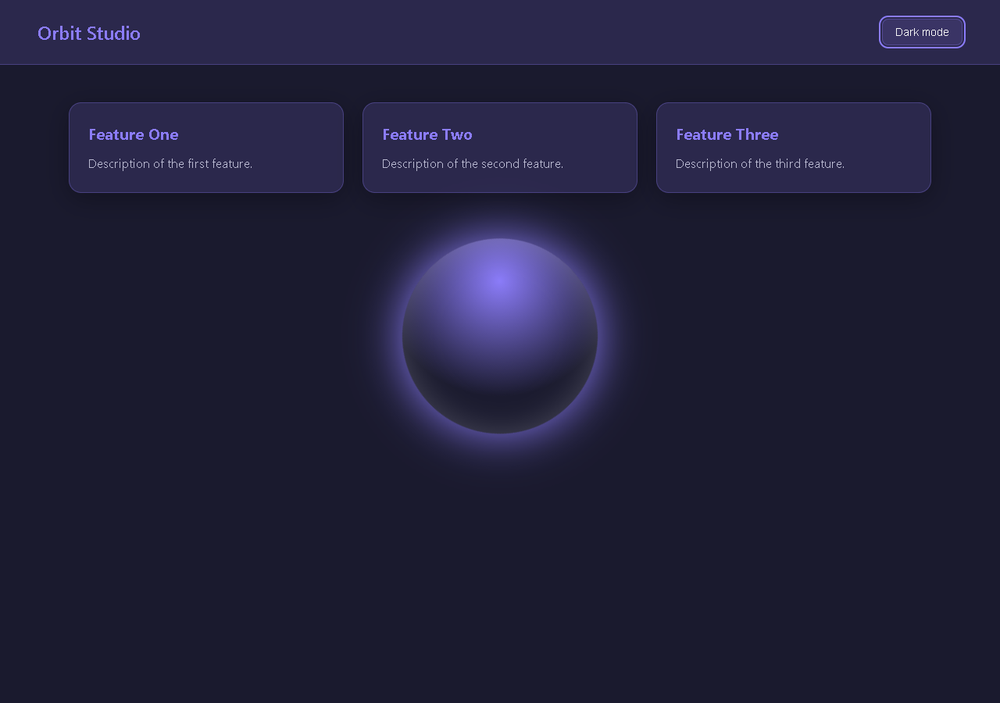
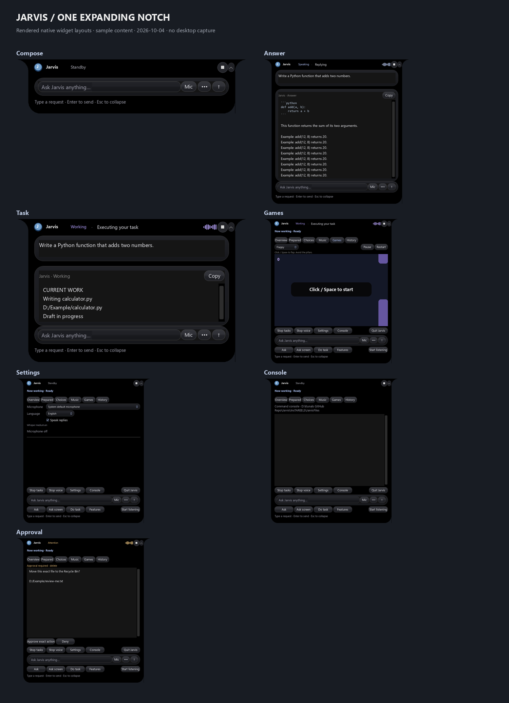
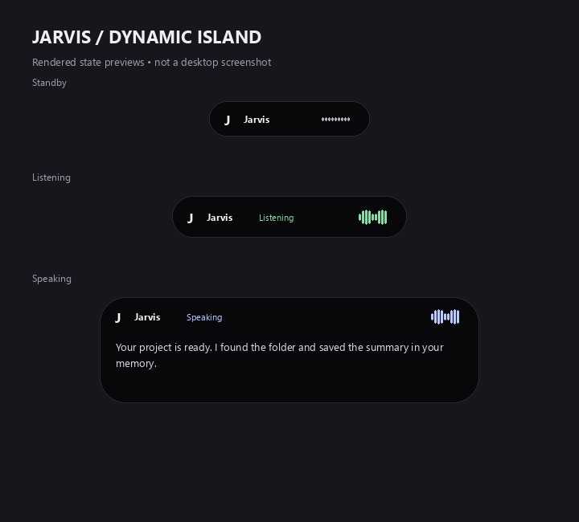
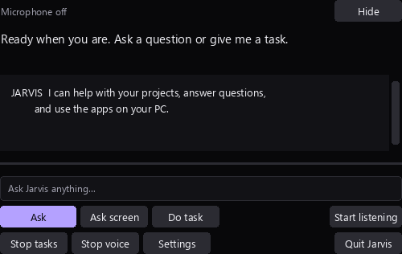
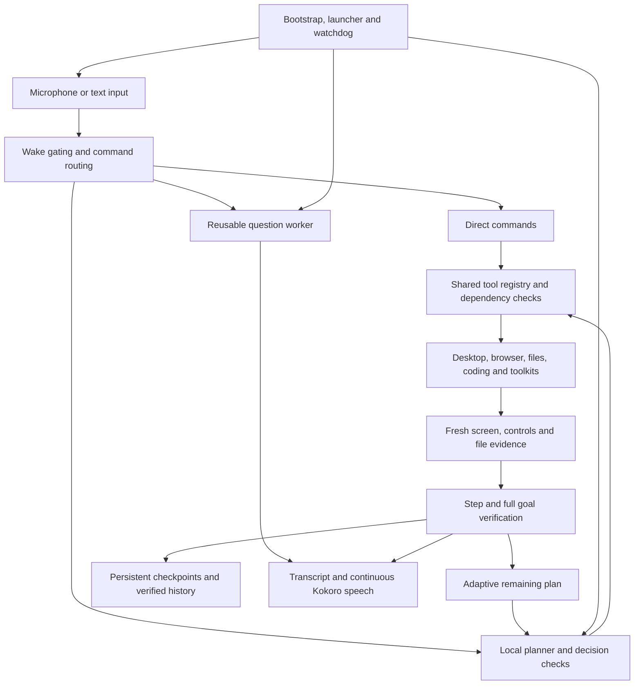

# Repository overview archive — 2026-10-09 IST

This preserves the repository overview before organization, including its historical paths, commands and measurements. Markdown links follow relocated files. Use the [application guide](../README.md) for current setup and the [structure guide](project-structure.md) for fresh verification.

# Jarvis — local Windows voice assistant

**Gmail command repair (2026-10-09 IST):** Draft/write, message-body reads and
draft reads/lists/updates now run through direct OAuth API workflows. Exact text
skips model planning; topic-based writing uses a separate Qwen text interpreter.
Partial updates preserve unchanged fields and HTML MIME, require approval/readback
and cannot replay uncertain writes. Live existing-test read/update and real Qwen
composition passed. Final command regression ran 1,308 tests successfully; the
live Docker isolation class was skipped because the Linux engine was unavailable.
Readiness is `ready`. The user chose to keep Jarvis stopped after final checks;
the repaired command workflow loads on the next start.
[Commands and checks](gmail-api.md#gmail-command-workflows--2026-10-09-ist).

**Unread Gmail repair (2026-10-09 IST):** `find my unread emails` now routes to a
bounded Gmail API metadata search, with sender/subject results and no screen/model
inference. Plural email routing, command parsing and API-first planning are fixed;
mail subject text cannot change verified task completion to paused. Credentials
remain encrypted locally. Live execution passed in 2.953 seconds; final regression
ran 1,291 tests successfully, with the live Docker isolation class skipped;
readiness is `ready`.
Jarvis restarted with approval at that checkpoint; its newer deliberate stop and
command repair are recorded above.
[Commands, checks and limits](gmail-api.md#unread-email-repair--2026-10-09-ist).

**Gmail API (2026-10-09 IST):** Local OAuth API tools now support message search/read
and draft creation/read/update. Credentials remain encrypted locally. Account
consent and live API tests passed: message search/read and recipient-free draft
creation/update/readback. No sending tool is exposed. Adding the selected account
as a test user resolved the initial Google 403.
The connected-account regression passed 1,291 tests; final corrections passed 78
focused checks. Real Qwen API search/dispatch passed. Six API tools are connected;
37 existing local utilities are enabled.
[Setup and limits](gmail-api.md).

**Gmail Compose flow (2026-10-09 IST):** Validated a local Chrome adapter for
Compose, optional To, Subject and body in the logged-in profile. It does not move
the shared mouse or send email. Nine owned-browser/transport checks and a full
1,279-test final suite (262.679 seconds) passed. Live Compose, subject/body, blank To and delayed readback
passed after the user loaded it. Actual Qwen selected and dispatched Gmail inspection.
Gmail is enabled among 38 local utility skills. [Setup and evidence](gmail-drafts.md).

**Planner/email repair (2026-10-09 IST):** Removed conflicting JSON instructions
from native next-step planning, extended bounded inference-only format correction
to ordinary tasks, and corrected Chrome app versus website guidance. The reported
email request now returns an explicit Gmail readiness limitation before model
guessing or any action. A real Qwen Chrome-opening proposal passed. Gmail draft
execution now has live verification. Jarvis was intentionally stopped at that
checkpoint; the later approved unread-email restart is recorded above.
[Checks and remaining setup](utility-skills.md#planner-and-email-repair--2026-10-09-ist).

**Curated utility skills (2026-10-09 IST):** The 42 supplied capabilities have
individual reviewed trials; 41 contracts currently pass (38 actual local skills and
three inactive mock-only messaging adapters). Only current passing source-bound
skills are offered to Qwen. The owned desktop button test passed without moving
the user's mouse. Gmail draft completion passed; symlink privilege remains disabled.
The earlier 1,265 regression tests and four actual Qwen skill-selection
tasks passed. External messaging has
mock-service validation only; no credentials or desktop images are published.
The earlier skill rollout restarted with healthy microphone/workers and current recovery snapshots.
[Setup, all contracts and validation limits](utility-skills.md).

**Repository skill engine (2026-10-09 IST):** Persistent static Python repository
analysis now connects to Jarvis's existing Qwen planner, tool dispatcher, approvals
and memory. Approved capabilities execute only in a hardened local Docker Linux
runtime. Actual Boltons, Packaging and AnyIO trials passed; static candidate
discovery does not imply every function is validated.
[Setup, commands, security and verification](repository-skills.md).
**1,241 regression tests passed**, including ten real container security checks;
readiness, hidden UI startup/shutdown and three persisted post-restart calls passed.

**Native coding validation (2026-10-09 IST):** **1,212 regression tests passed**;
configured readiness is `ready`. The local Qwen backend passed actual Python
workloads, three-file website generation and LocalGithub assembly, an independent
Chrome counter oracle, synthetic-image vision and the command/diff UI checks.
The website trial took 943.766 seconds. Firecrawl remains optional and unconfigured.
The supplied command reference is integrated as data and typed usage guidance.
Jarvis restarted after these checks with healthy microphone and foreground workers.
[Usage, actual screenshot, dated evidence and limits](native-coding.md).

**Native coding update (2026-10-08 IST):** Jarvis now defaults to its own local
Qwen3.5 9B coding tools and command/diff workspace. Native workers edit assigned
files, preserve fixed tests and assemble tested results through LocalGithub;
Codex CLI/accounts are not used by this path. The supplied six-page command
reference has 24 usage guides and real installed-program discovery. Actual
single- and two-worker native Python trials passed independent unchanged tests
and assembly; the 1,208-test regression checkpoint passed. Further live results,
failure repairs and explicit limits are in the [native coding guide](native-coding.md).

**Python workload repair (2026-10-08 IST):** Single Python-script requests now
stay in one Python source-and-tests workload even without a filename. This
addresses the reported missing worker-check indices and rejects accidental web
plans before writes. Existing ownership and behavioral validation remain strict.
Also fixed the Codex completion/GPU-cleanup handoff and Python worker context.
**1,198 regression tests passed**; configured readiness is `ready`. An actual
local-Codex continuation passed six generated tests and a visible-circle launch
in an isolated fixture. Earlier failures/time limits remain recorded. Jarvis
restarted with healthy microphone/workers and current recovery snapshots; the
original `TestCodes` project and failed checkpoint were not replayed or changed.
[Implementation, verification and limits](codex-workloads.md).

**Earlier GPU allocation checkpoint (2026-10-08 IST):** Jarvis now schedules planning,
execution, questions and local Codex GPU inference by priority, reserving memory
for Whisper. Primary Qwen 9B uses partial offload; local Codex uses nine GPU
layers. Live checks observed a 3,392 MiB peak on the 4,096 MiB GPU with healthy
microphone capture. Small helpers default to CPU after a slower cold GPU sample.
**1,192 regression tests passed**; readiness reports `ready`. Actual local Codex
creation/editing and synthetic GPU vision passed. Jarvis is running with healthy
microphone/workers, GPU heartbeat status and current recovery snapshots.
[Configuration, dated evidence and limits](gpu-priority.md).

**Earlier cursor checkpoint (2026-10-08 IST):** Jarvis's temporary cyan **J** cursor
activates supported native/browser controls without moving the user's system
mouse. Actual-worker checks passed on YouTube, GitHub, Spotify web and desktop,
Windows Camera and owned fixtures. **1,165 Jarvis regression tests passed**;
configured readiness is `ready`, and Jarvis restarted with healthy microphone
and foreground workers. Physical-only gestures refuse; app focus and
keyboard remain shared. [Behavior, actual screenshot and dated evidence](independent-cursor.md).

**Earlier production repair checkpoint (2026-10-08 IST):** All **1,156 Jarvis regression tests and 31 LocalGithub tests passed**; configured local-service readiness reports `ready`. The actual Codex/local Qwen full-stack repair passed its real homepage, seven browser interactions, six API requests, seven generated unit tests and an independent persistence check. Spotify transport passed on October 7. Resumed Computer Use checks passed against actual Jarvis controls in the isolated fixture. Fixed cold coding startup, protected interfaces, unchanged-save handling, checkpoint sharing locks, media helper cleanup and game Pause focus. Jarvis restarted normally; microphone capture/decoding and all foreground workers are alive with fresh audio. Optional account/service setup and untested native frameworks remain explicit. [Evidence and limits](production-validation.md).

**Production validation and repairs (2026-10-07 IST):** Fixed REST Countries v5 search/response handling, private URL leakage in API receipts, local credential storage and rate-limit backoff. All 55 realtime and three health-metadata tests passed. Partial GPU question inference measured 9.0 seconds first/2.8 seconds repeated with Whisper resident, improved from 17.6/4.3 seconds on CPU. The operator confirmed the live reply was faster and audible. All nine existing browser fixtures passed fresh checks. [Evidence, local setup and remaining production checks](production-validation.md).

**System audit and repairs (2026-10-07 IST):** Inventoried authored source, tools, skills and related installations; repaired configured-service readiness, partial/new-format model-cache restoration, hidden UI isolation, screen-capture owner identity, inseparable Codex test ownership and conflicting Harness plan/clarification output. The missing context-selection model is installed and the launcher reports `ready`. **1,132 Jarvis regression tests and 31 LocalGithub tests passed**; actual local Codex creation/editing passed with unchanged CLI behavior. Removed only the disconnected old orb renderer and its generated copies. Third-party API/configuration and model-generation limits remain explicit. [Architecture, cleanup decisions, fresh checks and remaining gaps](system-audit.md).

**Green public data and serious alerts (2026-10-07 IST):** Added the 82 API
adapters selected in the supplied screenshots, with timestamped evidence for
questions/tasks and location-aware idle hazard monitoring. A CPU-only Qwen 0.5B
reader uses one thread, yields to foreground work and unloads after each read;
temporary RAM/CPU use remains necessary. The final live probe reached 68 providers;
8 were unavailable/rate-limited and 6 require setup. Five need a self-hosted
endpoint/regional feed; REST Countries now needs a free-plan key. No paid
substitutes or large model fallback. Restart using Stop/Start Jarvis.
[Usage, all green providers, resource limits and verification](realtime-data.md).
Final regression: **1,117 tests passed**, including **50 focused realtime tests**;
launcher readiness is `ready`, and a live-data foreground question passed.

**LocalGithub workload orchestration (2026-10-06–07 IST):** Jarvis plans coding
workloads, starts suitable work in separate local Codex sessions, tests each
part and assembles commits using LocalGithub's local Git/ownership layer.
Combined checks gate application to the selected project. Two workers share
local 9B inference; faster completion is not guaranteed. This does not automate
or bypass the hosted Gitea review queue. LocalGithub source is unchanged.
[Workflow, configuration and verification](codex-workloads.md).
New plain sites use three source workers with Chrome component checks; tested
markup is shared with concurrent CSS/JavaScript workers.
Workers use compact task context; browser checks cover five widths from 320px
to 1920px. Complete-file repairs preserve all observed failures; tested peer CSS
helps JavaScript use consistent state classes. Jarvis allows three bounded repairs
within the normal 30-minute coding deadline.
Regression/readiness verification passed 1,067 tests plus 53 focused tests and
reported `ready` on 2026-10-07. The live animated website passed in 15 minutes
50 seconds, including three tested worker commits and LocalGithub assembly.
Eleven browser checks and 260 additional click/keyboard interactions passed
across five widths; application source was written and repaired only by Codex.
[Live and post-promotion results](codex-workloads.md#verification-2026-10-07-ist).



**Codex verification and repair (2026-10-05–06):** Jarvis now requires an
expected-file/check contract before coding writes, runs supported runtime and
browser checks, and sends failures plus fresh source to bounded Codex repair
turns. Frontend/backend requests require both layers and actual UI/API checks;
declared web backends and directly executed test files no longer incorrectly
require desktop window widgets.
Application source remains generated/edited by Codex/local Qwen. Actual local
Python create/edit passed automatic tests; **1,042 regression tests passed and
launcher readiness is `ready`**. Restart via Stop/Start Jarvis.
That October 5–6 full-stack trial was unverified: runtime checks caught a recursive
backend factory and zero executed tests. Local 9B generation still has limitations.
[Workflow and limits](codex-code-local.md).

**Coding destination and reply repair (2026-10-05 IST):** Jarvis now extracts
`TestCodes` from `create an app to monitor my health in folder TestCodes folder`.
Confirmed folder replies resume the original goal once through **Codex/local
Qwen**, with island and spoken completion. Handoff tests use a recording Codex
boundary and create no application source; expiry and uncertain-write guards
remain active. **1,021 regression tests passed; launcher readiness is `ready`.**
Restart Jarvis through Stop/Start to load the fix.
[Folder syntax and verification scope](codex-code-local.md).

**Ollama model visibility repair (2026-10-05 IST):** The `/api/show` 404 came
from a WSL server using a different model store from the existing Windows cache.
Restored configured Qwen models from cached files without registry downloads,
preserving Gemma and the shared server. Setup now restores base models before
local aliases; coding preflight repairs a missing alias or explains unavailable
weights. Actual local script creation/edit and counter-app browser interaction
passed after a Qwen repair of moving controls; **1,013 regression tests
passed and launcher readiness is `ready`**. Restart Jarvis once to load recovery
changes. [Setup and troubleshooting](codex-code-local.md).

**Local Codex coding (2026-10-05 IST):** Jarvis now uses the installed Codex
CLI with **local Qwen3.5 9B** for coding tasks, replacing the configured Claude
Code executor. Explicit folder/file paths take priority, followed by the fresh
File Explorer folder and remembered scope. Visible text, file activity and
results stream into the existing island. Checked saves preserve originals;
Stop closes only the owned process tree. Each task uses isolated Codex settings,
without changing the desktop chat model or requiring paid model API calls.
Actual local creation/edit and a Python run passed; **1,006 regression tests
passed and launcher readiness is `ready`**. The island replay passed 90 updates
without widget rebuilds or completion collapse. All **nine animated UI fixtures**
passed actual browser checks after reviewed corrections; React fixtures also
passed strict type checks/builds. Native C/C++/C#/Java compilation remains pending.
[Setup, behavior and limits](codex-code-local.md),
[languages and fixture results](multilingual-coding.md).
Restart through Stop/Start Jarvis to load the new backend.

**Windows command reference (2026-10-04):** Imported all **493 commands / 21
categories** from the supplied ZIP with pinned recipes, explicit parameter binding
and direct matching for app launches, file/host requests and exact command names.
The island reports execution and retains approvals; recipe voice requests wait
for the final transcript. Python input checks the current
app/window; DOM commands use the owned browser; Office recipes use one owned batch.
Configured launchers preserve typing focus. Added free PyAutoGUI/OpenCV dependencies.
All IDs are available through command search and explicit requests; optional apps,
permissions and exact targets remain necessary. Owned file/DOM/native fixtures passed; **980 regression tests passed** and
launcher readiness is `ready`. Verification results are in the
[execution guide](windows-commands.md). Restart via Stop/Start Jarvis.

**Longer plan execution (2026-10-04):** Fixed the six-action cutoff and lost
completion context. Jarvis now permits twenty actions by default and retains
verified progress with Stop and uncertain-action guards. Ten actual Qwen-generated
file plans spanning **2–20 actions** passed after fixes and retests with deterministic
decision/verification oracles; ten authored plans also passed. An owned native fixture verified
**20 real button activations in 64.953 s**. Qwen planning measurements are separate.
**960 regression tests passed; launcher readiness is `ready`.** Restart via
Stop/Start Jarvis. [Configuration and verification scope](plan-execution.md).

**Python GUI edit fix (2026-10-04):** Named script edits now send current source
and the UI request directly to the configured Qwen coder, check GUI structure
before saving, and keep streaming after an optional preview-file lock. Active
inference uses separate idle and total deadlines. A real local fixture generated
a working Tkinter calculator in **189.5 s**; its controls passed four arithmetic
and two error checks. **940 regression tests passed; launcher readiness is
`ready`.** No new dependency or paid API. Restart via Stop/Start Jarvis.
[Details and verification limits](python-gui-edits.md).

**Session memory and live app context (2026-10-04):** Jarvis now retains paired
conversation sessions, prefers current-session context, and offers contextual
memory choices inside the island. A separate free local **Qwen3.5 0.8B** thread
supplies ready context to the main planner. App/window lifecycle and accessible
controls are tracked separately from historical conversation; direct commands
recheck targets before input. Live authored checks verified memory selection and
its follow-up, background selection in **1.437 s**, and two native clicks followed
by closed-window guards with zero model calls. No new Python dependencies or paid
APIs. **929 regression tests passed; launcher readiness is `ready`.**
Restart through the normal launchers.
[Configuration, rendered UI, model comparison and verification limits](session-context.md).

**Voice-command cleanup (2026-10-04):** Jarvis now uses a separate free local
Qwen2.5 0.5B selector for checked surface corrections. It preserves original
intent and bypasses dictation/literal payloads; timeout retains the original words.
It was fastest among three tested options at **0.265 s warm median** on constrained
text fixtures. **886 tests passed; launcher readiness is `ready`.**
Restart through the normal launchers.
[Model comparison, exact safeguards and verification scope](command-cleanup.md).

**Smooth island growth (2026-10-04):** Long answers now extend the existing
mounted view, then scroll at the screen limit. A 160-update UI replay recorded
zero view unmounts or layout rebuilds; **864 tests passed and launcher readiness
is `ready`**. Restart Jarvis through the normal launchers.
[Rendered growth stages and verification](smooth-island-growth.md).

**Streaming island answers (2026-10-04):** Jarvis now shows incremental Ollama
answer/code output in the existing glass island. Real progress extends the
inactivity deadline, with a separate 30-minute total ceiling and working Stop.
Interrupted previews stay marked incomplete. Restart Jarvis through the normal
launchers. The C++ question streamed first text in **13.3 seconds** and finished
in **6 minutes 47 seconds**; code execution was not tested. **859 tests passed;
launcher readiness is `ready`.** [Configuration, rendered preview and verification](streaming-answers.md).

**Ollama output/timeout repair (2026-10-04):** Jarvis's missing `qwen3.5:9b` alias
is restored. Bounded planning deadlines now align at 300 seconds for HTTP and
330 seconds for its worker. Fresh text, warm chat and native proposal checks
passed; **843 tests passed and launcher readiness is `ready`**. CPU latency,
large model loading and logged server/GPU discovery interruptions still affect
response time. [Diagnosis and evidence](ollama-output-timeouts.md).
Restart Jarvis through its normal launchers.

**Ordered native execution (2026-10-04):** Jarvis uses reviewed desktop primitives
in the requested order: UFO → Windows-MCP → CUA → Open Computer Use → Agent-S.
Exact supported task grammar skips Qwen, with provider fallback before input and
no replay after uncertainty. **839 regression tests passed; launcher readiness is
`ready`.** A two-step owned Windows fixture passed in **0.453 seconds with zero
model calls**; arbitrary task speed remains unestablished. The five repos have a
5,700-file source inventory; only selected compatible actions are activated.
[Integration, commands, sources, licenses and evidence](execution-providers.md).
Restart Jarvis through the normal launchers.

**One expanding glass notch (2026-10-04):**

Jarvis now keeps typing, answers/code, tasks, approvals, music, games, history,
Prepared, settings and its console inside one animated top-edge notch. Rounded
glass buttons and inputs share highlights, borders and interaction states.
[Controls, VoiceOS/Firecrawl research, rendered previews and limits](voiceos-notch.md).
**809 regression tests passed; launcher readiness is `ready`.** Restart Jarvis once.



**Qwen3.5:9b primary model (2026-10-04):** The verified Ollama download now supplies
questions, vision, planning, decisions and coding. One-step planning uses native
function calls and verified result feedback across the **82 registered tools**;
configured tools are selected by intent. App/integration discovery and Firecrawl
search/scrape/map are connected. Firecrawl needs its own Jarvis key; account/MCP
services need authorization. Codex plugin logins are not automatically transferred.
**803 regression tests and launcher readiness passed.** Live native/vision/coding
fixtures passed in **31–115 seconds** on CPU. Restart Jarvis once.
[Configuration, tool categories, plugin scope and evidence](qwen35-9b.md).

**One-step planning (2026-10-03):** Jarvis uses a fresh screenshot, goal and verified
history to request one next action, prepares the next prompt during execution,
clears its two-frame context at task end and reuses eligible verified native
navigation with fresh checks. The real local-model fixture took **34.125 seconds**;
five-second completion and general accuracy are not guaranteed.
[Implementation, repeat scope and verification](step-planning.md).
Restart Jarvis once.

**2026-10-03 step-planning verification:** 785 regression tests passed and launcher
readiness reported `ready`. [Evidence and scope](../artifacts/reports/step-planning-regression-check.json).

**Idle-time anticipation (2026-10-03):** Jarvis now prepares bounded research
outlines and proposes editor review checklists from recent requests or eligible
window titles. The **Prepared** island view shows evidence, expiry and feedback
controls, with explicit authorization for automatic browser-topic public searches.
[Usage, rendered sample preview, limits, research sources and verification](anticipation.md).
Restart Jarvis once. One generic live query retrieved three public sources;
prediction usefulness remains unmeasured.

**2026-10-03 anticipation verification:** 758 regression tests passed and launcher readiness
reported `ready`. [Evidence and scope](../artifacts/reports/anticipation-regression-check.json).

**Jarvis web/app development (2026-10-02):** Framework-aware knowledge, design briefs, staged project coding, reviewed Node builds, owned previews, real browser outcome checks and verified learning are integrated into Jarvis. React/Vite, Next.js, Electron renderer and Expo web acceptance passed; native installers/devices remain separate checks. [Usage, setup, actual screenshots and verification limits](web-app-development.md) · [acceptance results](../artifacts/reports/development-acceptance-check.json). **719 regression tests passed; launcher readiness is `ready`.**


**Interactive island (2026-10-02):** The floating island now has output previews, persistent current file/activity, clickable choices and approvals, Spotify artwork/player cards, a focus timer and five local games that preserve background coding. [Commands, rendered preview, implementation and verification limits](interactive-island.md). A real Spotify metadata/artwork read passed; playback and live voice remain untested for this update. Restart Jarvis once.

Verification: **693 regression tests**, hidden UI/background-file checks and launcher readiness passed. [Dated results](../artifacts/reports/island-regression-check.json).

**Visual interaction and Save checks (2026-10-02):** Jarvis now has native-first local visual fallback using an actual reviewed UI-TARS parser component, guarded Windows input and independent per-action checks. Explicit document saving verifies the named file on disk and gates exact-file overwrites. Local model checks passed on a rendered fixture; live interactive input remains unverified in this execution session. [Integration, sources, commands and verification limits](visual-interaction.md). **667 regression tests and launcher readiness passed; four real local-model checks passed on a synthetic fixture.** Restart Jarvis once.

**Experience learning (2026-10-02):** Jarvis now stores and retrieves successes, failures and verified recoveries with app/UI/tool/project conditions and scoped outcome evidence. The Memento-inspired local case bank guides planning and coding without changing model weights or replaying uncertain actions. Close-window checks distinguish hidden, destroyed and remaining windows; process exit is not inferred. [Implementation, configuration, evidence and limits](experience-learning.md). **618 regression tests and launcher readiness passed.** Restart once to load the feature. Temporary-vault persistence/retrieval and a real Harness/Qwen proposal with synthetic state passed; no desktop proposal was executed.

**DeepSeek Harness (2026-10-02):** The real upstream SDK/runtime supplies general planning and replanning using local Qwen, with a read-only research CLI option. Jarvis retains execution and verification. **592 regression tests and launcher readiness passed.** [Explanation, setup, integration scope and evidence](deepseek-harness.md). Direct workflows and streaming coding keep their existing routes; synthetic inference checks do not establish a speed or quality advantage. Restart Jarvis to load the selected planner.

**Sharp UI and commands during speech (2026-10-01):** The island renders at native DPI with antialiased text and live task/file captions. Microphone capture continues during speech, addressed commands can interrupt replies, and general questions leave a running coding task intact. [Full HD rendered preview and behavior](hd-display-and-voice-input.md).


Verification: **578 tests passed**, hidden UI startup/shutdown and preview export passed, and launcher readiness reported `ready`. Live overlapping microphone speech still needs a spoken trial.

**Runtime memory connections (2026-10-01):** Relevant tools, skills and validated remembered program paths now reach task planning and coding. Personal Obsidian guides reload at runtime. The real vault was refreshed with **70 tools, nine local guides and 210 Hermes references**; seven configured routing checks and 566 regression tests passed. [Runtime selection and limitations](runtime-capabilities.md).

**Streaming coding (2026-10-01):** Script code now appears in drafts during Qwen3-Coder generation. Existing-file edits commit after validation and byte checks; single-script requests avoid redundant plan inference. A real alarm was created with 154 checked updates in **164.158 seconds**, with CPU loading/prompt processing still slow. [Behavior, timeout fix and evidence](streaming-coding.md).

**Folder navigation and personal skills (2026-10-01):** Drive-aware folder lookup, bounded typo matching, frequently opened folder preferences and linked Obsidian usage notes now support folder requests. Global personal guides use `custom-skills` and `add_skill.py`. Five real Ollama phrases resolved correctly; one Explorer open was independently confirmed in **0.881 seconds**, excluding voice. [Behavior and verification](folder-navigation.md) · [Create custom skills](skills-and-learning.md#adding-personal-skills).

**Hermes skills and comparison (2026-10-01):** The existing Nous Research Hermes installation now supplies an indexed library of **210 upstream reference skills** (58 bundled, 152 optional) and supporting files in Obsidian, alongside nine Jarvis guides. 168 declare Windows support; additional requirements remain explicit. A matched live comparison exposed model-planner timeouts and browser/playback failures; the later direct follow-up verified 3/3 tasks in **4.313 / 0.250 / 3.266 seconds**, excluding voice. Direct workflows are selected first, with native Qwen as the general fallback; Hermes remains installed as an optional planner and its skills remain connected. Both model routes failed the latest complete-goal check. All 535 regression tests and launcher readiness passed. Original failures are retained. [Catalogue, integration, comparison method and limitations](hermes-skills-and-comparison.md).

**Automation upgrade (2026-10-01):** A warm UIA worker, direct verified workflows and an owned Playwright Chrome session reduce repeated startup/model calls and redundant option prompts. Live search → first YouTube video → verified playback took **5.681 s cold / 2.918 s warm**; native Spotify search → matched song → verified playback took **6.656 s**, all excluding speech input/output. Both workflows used zero model calls. Nine skill guides and the 69-tool/41-operation catalogue are synchronized to Obsidian. All 523 regression tests and launcher readiness passed. Restart Jarvis once. [Behavior, setup, sources, live evidence and limits](automation-upgrade.md).

**Initial skills and execution learning (2026-10-01, before the automation upgrade):** Jarvis installed eight workflow guides and learned verified procedures in Obsidian. Similar tasks receive relevant step references; recent exact navigation requests can reduce planning overhead while retaining current-state checks. All 501 regression tests and launcher readiness passed; full desktop task latency remains unmeasured. [Setup, research and verification scope](skills-and-learning.md).

**Initial YouTube and Spotify controls (2026-10-01, before interactive desktop checks):** “Play first video” now preserves its ordinal and avoids a redundant choice. “Open Spotify” prefers its installed Windows app. Media searches use the active service, with direct player, seek, volume, captions and Spotify library/queue commands registered for tasks and Obsidian memory. Verification: 489 regression tests passed and launcher readiness passed; live playback remains unverified because the execution desktop exposed no visible windows. [Commands, verification and limits](media-controls.md).

**Free Heart voice and repair fix (2026-10-01):** Jarvis now uses local Kokoro Heart English speech with continuous playback and a warm worker. The coder-name mismatch behind repeated model repairs is corrected to the installed `Qwen3-Coder:latest` model. Pending downloads are no longer reported as immediate failures. Verification on 2026-10-01: 462 regression tests passed and launcher readiness passed. [Preview, live checks, timing limits and troubleshooting](natural-voice-and-model-repair.md).

**2026-10-01 Hermes regression/readiness:** All 449 tests passed and the launcher reported ready with Hermes selected for planning. [Verification scope](hermes-agent.md#verification-and-limits).

**Hermes automation planning (2026-10-01):** Free MIT Hermes Agent was installed and enabled at this stage for Jarvis's model-based planning/replanning using local Qwen, relevant Obsidian memory and the available tool catalogue. Jarvis retains execution approvals and independent verification. Live local inference passed using synthetic observations (37.09 seconds planning, 16.75 seconds replanning); no desktop actions were executed, and faster or more successful automation has not been benchmarked. [Setup, evidence, source attribution and limits](hermes-agent.md).

A local Windows assistant using **English-only Whisper medium.en on NVIDIA CUDA**, wake-word activation, concurrent desktop actions, live dictation, local Qwen planning and vision, Kokoro Heart English speech and Piper Hindi speech, and a compact animated Dynamic Island. The faster-whisper runtime uses `int8_float16` and was verified on the RTX 3050's 4 GB of VRAM. Core local inference needs no API key and does not upload microphone audio or save microphone recordings. Web tools and optional account services use network requests and may require credentials.

**Documentation updated: 2026-10-03.** The application is in `InsTAREELS/`. All commands below run from that application directory unless stated otherwise.

**Actual Qwen weight training:** Downloaded Qwen2.5-Coder-0.5B-Instruct and completed six local CUDA LoRA gradient rounds: 681 training examples, 171 optimizer steps and 1,081,344 trained adapter parameters. Corrective training uses 86 projects, with 14 excluded from updates. The best checkpoint passed 7/14 validation projects versus 1/14 before training; later rounds regressed. Dedicated adapters and full merged weights are saved locally, with exact resume and optional Jarvis Python-coder integration. Fresh evaluation passed 31/100 projects and 1/10 larger cases; a new invoice task passed 0/10 cases. All 391 regression tests and launcher readiness passed. The 4B coder remained selected at the time of that evaluation; the current coding route is described below. [Setup, evidence and limitations](qwen-weight-training.md).

**Additional coding-language training (2026-09-28):** Two local CUDA LoRA rounds added checked JavaScript and SQLite examples with Python replay to the dedicated 0.5B checkpoint. Held-out loss improved, while JavaScript still failed its export interface and SQL's two held-out tasks already passed before training. The 4B coder remained selected at the time of that evaluation. The new regression suite passed 400 tests and launcher readiness. [Evidence and usage](qwen-weight-training.md#additional-javascript-and-sql-training-2026-09-28).

**PC context and Qwen training:** A dedicated PC adapter completed two real gradient rounds (448 examples, 112 optimizer steps). Validation improved from 4/32 to 32/32; fresh model requests passed 11/13, while fresh exact-name lookup passed 12/12 real project/folder checks. The adapter is configured with live-path validation and metadata fallback. Project, folder and indexed-file context refreshes for planning, coding and PC questions; private contents are excluded. [Behavior, training and limits](pc-model-training.md).

**Coding model (2026-09-29):** Project coding and code/test drafts now route to the installed `qwen3-coder:30b` through `brain.coder`; planning and decisions remain on Qwen3.5-4B. See the app [configuration](../config/config.json) and [coding workflow](../README.md#desktop-and-files). The 2026-09-29 project-environment regression suite passed 402 tests; launcher readiness reported ready, and `ollama list` showed the coder installed. These are routing and readiness checks, not a live coding quality benchmark.

**Obsidian catalogue integration (2026-09-30):** Jarvis now stores tool/operation descriptions, bounded project summaries and registered software locations in its vault, then retrieves relevant entries for tasks, coding and questions. Exact project paths are checked before use and duplicate names remain ambiguous. Background refresh does not block answers. See [catalogue behavior, refresh commands and scan limits](../README.md#tool-project-and-app-memory). Private inventory contents remain in the local vault, outside this repository. The 2026-09-30 scan saved 64 tools, 38 operations, 302 detected project folders and 793 app/software entries; it is bounded rather than exhaustive. All 428 regression tests passed and launcher readiness reported ready. Direct project-summary/path lookup was verified against the actual vault in under 11 ms, excluding voice input/output. A separate model-backed project answer exceeded 60 seconds; general model-answer latency is not guaranteed.

**Obsidian memory and direct answers (2026-09-29):** Jarvis writes interaction and foreground-window summaries to the configured local [Obsidian vault](../README.md#obsidian-memory). Its user profile now supplies relevant context to local Qwen answers and personalized direct greetings. On normal startup Jarvis greets Kunal sir with a weather lookup and local time; hello, time, date and weather questions take a direct route. Weather uses approximate IP location with a saved-city fallback, so the reported city can be inaccurate. The installed Obsidian app at `D:\OBSIDIAN\Obsidian.exe` and existing `D:\Phython Project\Jarvis_Memory\Jarvis_Mem` vault are configured. See the [app memory and weather details](../README.md#obsidian-memory) for privacy, timing and offline behavior. The profile remains outside Git. A running Jarvis session is required for new activity entries, and window titles do not reveal every action or page contents.

**2026-09-29 regression/readiness check:** The project `.venv` suite passed 412 tests and launcher readiness reported `ready`. Direct greeting bypassed Ollama in a subsecond automated test; weather responses used mocked services. Live weather and spoken end-to-end timing were not verified.

**Everyday question bank runtime route (2026-09-29):** The supplied bank contains 147 intents and 672 sample phrases. Jarvis now computes more date, profile, arithmetic, conversion, random and PC status answers at request time and uses bounded weather/AQI and currency lookups for changing values. See the [app coverage and limitations](../README.md#everyday-runtime-questions). Actions and private account data still require connected tools and permissions; five seconds for every phrase is not a verified or guaranteed end-to-end result.

**2026-09-29 runtime regression/readiness check:** The project `.venv` suite passed 420 tests and launcher readiness reported `ready`. Computed answer routing completed in under one second in an automated worker test. A separate warm Qwen API sample took 3.67 seconds on CPU; live weather/currency requests were blocked by the local proxy, and spoken end-to-end timing was not measured.

**Local Qwen questions (2026-09-28):** General answers, planning, PC questions and screen vision use local Qwen models through Ollama. The optional cloud text provider and its credential setup have been removed. Web search remains available for current public information. See the app [configuration](../config/config.json).

**2026-09-28 regression/readiness check:** 398 automated tests passed and the launcher check reported ready with local Qwen planner and vision models. This is a regression/readiness result, not a new live end-to-end question or desktop-action test.

## Images and media



The current UI is a small black island at the top of the screen. It morphs for listening, work, speech and temporary replies; clicking opens compact conversation/input controls with settings hidden on demand. These are rendered previews with sample content, not desktop screenshots. [Dynamic Island behavior, references and verification](dynamic-island.md).




This older HUD artwork is retained for provenance and historical previews; the current island does not display its circular logo. It is third-party artwork; see [asset provenance](../jarvis/assets/README.md). A [static reference image](../artifacts/media/reference-logo.png), [earlier reference UI](../integrations/references/jarvis-ui/reference-jarvis-ui.png), and [reference cover](../integrations/references/jarvis-ui/reference-jarvis-cover.jpg) are also retained; they are reference material rather than screenshots of the current Jarvis panel.

[Listen to the current Heart English voice preview](../artifacts/media/jarvis-heart-preview.wav). The sample uses local Kokoro Heart and is generated speech, not a microphone recording.

## Contents

- [Hermes skills and measured route comparison](hermes-skills-and-comparison.md)
- [Automation upgrade and live checks](automation-upgrade.md)
- [Capabilities](#capabilities-at-a-glance)
- [Setup and launch](#start)
- [Speech recognition settings](#whisper-settings)
- [Voice commands and dictation](#talk-while-it-works)
- [Desktop, files, questions, and coding](#desktop-and-files)
- [God's Eye View](#gods-eye-view)
- [Recovery and adaptive planning](#silent-startup-and-recovery)
- [Integrations and toolkits](#integrations-and-toolkits)
- [Autonomous toolkit use](#autonomous-toolkit-use)
- [Agent runtime and project research](#agent-runtime-and-project-research)
- [Architecture and project layout](#architecture-and-project-layout)
- [Configuration and relocation](#configuration-and-relocation)
- [Troubleshooting](#troubleshooting)
- [Verification](#verification-commands)
- [Current validation and update history](#current-validation-and-update-history)
- [Documentation maintenance and attribution](#documentation-maintenance-and-attribution)

## Capabilities at a glance

| Area | Current behavior |
| --- | --- |
| Voice input | English Whisper on CUDA, wake gating, Silero VAD, overlapping transcription, live dictation, and cancellation. |
| Interface | Compact Dynamic Island, smooth state transitions, temporary reply cards, conversation/input controls, and settings on demand. |
| Questions and screen understanding | Local Qwen answers, optional web research, English/Hindi replies, and local vision of the destination window. |
| Desktop and browser | App/site launching, searches, exposed control selection, exact text-field filling, scrolling, supported shortcuts, menus, and dialogs. |
| Files and projects | Scoped file creation/editing, approved deletion, catalog lookup, project discovery, recent-project memory, and Explorer context. |
| Coding | Related-source context, bounded multi-file work, exact replacements, syntax checks, original-byte backups, diffs, atomic per-file writes, readback, verified failure recall, related examples, and learned missing-import checks. |
| Task execution | Shared tool registry, dependency checks, independent decisions, observations, verification, adaptive replanning, and bounded safe alternatives. |
| Memory | Local Obsidian vault with dated Jarvis interactions and foreground-window intervals, plus checkpoints, task summaries, and UI suggestions. |
| Speech output | Local Kokoro Heart English and Piper Hindi voices, continuous English reply playback, a warm voice worker, interruption, and recognition mute during replies. |
| Media and globe | Spotify session controls and on-demand God's Eye View browser console. |
| Tools | 70 registered operations: 16 core, 4 DOM browser tools, 37 earlier toolkit adapters and 13 agent/MCP tools; configuration and runtime approval gates apply. |
| Agent runtime | Hierarchical repository guidance, explicit skills, deferred tools, source maps, Git observations, read batches, events/deny hooks, approved MCP stdio, and headless read-only sessions/research agents. |
| Recovery | Hidden single-instance supervisor, worker/service health checks, startup snapshots, bounded retries, and explicit-stop handling. |

Local models do not make every task reliable. Custom/elevated apps may not expose usable controls; ambiguous targets require clarification. External writes and deletion use the applicable approval flow, and uncertain effects are never automatically replayed.

### Task questions and option replies

A plain file request such as **“open folder Downloads, create a file called JarvisTest .txt there and write hello kunal in it”** uses an exact file plan, preserves the filename/content, and resolves Downloads before launching or writing. It does not require selecting an Explorer folder or enter code generation just because the request mentions a folder. Full existing destination paths can be resolved without a catalog refresh.

When an essential detail is missing, Jarvis displays and speaks a task question, retains the original goal, and waits for an answer for up to three minutes. For a missing destination, reply **“Downloads”** or a full folder path. A short answer continues the paused task rather than becoming a general question; a new explicit command/question replaces it. Stop/cancel clears the question. Verified progress is retained, and an answer cannot replay an action whose result is uncertain.

For an offered file/app, project or UI list, reply **“one,” “the second one,” “option two,”** or the exact displayed name. UI selections still validate the current window and controls. File/app/UI lists expire after 45 seconds; project lists and task questions after three minutes. Invalid numbers preserve the offered choices; expired replies ask you to repeat the request for a fresh list. These flows do not grant deletion, command or account-write approval.

## Hardware and current models

On this PC (Ryzen 7 5800H, 32 GB RAM, RTX 3050 Laptop with 4 GB VRAM), use **Qwen3.5 4B** for planning, decisions and answers, **Qwen3-Coder 30B** for project coding and code/test drafts, **Qwen3-VL 4B** for screen vision, and the pinned English **Laya** checkpoint for control ranking. Ollama and Laya use CPU; the 30B coder may respond more slowly than the former 4B coding route. Whisper **medium.en** uses CUDA `int8_float16`. Kokoro Heart supplies English speech; Piper supplies Hindi speech. Laya's candidate suggestion still needs independent Qwen agreement for ambiguous controls.

The 2026-09-27 comparison found all three installed vision candidates passed two synthetic field-verification checks each; that limited evidence does not justify switching the stack. Very large models in the supplied screenshots exceed practical local memory; smaller 7–14B alternatives can fit RAM in isolation but need end-to-end evaluation before replacement. [Hardware, model sizes, timings, sources and limitations](MODEL_AUDIT.md), [raw comparison results](../artifacts/reports/hardware-model-comparison.json). No model configuration changed.

## Agent runtime and project research

Jarvis now has **69 registered operations**: 16 core tools, 4 DOM browser tools,
37 existing toolkit adapters and 12 agent/MCP operations. Coding tasks read applicable `AGENTS.md`,
explicitly selected `$name` skills and a bounded repository symbol map. Local
plugin bundles can contribute declarative skills. Planning uses deferred toolkit
discovery (`agent_runtime.deferred_tools: true`) with `tool_search`; configured
tools are discoverable without exposing the whole catalog on every request.

New tools inspect source maps and Git status/log/diffs, read repository guidance
and skills, and batch up to four independent local reads. Metadata events and
optional deny hooks record/control tool execution. Trusted stdio MCP servers
require explicit configuration, exact allowlists and visible approval for each
server start/call. These path checks and policies are application controls, not
an OS sandbox.

The headless read-only agent supports resumable/forked JSONL sessions and up to
three separate research agents. From the app directory, run
`python -m jarvis.agent_cli --project . --goal "Map this project"`; Ollama must
already be running. `python verify_agent_runtime.py` checks a fixture without a
model, and `--live` requests a temporary-project local-model check.

[Setup, usage, MCP/policy examples, research coverage and limits](codex-runtime-integration.md).
The [2026-09-27 live test report](real-world-validation.md)
records thirteen real local-model, repository, disk and public-web tasks,
including a multi-file expense application and three-agent investigation.
Run `python verify_real_world.py` from the app directory to reproduce the suite.
It uses fresh test workspaces and reports failures separately from readiness.
Local text inference now detects prompt-only Qwen templates and supplies explicit
role delimiters without modifying the installed model; native chat templates
retain their chat API.
No new Python dependencies or UI changes were introduced. Arbitrary JavaScript,
an OS sandbox, write-capable subagents, remote execution and Codex protocol/model
parity remain outside the implemented scope.

## Unified task tools

### Desktop actions

Tasks can fill named accessible text fields, scroll an accessible container one page, press supported shortcuts, expand menus/dropdowns, and choose buttons in active modal dialogs. Each action checks the destination before execution and is followed by observation and verification. Examples:

- `fill Search field with robot tutorials`
- `scroll down`
- `press control plus f`
- `open File menu and select Save as`
- `select Cancel in the dialog`

Text entry replaces a field's value without submitting it. Password fields and read-only fields are excluded. Supported shortcuts include Tab, Shift+Tab, Escape, Ctrl+A/F/L/S/Shift+S/C/V/Z/Y, Alt+Left/Right/F/E, arrow keys, Home/End, PageUp/PageDown, and F5. Use named buttons for confirmation and submission. File deletion continues through the file tool's approval flow. Custom interfaces that do not expose UI Automation patterns may still need manual interaction.

The preferred local models are Qwen3.5-4B for planning/decisions and Qwen3-VL-4B for screen interpretation. These are practical local choices for this PC, not a claim of universal benchmark leadership. If a preferred model is missing, the brain can use installed Qwen3-4B/Qwen2.5-3B for text or Qwen3-VL-2B for vision. Planning logs identify the fallback. Once the preferred model is installed, subsequent requests automatically use it. Set `brain.allow_model_fallback` to false to require configured models exactly. Run `verify_desktop_planner.py` with `.venv/Scripts/python.exe` to check live model planning and independent field selection without executing desktop actions. Add `--vision-only` to check the vision model on a synthetic form image.

The autonomous planner receives one shared tool catalog from `jarvis/tools.py`. The same catalog defines its action schema and routes execution to file operations, terminal commands, browser actions, or desktop controls. Direct file work uses file tools; website navigation uses browser tools; visible button selection uses a freshly checked desktop control. Terminal execution and file deletion retain visible user approval. Tool routes appear in the activity log, and dispatch evidence is followed by the existing observation and verification loop before another action runs. Existing direct voice commands remain available.

Firecrawl documentation was used to review browser tool boundaries. This local registry uses Jarvis's existing browser and desktop adapters; the Codex Firecrawl connector is not automatically a credential or browser session available to the Jarvis process.

## Name correction

App names match installed candidates using aliases, spelling edits, swapped letters, and close spoken forms. Examples include `open chrmoe`, `open spoitfy`, and `open kalkulator`. Known website names such as `youtub` resolve to their registered URLs. Button selection compares the requested words with visible enabled control labels, including labels with extra app/site text: `select svae`, `select setings`, or `select contnue`. Jarvis logs the interpreted name. Similar candidates remain numbered choices; unrelated gibberish has no automatic target. Destructive button names are excluded from typo inference.

## Start

If installation is interrupted, double-click **Resume Whisper Setup.cmd** when the connection is stable. It installs the missing packages, resumes the model download, and runs a synthetic-speech GPU check before reporting success.

Requires Windows 10/11, Python 3.10+, and an NVIDIA CUDA GPU with an up-to-date driver. From this folder run:

```powershell
powershell -ExecutionPolicy Bypass -File .\setup.ps1
```

Install Ollama before running **Setup Jarvis Brain.cmd** for local questions and screen-aware planning. That setup creates the separate brain environment, installs CPU inference dependencies, downloads the configured planning/vision and Laya models, and verifies them. A fresh installation needs internet access for these downloads. The optional God's Eye console also needs Node 24.14+ and `npm ci` in `integrations/gods-eye-view-src/gods-eye-view-main`.

Then close any older Jarvis window and double-click **Start Jarvis.cmd**. The top-center Dynamic Island expands into compact controls when clicked. Choose your microphone and click **Start listening** if listening is off. Click the launcher or **Hide** to collapse the panel; right-click the launcher for quick controls and Quit. Use Start listening to toggle the microphone; Escape hides the panel, while **Quit Jarvis** actually stops supervision. Windows capture exclusion keeps the launcher and panel out of supported screenshots. Initial setup downloads CUDA libraries and the ~1.53 GB English Whisper model. Core inference subsequently works offline; web research and online services require connectivity. The app verifies CUDA by running inference before starting capture and displays the actual device and precision. It does not silently fall back to CPU. Allow microphone access for desktop apps in Windows Settings if needed.

The input meter should move when you talk. Choose **Microphone Array (Realtek)** to try the laptop microphone, or your headset explicitly, rather than relying on the Windows default. The selection is saved to `config.json`.

Clicking **Start listening** also wakes Jarvis once microphone capture is ready. Wait for **Awake**, then say **“open notepad”** directly; “Jarvis open notepad” also works. After “go to sleep” or 90 seconds of inactivity, say “Jarvis” again. Recognized speech ignored while asleep is explained in the action log. **Microphone off** means you must click Start listening before speaking.

## Whisper settings

`config.json` contains the model path and `whisper` options:

- `device: "cuda"`, `compute_type: "int8_float16"`: GPU inference with quantized weights.
- `partial_interval_seconds: 1.0`: request a new partial transcription about once per second. Actual update delay also depends on GPU decoding time.
- `silence_seconds: 0.8`: finalize after detected speech ends. This does not pause microphone capture.
- `vad_threshold: 0.45`: Silero speech detection threshold. Lower values accept quieter speech but more background noise.
- `language: "en"`: transcribe speech as English without language detection. The English-only `medium.en` model is downloaded by `setup.ps1`.

The installed `models/faster-whisper-small.en` is a smaller, faster English-only fallback. To use it, set `whisper.model` to `small.en`, remove `whisper.repo`, and set `model_path` to `models/faster-whisper-small.en`. Medium.en decoded the included synthetic command in about 0.67 seconds and recognized `notes.txt` directly. Live accuracy depends on the selected microphone, accent, background noise, and phrasing.

Whisper is not a native streaming recognizer. This app continuously captures audio in one worker and decodes rolling hypotheses in another. Silero voice activity detection avoids feeding silence into Whisper. Long speech rolls through overlapping 20-second windows; timestamped words retain the earlier transcript. Pending partial snapshots are replaced by newer ones so they cannot build an ever-growing inference backlog. Completed utterances retain their order. CUDA DLL discovery is scoped to the process; no system PATH or driver changes are made.

## Talk while it works

- “Hey Jarvis open notepad then write here are my ideas for today”
- “Open notepad and write my name is Kunal” — both actions run in order; “and type” also works.
- Keep speaking; stable words stream into the focused destination app, with three words held back for recognition corrections.
- “Stop dictation then create a file called ideas dot txt containing buy milk”
- “Rename file ideas dot txt to shopping dot txt”
- “Delete file shopping dot txt”
- “Jarvis open calculator then open paint”
- “Go to sleep” cancels queued tasks and returns to wake-word listening.

Say **then**, **and then**, or **next command** between tasks to execute completed clauses without ending your speech. Without a separator, a command waits for the speech recognizer's natural endpoint. Dictation streams partial results without requiring a pause. “Stop dictation then …” ends dictation before the next command. Control phrases and “then” are reserved; they cannot be dictated literally in this version. Commands before a spoken separator can already have run, so later corrections cannot undo them.

After an app-opening command, **and write**, **and type**, and **and dictate** also start dictation, including when recognition splits the sentence into separate segments. Ordinary “and” inside dictated text stays literal.

Deletion and renaming wait for a finalized speech segment, even when “then” is spoken; subsequent tasks stay behind them. Each deletion now needs a separate approval dialog showing the exact file path. Approved files go to the Windows Recycle Bin. Silence for 90 seconds returns to wake-word mode. The microphone remains active for wake detection until you click Stop listening, Stop all tasks, or close the window. No background Windows service or startup registration is installed.

## Desktop and files

### Screen-aware autonomous tasks

**Setup:** double-click **Setup Jarvis Brain.cmd**. It creates `.venv-brain` separately from Whisper, installs CPU PyTorch and Laya, downloads the pinned English Laya checkpoint plus the Ollama models configured in `config.json`, and runs synthetic-screen inference checks. Interrupted model downloads can resume by rerunning setup. The feature is not ready until setup and verification finish successfully; existing direct commands continue working while models are missing.

After setup, restart Jarvis. Say **“Jarvis task open YouTube in Chrome”** or type the goal in the bottom box and click **Do task**. Pressing **Enter** routes instructions and questions the same way as speech. Compound instructions such as **“open YouTube and search for how to make robot and play first video”** stay together as a task. This YouTube workflow opens the search directly, observes the results, and selects the requested visible video in screen order. Explicit configured app launches in screen aware tasks run before model planning of the remaining steps. Previously unrecognized finalized commands also go to the planner; known direct commands retain their faster path. **Ask Jarvis** continues to answer questions without desktop actions.

The roles are:

- **Qwen3.5 4B planner:** produces the next supported steps from the currently visible screen.
- **Laya selector:** compares up to eight shortlisted visible control labels plus “none.” Its scores are advisory, not authorization or a guarantee of accuracy.
- **Qwen3.5 4B decision checker:** checks each step against your goal and selects a candidate when needed. A unique exact control name skips Laya's comparison; ambiguous choices require both models to agree. A final check considers the whole goal.
- **Qwen3 VL 4B screen reader:** captures the active destination window after every action, checks whether the expected result is visible, and describes the landed screen to the planner. Jarvis then plans its next action from that screen, keeping a short record of completed actions so it does not repeat them.

Brain and question inference use priority-managed partial GPU offload with speech memory reserved; Laya remains on CPU in its separate reusable process. The automatic loop supports opening apps/files/folders, websites, browser and music searches, exposed UI controls, exact text-field filling, scrolling, supported shortcuts, menus/dialogs, creating a new file with spoken content in a named folder, and requesting an app window to close. It cannot activate controls that the app does not expose to Windows UI Automation; text entry and shortcuts must pass the supported tool's destination checks. A new instruction or **Stop all tasks** interrupts the plan.

Examples: **“Jarvis play jazz on YouTube”**, **“Jarvis play my playlist on Spotify”**, **“Jarvis open playlist Focus on Spotify”**, **“Jarvis pause Spotify”**, **“Jarvis resume Spotify”**, **“Jarvis next song on Spotify”**, **“Jarvis previous song on Spotify”**, **“Jarvis shuffle on”**, **“Jarvis repeat one”**, **“Jarvis skip 30 seconds on Spotify”**, **“Jarvis rewind 15 seconds on Spotify”**, **“Jarvis set Spotify volume to 50 percent”**, **“Jarvis mute Spotify”**, and **“Jarvis what's playing on Spotify.”** Spotify search opens the installed Spotify app. Searching alone does not start playback; Jarvis must select a result and verify the playing state. Playback controls use Spotify's Windows media session, and volume controls use Spotify's own audio session; neither targets another app's music. Spotify may require its own login or account permissions. Closing sends the normal window close request, so an app can present a Save prompt. File creation never overwrites an existing file; the spoken folder must be identified unambiguously in the catalog, or you can say **“this folder”** with File Explorer selected.

For projects on D:, say **“Jarvis open project folder”** to open the first available configured project root (currently `D:\Kunals GitHub Repo`), **“Jarvis which project was I using”** to hear the last project Jarvis opened (or the most recently active folder it found), or **“Jarvis open my pending project”** for a numbered list of recent project folders. Say **“option two”** or the project name while the list is open. Jarvis then opens that project in File Explorer and Codex, and opens YouTube in Chrome. It remembers projects it opens in `project_memory.json`. Recent file activity is only a clue; Jarvis cannot determine whether work is actually pending. Change `project_roots` in `config.json` to scan other project parent folders.

Only current, revalidated controls can be activated. Invalid plans, ambiguous choices, changed targets, and unverified results stop the loop or enter the bounded recovery path when failure is known to precede execution; uncertain clicks are never replayed. Tasks have a six-action budget. The planner can edit a named UTF-8 text file, or request deletion of one named file in a named folder. Deletion waits for your approval. It can propose a command only when your task asks for command execution; Jarvis displays that command for separate approval before running it. Generic desktop payment/upload/permission actions are unsupported. Configured toolkit adapters separately support selected account sends and remote writes with destination/content approval; see the toolkit guide. Screenshots and labels remain local and are treated as untrusted input. Model verification is fallible; a successful check is not a guarantee that every task succeeded.

For model-planned desktop actions, Jarvis fetches fresh accessibility evidence and normally uses a new screenshot with screen awareness enabled. Exact field readback and file/process evidence can bypass redundant visual inference; direct supported workflows use fresh DOM/accessibility/Windows media checks. See the [automation upgrade](automation-upgrade.md). Toolkit operations instead verify their returned data or service acknowledgement and supply the verified result to planning. It waits briefly for a window or control change; if the first visual check catches a loading page, it observes once more. It never repeats the action while waiting. The next step is planned only after the result is verified. Coding tasks similarly read back every created folder, draft, and edited file before moving to the next write. The local task journal records the observation checkpoint.

Run `.\.venv\Scripts\python.exe verify_brain.py` to test all three models against synthetic screens without desktop actions. `--selector-only` checks Laya alone. `brain-worker.log` contains local runtime diagnostics. The model choices are configurable under `brain` in `config.json`.

Run `.\.venv\Scripts\python.exe verify_scenarios.py` for 13 varied synthetic requests, including a real create-and-read check in an isolated temporary folder. `scenario_results.json` records every plan and pass/fail result. Rerun **Setup Jarvis Brain.cmd** if a configured model is missing.

Sources: [Laya model and limitations](https://huggingface.co/convaiinnovations/laya), [Qwen3.5](https://ollama.com/library/qwen3.5). Laya's published model card explicitly warns about zero-shot errors and uncalibrated confidence; the desktop workflow has not been fine-tuned or calibrated on your usage.

### General questions and internet knowledge

Restart Jarvis after updating. Click the island and **Start listening**, then ask **“Jarvis why is the sky blue?”**, **“explain photosynthesis”**, or **“search the internet for today's technology news”**. Use **“ask …”** for anything that does not begin with a question word. You can also type a question in the panel and click **Ask**; the right-click menu’s **Preview typed command** remains a preview only. Stop dictation before asking a question.

Answers appear in the transcript log, with a short preview above it, and are spoken aloud. **Speak answers** toggles playback; **Stop voice** interrupts it. English uses the user-selected local Kokoro Heart American female voice; Hindi uses the local Piper Rohan voice. Both are installed by `setup.ps1`. Kokoro stays warm between replies and plays each synthesized reply as one continuous buffer. These are assistant-style voices, not an imitation of an actor's voice. The **Answer language** control selects Auto, English, or Hindi. Auto responds in Hindi to Hindi or Hinglish questions and English to English questions. You can type or say questions such as “mujhe batao gravity kya hai” or “पानी क्यों उबलता है”. Hindi answers use Devanagari for accurate Hindi speech. Source URLs stay in the transcript rather than being read aloud. Voice synthesis runs locally. Microphone capture now continues during speech. Say **“Jarvis …”** to interrupt a reply and issue a command; captured playback references reject matching self-echo. This is text-based filtering, not acoustic echo cancellation. **Stop voice** remains available. Questions run in a separate process and queue and no longer supersede a running coding/automation task; voice, questions and the action worker can operate concurrently. **Stop all tasks** cancels pending questions and speech. The last three question/answer pairs stay in session memory for follow-ups; say **“forget conversation”** to clear that short session history. When Obsidian memory is enabled, short question and answer notes remain in its local vault.

The local Ollama model **qwen3.5:9b** provides answers. Jarvis starts the installed Ollama server if necessary; its supervised recovery can restore missing declared models while preserving partial downloads. The enabled `gpu_scheduler` governs actual offload and reserves speech memory; use `gpu_scheduler.primary_layers: 0` for CPU primary inference. `knowledge.num_gpu` remains the scheduler-disabled fallback. Responses can take several seconds, especially with cold model loads. [Current GPU configuration](gpu-priority.md).

### Jarvis command prompt and file edits

Right-click the island and choose **Command prompt**, or say **“Jarvis open Jarvis command prompt.”** Enter a Windows command and press **Run**. Jarvis shows the exact command in an approval dialog first, runs it from `JarvisFiles`, and displays its output and exit code. Commands time out after 60 seconds. A command can change or delete files, so review the entire command before approving it. You can also say **“Jarvis run command dir”** or ask a task to run a command.

### Coding in a named project

Jarvis writes the current task and its checkpoints to local `task_state.json`. The record includes the goal, selected project, stages, action targets, window titles, and verification summaries; it does not store screenshots or generated file contents. A crash or restart marks an unfinished task as interrupted. Repeating the same unfinished request gives the planner that history alongside a fresh screen observation, so it can identify what remains. The record never replays old clicks or commands automatically. Only the latest 20 previous tasks and 30 checkpoints per task are retained. Remove `task_state.json` while Jarvis is closed if you want to clear this local history.

Say **“Jarvis code in project Demo: add a greeting function”** or **“Jarvis fix the greeting in project Demo.”** Jarvis finds the named project in `project_roots`, inspects a bounded source file list, plans changes to up to three files, reads those files together for context, and generates complete replacements with the local `brain.coder` model (`qwen3-coder:30b`). It validates Python and JSON syntax, checks for changed files and unexpectedly truncated output, then writes each file. It cannot delete project files through this coding mode. Check the changed files and run the project's tests yourself; syntax checks alone cannot establish that generated code works. Say **“Jarvis open project Demo”** or **“Jarvis list projects”** to find the project name. Run `python verify_coder.py` for a synthetic, no-write model check.

With the destination folder open in File Explorer, say **“Jarvis modify kunal.py to add a UI”** or **“Jarvis create a tools folder and a Python script.”** You do not need to say the folder name: Jarvis uses the open Explorer folder, reports its source files, and reads the existing file before editing it. If an edit names a file that is missing or appears in multiple subfolders, Jarvis reports the available paths instead of creating a different file. Jarvis can plan up to three new folders and three files inside that folder. It creates folders and draft files first, then generates or edits source. A failed generation leaves a recognizable draft that can be resumed. Existing files are changed only after the generated replacement passes validation. It will not delete files as part of a coding plan. Run `python verify_coder.py --workflow-smoke` to test folder creation, script creation, and a follow-up script edit in a temporary folder.

For a new standalone Python file, open its destination in File Explorer and say **“Jarvis create a Python file with calculator code in it.”** Jarvis uses the selected folder and chooses `calculator.py` from the stated purpose. It first creates a visible draft, writes the code into that file, then checks the result. For a basic calculator it runs arithmetic and division-by-zero checks. For other Python requests it generates code with the local model and checks syntax; a failed generation leaves a draft that Jarvis can resume on the next attempt. It does not overwrite an existing user file. You can name the file explicitly as well.
**“Jarvis create Python code for calculator in TestCodes project folder”** also works when the selected Explorer folder is `TestCodes`; Jarvis checks the spoken folder name against the selected folder before writing. Restart Jarvis after installing code updates so its running process loads the new behavior.

For a direct text edit in `JarvisFiles`, say **“Jarvis modify file notes dot txt replace old with new.”** This changes one exact match and stops if the old text appears zero or multiple times. Say **“Jarvis overwrite file notes dot txt with content new text”** to replace the complete file. For a task in another folder, name the folder and file; Jarvis will not infer an unnamed destination. **“Jarvis delete file notes dot txt”** asks for approval of that exact path before moving it to the Recycle Bin.

### Questions about your screen

Open the app you want Jarvis to inspect, then ask **“What is on my screen?”**, **“What does this error mean?”**, or **“Screen pe kya dikh raha hai?”**. You can also click the island, type a question, and press **Ask screen**. Jarvis briefly hides both the controls and island, captures the last active external window, then restores the launcher. It reads visible text with local OCR and sends the screenshot to the local **qwen3-vl:4b** vision model. The screenshot stays in memory and is not sent to a web search service or saved to disk. The window title appears in the action log so you can see which app it read.

Screen answers describe one frame at question time. They can read visible text and describe images, but cannot reliably infer motion, hidden content, or what happened earlier. Screen content is treated as untrusted input and cannot trigger desktop actions. Run **Setup Jarvis Brain.cmd** if the vision model is missing; it downloads the model configured in `knowledge.screen_model`.

Explicit searches and questions about current information use public web search; otherwise the local model decides whether it needs web verification. This uncertainty decision is imperfect. Say **“search the internet for …”** to force a check. Search sends the question (up to 500 characters) to the search providers; audio, the PC catalog, button memory, and conversation history are not uploaded. Answers use search snippets and list their source URLs, rather than claiming full-page research. Offline/search failures are shown clearly. Set `knowledge.internet` to `false` for offline-only use, or `knowledge.enabled` to `false` to disable question answering. The LLM and web results cannot issue desktop actions.

Implementation references: [Ollama chat API](https://docs.ollama.com/api/chat), [raw generation API](https://docs.ollama.com/api/generate), [DDGS search library](https://pypi.org/project/ddgs/).

### Remembered button choices

Jarvis saves successful selections made **through Jarvis** in local `ui_memory.json`, scoped to the app executable and window title. It does not monitor manual mouse clicks. While awake and listening, it checks periodically for a remembered, currently available option when you return to a screen. It shows **“Use it again? Say yes or no.”** Answer **“yes”** to select it, or **“no”** to see alternatives and then say **“select option two”** or **“select [name]”**. Suggestions appear on screen; they are not spoken aloud.

Say **“suggest a button”** to request a suggestion immediately, or **“forget button memory”** to erase the saved choices. Suggestions expire after 45 seconds; changed windows/controls invalidate approval. Learning only occurs after a successful activation, and Jarvis never automatically activates a remembered choice without your answer.

### Select buttons and options by voice

Common phrasing is accepted: **“button list”**, **“choose Person 1”**, **“open Person1 profile”**, **“pause video”**, and **“close”**. Spacing and profile numbers are normalized; a profile's Open button takes priority over its More actions menu. Close buttons can belong to several tabs/windows, so Jarvis lists numbered choices with parent labels where available. “Pause” does not toggle a player that already exposes Play.

### Common names and browser commands

Try **“open YouTube in Chrome”**, **“open Chrome and search MyHuna”**, **“search my hood on Chrome”**, **“open D drive”**, **“open VS Code”**, or **“open my budget”**. Browser searches open Google results in the requested installed browser; **“search the internet for …”** still requests a researched answer. Follow-up questions can begin with **“but why…”** or **“so how…”**.

App matching accepts common aliases, spacing differences, partial names, and close spelling matches. File opening accepts words from longer indexed names, in any order, without requiring an extension. Multiple matches produce a numbered list: say **“select option two”** within 45 seconds. Very broad file searches ask for more detail. This matching uses real catalog entries and exposed controls; it does not infer arbitrary targets or repair every speech-recognition error. Rename and deletion still require explicit filenames.

- **“Click Save”** or **“click the Save button”**
- **“Select comedy with cartoons”** (for a visible tab, button, link, or list option with that label)
- **“Open chrome and select comedy with cartoons”**
- **“List buttons”**, then **“select option two”**
- **“Select second video”** on a YouTube results window, or **“select third result”** for a visible result. Jarvis counts matching controls in their visible screen order.
- **“Select this option”** while pointing at an exposed option, or after Jarvis has shown numbered choices. If several options still fit, Jarvis asks which one you mean.
- **“Select svae”** can match a visible **Save** control. Close spellings are accepted only when the visible choice is clear; ties produce a numbered list.
- **“Click File”**, then name an item in the opened menu

Jarvis uses Windows UI Automation names, not guessed screen coordinates. Keep the destination app in front; if Jarvis itself is in front, it can use the last window it targeted. Controls must be visible, enabled, and exposed by the app's accessibility interface. Hidden dropdown items require opening the dropdown first. Custom canvases and some browser controls may not expose names; the action log explains when no match is available.

Exact labels win over longer labels. Multiple matches produce numbered choices in the action log. Choices expire after 45 seconds and are invalidated when the window or available controls change. Clicking waits for finalized speech. UI calls run in an isolated worker with cancellation and a timeout so a stuck app cannot block microphone capture. If dictating, say “stop dictation” before giving a selection command.
Ordinal and pointer-based choices rely on visible accessibility controls. Jarvis avoids destructive controls in inferred selections; name a control explicitly when that is your intent. If a video page does not expose usable video links, Jarvis asks you to choose another way.

### PC catalog

`config.json` now contains discovered Windows applications, Start Menu shortcuts, executable registrations, and named folders. `file_catalog.json` contains file and folder paths from the PC scan; `file_catalog.sqlite3` accelerates lookups without loading millions of aliases into memory. `config.before-pc-scan.json` preserves the configuration from before the first scan. `scan_report.json` records counts, exclusions, and inaccessible paths.

Examples: **“open chrome”**, **“open blender”**, **“open visual studio code”**, **“open folder downloads”**, **“open file filename dot pdf”**. If names are duplicated, choose a numbered candidate, say the parent folder followed by the filename, or add a unique name under `files` in `config.json`, mapping it to the full path.

Double-click **Refresh PC Catalog.cmd** after installing apps or moving files, then restart Jarvis. The scan reads names and paths, not document contents. It skips Windows internals, AppData, ProgramData, dependency/cache folders, and reparse points/junctions, and records permission-denied locations. It does not claim to index every protected or cached file. Direct file creation, rename, edit, and deletion use `files_root`; a multi-step task can create, edit, or request deletion of a single file in a named folder. Deletion always opens an approval dialog. File edits require UTF-8 text and either one exact snippet to replace or an explicit full overwrite.

Some packaged apps launch through Windows shell IDs. For those apps, select the text field and say “stop dictation, then write …” before dictating; their actual destination process cannot reliably be inferred from the launcher.

Notepad, Calculator, Paint, and File Explorer are configured. Add apps as executable argument arrays in `config.json`, for example `"my editor": ["C:\\Path\\Editor.exe"]`. Commands never become shell scripts.

Click the app's text field before saying “Jarvis write …”, or open Notepad by voice first. Typing is bound to the initial foreground window and stops if focus changes. After a typing error, say “stop dictation”, select the destination, and restart. Moving the pointer to a screen corner triggers the typing fail-safe. Some elevated or custom apps reject simulated typing.

Each fresh dictation command selects the currently focused app, except when it follows an app-open command: that sequence retains the verified opened window. To switch apps during ongoing dictation, say “stop dictation”, click the new text field, and say “write …”.

File operations are restricted to the configured `files_root` (default `JarvisFiles`). They target single filenames, never folders. “Dot txt” becomes `.txt`; a missing extension defaults to `.txt`. Creation and rename never overwrite existing files. To choose another folder, edit `files_root` in `config.json`. Voice cannot expand that scope.

`microphone` may be an input device index or device name. List available devices:

```powershell
.\.venv\Scripts\python.exe -m sounddevice
```

Whisper recognition still depends on the microphone, noise, accent, and overlapping speakers. Wake recognition is speech-to-text matching, not speaker authentication. The app shows Whisper's original punctuation in the transcript but normalizes case and command punctuation before passing text to the existing command engine. Dictated text currently uses that normalized form too. Transcript history is memory-only and capped in the UI.

## God's Eye View


Bundled upstream demonstration, not a screenshot of a verified Jarvis task. Additional globe demos are available in the [upstream media guide](../integrations/gods-eye-view-src/gods-eye-view-main/docs/media/README.md). Some showcased layers or analyst features have separate data/API requirements.

Say **“Jarvis open God's Eye View”** to start Bilawal Sidhu's local 3D Earth console and open it in Chrome. You can also say **“open God's Eye View in Edge”**. Jarvis starts the console only on request; the local server stops when Jarvis closes. The installed source is under `integrations/gods-eye-view-src/gods-eye-view-main`. While its browser window is active, Jarvis's existing screen questions can describe the visible view. The globe's own analyst and voice features need a separate OpenAI API key; no key is configured by this integration. Public data layers work without one. The globe adds spatial data and does not replace Jarvis's local Qwen planner or Laya selector.

God's Eye View's source code is [MIT licensed](https://github.com/bilawalsidhu/gods-eye-view/blob/main/LICENSE). Its bundled assets and third-party data retain [separate terms](https://github.com/bilawalsidhu/gods-eye-view/blob/main/DATA_SOURCES.md). The installed local copy can be updated from [upstream](https://github.com/bilawalsidhu/gods-eye-view); run `npm ci` in its folder after an update. It uses Node 24.14 or newer.

## Silent startup and recovery

### Task failure recovery

`brain.task_recovery` is enabled. Missing controls, unavailable dialogs and stale targets detected before dispatch are recorded as not executed. Jarvis takes a fresh observation and asks the existing Qwen planner for a different supported approach. The alternative plan still passes the normal goal, filename, exact text, command and approval checks; failed actions are blocked. Recovery is limited to two alternative plans within the six-iteration task budget.

Tool exceptions and results that cannot be verified are recorded as uncertain and pause the task, since an external effect may already have happened. Decision-model rejection, sensitive controls and missing approval never trigger an alternate route around those checks. Failure history survives in `task_state.json` and is supplied when revisiting the same unfinished goal. Repair messages stay in the transcript; no new background service or dependency is needed.

Research through Firecrawl used agent feedback and bounded stopping patterns described in [Building effective agents](https://www.anthropic.com/engineering/building-effective-agents).

### Adaptive planning

`brain.adaptive_planning` is enabled in `config.json`. For unified tool tasks, Jarvis breaks the goal into executable tasks, performs one action, observes and verifies its result, then revises the remaining tasks using the original goal, current screen, completed results and action budget. The planner can remove unnecessary tasks, reorder remaining tasks or add a newly needed navigation step. Completion still requires an independent check against the full goal.

Remaining tasks, verified results and bounded revision history are saved in `task_state.json`. After a crash they are context for a fresh observation, never an automatic replay queue. An uncertain result or failed replanning pauses the task; completed actions are not repeated. The existing coding workflow separately validates generated files before committing them. No new model or background service is required: replanning uses the configured Qwen planner inside the existing supervised inference worker. Six external actions per task remain the limit.

Research through Firecrawl: [OPEA's plan/execute/replan workflow](https://github.com/opea-project/GenAIComps/blob/8130a3fb9cd8f2fcef8eff6657844e11ddf63d71/comps/agent/src/integrations/strategy/planexec/README.md).

Double-click **Start Jarvis.cmd** to start the hidden, single-instance supervisor and Jarvis with listening enabled. **Stop Jarvis.cmd** or Jarvis's Quit command stops supervision and owned repair downloads. Stopping only the microphone leaves the other service checks running and keeps the microphone stopped after an unrelated crash.

The background watchdog checks the interface heartbeat, microphone/decoder, action and question threads, speech thread, Ollama, configured Ollama models, and God's Eye's local server after it has been requested. Repairs use hidden processes and appear only as `REPAIR` messages in the transcript. Logs and startup snapshots are stored under `.jarvis-runtime`; no repair notifications are spoken. Recovery does not launch or reopen unrelated user apps.

Startup checks restore missing declared Python dependencies and model assets. Invalid Jarvis source syntax or configuration can be restored from a previous startup snapshot, preserving the damaged copy. A separate standard-library bootstrap can restore the supervisor's entry point before importing it. These snapshots verify syntax, not program behavior: recovery cannot invent fixes for arbitrary logic bugs, reinstall Windows/Python/drivers, or recover its bootstrap if that file itself is damaged. Repairs needing a network connection retry with backoff. Stop interrupts owned setup processes.

Crashes preserve task checkpoints and pause unfinished work. File writes, shell commands, clicks, and shortcuts are never replayed automatically after an uncertain failure. Resume a task using the fresh screen/file state. File deletion and command approval remain in place; normal task approval dialogs are separate from silent repair.

`runtime_manifest.json` declares runtime dependencies; `AGENTS.md` requires future upgrades to maintain the launcher and recovery registrations together. Check syntax, configuration, dependency imports and local model files without starting the interface:

```powershell
.\.venv\Scripts\python.exe -m jarvis.launcher --check
```

The recovery design follows [Supervisor's process states and retry behavior](https://supervisord.org/subprocess.html) and [Ollama's service configuration](https://docs.ollama.com/faq). Research also included [Supervisor's restart discussion on GitHub](https://github.com/Supervisor/supervisor/issues/212) and [a Python background watchdog discussion on Reddit](https://www.reddit.com/r/Python/comments/42oy0x/running_watchdog_in_the_background/).

## Integrations and toolkits

Jarvis adapts Ultron's memory decay code for recent successful UI suggestions
and recalls compact summaries of related verified tasks when planning. This
runs locally with the existing task history and dependencies. See
[Ultron integration and attribution](ultron-integration.md) for scope,
license, and validation details.

Spoken replies are enabled in the saved settings. Jarvis uses conversational
answer wording and the user-selected Kokoro Heart English voice, synthesizing
each reply into one continuous buffer before playback. The owned voice worker
stays warm between replies; Hindi uses Piper. Stop voice interrupts playback; repair notices stay
silent. Microsoft JARVIS dependency checks now validate related task steps.
See [planning and speech integration details](jarvis-repository-integrations.md)
for historical source attribution. See [current Heart voice and repair details](natural-voice-and-model-repair.md)
for settings, the current preview, measured timing and limitations.

The launcher now uses a compact native Dynamic Island with animated size changes.
Click to open conversation and controls; Settings reveals microphone/language options.
See [Dynamic Island interface](dynamic-island.md) for behavior, design references and rendered previews.

Autonomous coding now uses related project sources, exact-match edits and
shared context across generated files. Original files and diffs are saved before
project writes; uncertain writes block automatic replay. See
[agenticSeek-inspired coding improvements](agenticseek-integration.md).

Questions reuse a hidden worker and task inference avoids duplicate model
discovery, keeping the same configured models. See
[GAR-inspired response speed improvements](gar-response-speed.md)
for measured latency and recovery behavior.

SuperAGI-inspired adapters add 37 toolkit operations, including scoped resource
search, coding drafts, GitHub, research and credential-gated account services.
Say **“list toolkits”** to see configuration requirements. See
[toolkit integration and command examples](superagi-toolkits.md).

| Integration | What Jarvis uses | Reference and attribution |
| --- | --- | --- |
| Ultron | Adapted time-decay ranking and compact recall of verified task summaries; no upstream server at runtime. | [Memory adaptation](ultron-integration.md), retained Apache-2.0 license. |
| Microsoft JARVIS | Adapted dependency validation for task IDs; execution stays sequential. | [Planning integration](jarvis-repository-integrations.md), retained MIT license. |
| isair/jarvis | Inspected voice design; independently implemented conversational speech and sentence playback using installed Piper voices. | [Speech integration](jarvis-repository-integrations.md), reference license retained; no upstream runtime source copied. |
| Jarvis HUD reference | Historical circular artwork retained for attribution; replaced at runtime by the native Dynamic Island. | [HUD](hud-interface.md) and [artwork provenance](../jarvis/assets/README.md). |
| agenticSeek | Related-source discovery, exact replacement validation, bounded feedback, and coding review artifacts. | [Coding improvements](agenticseek-integration.md), retained GPLv3 reference license; no imported upstream runtime. |
| General-Agent-Runtime | Reusable hidden question worker and removal of duplicate model discovery overhead. | [Response speed measurements](gar-response-speed.md); configured models unchanged. |
| SuperAGI | Independently implemented file/resource/coding/web/GitHub/account adapters. | [Toolkit guide](superagi-toolkits.md), retained MIT reference license. |
| God's Eye View | Separate on-demand local 3D Earth console. | [Installed source](../integrations/gods-eye-view-src/gods-eye-view-main/README.md), MIT code and separate data/asset terms. |

Toolkit groups include file listing/reading/appending/search, local resource and knowledge search, thinking/specification/test/code drafts, public web search/static scraping, GitHub reads/reviews/approved writes, email, Google Calendar, Jira, Apollo, Slack, and X. Of the 37 added operations, 19 require no account credentials and 18 need environment configuration. No-credential web operations still need network access. Coding drafts are returned for review; the project coding workflow performs checked writes.

Use **“list toolkits”** to inspect required environment variable names before launch. Provider credentials are not supplied by Codex plugins, and OAuth acquisition/refresh is not automated. See the guide for exact payloads, approvals, and current adapter limits. Email attachments, Instagram publishing, image generation, SuperAGI agent spawning, and its full service stack are not implemented by these adapters.

## Autonomous toolkit use

Jarvis chooses and combines toolkit operations from the given goal; you do not need to specify tool names. Initial planning, adaptive replanning and recovery receive relevant configured toolkit operations plus previously discovered tools. `tool_search` loads more operations for subsequent steps. Set `agent_runtime.deferred_tools` to false to expose the entire configured catalog. There are **51 operations with no required account environment variables**, and **69 registered in total**. The 18 account-backed operations need their environment variables; MCP wrappers additionally need trusted local server configuration and approval.

Verified tool results feed the next decision, remaining plan and final goal check. File/API/draft results are checked directly instead of requiring a desktop screenshot. Unknown URLs, IDs, SHAs or source text should be discovered by a prerequisite read, followed by replanning. Full result context stays in current-task memory with bounded/truncated input; durable checkpoint summaries stay compact. Planning and coding use a 16,384-token context for selected tools, guidance and observations.

Examples:

- `task find useful public sources about Python asyncio and compare the main tradeoffs`
- `read file source.txt in Demo and draft tests for its functions`
- `task check my upcoming calendar meetings and draft a preparation checklist`
- `task review pull request 12 in GitHub repository owner/repository`
- `task research Python asyncio and email a summary to recipient@example.com`

External messages and remote changes require the appropriate account configuration and visible approval of the destination and exact payload. Drafting does not save or execute code. Every initial and revised plan checks write intent, while failure/cancellation blocks dependent actions and uncertain effects are never replayed. The six-action budget is unchanged. See [autonomous toolkit details](superagi-toolkits.md#autonomous-planning-and-chaining).

## Architecture and project layout



Planning, observation and inference can retry within their defined bounds; external actions cannot be replayed after uncertainty. Task history informs planning and is never an executable replay queue. Question work and speech use separate workers so desktop tasks and capture can continue.

```text
Jarvis/
  README.md                     Repository entry point
  AGENTS.md                     Documentation maintenance instructions
  InsTAREELS/
    README.md                   Complete application guide
    AGENTS.md                   Runtime and documentation requirements
    main.py                     App state and UI lifecycle
    jarvis_bootstrap.py          Minimal supervised entry point
    Start Jarvis.cmd             Hidden single-instance startup
    Stop Jarvis.cmd              Explicit supervisor shutdown
    config.json                 Local settings, apps, folders and models
    runtime_manifest.json       Dependencies, capabilities and owned services
    requirements*.txt           Main and isolated brain dependencies
    jarvis/                     Application modules and assets
    tests/                      Regression tests and synthetic speech fixture
    docs/                       Audits, integration notes and recovery design
    artifacts/                  HUD preview and synthetic voice sample
    integrations/               References, licenses and globe source
    models/                     Downloaded Whisper, Laya and voice assets
    JarvisFiles/                Default direct-file and terminal workspace
    .venv/                      Main Python environment
    .venv-brain/                Isolated CPU brain environment
    .jarvis-runtime/             Health state, snapshots, repairs and coding diffs
```

| Modules | Responsibility |
| --- | --- |
| `audio.py`, `whisper_backend.py`, `engine.py`, `commands.py` | Capture, VAD/transcription, wake/stream handling, and command parsing. |
| `interface.py`, `hud.py`, `main.py` | Dock/panel rendering, controls, event handling, and app lifecycle. |
| `actions.py`, `desktop_actions.py`, `ui_controls.py`, `ui_worker.py`, `browser.py` | Direct actions, accessibility-backed operations, checked destinations, and browser launching. |
| `brain.py`, `brain_worker.py`, `model_selection.py`, `screen_worker.py` | Planning/decisions, Laya, model availability/fallback, and screen observation. |
| `tools.py`, `toolkits.py`, `task_graph.py` | Shared tool schemas/routes, provider adapters, and task dependencies. |
| `coder.py`, `code_context.py`, `projects.py`, `catalog.py` | Checked source generation/edits, project context/discovery, and indexed path lookup. |
| `agent_context.py`, `agent_tools.py`, `agent_events.py`, `mcp_bridge.py` | Repository guidance/skills/maps, scoped reads/batches, metadata events/deny hooks and approved stdio MCP. |
| `agent_session.py`, `agent_cli.py` | Headless read-only provider loop, JSONL sessions/forks, bounded research agents and stdio API. |
| `knowledge.py`, `knowledge_worker.py`, `question_client.py`, `speech.py`, `piper_speech.py` | Answers, web/screen context, worker reuse, voice synthesis, and playback. |
| `task_state.py`, `task_recovery.py`, `experience.py`, `ui_memory.py` | Checkpoints, safe alternatives, verified task recall, and UI suggestions. |
| `launcher.py`, `recovery.py`, `model_recovery.py` | Process ownership, startup readiness, health checks, and bounded silent repair. |
| `spotify.py`, `gods_eye_view.py` | Spotify-specific sessions and owned globe server lifecycle. |

## Configuration and relocation

| Setting | Current saved value / purpose |
| --- | --- |
| `model_path` | `models/faster-whisper-medium.en`, resolved from the app directory. |
| `whisper` | `medium.en`, CUDA, `int8_float16`, English, 1 s partial interval, 0.8 s silence, 0.45 VAD threshold. |
| `files_root` | `JarvisFiles`, resolved from the app directory. |
| `folders["jarvis files"]` | Relative `JarvisFiles` alias; follows a future app directory move. |
| `project_roots` | `D:\Kunals GitHub Repo`, its `Jarvis` directory, existing `D:\Phython Project`, and `D:\`. These are local machine paths. |
| `microphone`, `wake_timeout_seconds` | Default device (`null`), 90 s wake inactivity timeout. |
| `knowledge` | Enabled, `qwen3.5:9b` answers/vision, English answers, internet enabled; actual offload governed by `gpu_scheduler`. |
| `gpu_scheduler` | Enabled; primary layer ceiling 12, coding layers 9, speech/headroom reservation 1,024/512 MiB, queue 120 s, warm cache 30 s, helpers default CPU. |
| `speech` | Enabled, English, length scale 1.05, noise 0.667/0.8, sentence silence 0.18 s. |
| `brain` | Enabled, Qwen planner/decision/vision, Laya selector, screen awareness, adaptive planning, and task recovery enabled. |
| `agent_runtime.deferred_tools` | Enabled; show relevant configured toolkit tools and load others through `tool_search`. |
| `apps`, `folders`, `files`, `file_catalog` | Installed app targets, named path aliases, optional explicit file aliases, and catalog source. |

Current application location: `D:\Kunals GitHub Repo\Jarvis\InsTAREELS`. Launchers use their own directory; application/model paths derive from source locations. Run commands from the app directory so Python resolves the `jarvis` package. The **open project folder** command uses the first existing non-drive-root entry in `project_roots`, rather than relying on the old folder name.

After another move, review absolute `project_roots` and app/folder aliases, then refresh the PC catalog for moved indexed paths. Historical task records describe the original targets and should not be blindly rewritten. Python virtual environments also contain absolute activation/console-launcher paths: the activation scripts in both current environments were corrected during this relocation. Prefer `python.exe -m pip` from the selected environment; if an environment is moved again and fails, recreate it with the setup scripts. Verify readiness before restarting Jarvis.

Runtime records include `task_state.json` (bounded task history/checkpoints), `ui_memory.json` (successful choices), optional `project_memory.json` (opened projects), the file catalog/SQLite index, worker logs, and `.jarvis-runtime/repairs.jsonl`. Coding originals/diffs/hashes are stored in `.jarvis-runtime/coding/<id>/`. The UI transcript and question conversation history are bounded in memory; task metadata and repair records persist locally. Screenshots and generated file contents are not embedded in task-state records.

## Troubleshooting

| Symptom | Check / action |
| --- | --- |
| Startup fails or dependencies/models are missing | Run the launcher readiness command below; inspect `.jarvis-runtime/repairs.jsonl` and worker logs. Rerun the relevant setup/resume script. |
| Setup interrupted | Rerun **Resume Whisper Setup.cmd** or **Setup Jarvis Brain.cmd** when connectivity returns. Downloads are designed to resume. |
| GPU speech check fails | Confirm NVIDIA driver/GPU availability and inspect `verify_whisper.py` output. This configuration does not silently use CPU Whisper. |
| No recognized speech | Check Windows microphone access, the selected device and input meter, listening state, and whether reply playback is muting recognition. |
| Answers/planning unavailable | Install/start Ollama, complete brain setup, and inspect the configured model names and worker logs. |
| Jarvis ignores a spoken selection | Stop dictation, keep the destination visible, list exposed controls, and name an unambiguous current label. Choices expire after 45 s. |
| File lookup fails after a move | Check aliases and run **Refresh PC Catalog.cmd**; restart Jarvis. An outdated SQLite index is rejected rather than guessed. |
| Project folder opens the wrong location | Reorder/update `project_roots` in `config.json`; the first existing non-drive root is used for the generic project-folder command. |
| Toolkit is unavailable | Use **list toolkits**, set the required provider environment variables before startup, and review provider scopes in the toolkit guide. |
| Unfinished task after a crash | Inspect fresh screen/file state and use **resume last task** when appropriate. An uncertain write/click remains paused until inspected. |
| Panel disappears but Jarvis remains active | Closing/hiding the panel is intentional; use **Quit Jarvis** or **Stop Jarvis.cmd** to stop supervision. |
| Globe fails to launch | Check Node, installed `node_modules`, port 4173, and `jarvis-launch.log` in the globe source directory. |

## Verification commands

Use the main environment explicitly to avoid another installed Python or a stale moved console launcher:

```powershell
.\.venv\Scripts\python.exe -m unittest discover -s tests -v
.\.venv\Scripts\python.exe -m jarvis.launcher --check
.\.venv\Scripts\python.exe verify_whisper.py --audio tests\fixtures\jarvis-command.wav
.\.venv\Scripts\python.exe verify_brain.py
.\.venv\Scripts\python.exe verify_scenarios.py
.\.venv\Scripts\python.exe verify_speech.py
.\.venv\Scripts\python.exe verify_ui.py
.\.venv\Scripts\python.exe verify_coder.py --workflow-smoke
```

Additional targeted checks:

```powershell
.\.venv\Scripts\python.exe verify_desktop_planner.py
.\.venv\Scripts\python.exe verify_desktop_planner.py --vision-only
.\.venv\Scripts\python.exe verify_ui.py --preview artifacts\jarvis-hud-preview.png
.\.venv\Scripts\python.exe verify_question_speed.py --live
.\.venv\Scripts\python.exe verify_toolkits.py --live
.\.venv\Scripts\python.exe verify_toolkit_planner.py
.\.venv\Scripts\python.exe verify_hardware_models.py
.\.venv\Scripts\python.exe verify_clarification.py
```

Unit tests use controlled fixtures/mocks for desktop and provider behavior. Readiness checks import declared dependencies and check local assets without launching the main interface. Model checks need installed models; UI checks create their own test window; coding/toolkit smoke checks write only their isolated temporary workspace. Live question/toolkit checks can contact local inference and public web services. Use **Start Jarvis.cmd** for ordinary supervised use; direct `main.py` execution bypasses the supervisor.

The **Preview text command** box accepts a full “Jarvis …” sentence and displays planned actions without executing them. Automated tests cover streaming, duplicate prevention, wake gating, explicit deletion, cancellation, and filesystem restrictions. Live microphone accuracy and typing into your chosen apps need a spoken trial on your PC.

`verify_whisper.py` loads the configured model, executes GPU inference, prints the recognized text, timing, and planned commands, and never executes desktop actions. The included WAV is synthetic test speech, not a recording of the user. Unit tests cover punctuation normalization, overlap stitching, backpressure, cancellation during inference, plus the existing file and typing restrictions.

References: [faster-whisper GPU requirements](https://github.com/SYSTRAN/faster-whisper#gpu), [English-only medium.en conversion used here](https://huggingface.co/Systran/faster-whisper-medium.en), and [Silero integration](https://github.com/SYSTRAN/faster-whisper/blob/v1.2.1/faster_whisper/vad.py). Desktop control uses the Windows API directly.

## Current validation and update history

**2026-09-27 coding curriculum:** completed [100 standalone Python CLI projects](coding-curriculum.md)
with real local inference and executable checks: **69/100 passed**, including
**61 first recorded attempts** and **8 repairs**; **31 failed** within two attempts.
There were **405 actual CLI invocations** across the completed primary attempts.
Ten larger follow-up checks passed **10/10**, and a new invoice calculator through
normal Jarvis coding passed **10/10**, including eight withheld cases, in one inference.
The report preserves all failures, two inference timeouts, interrupted files and protocol changes.

Jarvis now recalls verified failure categories and related fixed examples, applies a
learned check for selected missing Python imports before returning drafts, and ships
**151 metadata records** so the experience survives a fresh checkout. This is
experience memory, **not model-weight training** or guaranteed error elimination.
Run `python train_coding.py --limit 100 --attempts 2` from `InsTAREELS/`; larger and transfer
verification commands are in the linked guide. Previously recalled examples are teaching
data and cannot be called unseen tests in later repeated runs. Current project language,
interfaces and permissions govern applicability of the curriculum lessons.

All **386 regression tests passed**; launcher readiness reported `ready` with no
missing requirements. No new dependencies or visible Jarvis UI changes were introduced.
These are live coding checks plus regression/readiness results; microphone, desktop,
real accounts and external MCP providers were not newly live-tested in this curriculum.

**2026-09-27 live task trials:** thirteen real scenarios used the installed local
model, actual repository/Git, scoped disk writes and live Python documentation.
The three-agent investigation completed after a CPU queue timeout fix. The
three-file expense application initially passed **4/10 real CLI cases**; after
explicit failure feedback and a Jarvis-generated repair in a fresh copy,
**10/10 passed**, preserving every CSV input. Earlier source answers and builds
failed; some audit prose remains inaccurate despite keyword checks. The
[complete task/evidence report](real-world-validation.md) preserves
those failures and distinguishes repair success from an autonomous first attempt.
All **376 regression tests passed**; launcher readiness reported `ready` with no
missing requirements. Microphone, desktop and real account/MCP-provider actions
were not live-tested. Both README files and the integration guides were updated.
All **129 local documentation links and anchors** in the updated documentation resolved.

**2026-09-27 agent runtime integration:** all **370 regression tests passed**,
including 23 new runtime tests with real temporary Git/MCP fixtures, timeout,
blocked stdin, oversized/invalid output, cancellation, approval/allowlist gates,
instruction preflight, skills, policy hooks, batches, session resume/fork and
isolated research-agent failures. Launcher readiness reported `ready` with no
missing requirements. These are regression/readiness results, not validation of
real third-party MCP providers or desktop/account actions. The attempted live
headless model smoke check could not connect because Ollama was not running;
live model behavior had not yet been verified at that stage. Subsequent live
trials are recorded in the [live task report](real-world-validation.md).
The fixture-provider smoke check inspected source, preserved project files and
resumed its saved session successfully.
The headless stdio metadata/catalog check passed; all **108 local documentation
links and anchors** across both README files and the new guide resolved.

**2026-09-27 file-task and clarification fix:** all **347 regression tests passed**, including the reported spoken sentence, exact contents, folder questions and answers, option names/numbers/ordinals, expired/invalid choices, cancellation, and uncertain-action blocking. The live Qwen smoke check created and read back two temporary files, including a task continued by a Downloads answer; Explorer launch/observations were simulated, with no real desktop, microphone or account actions. Launcher readiness reported ready with no missing requirements. Both README files document the new behavior and `verify_clarification.py` reproduces the smoke check.

**2026-09-27 hardware/model review:** actual hardware inspection, six synthetic vision step checks, and live Laya/Qwen agreement and unrelated-action rejection checks passed. All 330 regression tests passed; launcher readiness reported ready with no missing requirements. Current model assignments retained; see the model audit for the scope and timings.

**2026-09-27 autonomous toolkit planning:** all **330 regression tests passed**, including autonomous dispatch coverage for all 37 added toolkit operations with mocked adapters, actual scoped temporary-file reads, bounded result context, configured-tool schemas, failed verification, and unrequested-send rejection. The actual local `qwen3.5:4b` selected research and source-reading tools and replanned from source text into `write_tests` without unnecessary clarification. Launcher readiness passed with no missing dependencies/models; **96 local documentation links/images/anchors passed**. The live planner check executed inference only, with no desktop, web-tool or account actions. All models remain unchanged.

**2026-09-27 relocation validation:** all **317 tests passed** and `python -m jarvis.launcher --check` reported `ready` with an empty missing list. Direct checks confirmed the relative Jarvis-files alias, relocated Jarvis project discovery, and `python -m pip` in both Python environments. This verifies regressions and runtime readiness, not every real app, account operation, or live microphone condition.

**2026-09-27 documentation and follow-up fix:** expanded both README entry points, embedded existing media with provenance, documented current settings/architecture/integrations, and added ongoing documentation requirements. Reviewing the generic project-folder command revealed a remaining hardcoded old folder name; it now uses the configured project roots, with a regression test for a renamed root and a missing first entry. All **318 regression tests passed**, the launcher reported `ready` with no missing assets/dependencies, and all **56 local documentation links, images, and anchors** passed validation.

Earlier implemented work includes streaming speech and direct commands; catalog/project and accessibility controls; local screen-aware planning and coding; Spotify/globe integration; supervisor/checkpoint recovery; adaptive plans and safe alternatives; verified task/UI recall; task dependency checks; sentence speech; the HUD interface; related-code edits and backups; reusable question inference; and the 37 toolkit adapters. Detailed source revisions and historical validation counts remain in the linked integration notes rather than being presented as current reruns.

Historical measurements include approximately 43% less overlay render time in the earlier feature audit and roughly 17% lower warm question latency in a small reusable-worker benchmark. These measure particular components and samples, not an overall task-speed guarantee. See [feature audit](FEATURE_AUDIT.md) and [response speed](gar-response-speed.md) for methods and limitations. Real account-backed toolkit writes were tested with mocked transports; documentation does not claim a live message, event, or repository change occurred.

## Documentation maintenance and attribution

Update this README alongside future changes to features, setup, dependencies, settings, paths, interface, integrations, limitations, or verification. Refresh the parent [repository README](../../README.md) when its overview changes. Add current UI media when available; label previews, references and upstream demos accurately. Keep links relative so the documentation works after moving the repository. Date test results and distinguish readiness, regression, synthetic inference, and live checks. These requirements are recorded in [application instructions](../AGENTS.md) and [repository instructions](../../AGENTS.md).

Reference repositories, retained licenses, and pinned revisions are documented under `docs/` and `integrations/`. Downloaded reference sources do not imply that their entire products run inside Jarvis. The bundled HUD branding/artwork and globe datasets have separate provenance and terms; see [HUD artwork](../jarvis/assets/README.md) and [globe data sources](../integrations/gods-eye-view-src/gods-eye-view-main/DATA_SOURCES.md). Do not infer a single project-wide license from an upstream reference license.

**Dynamic Island UI (2026-09-30):** Replaced the circular HUD and large command center with a compact black island, 420 ms size transitions, active status bars and temporary answer cards. Clicking opens compact controls with settings on demand. Firecrawl research covered the requested MacDynamic-Island repository, React Bits, SmoothUI and Motion; the native Tk implementation adds no React/Electron dependency and copies no upstream component code. All 432 regression tests passed; hidden UI startup/shutdown and rendered preview generation passed without microphone capture, startup speech or vault writes. Launcher readiness reported `ready`. Animation frame rate and live voice/tasks were not benchmarked. [Design, controls, sources and previews](dynamic-island.md).
