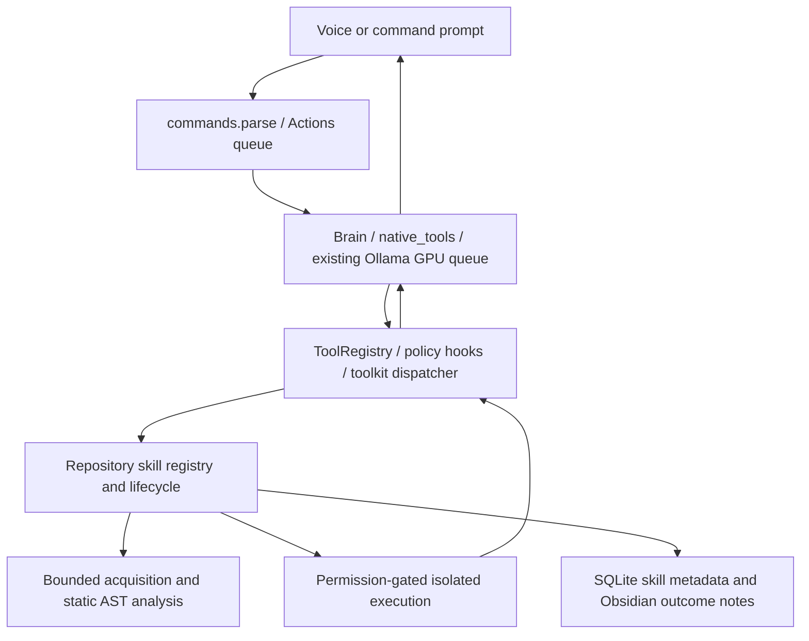

# Repository-derived skills

Architecture inspection and implementation work started 2026-10-09 IST.
The requested `Pasted markdown(20261008-184924).md` was not found in the workspace.
The second user-provided pasted attachment supplies the original implementation
and its Fibonacci/ROI verification example; that is the source analyzed here.

## Existing architecture and integration map



`main.py` owns Tk, audio and shutdown; `jarvis.launcher` owns the supervised
interpreter and recovery snapshots. `Actions` already runs bounded queued tasks
off the UI thread and exposes cancellation and `_approve`. `Brain` performs
bounded sequential planning, observations and fresh checks. `native_tools`
translates Ollama function calls to checked proposals; it never executes them.
`ToolRegistry`, `toolkits`, declarative policy hooks and metadata-only events are
the shared execution boundary. Repository capabilities belong at that boundary,
not inside model inference or Python's host import system.

`SkillMemory` stores guides and verified procedures; `ExperienceMemory` stores
bounded outcome cases; neither is a Python plugin loader. `ObsidianMemory` stores
local notes and an indexed reference catalogue. `ConversationMemory` uses
SQLite for session turns. The memory index uses lexical retrieval; the local
context selector serves conversation context rather than a repository vector
database. Repository metadata therefore uses its own tables and lightweight
indexed retrieval, with short outcome notes through existing memory reporting.
Conversation history, capability knowledge and executable authorization remain
distinct. No model weights are changed.

Existing Git/LocalGithub coding worktrees, native coding tools and approved MCP
providers remain intact. Repository discovery uses bounded Git acquisition and
AST data, not generated executable wrappers. Its jobs use the existing action
worker rather than a new always-running service. Optional dependencies must
never be installed into Jarvis's primary environments.

## Original engine analysis

| Component | Original behavior and defect | Integration design |
|---|---|---|
| CodeEntityVisitor | Generic traversal exposes nested functions/methods as module functions; ignores defaults, positional-only, keyword-only and constructors | Scope-aware static entities and normalized signatures |
| RepoAnalyzer | Deletes an existing clone, accepts broad Git sources, follows a broad source tree, suppresses every parse failure | Immutable bounded snapshots, pinned provenance and explicit diagnostic records |
| SkillSynthesizer | `rstrip('.py')` corrupts module names, generates identifiers/docstrings as Python, collapses types and requires every argument | Exact suffix/package resolution, deterministic IDs, JSON metadata and typed adapters |
| SkillRegistry | Imports generated runners in the host, changes global imports, duplicates schemas and trusts manifests | Persistent versioned state; no imports during discovery or registry reload |
| JarvisAgent | Separate orchestration silently activates everything and equates persistence with learning | Existing router, planner, tool dispatcher, approval UI and memory integration |

Additional defects include import-time code injection through generated
docstrings/paths, absent cancellation/resource/output limits, mutable source after
approval, no license/commit provenance, arbitrary return serialization, missing
dependency checks, malformed manifests, no lifecycle revocation and no actual
isolation. The sample verification only uses one synthetic repository and cannot
establish safe execution of arbitrary public repositories.

Discovery alone is never reported as an executable or successfully validated skill.

## Implemented behavior

`repo_acquisition.py` takes a bounded source snapshot of a canonical public
HTTPS GitHub URL or explicitly named local project. Git hooks, credential helpers,
file/ext transports and checkout are disabled. Source blobs are read as data;
links, secrets, hidden directories and unrelated binary assets are excluded.
Commit and content hashes identify immutable revisions. Failed acquisitions and
old revisions are retained rather than deleting or overwriting existing projects.

`repo_analysis.py` records functions, async functions, methods, constructors,
imports, relationships, defaults, positional/keyword-only parameters, variadics,
package roots, annotations and license/dependency metadata. It excludes nested
functions and quarantines unsupported callable shapes. Docstrings and decorators
are untrusted reference data, never planner instructions. `repository_skills.py`
persists this knowledge, deterministic IDs, state, validation and approval in
SQLite. Updates disable the old revision; rollback requires fresh validation.
Revocation retains source but withdraws execution. Emergency disable interrupts
queued/running invocations through the existing cancellation path.

Candidates start `ANALYZED` or `QUARANTINED`. A user-approved isolated smoke call
must succeed before `VALIDATED`; explicit approval then makes it `ACTIVE`.
Every call still requires approval. Failed executions become `FAILED`; disable
and revoke withdraw approval. Source, image or runner changes invalidate earlier
execution validation. Registry reload reads metadata and verifies source hashes;
it never imports a repository into Jarvis.

Enum names are scoped to their defining module. Analyzer-version refresh updates
cached contracts and withdraws activation until new validation; revoked and
disabled states remain withdrawn rather than being silently resurrected.

`repo_tools.py`, `toolkits.py`, `tools.py`, `commands.py`, `native_tools.py` and
`native_coding.py` connect eight fixed lifecycle tools and up to six relevant
typed active capabilities to the existing dispatcher and Qwen planner. Read-only
sessions cannot obtain execution tools. Existing GPU scheduling handles model
inference; discovered Python runs under bounded CPU isolation, without GPU access.
Obsidian records short outcome notes and answers capability-catalogue questions.
This is persistent capability knowledge, not model training or universal skill mastery.

## Isolation and setup

Docker Desktop's local Linux amd64 engine is required for execution. Static
analysis remains available without it. There is no host or venv fallback.
Build the reviewed runtime from the application directory:

```powershell
docker --host npipe:////./pipe/dockerDesktopLinuxEngine build -t jarvis-repository-runtime:1 integrations/repository-runtime
```

The base image is digest-pinned and dependencies are hash-pinned binary wheels.
Untrusted repositories are not pip-installed. The current reviewed image includes
idna, sniffio and typing_extensions; additional dependency environments require
separate review and rebuilding, followed by capability revalidation.

Each invocation uses an immutable image ID, UID 65534, no network, read-only root
and source, no capabilities, no-new-privileges, 256 MB container memory, 192 MB
address-space limit, half a CPU, 16 PIDs and 5 seconds CPU time. The trusted helper
checks actual cgroups and mounts before imports and installs a syscall filter
denying subprocesses, forks, internet sockets and privilege/namespace operations.
Only source and the trusted runner are mounted. No host home, credentials,
Docker socket or GPU is mounted. Docker proxy injection is overridden and the
environment is cleared before imports. A 16 MB noexec scratch directory supports
temporary data. Calls have a 15-second wall deadline, a 30-second queue bound,
16 KB JSON request and 32 KB JSON response budgets. Cancellation removes only
the unpredictable container created for that invocation; uncertain work is never
replayed. See [Docker security](https://docs.docker.com/engine/security/),
[container limits](https://docs.docker.com/engine/containers/run/) and
[Linux seccomp](https://man7.org/linux/man-pages/man2/seccomp.2.html).

Containers share a kernel: the trusted Docker engine, reviewed image and host
remain part of the security boundary. This does not guarantee protection from
unknown kernel/runtime exploits. Arbitrary native extensions, network services,
subprocess tools, persistent class instances, custom Python objects and writable
host outputs are deliberately outside this execution contract. Unknown annotations
accept bounded JSON; they do not promise custom-object construction. Enum and
built-in collection conversion occurs only inside the approved isolated process.

## Commands and permissions

Say or type `learn repository https://github.com/mahmoud/boltons`,
`show learned repository skills`, `what new abilities did you learn?`,
`repository skill health`, or `disable all repository skills`.
Learning performs static analysis; it does not activate every function.
Start Jarvis with `Start Jarvis.cmd`; click its island to open the command input
and approval controls. `Stop Jarvis.cmd` requests an intentional supervised stop.
Exact command-prompt tool calls can inspect and validate a selected candidate:

```text
tool repository_skill_search {"value":"chunked"}
tool repository_skill_explain {"value":"EXACT_SKILL_ID"}
tool repository_skill_validate {"value":"EXACT_SKILL_ID","content":"{\"arguments\":{\"src\":[1,2,3],\"size\":2}}"}
tool repository_skill_activate {"value":"EXACT_SKILL_ID"}
tool repository_skill_run {"value":"EXACT_SKILL_ID","content":"{\"src\":[1,2,3],\"size\":2}"}
tool repository_skill_lifecycle {"value":"EXACT_SKILL_ID","content":"{\"operation\":\"revoke\"}"}
```

The normal Jarvis approval UI applies to smoke execution, activation and each
call. Enabling a repository/global execution and rollback also require approval.
Disabling is immediate. Removing metadata/source physically is not implemented;
revocation withdraws authority without deleting evidence or user files.
Set `repository_skills.enabled` to false to disable this integration, or use the
emergency command. Configuration lives in `config/config.json`; local state is under
`.jarvis-runtime/repository-skills/`, excluded from Git.

## Actual repository verification — 2026-10-09 IST

[Live trial evidence](../artifacts/reports/repository-skills-live.json) and
[retained trial history](../artifacts/reports/repository-skills-live-history.json) record
actual Actions routing, ToolRegistry dispatch, hardened Docker execution, local
Qwen3.5 9B typed tool selection, registry reconstruction, disable rejection and
revalidation of these three capabilities. Test approvals are restricted to these
repositories by the user's implementation request; production UI approval remains.

| Repository and pinned commit | Static candidates | Actual result |
|---|---:|---|
| [Boltons](https://github.com/mahmoud/boltons/tree/4e5faa3d7e4008d89e0d8bf1ea87b6d9a061a16d) | 508; 450 supported | `iterutils.chunked([1,2,3,4,5], size=2)` → `[[1,2],[3,4],[5]]` |
| [Packaging](https://github.com/pypa/packaging/tree/ea25b7d2befd0068fb3d46b375f6f926f4473472) | 177; 95 supported | `SpecifierSet('>=1.2,<2.0').contains('1.5')` → `true` |
| [AnyIO](https://github.com/agronholm/anyio/tree/159ffdffa5888831b0758bc2a656ff76480a77ca) | 763; 531 supported | Awaited `_core._eventloop.sleep(0.02)` → `null` |

Only those individual capabilities were executable-validated; candidate counts
are static findings. AnyIO initially failed because typing_extensions 4.15 lacked
its required API. The reviewed runtime was repaired to 4.16.0 with a pinned wheel
hash; no repository code or behavioral assertion was changed to obtain success.
Source traversal, import-time attacks, malformed contracts, stale snapshots,
authorization, revocation, lifecycle/update/rollback and native routing have
regression coverage. Real kernel tests additionally cover denied shell/network,
read-only writes, async imports, missing dependencies, memory/output limits,
timeouts/cancellation, environment isolation and enum conversion.

Run `python -m unittest discover -s tests` for regressions, and
`python -m scripts.verification.verify_repository_skills` for the explicitly scoped live trial.
The latter leaves only its three successfully approved capabilities active;
future execution still needs per-call approval. An unavailable isolation backend
is an explicit skip in kernel tests and an execution failure in production.
Final results on 2026-10-09 IST:

| Check | Actual command and result |
|---|---|
| Full regression, including real security checks | `.venv/Scripts/python.exe -m unittest discover -s tests` — **1,241 passed in 227.003 s**, no failures/errors/skips |
| Dedicated engine checks | 19 static/schema/lifecycle tests passed in 1.697 s; ten actual isolation tests also passed as part of the full suite |
| Original routing and guide assertions | 32 toolkit tests and 12 SkillMemory tests passed; assertions unchanged |
| Three real repositories | `.venv/Scripts/python.exe -m scripts.verification.verify_repository_skills` — all three passed in 99.813 s, including actual Qwen selection and memory outcomes |
| Configured readiness | `.venv/Scripts/python.exe -m jarvis.launcher --check` — `ready`; configured Ollama models and LocalGithub available |
| Hidden UI | `.venv/Scripts/python.exe -m scripts.verification.verify_ui` — startup/shutdown passed; microphone and private vault were excluded from this UI check |
| Actual supervised restart | Started the real app through `jarvis_bootstrap.py` after all final checks; fresh running heartbeat and action worker confirmed |
| Persisted execution after restart | `.venv/Scripts/python.exe -m scripts.verification.verify_repository_skills --restart-check` — all three discoverable and original results returned in 13.047 s, without relearning/revalidation/activation |
| Delivery checks | 240 existing local documentation targets passed; 159 authored source snapshots matched; `git diff --check` passed; no running Jarvis-owned skill containers remained |

[Final delivery evidence](../artifacts/reports/repository-delivery.json) records the actual
running/listening app with healthy capture, decoder and action/question/speech
workers after model initialization. This health check does not claim a newly
spoken repository task was validated.

[Post-restart evidence](../artifacts/reports/repository-skills-restart.json) distinguishes
the running production process heartbeat from the fresh Actions test process:
the test does not inject commands into the production UI or claim a voice trial.
Both use the same installed source and persistent registry. The original full
run found a hard-coded nine-guide regression and three repository actions being
classified under publication intent. Guidance was integrated into the existing
coding guide, and production repository intent handling was corrected. Original
assertions remained intact. A new environment test fixture initially treated a
denied home-directory stat as an unexpected exception; the fixture now treats
that denial as blocked access while retaining its empty-environment/no-host-home
assertions. No security boundary or expected repository result was weakened.

| Repository | Restart check | Security status |
|---|---|---|
| Boltons at commit above | Discoverable; returned `[[1,2],[3,4],[5]]` after real app restart | Hardened Docker execution; current source/image/runner validation and scoped call approval |
| Packaging at commit above | Discoverable; constructed class and returned `true` | Same enforced boundary; no host imports |
| AnyIO at commit above | Discoverable; awaited function and returned `null` | Same enforced boundary; dependency repair retained in history |

## Files in this integration

| File | Purpose |
|---|---|
| `jarvis/repo_acquisition.py` | Bounded trusted Git operations, immutable snapshots and provenance checks |
| `jarvis/repo_analysis.py` | Import-free AST intelligence and finite JSON contracts |
| `jarvis/repository_skills.py` | SQLite persistence, lifecycle, freshness and permission-aware dispatch |
| `jarvis/repo_sandbox.py` | Reviewed local Docker admission, limits, cancellation and owned cleanup |
| `jarvis/repo_runtime_runner.py` | Isolated import/call, kernel hardening, typed binding and bounded serialization |
| `jarvis/repo_tools.py` | Eight lifecycle tools, natural commands and bounded active schemas |
| `jarvis/toolkits.py`, `jarvis/tools.py` | Existing tool registration, discovery and dispatch integration |
| `jarvis/commands.py`, `jarvis/brain.py` | Command routing and explicit local repository intent validation |
| `jarvis/native_tools.py`, `jarvis/native_coding.py` | Typed local Qwen calls and native worker routing through existing approval |
| `jarvis/obsidian_memory.py` | Persistent catalogue answers and outcome integration |
| `jarvis/launcher.py`, `config/config.json`, `config/runtime_manifest.json` | Validated configuration, supervised source declarations and runtime contract |
| `integrations/repository-runtime/Dockerfile`, `requirements/runtime.txt`, `dependency-pins.json` | Reviewed isolated image and hash-pinned dependency provenance |
| `skills/project-coding/SKILL.md` | When to use repository tools and their permission/security limits |
| `tests/test_repository_skills.py` | Static/schema, lifecycle, authorization and dispatcher regressions |
| `tests/test_repository_skill_isolation.py` | Actual kernel/container security and execution checks |
| `scripts/verification/verify_repository_skills.py` | Three real repositories, Qwen proposals, persistent memory and post-restart check |
| `artifacts/reports/repository-skills-live.json`, `repository-skills-live-history.json`, `repository-skills-restart.json`, `repository-readiness.json`, `repository-delivery.json` | Dated actual evidence, including retained failed trials and final app health |
| `.gitignore`, `README.md`, `../README.md`, `docs/repository-skills.md` | Local log exclusions, usage, engineering report and overview |

Earlier native coding changes, user worktrees, unrelated integrations and approved
Git untracking remain preserved. No credentials were copied from Codex plugins,
no Firecrawl key was added, and repository source/state remains local and ignored.
This update adds no visual UI component; approvals use the existing Jarvis UI,
so there is no new screenshot or fabricated rendered preview.

Fully tested behavior includes static Python analysis, typed built-in/enum JSON
calls, methods with constructor arguments, async calls, versioned persistence,
isolated execution, local Qwen selection and disable/revalidation. Other static
candidates are unvalidated. Live voice selection of these new capabilities has
not been measured; integration trials use Jarvis's actual command/router and
Actions dispatcher. Universal repository support, automatic dependency installation,
custom-object transport, trained weights, remote/private Git acquisition and
host-output promotion are unsupported. Per-repository dependency environments,
vector retrieval and richer project-specific adapters are deferred improvements.
