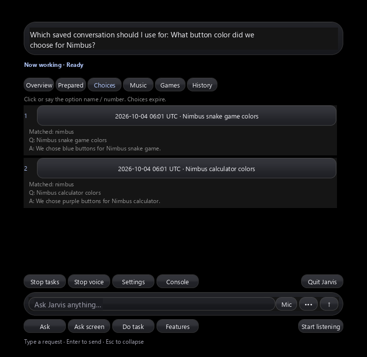

# Session memory and background context selection

Updated 2026-10-04. Jarvis retains paired questions and completed answers for
each conversation, searches saved conversations when the current one does not
resolve the request, and lets you choose between ambiguous memories inside the
existing island. The free local context selector is **Qwen3.5 0.8B**. Its job is
only to select context; the configured Qwen3.5 9B planner/answer model still handles
planning and answers. Voice cleanup continues to use its separate 0.5B model.

## How to use it

Ask about a topic, then ask a follow-up such as “explain it more.” Relevant older
turns and recent turns in the current session take priority. After a restart or
“forget our chat,” name a remembered topic. “Forget our chat” starts a new session
and clears active context; it does **not** delete saved sessions.

When several saved sessions match, the Choices view shows each date, question,
answer excerpt and matching keywords. Click the glass option, or say its number
or listed name. The original question resumes with only that selected context.
The selection is consumed once, and subsequent follow-ups retain that context.
Stop, a newer question and the choice expiry invalidate stale selections.



This preview uses Jarvis's actual off-screen Tk widgets and authored Nimbus
calculator/game examples. Dropdown selection and glass-button press/release
events were checked. Expansion now preserves interactive control focus so a
clicked dropdown or input is not displaced by automatic composer focus.

## Storage and retrieval

Full question/answer pairs are retained in
`.jarvis-runtime/conversations.sqlite3`, a local SQLite database with FTS5 search.
It is excluded from Git. No new Python package is required. Back up the database
while Jarvis is stopped; moving the application without its runtime folder does
not carry conversation memory. Existing Obsidian observations remain a secondary
source when paired-session search finds nothing.

Every completed question response, including quick answers and task-status
answers, extends RAM session history and the durable session. Finished managed
task/code-task replies also record their goal/result pair. Pending, failed,
cancelled and expired question turns are not retrieved as completed answers.
Interim tokens and UI notices are not stored as completed Q&A. Sessions are
created on application start and on “forget our chat”; there is no retention
expiry. The existing sensitive-text matcher redacts an entire saved question or
answer when it detects credential-related text. This matcher is heuristic and
also applies to ordinary discussions containing such terms.

The full database is searched lexically; at most eight recently matching sessions
become candidates, with one representative match per session. A selected saved
match supplies its nearby completed turns. Current-session projection retains
up to eight relevant older pairs plus four recent pairs, in chronological order.
Full disk text remains available, but prompts use excerpts: the default retrieval
budget is 24,000 characters, further reduced for the question model's configured
window (6,144 history characters for the default 4,096-token window). This is a
conservative character estimate, not exact token counting. Long code, synonyms
and pronoun-only references across restarts can require a more specific request.
There is no semantic embedding index or automatic factual verification of old
answers.

## Background model flow

### Live app context for follow-up tasks

Jarvis keeps volatile context for the foreground/last external window and up to
eight recently observed windows. Its existing 300 ms window tracking loop updates
the active app, while planner requests check window existence/identity again.
Handle, process ID, process start (when readable) and window class help detect
closed or replaced windows. This describes **window** lifecycle: closing one
window does not prove an application's entire process or other windows exited.
Desktop/taskbar and Jarvis's own windows do not become task targets.

Accessible control observations from the existing UIA worker extend this context
with names, roles, grouping and selection/toggle state. Values, password controls,
coordinates and executable control IDs are excluded. A bounded reference includes
up to 40 controls; earlier app windows retain status summaries. Title changes,
closure, replacement, hidden windows and failed refreshes clear offered controls.
Control observations have an age and remain reference data. This cache is kept
in RAM, rather than treating yesterday's UI as available today.

Planner/code requests receive `live_app_context` independently of the selector's
completion. Pronoun follow-ups can add the open window title to the **retrieval
query** and supply it separately to the context selector; the original user
command is preserved. Closed-window titles do not enrich retrieval. Switching
apps or closing the window invalidates cached selector results for the same
request. Relevant questions refresh the current app's accessible controls on
the question worker. Direct named clicks and field entry use the existing coded
UIA/execution adapters: supported commands bypass Qwen, re-enumerate controls,
validate the exact fresh target and issue input once. General tasks retain fresh
observations between steps. A closed app is not silently relaunched for a
follow-up. Ambiguous intended apps require clarification.

Accessible labels describe only exposed, visible/enabled controls, not every
possible app function. Hidden menus, custom canvases, elevated apps and changing
web pages can require discovery or existing visual fallback. App context adds no
extra model or polling thread. A generic click may remain marked unverified even
when a label changes: a changed UI alone does not establish an arbitrary downstream
goal, so uncertainty remains paused without replay.

The [owned native app check](../artifacts/reports/live-app-context-check.json) exercised
Apply → Applied 1 → Applied 2 through two coded click commands, verified exactly
two clicks independently with zero model calls, closed the fixture, and confirmed
that both a follow-up click and an old control target were blocked. This checks
one authored native app, not all installed applications. Window switching,
identity replacement, hidden/changed UI, password exclusion, failed refresh,
planner delivery and local app answers also have regression coverage.

The bounded `Jarvis context selector` daemon thread starts when context work is
requested. Preparation begins when an answer/task is submitted. It first checks
the current session and retrieves small saved-match excerpts. Current-session
matches and a single saved candidate bypass model inference. Multiple candidates
with a distinctive leading keyword match can be checked by the 0.8B model.
Tied or weak matches remain explicit island choices.

The model receives only the task text and candidate excerpts, with short labels
`a` through `h`, and returns schema-constrained JSON. A validated label maps back
to the exact stored turn. It cannot execute actions, answer the question, rewrite
the command or invent a context ID. A model choice is accepted only when it agrees
with a unique lexical lead of at least two matching keywords. Model failure,
unknown output and weak matches preserve choices.

The main planner's context provider never waits for this thread. Ready output is
attached to `memory_context.conversation` on plan, replan, next-step and code
planning/editing requests; output finishing later becomes available on subsequent
requests. The question worker can wait up to three seconds before falling back
to deterministic retrieval/choices. Historical context is reference data and
does not authorize replaying a task or replace fresh desktop observations.

Selector inference uses CPU, four threads, a 2,048-token window, 32 output tokens,
temperature zero and thinking disabled. Requests have a three-second wall-clock
budget, a two-job queue and 30-second retry backoff. Its watchdog has bounded
recovery; shutdown cancels jobs and never restarts an intentionally closed
selector. Storage faults preserve RAM context, log a throttled repair notice and
leave the original file in place. If initial database opening fails, disk memory
requires repair and an application restart; later database operations retry on
later requests.

## Model choice and limits

The [Ollama package](https://ollama.com/library/qwen3.5:0.8b) is about 1.0 GB,
Q8_0, under Apache 2.0; [Qwen's model card](https://huggingface.co/Qwen/Qwen3.5-0.8B)
documents the model. This is the selected balance among three locally measured
models, not a universal fastest/most accurate claim.

Eight authored classification fixtures were measured on this PC on 2026-10-04:

| Model | Raw model correct | Guarded outcome correct | Warm median |
| --- | ---: | ---: | ---: |
| Qwen2.5 0.5B | 3/8 | 6/8 | 0.625 s |
| Qwen3.5 0.8B | 5/8 | 8/8 | 1.984 s |
| Qwen2.5 3B instruct | 5/8 | 8/8 | 2.000 s |

Both larger candidates got the five specific-topic cases right, but guessed on
vague/unrelated cases. The guarded result includes manual ambiguity and no-match
decisions, rather than claiming perfect LLM accuracy. The small difference in
0.8B/3B median is not statistically significant; the smaller package is the
reason to prefer 0.8B at comparable fixture accuracy. The comparison harness used
nonstream responses; production uses bounded streaming JSON transport.

A production background fixture selected the calculator context in **1.437 s**;
its initial planner context call returned immediately. A later app-aware follow-up
also selected the calculator in **0.235 s** with a warm model and cached prompt
prefix; this repeated-prefix figure is not representative cold/uncached latency.
The unmodified request was “Improve multiplication in that app,” accompanied by
separate authored open-calculator metadata. Earlier runtime pilots
hit the three-second deadline and retained both options; cold loading, UUID
output length and shared-server contention were investigated, and the final wire
uses compact labels. Cold or busy requests can still fall back to choices.
Models share CPU/RAM and the Ollama scheduler; a Python thread does not prove
simultaneous inference or faster full tasks. See [Ollama's concurrency FAQ](https://docs.ollama.com/faq).
No global Ollama parallelism setting was changed, and no paid API is required.

## Configuration and verification

In [config/config.json](../config/config.json):

```json
"context_selector": {
  "enabled": true,
  "model": "qwen3.5:0.8b",
  "timeout_seconds": 3.0,
  "backoff_seconds": 30.0
}
```

`memory.conversation_sessions` enables durable storage, sets
`context_characters` (default 24000), and `choice_seconds` (default 300).
Disabling the selector retains deterministic session retrieval and manual
choices. Disabling conversation storage retains active RAM history and existing
Obsidian fallback. The configured model is installed here; on a new machine use
`ollama pull qwen3.5:0.8b` or the normal Jarvis brain setup. Restart using the
normal Stop/Start Jarvis launchers to load source/configuration changes.

Evidence is deliberately separated:

- [Model comparison](../artifacts/reports/context-model-check.json): eight authored
  text fixtures per model; no microphone recordings or task execution.
- [App-aware production selector thread](../artifacts/reports/context-runtime-check.json),
  [simple selector fixture](../artifacts/reports/context-runtime-simple-check.json),
  [cold app-aware timeout/fallback](../artifacts/reports/context-runtime-app-cold-check.json), and
  [earlier UUID runtime pilot](../artifacts/reports/context-runtime-uuid-pilot.json):
  actual loopback model transport, temporary authored sessions and ready planner
  consumption; no simultaneous-inference speed measurement.
- [Live island selection and follow-up](../artifacts/reports/session-context-live-check.json):
  actual native glass-button events resumed the original question once, answered
  “purple” from the chosen calculator session, retained it for the next answer,
  and saved both pairs. The competing game memory said “blue.” These are authored
  local model checks, not a real user recording or desktop task.
- [Regression and launcher readiness](../artifacts/reports/session-context-regression-check.json):
  **929 tests passed and launcher status `ready` on 2026-10-04**. Tests include restart/search, full-text persistence,
  current-session priority, selector validation, backoff/cancellation/shutdown,
  stale/duplicate clicks, dropdown events, storage faults and planner delivery.
