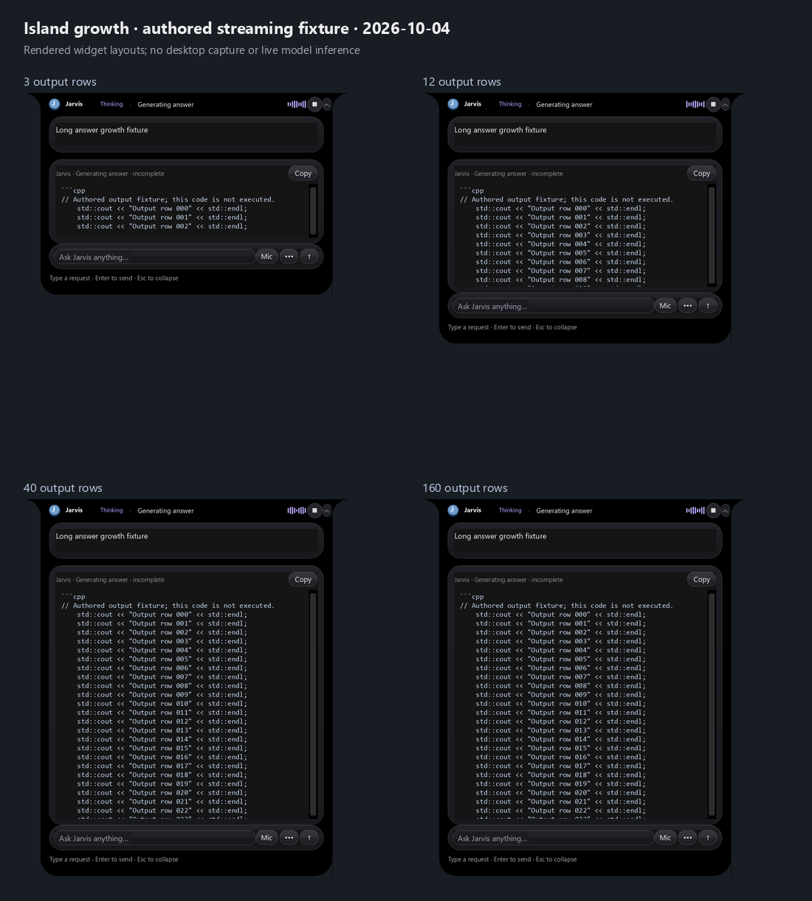

# Smooth island growth during long output

Updated **2026-10-04, Asia/Kolkata**.

Streaming updates previously called `show('Overview')` for every partial answer.
That method unpacked every feature frame, repacked the answer view, restyled
navigation controls and refreshed the text again. The panel also reapplied its
placement every animation tick, and crossed a separate 320-pixel layout threshold
while growing. These unnecessary transitions could make a long answer look like
the island was repeatedly rebuilding itself.

The answer view now stays mounted for the entire stream. Text appends in place;
navigation occurs only when the selected view changes. The existing animation
extends the same shell as content grows, up to **710 logical pixels** or the
available screen height, whichever is smaller. Further output scrolls inside the
answer card. Physical dimensions follow Windows display scaling.

The island remains open through gaps between tokens. Replacing a draft during
web verification or finishing with shorter text retains the height already
reached for that answer. Escape and the collapse control still hide it, and later
tokens do not override that choice. Reopening or beginning a new answer can
resize the island again.



Panel placement and glass-card rendering now skip unchanged dimensions. Layout
and feature chrome only update when their state changes; entering workspace mode
does not rebuild the layout again at an intermediate height. Question wrapping
uses the incoming panel width rather than the previous geometry frame. If you
scroll back during generation, appending text preserves the same reading line
instead of holding a scroll fraction that drifts as the document grows.

No dependencies, services, model settings or inference deadlines changed in this
update. The normal launchers, runtime manifest and recovery snapshots remain
compatible. **Restart Jarvis through its normal Stop/Start launchers** to load it.

## Verification

- [UI replay](../artifacts/reports/island-growth-ui-check.json): **160 authored output
  chunks**, **7,742 characters**, and **497 animation frames** through the real Tk
  island off-screen. **Zero answer-view unmounts and zero streaming layout
  rebuilds**; widget identities were preserved, measured window height never
  decreased, and the island stayed visible after the temporary caption expired.
  This is a controlled UI replay, not live Ollama inference, microphone input,
  a desktop screenshot, or a guarantee for every Windows/compositor configuration.
- [Regression/readiness](../artifacts/reports/island-growth-regression-check.json):
  **864 tests passed**, and launcher readiness returned **ready**, with no missing
  requirements. New tests cover mounted-view reuse, unchanged placement, one
  workspace layout across growth, incoming-width wrapping, stream pauses,
  replacement/final height retention, explicit collapse and stable reading lines.
- The four image stages above come from the authored widget fixture. They use one
  common image scale so the height change can be compared without implying a
  width change. No unrelated desktop content was captured.

Reproduce from the application directory:

```powershell
.venv/Scripts/python.exe -m scripts.verification.verify_island_growth
.venv/Scripts/python.exe -m scripts.verification.verify_island_growth --regression
```

Implementation: [island lifecycle and size](../jarvis/island.py),
[stable answer view and scrolling](../jarvis/island_desk.py),
[embedded panel and cards](../jarvis/notch_widgets.py), and
[layout](../jarvis/interface.py). The earlier
[streaming-answer measurements](streaming-answers.md) remain historical inference
results; this update measures display behavior separately.
