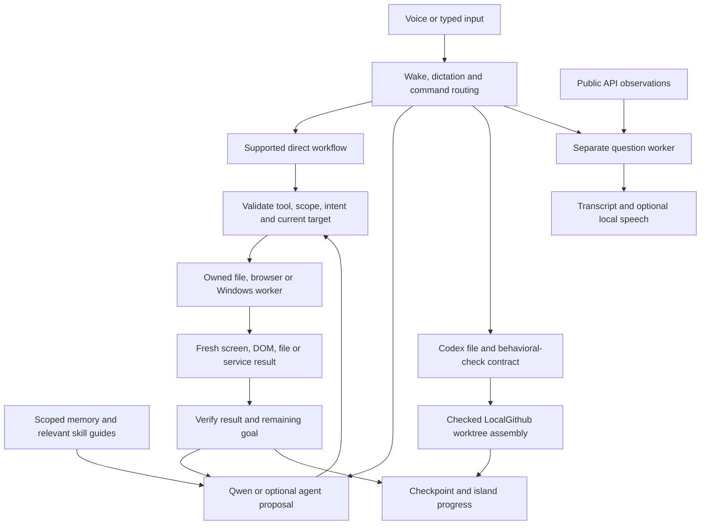
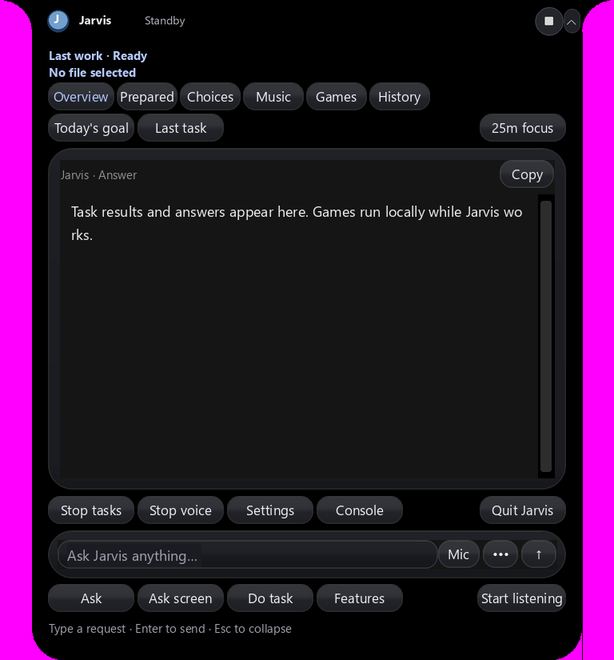
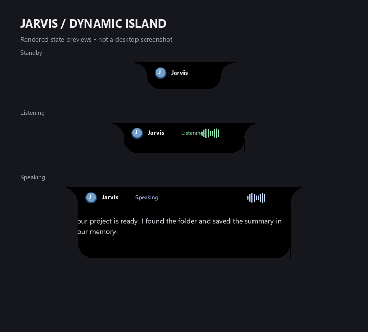

# Jarvis system audit — 2026-10-07 IST

This audit inventories the authored application and related installations,
checks their connections, repairs reproduced failures, and records verification
limits. Jarvis's intentional stop marker was present and preserved during the
initial audit. The operator subsequently authorized live microphone/playback
testing and partial GPU tuning; those results are recorded separately in
[production validation](production-validation.md). No account messages, remote
pushes or user-file deletions were performed. Existing workspace edits are preserved.

## Inventory and actual execution paths

[The file-by-file inventory](../artifacts/reports/repository-audit.json) contains paths,
sizes, SHA-256 hashes, Python symbols/imports and incoming references. It checks
all authored Python syntax and optionally runs Pyflakes. Import reachability is
evidence of a connection; a missing static reference is **not** proof of an
unused file. Entry points, subprocess workers, file-driven templates and optional
backends can be loaded dynamically. Private runtime state, model weights,
environments, upstream checkouts and generated artifacts are retained as groups.
This is a static inventory plus the feature checks below, not a claim that every
line has been manually reviewed or every possible user workflow exercised.



| Component | Connected implementation and role |
| --- | --- |
| Start, stop and recovery | `Start Jarvis.cmd`, `Stop Jarvis.cmd`, `jarvis_bootstrap.py`, `jarvis/launcher.py`, `config/runtime_manifest.json`, `jarvis/recovery.py` and `jarvis/model_recovery.py`. The supervisor tracks owned processes and respects intentional stops; missing configured models have bounded background restoration. |
| Voice and routing | `main.py`, `audio.py`, `whisper_backend.py`, `engine.py`, `commands.py`, `command_cleanup.py` and `names.py`. Whisper produces partial/final text, wake gating and dictation route it, and exact supported commands take direct paths. Cleanup uses the small configured model; it does not authorize execution. |
| AI planning and questions | `brain.py`, `brain_worker.py`, `grounding.py`, `knowledge.py`, `knowledge_worker.py`, `model_selection.py` and `inference_limits.py`. Current planning, decisions, vision and general answers use local Qwen3.5 9B; Whisper uses the GPU. Completed observations guide subsequent steps. |
| Tool and skill selection | `tools.py`, `capabilities.py`, `context_selector.py`, `skill_memory.py`, `hermes_skills.py`, `memory_index.py` and the nine bundled guides. There are 85 registered tools, 64 configured at this check, and 210 pinned Hermes reference guides with 1,090 resources. References are guidance; platform requirements and available handlers still gate execution. |
| Screen control | `ui_transport.py` owns a persistent `ui_worker.py`; `ui_controls.py`, `desktop_actions.py`, `execution_router.py`, `execution_adapters.py` and reviewed `upstream_windows_patterns.py` supply UI Automation and bounded native input. `screen_worker.py` captures a selected destination; visual fallback modules provide a separate checked path. Fresh window/process/control identity is required before input. |
| Browser and media | `browser_automation.py`, `browser_worker.py`, `fast_workflows.py`, `media_commands.py`, `media_ui.py` and `spotify.py`. Owned browser DOM checks and source-specific Windows media checks verify supported operations. Installed/logged-in apps remain prerequisites. |
| Coding, Codex and LocalGithub | `coder.py`, `codex_code.py`, `codex_proxy.py`, `codex_files.py`, `codex_validation.py`, `codex_browser_check.py` and `codex_workload.py`. Installed Codex uses isolated settings and the local 9B model; exact allowed files, backups, behavioral checks and cancellation bound writes. LocalGithub's public `gitops` utilities assemble checked worktrees locally, independently of hosted Gitea/controller review. |
| Optional agent backends | `harness.py`/`harness_worker.py` and `hermes.py`/`hermes_worker.py` use separate environments. Harness SDK runs behind an owned loopback gateway; Hermes exposes the plan-submission boundary. Jarvis validates their proposals through its normal execution rules. Legacy Claude Code/direct-Qwen adapters remain selectable and covered by regression tests. |
| UI and speech | `main.py`, `island.py`, `island_*`, `notch_widgets.py`, `ui_preview.py`, `speech.py` and `kokoro_speech.py`. The native Tk notch shows status/progress, controls, answers and approvals. Current English speech is Kokoro `af_heart`; Hindi uses Piper. See [UI controls](voiceos-notch.md). |
| Files, projects, memory and APIs | `catalog.py`, `folder_lookup.py`, `projects.py` and its `project_memory.json` state, `task_state.py`, conversation/experience memory, `toolkits.py`, `mcp_bridge.py`, `realtime.py`, `realtime_catalog.py` and `realtime_sources.py`. Stored state informs fresh operations; credentials and account configuration remain separate. The public realtime catalogue has 82 adapters. |
| Training, examples and provenance | Setup/download/export/train scripts, `examples/`, `integrations/`, model manifests, source licenses and referenced artwork support setup, optional training, fixtures or attribution. They are connected assets even when not loaded by every normal task. They were retained. |

The current model inventory is `qwen3.5:9b`, local coding alias
`jarvis-codex-qwen3.5:9b`, `qwen3.5:0.8b` for context selection and
`qwen2.5:0.5b` for cleanup/realtime reading. Laya remains an advisory selector in
its separate brain environment. The current default task budget is **20**,
configurable from 1–40; a verified result is required between actions.

Brain model inference and Laya use CPU. Following the authorized live production
check, question inference uses 12 GPU layers; its measured allocation and limits
are in [production validation](production-validation.md). The separate Codex alias currently
sets `num_gpu: 20` and `num_ctx: 32768`; coding can therefore use partial GPU
offload and share hardware with Whisper. Smaller component contexts override
the default where supported. Successful fixture checks do not establish latency
or memory behavior under simultaneous microphone, vision and coding load.

The desktop execution order is UFO → Windows-MCP → CUA → Open Computer Use →
Agent-S, using reviewed native primitives, rather than running all upstream agent
frameworks. A provider may fall through only before dispatch. After uncertain
input, Jarvis observes and pauses without replay. Supported desktop shortcuts
come from `desktop_actions.SHORTCUTS`: Tab/Shift+Tab, Escape, Ctrl+A/F/L/S,
Ctrl+Shift+S, Ctrl+C/V/Z/Y, Alt+Left/Right/F/E, arrows, Home/End, PageUp/PageDown
and F5. Named dialog controls are required for submission/confirmation. Other
specific Windows/browser recipes are described in the
[493-command guide](windows-commands.md); recipe availability does not establish
that an optional app is installed or authorized.

[Related-installation inventory](../artifacts/reports/audit-related-installations.json)
checks 26 LocalGithub source/test/script/document files, including syntax of all
19 Python files. `D:/jarvis_voiceos` is an installed Electron application and UI
reference, not the Jarvis Python runtime. Its executable, DLLs, resources,
uninstaller and licenses are connected installation files and remain intact.

## Reproduced failures and repairs

1. **False readiness:** `--check` previously validated installed dependencies
   while configured Ollama models could be missing. It now checks the local model
   inventory and the configured LocalGithub Git bridge, reporting missing or
   unavailable services. `--offline-check` explicitly reports
   `dependencies_ready` with scope `installed_dependencies_only`. Both retain
   the launcher's existing source/config preflight and backup behavior; the
   configured-service probe itself neither loads models nor repairs services.
2. **Model restoration stopped on a partial cache:** incomplete candidate layers
   now preserve the cache and allow another valid root or a resumable pull.
   Corrupt digests still fail closed. Current Ollama manifests also contain
   small downgrade-retention anchor descriptors. Jarvis verifies their kind,
   size, JSON schema and digest before ignoring their non-weight metadata.
   See Ollama's [anchor writer](https://github.com/ollama/ollama/blob/main/manifest/manifest.go)
   and [model-layer loader](https://github.com/ollama/ollama/blob/main/server/images.go).
   Actual setup restored the missing `qwen3.5:0.8b`; all configured models are now
   listed by the active server.
3. **UI verification could start runtime activity:** the hidden verifier now
   sets isolation before importing `main`. It does not publish an inherited
   supervisor heartbeat, start watchdog/model repair, listen, resume a task,
   save settings or change the intentional stop marker. Regression checks verify
   inherited autolisten/resume/supervision flags and byte-preserved user state.
4. **Screen capture could select Jarvis through a Windows venv redirector:**
   question and task callers now pass their actual process ID to the capture
   worker. Selection excludes that owner as well as the worker and its immediate
   parent. A mocked redirector regression verifies destination selection.
5. **Codex edit plans omitted sole-worker test ownership:** a plan that already
   declares a Python/Node test and assigns its check to one independent worker
   now adds that test to the worker's file list before strict validation. It
   declares no new files and never redistributes multi-worker ownership. The
   receipt records completed test paths. Actual code still comes from Codex.
   A subsequent live trial incorrectly split one Python implementation from its
   behavioral tests. Explicit single-module Python requests now constrain the
   planner's task schema to one worker; broader projects keep their normal
   workload graph. Rejected plans and source snapshots remain inspectable.
6. **Optional live verifiers used obsolete model names:** Harness/Hermes checks
   now use the installed configuration instead of hardcoding Qwen3.5 4B.
7. **Harness mixed clarifications with actions:** a configured live YouTube
   planning check reproduced a proposal containing both a question and a browse
   action. Its unconstrained output shape also encouraged unrelated file-folder
   questions. The model-facing schema now separates actionable plans,
   clarifications and completed replans into exclusive branches; folder
   requirements apply only to file operations. Runtime validation remains strict.
   [Twelve positive/negative branch cases](../artifacts/reports/audit-harness-schema-check.json)
   passed an independently installed JSON Schema validator, and 16 Harness fault/ownership tests passed. The broader
   brain verifier also now supplies the registered tools its backend requires.

The live Codex retest exposed a separate generation limitation: a model-added
demo print changed CLI output while its generated arithmetic tests passed.
That failed trial is retained in
[Codex live history](../artifacts/reports/codex-code-live-history.json). The verifier now
explicitly requires unchanged CLI output in generated behavioral tests and
reports stdout/exit details on failure. This does not establish universal
correctness of generated tests or instruction following.

## Cleanup decisions

Removed only the obsolete `jarvis/orb.py` renderer, its matching recovery-source
copy and its Python 3.10 bytecode. The renderer had no import, subprocess or
filename-driven consumers; active UI paths use HUD/island/notch modules.
Upstream resources, optional adapters, training scripts, dynamically loaded
examples, models, existing generated evidence, user files and memory were
retained. No unrelated folder or shared software installation was deleted.

## Verification evidence and boundaries

All fresh checks below are dated 2026-10-07. Older linked measurements retain
their original dates and scope.

| Check | Evidence and scope |
| --- | --- |
| Jarvis regression | **1,132 tests passed in 293.133 seconds** in the [final suite log](../artifacts/logs/audit-final-tests.log), including injected faults, ownership/cancellation, recovery, UI isolation and owned browser/runtime checks. |
| Configured readiness | [Final launcher result](../artifacts/reports/audit-final-readiness.json): `ready`, no missing models/dependencies, local Git available. It does not certify every external API/account or optional native compiler. |
| Static source and documentation | [Inventory](../artifacts/reports/repository-audit.json): all authored Python parses; 332 Python files checked by isolated Pyflakes with zero correctness errors and 79 unused-import/local-variable warnings. Warnings remain recorded; imported modules can provide compatibility exports or side effects, so they are not automatic deletion authority. All authored README/guide relative file targets checked; external URLs and anchors are outside this checker. |
| Tools and skills | [Configured routing](../artifacts/reports/runtime-capabilities-check.json): seven cases passed, nine local guides without errors, 85 tools/64 configured. [Hermes checksums](../artifacts/reports/audit-hermes-skills.json): all 210 guides and 1,090 resources verified; unsupported-platform guides remain references. |
| Native screen inputs | [Owned execution fixture](../artifacts/reports/execution-native-check.json): all five providers, single dispatch, supported input/readback, persistent transport, cancellation and cleanup passed. This fixture operates its own windows, not arbitrary elevated/custom apps. |
| Windows recipes | [Command results](../artifacts/reports/windows-command-live-check.json): all 493 recipes inspected, 238 PowerShell recipes parsed, owned file/DOM/native fixture checks passed. It did not run every recipe against the user's apps or data. |
| Hidden UI | [Verifier log](../artifacts/logs/audit-ui.log): actual Tk startup/shutdown and rendered previews passed without microphone or background repair. Preview export is not a screenshot or interactive usability benchmark. |
| Whisper | [Synthetic audio result](../artifacts/logs/audit-whisper.log): installed CUDA `int8_float16` medium.en decoded the 6.22-second fixture in approximately 0.66 seconds; streaming/final routes matched. No live microphone or user command execution. |
| Speech | [Piper synthesis](../artifacts/logs/audit-speech.log) and [Kokoro result](../artifacts/reports/kokoro-voice-check.json): actual nonempty local English/Hindi synthetic audio. Kokoro produced 8.768 seconds at 24 kHz; no speaker playback or subjective quality rating. |
| Codex | [Latest actual create/edit result](../artifacts/reports/codex-code-live-check.json) **passed**: owned Python fixtures, actual Read/Write/Edit, guarded saves, original backup, generated behavioral checks and unchanged `5` CLI output. Nine adapter requests used disabled thinking. [Earlier failures](../artifacts/reports/codex-code-live-history.json) remain recorded. General application generation and all native languages remain broader than this test. |
| Harness | [Actual SDK/local-model result](../artifacts/reports/harness-local-check.json): planning, completed-goal replanning and read-only source explanation all passed with configured Qwen3.5 9B. Observations were synthetic; returned actions were never executed. SDK/profile readiness was checked separately. |
| Hermes | [Actual local-model result](../artifacts/reports/hermes-readonly-check.json): plan and completed-goal replan passed with Qwen3.5 9B. Its normal configured desktop planning flag remains disabled; this was an explicitly isolated verifier. |
| Brain roles after repair | [Final configured-model check](../artifacts/reports/audit-brain-complete-live.json) and [actual output](../artifacts/logs/audit-brain-complete-live.log): eight checks passed covering Laya selection, web/file/music proposals, matching-control approval, unrelated-deletion rejection, incomplete-goal rejection and synthetic screen interpretation. Proposed file/media actions were not executed. Earlier missing-catalogue and mixed-proposal failures remain in the audit logs. |
| Questions and cleanup | [Actual transport checks](../artifacts/reports/audit-question-cleanup-check.json): the configured question worker answered English arithmetic correctly; four actual small-model cleanup proposals preserved the allowed edits, negation and dictation text. No commands were executed. |
| Restored context model | [Actual background selector](../artifacts/reports/context-runtime-check.json): `qwen3.5:0.8b` selected the intended authored saved conversation in its own worker, while planner consumption remained nonblocking. Fixture preload was 6.875 seconds; selection was 2.078 seconds after preload. These exclude cold-start performance and simultaneous-model throughput. |
| LocalGithub | Its complete pytest suite passed **31 tests**, with one Starlette deprecation warning. [Service lifecycle](../artifacts/reports/audit-localgithub-services.json): owned Gitea/controller start, health and stop passed; restored stopped state. Jarvis uses the separately checked public local Git layer. No hosted task/review, account write or remote push was performed. |
| Public APIs | [Full 82-adapter probe](../artifacts/reports/realtime-live-check.json): **66 ok, 10 unavailable, 6 needing configuration** at that probe. [Supplemental reads](../artifacts/reports/audit-provider-recheck.json) later reached the documented dictionary `hello` sample and Open Notify. Availability is time/query-specific; the original full-probe totals remain unchanged. Bluesky search remained 403, SpaceX 525, WorldTime connection-reset, and other failures include timeouts/rate limits. Five endpoints/feed deployments and the Countries free-plan key remain operator setup. |

The full API probe deferred its small background model reader while foreground
model work was active. That is a resource guard, not fresh reader inference
validation; earlier reader evidence retains its own context. API rejections and
missing operator configuration were not bypassed with credentials, alternate
paid services or invented successful results.





Live microphone/echo behavior, logged-in Spotify playback, real account sends,
all third-party MCP servers, elevated/custom applications, full-stack model
generation and every C/C++/C#/Java toolchain are not certified by these checks.
The earlier full-stack generation failures remain documented in
[coding verification](codex-code-local.md). Current readiness and fixture success
do not make Jarvis a universally production-ready autonomous operator.

## Repeat the audit

From the application directory, use the installed `.venv` interpreter:

```powershell
.\.venv\Scripts\python.exe -m pip install --target .jarvis-runtime/audit-tools -r requirements/audit.txt
.\.venv\Scripts\python.exe -m scripts.audit.audit_repository --static
.\.venv\Scripts\python.exe -m unittest discover -s tests -v
.\.venv\Scripts\python.exe -m jarvis.launcher --check
.\.venv\Scripts\python.exe -m jarvis.launcher --offline-check
```

`requirements/audit.txt` pins optional Pyflakes separately; normal runtime does
not require it. Socket/browser/native fixture tests need a normal local Windows
execution environment. A sandbox blocked localhost socket acceptance during the
first run; the complete suite was then run outside that restriction. This was
an environment constraint, not hidden as an application pass or failure.
