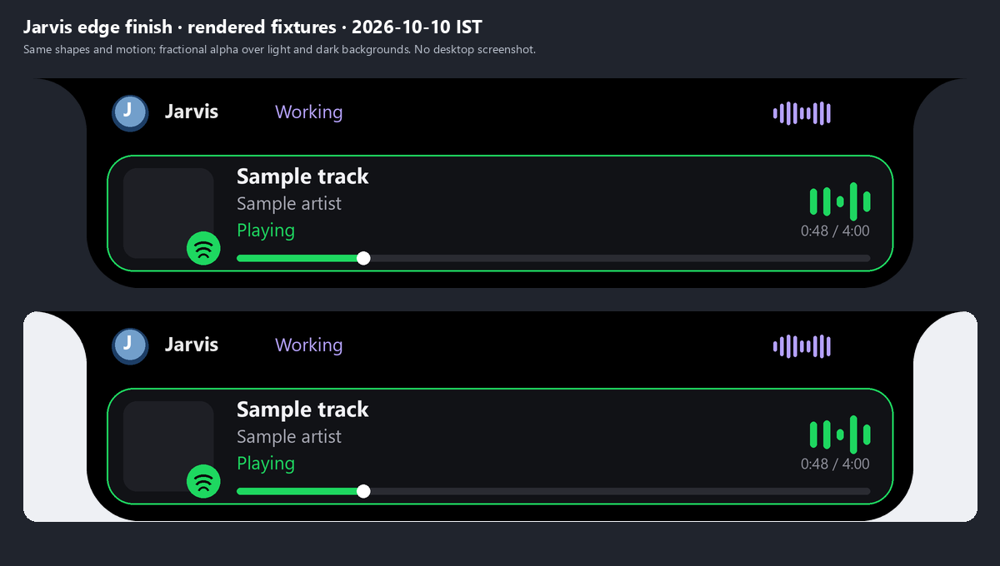

# Island edge finish and animation pacing

Updated 2026-10-10 IST. The existing notch, glass controls, layout, colors, equalizers,
shimmer, artwork, progress indicators and 340 ms quartic size animation are retained.
This repair changes how those pixels are rendered and scheduled.



This is an authored 200% renderer preview with sample track text and no album artwork.
It is not a desktop screenshot or evidence of Spotify playback. The existing design
references and artwork attribution remain in [Dynamic Island](dynamic-island.md),
[glass notch](voiceos-notch.md) and [asset attribution](../jarvis/assets/README.md).

## What changed

- Fixed the inclusive mask bound that left a one-pixel vertical tail alongside the
  bottom curves. The corrected silhouette is symmetric at 100%, 125%, 150%, 200%
  and 300% scale.
- Windows blends fractional edge coverage through an owned native alpha layer.
  Tk draws the fully covered interior, so neither magenta fringe nor a sharp binary
  edge is blended into the desktop. The helper contains only black edge pixels:
  it does not capture or sample the desktop, has no taskbar entry, cannot activate,
  and passes input through to the existing root and its controls.
- Reuse curve tiles, fitted text, text rasters and static header/media artwork.
  Settled frames repaint only the waveform, meter and progress regions; the tall
  workspace keeps its mounted native controls and redraws only its header. Animated
  warning artwork and call rings retain their existing full artwork rendering.
- Active frames follow the monitor refresh rate detected at the first display tick,
  bounded to a 60–144 fps target. Frame deadlines include rendering time. Missed
  slots are skipped instead of adding a catch-up burst or another full interval of
  delay. Truly idle/reduced-motion polling uses 20 fps, and the old 24 fps phase
  quantization is removed.
- Morph dimensions stay fractional until physical-pixel rounding. This avoids
  logical-pixel steps at higher Windows scaling. Activity captions end before the
  waveform, preventing text overlap. Canvas borders are explicitly disabled.
- Paused, finished and not-started games avoid redundant frame uploads. Explicit
  game clicks, restart and pause still redraw immediately. Live games use the same
  engines and time steps.

No dependencies, model changes or background services were added. The existing
`ui.opacity` and `ui.reduced_motion` settings remain supported. All interactive
content still belongs to the same Tk root. The native edge helper is destroyed and
its bitmap/DC released on shutdown; compositor failure disposes it and falls back
to the corrected color-key silhouette without restarting UI or repeating actions.
The 1 ms Windows timer request is balanced at shutdown.

The compositor uses Microsoft's [UpdateLayeredWindow](https://learn.microsoft.com/en-us/windows/win32/api/winuser/nf-winuser-updatelayeredwindow)
and [input-transparent/non-activating window styles](https://learn.microsoft.com/en-us/windows/win32/winmsg/extended-window-styles).
The timer request follows [timeBeginPeriod/timeEndPeriod](https://learn.microsoft.com/en-us/windows/win32/api/timeapi/nf-timeapi-timebeginperiod).
Windows can still vary timing for occluded windows and under load; a callback target
does not establish constant compositor-presented FPS.

## Verification

[Recorded off-screen measurements and checks](../artifacts/reports/island-smoothness-2026-10-10.json)
use authored compact, expanded and media fixtures with the real Tk callback loop and
native alpha helper. The verifier checks input-transparent/non-activating styles,
retained root ownership of controls, injected compositor failure cleanup, fallback
rendering and no microphone startup. It does not capture unrelated desktop content,
start a normal Jarvis session, exercise live inference, or measure compositor-presented
frames. The report records callback rates and median/p95 rendering and interval times;
short-run values are measurements of this installation, not universal FPS guarantees.

Final off-screen run on 2026-10-10 IST, on a detected 144 Hz monitor:

| Fixture | Callback fps | Render median / p95 | Interval median / p95 |
| --- | ---: | ---: | ---: |
| Compact active header | 118.7 | 1.02 / 6.55 ms | 8.11 / 14.22 ms |
| Expanded workspace, including its opening morph | 98.5 | 0.92 / 12.45 ms | 8.15 / 28.08 ms |
| Media card, including its opening morph | 103.6 | 2.37 / 13.55 ms | 8.42 / 18.66 ms |

Each fixture ran for 1.8 seconds. These are callback measurements including resize
transitions, not a long-running onscreen presentation benchmark. Native-edge style,
compositor failure cleanup and fallback checks passed. Hidden UI startup/shutdown
passed; the final full suite ran **1,459 tests successfully with one skip**, and
launcher readiness returned **`ready`** with empty missing/incomplete lists.
Four new regression cases cover symmetric seam-free curves across five DPI scales,
fractional alpha without key-color pixels, frame deadlines after stalls, and physical
pixel sizing during fractional morphs. Existing controls, media and game regressions
also passed. An additional renderer comparison of compact/media frames at 100%,
150% and 200% scaling produced mean channel differences below 0.09 on the 0–255
scale between cached animation frames and full redraws; it is a pixel check, not a
human perceptual or live desktop test.

```powershell
.\.venv\Scripts\python.exe -m scripts.verification.verify_island_smoothness
.\.venv\Scripts\python.exe -m scripts.verification.verify_ui
.\.venv\Scripts\python.exe -m unittest discover -s tests -v
.\.venv\Scripts\python.exe -m jarvis.launcher --check
```

Run these from the application folder. The generated preview and report contain
only authored fixture content. Jarvis was already stopped during this repair;
[Start Jarvis.cmd](<../Start Jarvis.cmd>) loads the updated renderer through the
normal supervisor.
