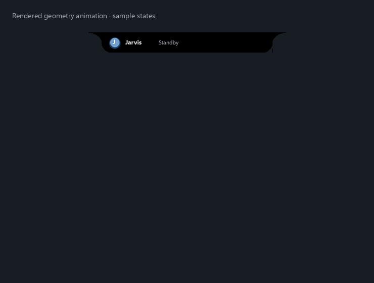

# One expanding glass notch

Implemented **2026-10-04**. Jarvis's composer, answers, task/source previews,
choices, approvals, music, games, history, Prepared, settings and command console
now share **one native window**. The black silhouette attaches to the top edge
with curved shoulders and rounded bottom corners. Buttons, text inputs,
dropdowns, checkboxes and choice cards share glass artwork with soft highlights,
thin borders and distinct interaction states.


These previews use the runtime renderer and actual off-screen Tk widget layout
with authored sample content. The supplied desktop images are design references;
their wallpaper, icons and clipboard overlay are not bundled. The animation below
demonstrates the runtime geometry controller, not measured desktop frame rate.



## Controls

- Click the notch to open it. Type a request and press **Enter** or **↑** for the
  existing command/question routing. The real input placeholder disappears when
  text is entered. **Mic** starts/stops the existing listening workflow.
- **•••** opens feature controls inside the notch. Overview, Prepared, Choices,
  Music, Games and History remain available; Settings and Console appear in the
  embedded drawer alongside Ask, Ask screen, Do task and lifecycle controls.
  Native dropdown lists and the existing right-click quick menu remain transient
  controls. Feature views no longer create separate top-level windows.
- Answers are scrollable. Fenced code uses a monospace face and retains indentation.
  **Copy** copies the complete received answer; the visual card retains up to
  64,000 characters. New tasks clear stale answer text from their working card,
  while History retains the transcript.
- The top square calls the existing **Stop** handler: it stops microphone capture,
  tasks and voice output. **⌃** or **Escape** collapses without cancelling work.
  Quit Jarvis retains the normal shutdown behavior.
- Automatic results do not take keyboard focus. Hovering keeps their temporary
  surface available; clicking inside pins it. Explicit opening focuses the input,
  game or console as appropriate. Header dragging moves the notch horizontally
  while keeping it attached at `y = 0` on the primary display.

VoiceOS's hold-to-talk keyboard shortcut is not introduced by this UI update.
Jarvis's displayed instructions describe its actual controls.

## Motion and glass

Sizes are logical pixels; physical sizes follow Windows DPI. The resting
silhouette is **402 × 40**, including 32-pixel shoulders around a 338-pixel body.
The expanded silhouette is **614 pixels** wide, with a 550-pixel body. The clean
composer is 144 pixels tall. Answers adapt between 380 and 710 pixels; the feature
drawer uses up to 660 pixels. Dimensions are clamped to the display.

Size interpolation takes **340 ms** and starts from the currently displayed
dimensions when interrupted. The existing approximately 30 Hz update scheduling
target remains for settled states, with 16 ms scheduling while moving; it is not
a guaranteed measured frame rate. `ui.reduced_motion:
true` disables shape interpolation and decorative bar motion. Workspace chrome
appears when there is room inside the animated surface.

The glass treatment uses native Tk/Pillow artwork: antialiased rounded shapes,
tonal gradients, translucent highlight borders and hover/pressed/focus states.
The existing `ui.opacity` controls overall window translucency. Nine-slice artwork
keeps button and input corners rounded as they resize. Tall, settled shells reuse
their background and repaint only the live top band; large cards reuse small glass
tiles rather than supersampling their full area. This is a glass visual
style, not an OS backdrop-blur implementation. It adds no Python dependency,
browser runtime, paid service, voice model or long-running service.

## Research and attribution

Firecrawl research on **2026-10-04** combined the eight supplied screenshots,
official pages, image search and a YouTube demonstration transcript:

- [VoiceOS: AI assistant in your notch](https://www.voiceos.com/blog/ai-assistant-in-your-notch)
  describes a quiet top-edge surface that expands for progress, confirmation and
  results, with official UI images showing task and review cards.
- [VoiceOS Agent Mode](https://www.voiceos.com/features/agent) provides primary
  connected-app result, confirmation and history examples. Jarvis keeps its own
  existing tool authorization and execution paths.
- [Feel Productive's VoiceOS demonstration](https://www.youtube.com/watch?v=jwnqScPAmqk)
  was retrieved as description/transcript. Agent Mode starts at 03:02 and coding/
  custom MCPs at 07:02. It corroborates interaction examples; individual video
  frames were not inspected.

Read-only inspection of the installed `D:\jarvis_voiceos` build also confirmed
pill/notch routes, content sizing, an edge silhouette, a 340 ms size-transition
constant and interrupted-transition handling. Those observations apply to that
build. The supplied Windows screenshots informed the expanded visual proportions.
Jarvis's Python implementation and J emblem are authored locally; VoiceOS code,
branded assets and proprietary integrations are not bundled.

## Implementation and checks

[Island rendering/motion](../jarvis/island.py), [interface](../jarvis/interface.py),
[embedded cards](../jarvis/notch_widgets.py) and [glass controls](../jarvis/glass_ui.py)
own the single surface. [Island views](../jarvis/island_desk.py) retain explicit
approvals and independent tasks; [App](../main.py) routes console output into an
embedded frame. Capture exclusion applies to the root containing every view.
Screen requests retain the existing overlay-hiding behavior. Launcher source
discovery includes the new modules in recovery snapshots, with capabilities in
the [runtime manifest](../config/runtime_manifest.json).

```powershell
.venv\Scripts\python.exe -m scripts.verification.verify_notch
.venv\Scripts\python.exe -m scripts.verification.verify_ui
.venv\Scripts\python.exe -m scripts.verification.verify_notch_regression
```

**2026-10-04 results:** **809 regression tests passed**; launcher readiness reported
`ready` with no missing components. [Regression/readiness record](../artifacts/reports/notch-regression-check.json).
The off-screen [UI check](../artifacts/reports/notch-ui-check.json) verifies composer,
long answers, a working draft, games, settings, console, explicit approval and
safe denial on closure, without starting the microphone or executing the fixture
actions. Rendered preview layouts were visually inspected.

[Renderer-only timings](../artifacts/reports/notch-render-check.json) measure a 614-pixel
logical-width fixture at 125% scaling after five warmups, with 20 measured samples.
The tall 660-pixel case averaged 12.243 ms; the 96-pixel header case averaged
6.729 ms. These exclude Tk scheduling, microphone/model work and desktop interaction,
and do not establish live animation frame rate. A separately inspected
[native input fixture](../artifacts/media/notch-native-input-fixture.png) was captured only
from an authored off-screen Jarvis window, with sample typed text and no desktop
capture. The regression suite checks input bounds and microphone-button wiring.

Restart through the existing Stop/Start launchers to load the changes. Live
microphone use, Spotify playback, external actions and desktop animation
performance need separate checks. Additional monitor selection is not added.
Historical behavior and measurements remain in [Dynamic Island](dynamic-island.md)
and [interactive island](interactive-island.md).
