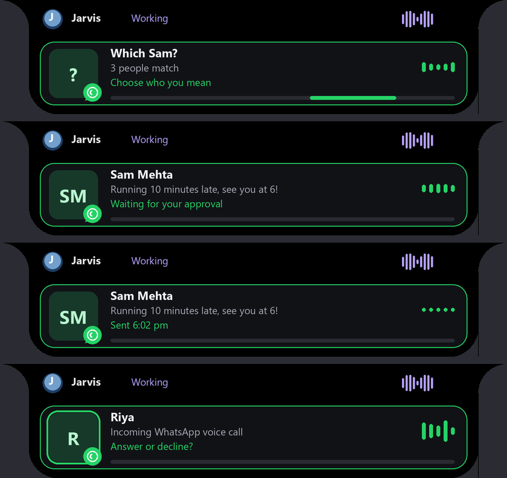

# WhatsApp automation, other messaging apps, and voice approvals

Updated 2026-10-10 IST. Jarvis now sends and replies to WhatsApp messages through the installed **WhatsApp Desktop** app, watches for new messages and incoming calls, and asks before anything is sent. This update also fixes "play"/"pause" being answered as chat.

*Rendered preview (2026-10-10) from `render_island` with sample names. Live cards show the real contact and message.*

## Fix: "play" / "pause" answered as chat

Whisper often adds punctuation ("Pause.", "Play.", "Jarvis, pause please."), and those forms matched no command. They fell through to the chat model, which replied that it can't control the player. When a sentence doesn't parse, Jarvis now retries once after removing punctuation, a leading "Jarvis/please/can you/hit/press" and a trailing "please/now". "Stop the video" means pause. "What's playing?" / "what song is this" now ask the player instead of the chat model. A sentence that already parses is never reinterpreted.

## How it works

WhatsApp Desktop is the WhatsApp Web page inside WebView2, and Windows exposes that page to UI Automation. `jarvis/whatsapp.py` reads it in one cached call (about 0.1–0.4 s): the search box, chat rows ("3 unread messages Name 5:40 pm preview"), the open chat's header, every message (sender label, text, time, Delivered/Read) and the compose box. No WhatsApp API, browser or phone integration is used.

1. **Find the person.** Jarvis types the name into WhatsApp's own search and reads the Chats and Contacts results. A full name ("Jay Patel") opens that chat directly. A first name alone ("Jay") matches everyone whose first name sounds the same, including Hindi/Gujarati spelling variants. If more than one person matches, Jarvis says the full names and shows them as island choices; answer by clicking, by number ("option two") or by saying the name. Groups are labelled.
2. **Open the chat** with Jarvis's own pointer, then confirm from the chat header that exactly that chat opened. Your "Message yourself" chat and a contact saved with the same name are told apart.
3. **Draft.** "Saying exactly …", "word for word" or quoted text is used verbatim. Otherwise the local Qwen model writes the message from what you said and the recent chat, matching its language (for example Hinglish). It never invents plans or facts; when a decision is yours it stays non-committal.
4. **Preview and approve.** The message appears on the island under **Approve and send**, and Jarvis reads it out. Say "approve", "send it", "yes send it", or click. Say what to change ("make it shorter", "add that I'll bring snacks") and Jarvis rewrites it and asks again. "Don't send it", "cancel" or no answer within 2 minutes sends nothing, and nothing is typed into WhatsApp until you approve.
5. **Send and verify.** Jarvis refuses if the compose box already holds your own unsent text. It types the approved text, checks that the compose box holds exactly that text, presses Enter once, and confirms that the new outgoing message shows in the chat. An unconfirmed send is reported and never retried.

### New messages and replies

- **"Reply to my WhatsApp messages" / "check WhatsApp":** opens each unread one-to-one chat (up to 5), reads the new messages, says who wrote what, drafts a reply, previews it and sends after approval. Groups and muted chats are skipped unless enabled in config.
- **"Reply to Jay on WhatsApp (saying …)":** the same flow for one person.
- **Automatic drafts:** a background watcher checks the unread count in WhatsApp's title every 2 seconds. When a new one-to-one message arrives, Jarvis announces it and drafts a reply from the chat-list preview without touching WhatsApp. It shows the draft for approval and only then opens the chat to send. Messages that were already unread when Jarvis started don't trigger drafts.

### Incoming calls

The watcher looks for WhatsApp's **Accept/Decline** call buttons in WhatsApp's windows. When a call rings, Jarvis says "Incoming WhatsApp voice call from X. Should I pick up?" and shows Answer/Decline on the island with a pulsing card. "Yes" or "pick up" answers it; "no", "decline" or "hang up" declines it. Each press uses Jarvis's pointer, with the accessibility Invoke action as a fallback. If the call stops ringing first, nothing is pressed.

## Island card

The WhatsApp card is green, with the contact's initials and a WhatsApp badge. Its phases: finding the contact, choosing who you mean, drafting, waiting for approval (the message text is shown), sending, sent with the time, new message, incoming call (a pulsing ring), and error. While Jarvis is waiting on you, the island's Choices view shows the question, the message under **Approve and send**, and the other options.

## Voice approvals elsewhere

"approve", "send it", "don't send it", "pick up" and "decline" now answer whatever is waiting: a WhatsApp question, or the island's existing **Approval** card (for example a Gmail send or a file deletion). When nothing is waiting, Jarvis says so.

## Commands

| Intent | Examples |
| --- | --- |
| Send | `send a WhatsApp message to Jay saying I'll be late`; `message Jay Patel on WhatsApp that I'm coming at 6`; `ask mom on WhatsApp if dinner is ready`; `WhatsApp Rahul saying exactly "ok bro"`; `send a message to Jay on WhatsApp` (Jarvis asks what to say) |
| Reply | `reply to my WhatsApp messages`; `check WhatsApp`; `reply to Jay on WhatsApp saying sure` |
| Answer Jarvis | `option two`, a full name, `approve`, `send it`, `make it shorter`, `don't send it`, `cancel`, `pick up`, `decline` |
| Other apps | `message Rahul on Telegram saying hi` |

## Other messaging apps

Installed on this PC: Telegram Desktop, Discord, Teams, Skype and Phone Link. Telegram has a guarded flow: search, choose, confirm the chat, preview, approve, send, confirm. During this update Telegram was **not signed in** (it showed its phone-number screen), so Jarvis detects that and asks you to sign in. The signed-in flow has **not been tested live**. Discord, Teams, Signal, Skype, Instagram and Messenger are recognised, and Jarvis says they aren't automated yet rather than guessing.

## Settings (`config/config.json` → `whatsapp`)

| Key | Default | Purpose |
| --- | --- | --- |
| `enabled` | `true` | Starts the watcher with Jarvis. |
| `watch_messages`, `auto_draft_replies` | `true`, `true` | Announce new messages; draft a reply for approval. |
| `watch_calls` | `true` | Ask before answering or declining calls. |
| `include_groups`, `include_muted` | `false`, `false` | Include groups / muted chats in replies and automatic drafts. |
| `max_replies` | `5` | Most chats per "reply to my messages". |
| `poll_seconds` | `2` | Watcher interval. |

## Verification (2026-10-10 IST, this PC)

Live runs used WhatsApp Desktop 2.2639.100.0 and the real `Actions` path, with answers given through the same voice/click routes Jarvis uses. **Every message was sent only to the account's own "Message yourself" chat.** No other contact was messaged, and only a chat with no unread messages and the self chat were opened.

| Check | Result |
| --- | --- |
| Search and match | First name "Jay": 8 people offered. Full names and a misspelt surname ("jay vagani") resolved to one. "mammi" and "papa": 2 and 3 options. |
| Read a chat | Senders, texts, times, Delivered/Read and a sticker parsed correctly. |
| Send with a voice edit | Contact found → draft → "make it a bit more fun" → new draft → "approve" → typed, sent, confirmed in the chat. 17.9 s, including two model drafts. |
| First-name choice and verbatim | "WhatsApp Kunal saying exactly …" → 7 people offered → spoken full-name answer → preview → "send it" → sent and confirmed. 10.7 s. |
| Automatic reply | A new-message preview → non-committal draft → "approve" → chat reopened, sent, confirmed. 12.6 s. "don't send it" and "cancel" sent and typed nothing. |
| Watcher reads | Call check 0.38 s, unread-chat read 0.23 s, with WhatsApp in the background. |

Problems found during these runs and fixed before the final runs:

- A lone first name matched only a contact saved as just that name.
- The compose-box name could not tell your self chat from a same-named contact, so verification now uses the header.
- Background WhatsApp updated its search results late until focused.
- A phone number was read as an unread count.
- A first draft invented plans.

**Not yet tested live:** an incoming call (needs a real call), a newly arriving message triggering the watcher (covered by unit tests), signed-in Telegram, and replying to unread chats of real contacts (opening them marks messages as read).

Regression and readiness (2026-10-10 IST): **1,429 tests ran, all passed with one skip** (`artifacts/logs/whatsapp-regression-2026-10-10.log`), and `python -m jarvis.launcher --check` reported `ready`. `tests/test_whatsapp.py` covers row and message parsing, strict chat identity, contact matching, commands, prompts and answer routing, the full send flow with an edit, declined previews, the watcher, call answer/decline, unsupported apps and card rendering.

## Limits

- WhatsApp Desktop must be installed and signed in. Jarvis brings it to the front to search and send, because a background WebView2 page updates late. Reading new messages and calls works in the background.
- Selectors are WhatsApp's accessibility labels ("Search or start a new chat", "Type a message to …", "Profile details"). A WhatsApp redesign could rename them; Jarvis then stops with an error rather than guessing.
- Media, voice notes and stickers are read as "[media]" or their emoji; Jarvis sends text only.
- The call buttons are matched by name (Accept/Answer, Decline/Reject). The exact call window layout is unconfirmed until a live call.
