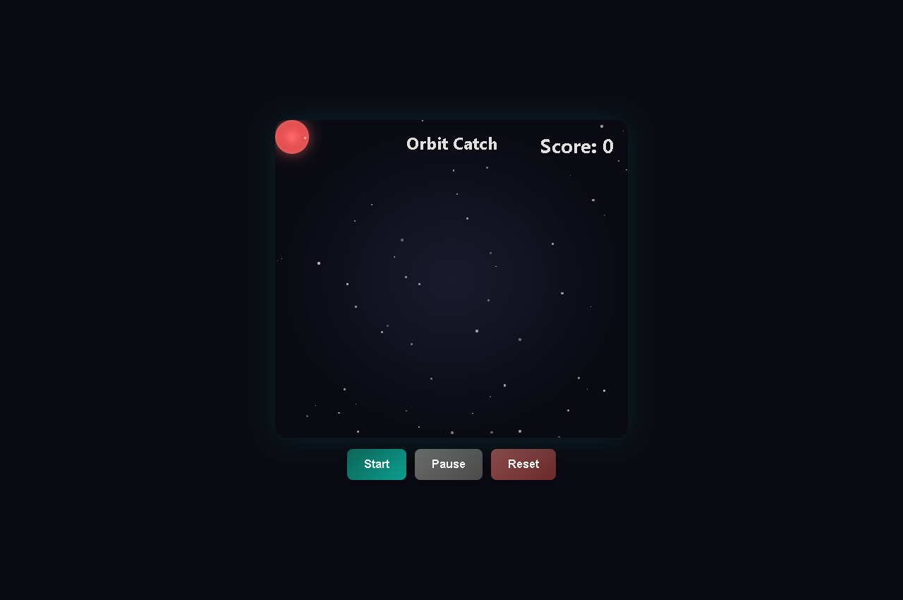
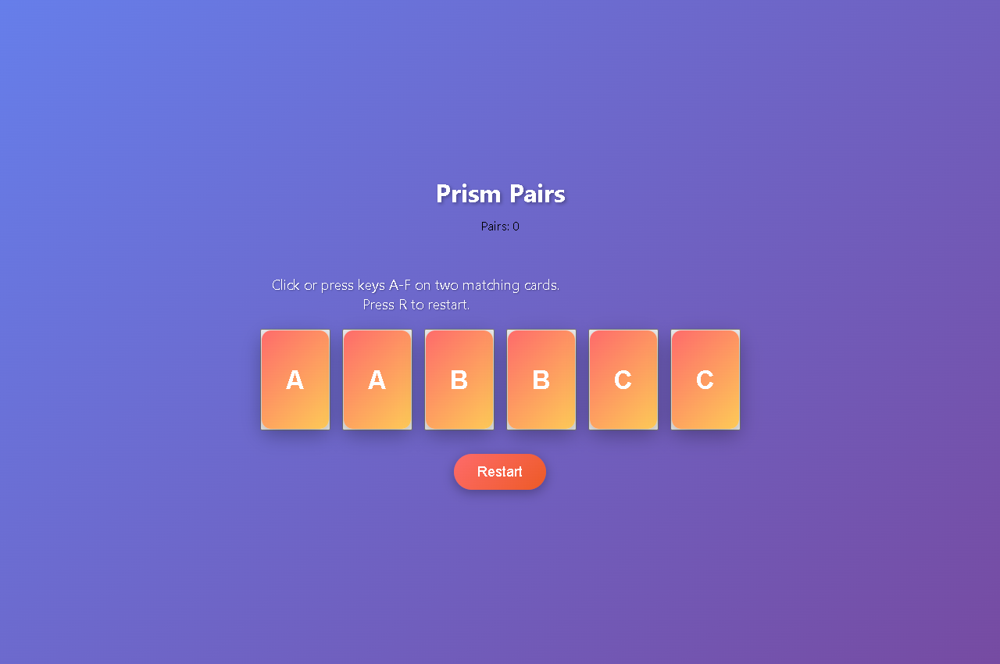
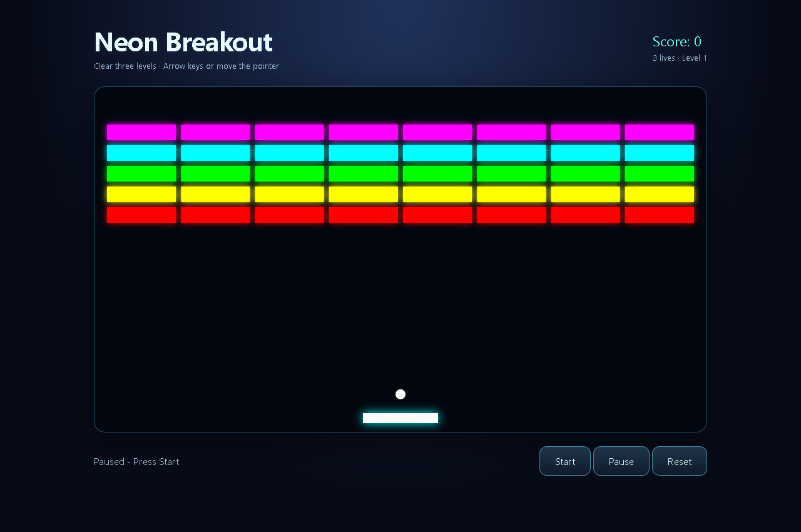
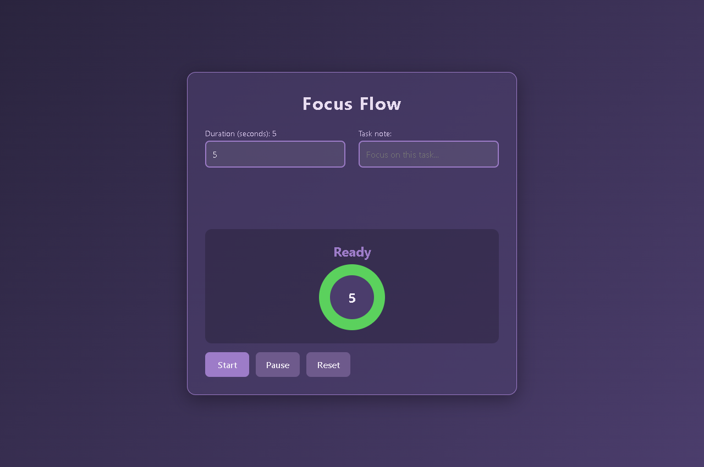
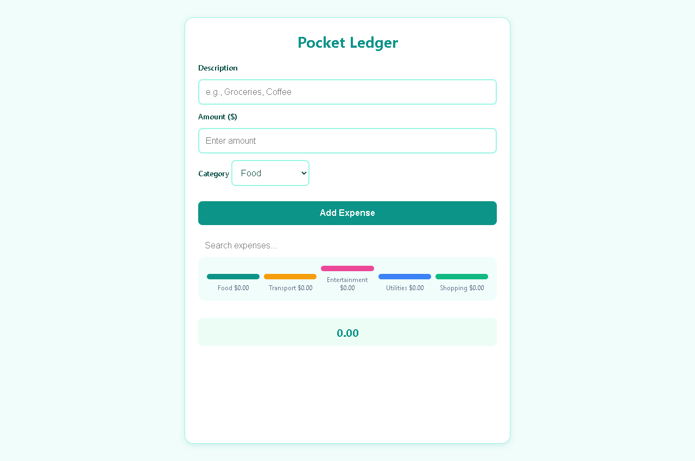
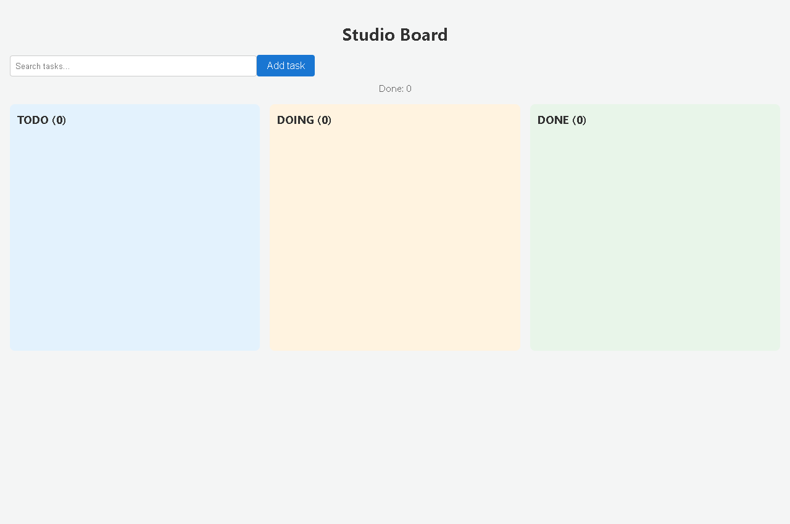
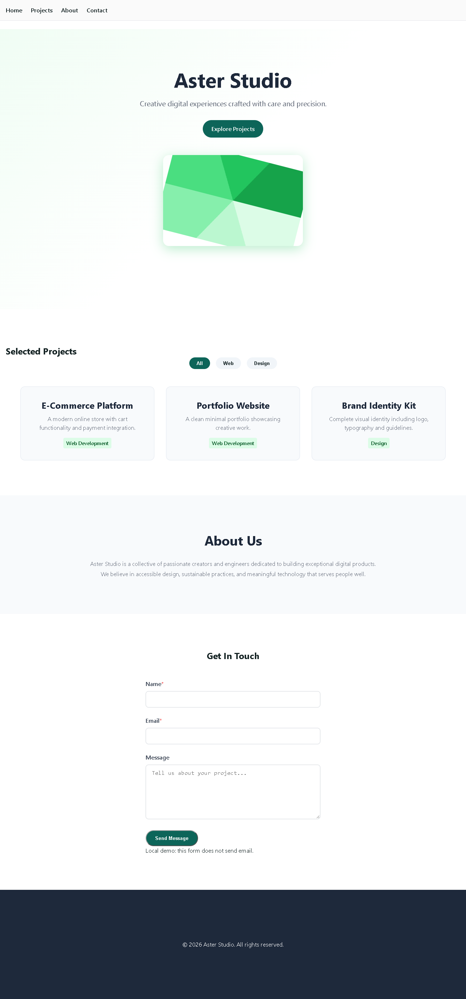
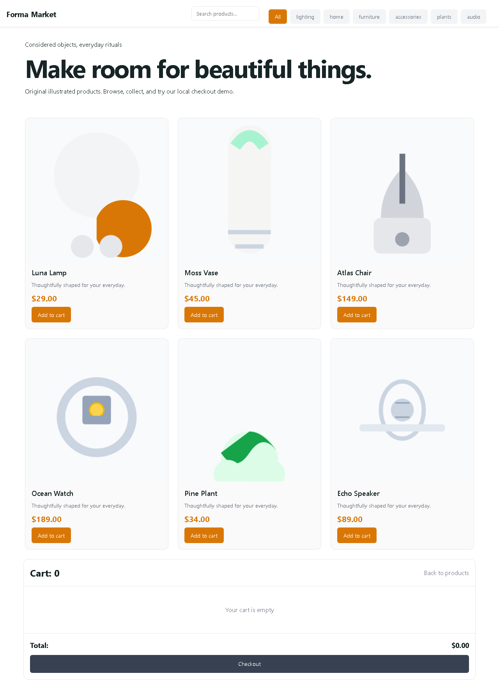
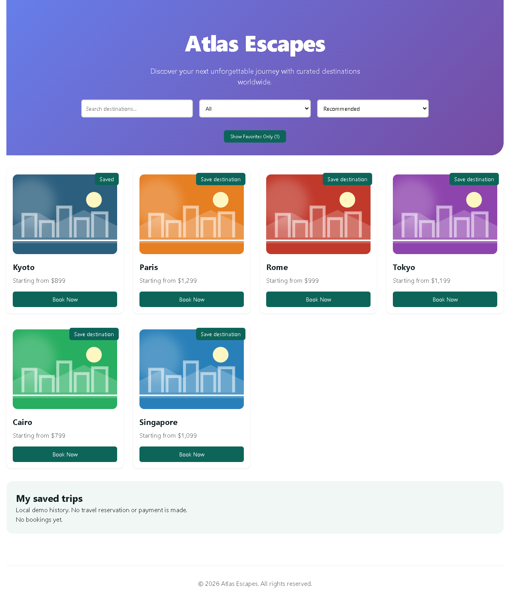

# Animated UI fixtures

These are owned, local demonstrations used to check Jarvis's coding route.
Levels 1–3 mean increasing complexity within this suite, not a benchmark for
arbitrary production projects. Historical games, Ledger and Board began with
local Qwen through Claude Code. Focus and the websites use local Qwen through
Codex. Reviewed corrections are credited to Codex separately in the
[correction receipt](../../artifacts/reports/multilingual-ui-corrections.json).
No external artwork or paid inference was used. Contact, shop and booking flows
are local demonstrations; they do not send messages, take payments or book travel.

Open each standalone `index.html` locally, or use a local static server. React
examples need the already installed fixture dependencies and the build performed
by [the verifier](../../scripts/verification/verify_multilingual_ui.py); `bundle.js` is generated and
ignored. A browser run checks actual controls and outcomes, animation, persistence
where applicable, a 390px layout and reduced-motion rendering. TypeScript fixtures
also receive a strict type check and production build.

The [dated browser receipt](../../artifacts/reports/multilingual-ui-check.json) records
actual results and earlier failed attempts. The screenshots below are real
isolated Chrome captures of these fixtures, not upstream demos or a user's desktop.

| Fixture | Source | Level |
|---|---|---:|
| Orbit Catch | [HTML game](game-1-orbit/index.html) | 1 |
| Prism Pairs | [HTML game](game-2-pairs/index.html) | 2 |
| Neon Breakout | [Canvas game](game-3-breakout/index.html) | 3 |
| Focus Flow | [Timer app](app-1-focus/index.html) | 1 |
| Pocket Ledger | [Expense app](app-2-expenses/index.html) | 2 |
| Studio Board | [React/TypeScript app](app-3-board/App.tsx) | 3 |
| Aster Studio | [Portfolio website](website-1-folio/index.html) | 1 |
| Forma Market | [Shop website](website-2-market/index.html) | 2 |
| Atlas Escapes | [React/TypeScript booking website](website-3-booking/App.tsx) | 3 |

[Coding setup and limits](../../docs/multilingual-coding.md) ·
[Codex local Qwen integration](../../docs/codex-code-local.md)
